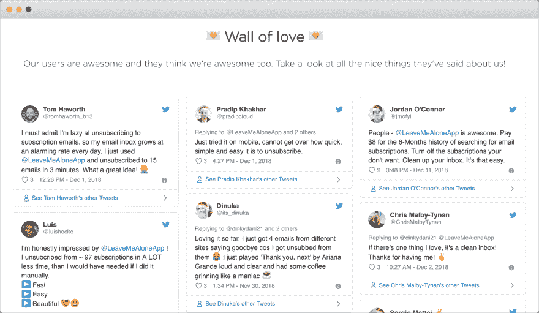
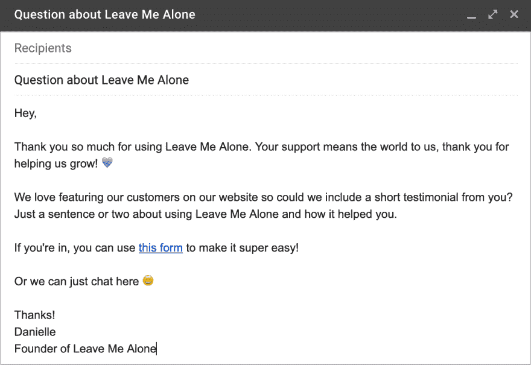
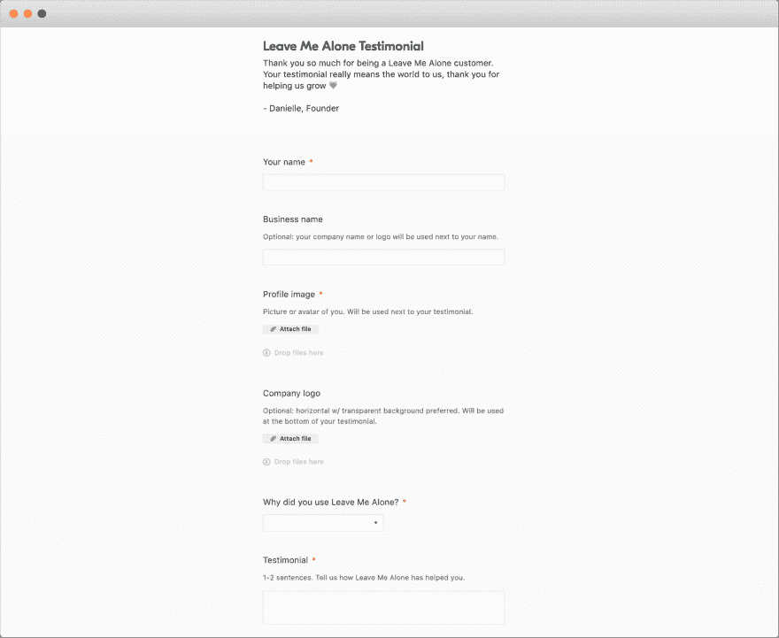
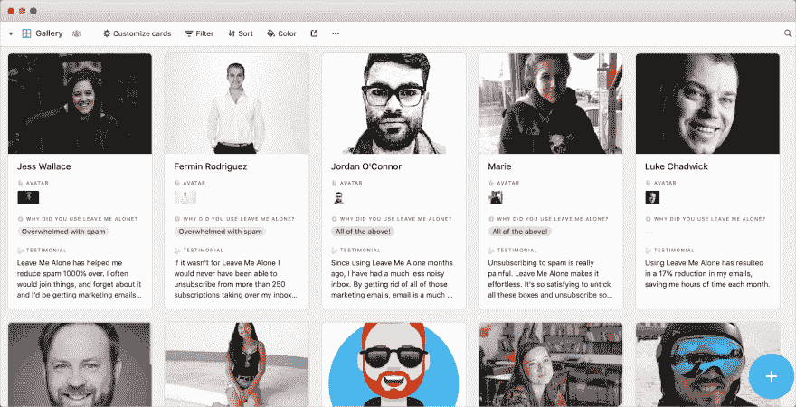
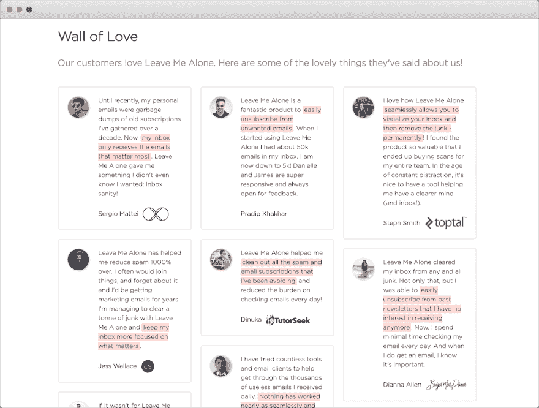

# 我们如何从客户那里获得令人惊叹的评价

> 原文：<https://dev.to/dinkydani21/how-we-get-awesome-testimonials-from-our-customers-2jjc>

客户证明对我们的营销和社会认可都很重要。我们的网站上到处都有他们的照片，我们有一面专用的爱心墙来展示顾客对我们的评价。

许多创始人不要求他们，因为他们害怕向客户寻求反馈，但客户往往希望提供帮助。

## 首发简单

当我们创建并发布《别管我》时，我们收到了令人难以置信的积极回应，包括 Twitter 上的许多爱！在发布狂潮平息后，我们意识到我们可以利用所有这些可爱的推文。受 Baremetrics 爱心墙的启发，我们制作了第一版爱心墙！

<figure> 

<figcaption>嵌有推文的旧爱情墙——还有几张以节日为主题的个人资料照片！</figcaption>

</figure>

这是一个很好的开始，人们开始问我们是如何建立这个页面的。这非常简单，我们只是使用 Twitter 嵌入代码来发布推文。然而，这种方法有几个缺点。

主要问题是，因为当有人访问页面时，嵌入的推文是从 Twitter 加载的，它们对搜索引擎不可用，这意味着我们失去了潜在的 SEO 好处。我们还遇到了推文需要很长时间才能显示或者出现在页面上而没有风格的问题，这看起来很糟糕！

我们希望推荐更加个性化，符合我们的品牌，让我们的客户能够指定他们的信息将如何显示，而不是使用他们在 Twitter 上的名字和头像。

## 索要奖状

我们想尽可能简单地为《别烦我》写一篇感言。收集评价并不容易，需要时间和跟进才能让人们提供反馈。

我们需要的第一件事是可以发送给客户的简短而甜蜜的信息。如果你使用对讲机或其他聊天 CRM，那么这可以是自动的，但我们现在手动发送这些。

<figure> 

<figcaption>向客户求助的短信:)</figcaption>

</figure>

我们过去曾尝试过这种事情，但都失败了，因为我们想得太多了。我们收到了回复，因为这个请求是真实的。我们真的非常感谢我们的每一位顾客，如果他们能花几分钟给我们写一封感谢信，这对我们非常非常有帮助。

## 保存响应

我们可以要求人们通过电子邮件回复，但我们知道这将变得难以管理。我们使用一个表格来收集回答，因为它可以非常容易地收集所有需要的信息，并清楚地表明我们的要求。

我们使用[气动工作台](https://airtable.com)来完成这项工作，这无疑是这项工作的最佳工具。你可以使用电子表格，但是 Airtable 就像是 Google Sheets on crack——说真的，它很棒。它为我们提供了一个托管的表单，供客户填写，回复直接进入表格。我们已经在《别烦我》上用 Airtable 做了其他事情——[bug 报告](https://leavemealone.app/bugs)、[反馈](https://leavemealone.app/feedback)，追踪[新闻报道](https://leavemealone.app/news)，记录我们的[开销](https://leavemealone.app/open)。

我们会询问一些基本信息(姓名、公司和头像)以及一两句话。我们还询问他们使用“让我一个人呆着”的主要原因，我们现在在任何地方都没有使用它，但它对我们来说是有价值的信息！

我们要求他们写下我们是如何帮助他们的，这促使他们思考并写下一些具体的东西。这比“给我们写一封感谢信”要好得多，因为那会导致低质量和不具体的回复。

Airtable 甚至有这个图库功能来预览响应，但我们大多数时候倾向于使用电子表格视图。

<figure> 

<figcaption>我们在 Airtable 中的一些推荐-画廊视图让查看它们变得非常愉快！</figcaption>

</figure>

我们发现 Baremetrics 在某些时候也使用 Airtable 作为他们的推荐(也许他们现在还在使用！)并且他们已经创建了[这个叫做“base”的 Airtable 模板](https://airtable.com/shrDuPs3Wv2p9lNnz/tbl7pMEoXVyAW9KxH/viwqYBvlaC8odjOZo?blocks=hide),你可以复制这个模板，立即开始为你的产品收集评价。这是客户将使用的表单的[预览。](https://airtable.com/shrufrcitHKs6q694)

## 最终结果

一旦我们有了足够多的推荐，我们就替换掉这些推文，并将它们设计成与我们的品牌相匹配的风格。它看起来比我们以前的 tweets 解决方案更专业、更干净。

访问者不太可能阅读所有的评价，所以我们(再次)从 Baremetrics 获得灵感，并使它们每次以不同的顺序加载。这样，我们的每一个了不起的客户都有机会成为顶尖人物！

你可以在这里看看我们新的爱情墙！

<figure> 

<figcaption>✨我们崭新的爱墙！✨</figcaption>

</figure>

我们对新的爱之墙感到无比幸福。我们希望你同意它看起来更好，我们现在有超级有组织的方式来收集和管理我们的未来推荐！

* * *

我们希望你喜欢这篇文章，也希望你受到启发，为自己建造一堵爱的墙。即使你还没有准备好展示它们，开始收集社会证据也不会太早！如果您有任何意见或问题，请告诉我们。

此外，我们希望看到你们的爱之墙，所以请在 [Twitter](https://twitter.com/LeaveMeAloneApp) 上与我们分享！