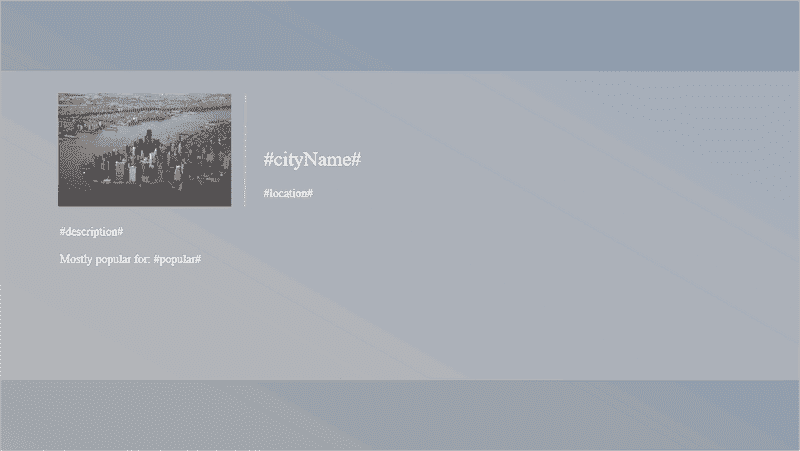
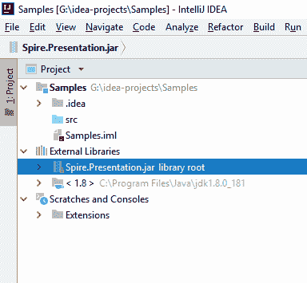
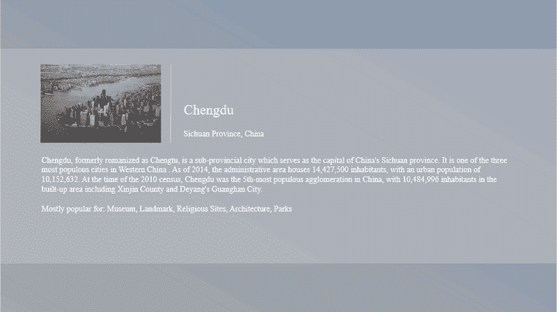
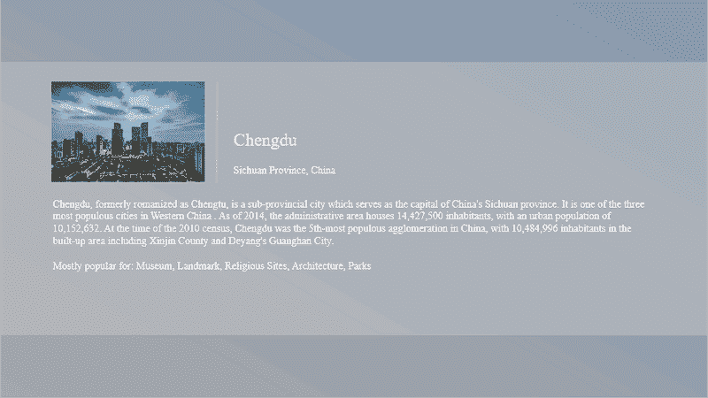

# 用 Java 替换 PowerPoint 中的文本和图像

> 原文:[https://dev . to/eice blue/replace-text-and-images-in-PowerPoint-in-Java-1 bj](https://dev.to/eiceblue/replace-text-and-images-in-powerpoint-in-java-1ibj)

从头开始创建 PowerPoint 文档可能非常耗时。如果想完全通过 java 代码创建一个设计良好的文档，那就更难了。因此，我们建议使用 MS PowerPoint 预先设计一个模板，然后使用 [Free Spire 替换其中的文本和图像。Java 的演示文稿](https://www.e-iceblue.com/Introduce/free-presentation-for-java.html)。通过这样做，您可以节省一些时间，并在一定程度上自动化这个过程。下面几节将对此进行演示。

## [](#creating-a-template)创建模板

如下所示，我们准备了一个简单的模板，包含一个图像和几段文本。文本已用字体颜色、字体大小和字体名称进行了格式化，因此文档中替换的新文本保留了所需的样式。

[T2】](https://res.cloudinary.com/practicaldev/image/fetch/s--pYiTK4xM--/c_limit%2Cf_auto%2Cfl_progressive%2Cq_auto%2Cw_880/https://thepracticaldev.s3.amazonaws.com/i/zndpubswpo805b268i67.png)

## [](#adding-jar-to-project)向项目添加 Jar

第一步。下载[免费 Spire。Presentation for Java](https://www.e-iceblue.com/Download/presentation-for-java-free.html) 包，解压。你会找到尖顶。lib 文件夹下的 Presentation.jar 文件。

第二步。在 IED 中创建一个 java 项目，并添加 jar 文件作为依赖项。这是它在 IntelliJ IDEA 中的样子。

[T2】](https://res.cloudinary.com/practicaldev/image/fetch/s--rOD_yTyI--/c_limit%2Cf_auto%2Cfl_progressive%2Cq_auto%2Cw_880/https://thepracticaldev.s3.amazonaws.com/i/feo79teuo0ys5yqgnnkd.png)

## [](#using-the-code)使用代码

### [](#part-1-replace-text)第一部分。替换文本

```
import com.spire.presentation.*;

import java.util.HashMap;
import java.util.Map;

public class ReplaceText {

    public static void main(String[] args) throws Exception {

        //create a Presentation object
        Presentation presentation = new Presentation();

        //load the template file
        presentation.loadFromFile("C:\\Users\\Administrator\\Desktop\\template.pptx");

        //get the first slide
        ISlide slide= presentation.getSlides().get(0);

        //create a Map object
        Map<String, String> map = new HashMap<String, String>();

        //add several pairs of keys and values to the map
        map.put("#cityName#","Chengdu");
        map.put("#location#","Sichuan Province, China");
        String description = "Chengdu, formerly romanized as Chengtu, is a sub-provincial city which serves as the capital "+
                "of China's Sichuan province. It is one of the three most populous cities in Western China . As of 2014, "+
                "the administrative area houses 14,427,500 inhabitants, with an urban population of 10,152,632\. At the time "+
                "of the 2010 census, Chengdu was the 5th-most populous agglomeration in China, with 10,484,996 inhabitants "+
                "in the built-up area including Xinjin County and Deyang's Guanghan City.";
        map.put("#description#",description);
        map.put("#popular#","Museum, Landmark, Religious Sites, Architecture, Parks");

        //replace text in the slide
        replaceText(slide,map);

        //save to another file
        presentation.saveToFile("output/ReplaceText.pptx", FileFormat.PPTX_2013);
    }

    /**
     * Replace text within a slide
     * @param slide Specifies the slide where the replacement happens
     * @param map Where keys are existing strings in the document and values are the new strings to replace the old ones
     */
    public static void replaceText(ISlide slide, Map<String, String> map) {

        for (Object shape : slide.getShapes()
        ) {
            if (shape instanceof IAutoShape) {

                for (Object paragraph : ((IAutoShape) shape).getTextFrame().getParagraphs()
                ) {
                    ParagraphEx paragraphEx = (ParagraphEx)paragraph;
                    for (String key : map.keySet()
                    ) {
                        if (paragraphEx.getText().contains(key)) {

                            paragraphEx.setText(paragraphEx.getText().replace(key, map.get(key)));
                         }
                    }
                }
            }
        }
    }
} 
```

[T2】](https://res.cloudinary.com/practicaldev/image/fetch/s--ShVrSSRC--/c_limit%2Cf_auto%2Cfl_progressive%2Cq_auto%2Cw_880/https://thepracticaldev.s3.amazonaws.com/i/bq4a6fecdorric53ju31.png)

### [](#part-2-replace-image)第二部分。替换图像

```
import com.spire.presentation.*;
import com.spire.presentation.drawing.IImageData;

import javax.imageio.ImageIO;
import java.awt.image.BufferedImage;
import java.io.FileInputStream;

public class ReplaceImage {

    public static void main(String[] args) throws Exception {

        //create a Presentation object 
        Presentation presentation= new Presentation();

        //load the documenet generted by above code
        presentation.loadFromFile("C:\\Users\\Administrator\\Desktop\\ReplaceText.pptx");

        //add an image to the image collection 
        String imagePath = "C:\\Users\\Administrator\\Desktop\\Chengdu.jpeg";
        BufferedImage bufferedImage = ImageIO.read(new FileInputStream(imagePath));
        IImageData image = presentation.getImages().append(bufferedImage);

        //get the shape collection from the first slide 
        ShapeCollection shapes = presentation.getSlides().get(0).getShapes();

        //loop through the shape collection 
        for (int i = 0; i < shapes.getCount(); i++) {

            //determine if a shape is a picture 
            if (shapes.get(i) instanceof SlidePicture) {

                //fill the shape with a new image 
               ((SlidePicture) shapes.get(i)).getPictureFill().getPicture().setEmbedImage(image);
            }
        }

        //save to file 
        presentation.saveToFile("output/ReplaceImage.pptx", FileFormat.PPTX_2013);
    }
} 
```

[T2】](https://res.cloudinary.com/practicaldev/image/fetch/s--K9e3RIre--/c_limit%2Cf_auto%2Cfl_progressive%2Cq_auto%2Cw_880/https://thepracticaldev.s3.amazonaws.com/i/xn4gkm0ltxkvu16jshcf.png)