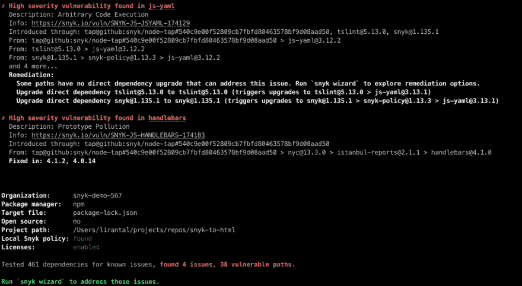
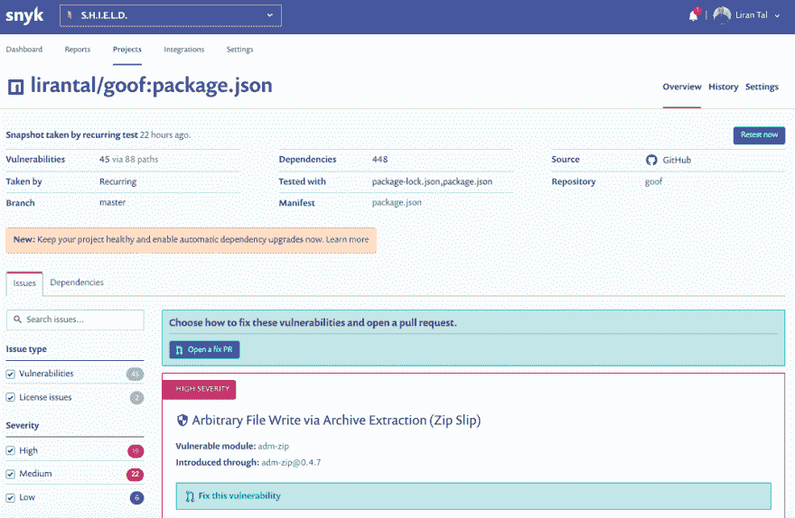

# 使用 jq 操纵 snyk 安全测试的 JSON 结果

> 原文:[https://dev . to/snyk/using-jq-to-manipulate-JSON-results-of-snyk-security-tests-2 Leo](https://dev.to/snyk/using-jq-to-manipulate-json-results-of-snyk-security-tests-2leo)

jq 是一个方便的 CLI 实用程序，可以轻松打印、过滤和操作 JSON 数据。让我向你展示我是如何在一些项目中使用它的。

假设您有一个持续集成(CI ),如 Travis、Circle 或 Jenkins 来构建您的应用程序，在该应用程序中，您通过 CLI 运行 Snyk 的安全测试来寻找这些安全漏洞并破坏构建，以确保您不会引入不必要的风险。

您如何确保关注可操作性，以便开发人员能够在构建失败时修复安全问题？

这就是`jq`和 JSON 格式的结果的用武之地。



## [](#getting-the-json-output)获取 JSON 输出

如果您从 CLI 运行 snyk 来搜索这些 JavaScript 和 Node.js 安全问题，您可能已经习惯了漂亮的漏洞列表。很高兴在构建输出中看到这一点。

[T2】](https://res.cloudinary.com/practicaldev/image/fetch/s--RwIKYLhb--/c_limit%2Cf_auto%2Cfl_progressive%2Cq_auto%2Cw_880/https://thepracticaldev.s3.amazonaws.com/i/wzermd7s5fl7pe1z08kk.png)

你知道你可以在 JSON 输出中得到结果吗？这对我们到底有什么帮助？



## [](#manipulating-json)操纵 JSON

幸运的是，snyk 的 CLI 命令参数之一是能够将`--json`传递给 snyk 测试，并将其所有输出通过管道传递给`jq`,然后我们可以使用下面的一些过滤来选择性地导出或失败构建，只针对我们项目中那些可以解决和修复的开源安全漏洞。

所以这里有一个例子:

```
$ snyk test --json | jq 
```

<svg width="20px" height="20px" viewBox="0 0 24 24" class="highlight-action crayons-icon highlight-action--fullscreen-on"><title>Enter fullscreen mode</title></svg> <svg width="20px" height="20px" viewBox="0 0 24 24" class="highlight-action crayons-icon highlight-action--fullscreen-off"><title>Exit fullscreen mode</title></svg>

这只是用颜色和适当的格式和缩进漂亮地打印 JSON 输出，因为我们没有向`jq`提供任何参数。

如果您正在使用 Snyk CLI 测试，那么在促进应用程序安全性测试的 CI 中要做的一件非常好的事情就是确保您正在破坏可操作的安全性问题的构建。这意味着，如果构建中断，开发人员可以了解原因，然后采取措施(如升级库)来修复漏洞。

使用 jq，我们可以进一步做到这一点，这要感谢 Snyk 在 JSON 结果中的`isUpgradable`字段:

```
$ snyk test --json | jq '.vulnerabilities |= map(select(.isUpgradable == true or .isPatchable == true))` 
```

<svg width="20px" height="20px" viewBox="0 0 24 24" class="highlight-action crayons-icon highlight-action--fullscreen-on"><title>Enter fullscreen mode</title></svg> <svg width="20px" height="20px" viewBox="0 0 24 24" class="highlight-action crayons-icon highlight-action--fullscreen-off"><title>Exit fullscreen mode</title></svg>

太酷了！

## [](#whats-next)接下来是什么？

以下是一些帮助你继续前进的相关资源:

1.  关于过滤器和其他操作员文档，您可以参考 [jq 文档](https://stedolan.github.io/jq/manual/)
2.  最后，你可能想读一篇关于用 JSON 充分利用 Snyk 测试的更全面的文章
3.  1.为了了解更多关于 Snyk CLI 命令参数的信息，我们创建了这个 [Snyk CLI 备忘单](https://snyk.io/blog/snyk-cli-cheat-sheet/)

如果您关心您的应用程序安全性(您可能应该？:-])你可能想把它提升一个档次，把你的源代码库和 Snyk 连接起来(它是免费的，对于私人回购也是如此！).

您可以为您的项目获得这个漂亮的仪表板，Snyk 还会自动打开拉请求来修复您的安全问题:

[T2】](https://res.cloudinary.com/practicaldev/image/fetch/s--WdEqbklD--/c_limit%2Cf_auto%2Cfl_progressive%2Cq_auto%2Cw_880/https://thepracticaldev.s3.amazonaws.com/i/jlmlp8yv32q9m2s63lfz.png)

