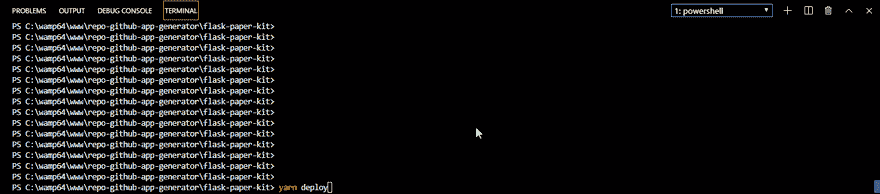

# Flask 样板文件-静态导出和实时 FTP 部署

> 原文：<https://dev.to/sm0ke/flask-boilerplate-static-export-and-live-ftp-deploy-3h31>

你好编码器，

在这篇短文中，我将介绍一种简单的方法，将一个 [Flask](https://palletsprojects.com/p/flask/) 应用程序导出到一个静态网站，然后通过 FTP 将 HTML 文件部署到活动系统上。本文中引用的 Flask 应用程序以及脚本发布在 Github (MIT license)上。

* * *

> 谢谢大家！**内容由 [AppSeed - App 生成器](https://appseed.us)T3】提供。**

* * *

## [什么是烧瓶](https://docs.appseed.us/what-is/flask/)

新手注意:Flask 是一个用 Python 编写的轻量级 web 框架，适用于(几乎)任何类型的 web 应用程序:单页面、API 服务器或复杂的电子商务应用程序和门户。官方信息(复制自他们的网站):

> **Flask** 是一个轻量级的 WSGI web 应用框架。它旨在快速轻松地开始使用，并能够扩展到复杂的应用程序。它最初是一个围绕 Werkzeug 和 Jinja 的简单包装器，现在已经成为最流行的 Python web 应用程序框架之一。

* * *

## 构建[烧瓶 App](https://github.com/app-generator/flask-paper-kit)

为了克隆和构建这个应用程序，我们需要键入几行代码(完整的说明，请参考项目[自述文件](https://github.com/app-generator/flask-paper-kit/blob/master/README.md):

```
$ # clone the repo

$ git clone https://github.com/app-generator/flask-paper-kit.git
$ cd flask-paper-kit

$ # install the dependencies
$ pip install -r requirements.txt

$ # create the database (using Flask shell)

$ flask shell
$ >>> from app import db
$ >>> db.create_all()

$ flask run

$ # App is running on http://localhost:5000 
```

Enter fullscreen mode Exit fullscreen mode

如果一切顺利，应用程序应该在您的浏览器中可见:

[](https://res.cloudinary.com/practicaldev/image/fetch/s--xy42enuw--/c_limit%2Cf_auto%2Cfl_progressive%2Cq_66%2Cw_880/https://raw.githubusercontent.com/app-generator/static/master/products/flask-paper-kit-intro.gif)

* * *

## 静态出口 vis [冻瓶](http://packages.python.org/Frozen-Flask/)

Frozen-Flask 基本上将 Flask 应用程序冻结到一组静态文件中，因此您可以轻松地托管它。静态导出挂钩到应用程序路由，并提取由 Flask 引擎呈现的 HTML。我不得不说，很酷。

导出[脚本](https://github.com/app-generator/flask-paper-kit/blob/master/static.py)只包含几行代码:

```
import os
from app import app
from flask_frozen import Freezer

#----------------------------------------
# launch
#----------------------------------------

if __name__ == "__main__":
    freezer = Freezer(app)
    freezer.freeze() 
```

Enter fullscreen mode Exit fullscreen mode

正如我们所看到的，Flask-Frozen 在受害者周围构建了一个包装器，执行注册的路由，并将呈现的 HTML 输出保存到`app/public`目录中。

* * *

## FTP 实时部署

为了避免手动复制，我使用 Node.js 下执行的简单脚本通过 FTP 上传文件。

```
var FtpDeploy = require('ftp-deploy');
var ftpDeploy = new FtpDeploy();

var config = {
    user:     "FTP_USER", # edit ME
    password: "FTP_PASS", # edit ME                           
    host:     "FTP_HOST", # edit ME
    port: 21,
    localRoot: __dirname + '/app/build', # upload ME 
    remoteRoot: '/',
    include: ['*', '**/*'],      
    ....
} 
```

Enter fullscreen mode Exit fullscreen mode

> 在执行脚本之前，不要忘记在项目的根目录下运行一个 yarn 命令(在本地安装 Node.js 模块 ftp-deploy)并编辑 ftp 凭证。

要执行该脚本，只需键入`node deploy`，您应该会在您的终端中看到这种神奇的效果:

[](https://res.cloudinary.com/practicaldev/image/fetch/s--K-7sbmSD--/c_limit%2Cf_auto%2Cfl_progressive%2Cq_66%2Cw_880/https://raw.githubusercontent.com/app-generator/static/master/products/flask-boilerplate-live-deploy-intro.gif)

* * *

### 谢谢！

*   [应用程序来源](https://github.com/app-generator/flask-paper-kit) -麻省理工学院许可证
*   [现场演示](https://flask-paper-kit.appseed.us/)
*   [烧瓶样板文件](https://appseed.us/boilerplate-code/flask-boilerplate) -由 AppSeed 支持
*   更多[样板代码](https://appseed.us/boilerplate-code/) -由 AppSeed 提供

[](https://i.giphy.com/media/JEYYpBGPLq98I/giphy.gif)