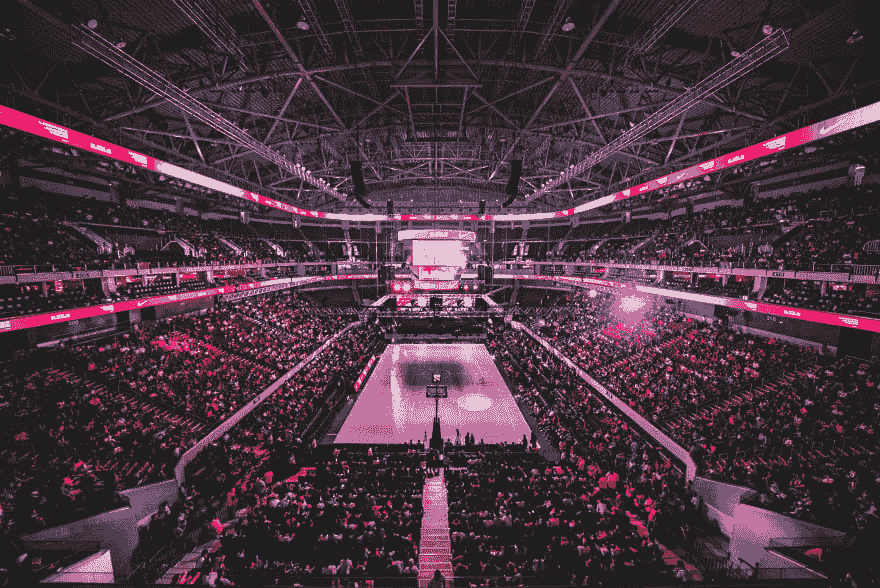
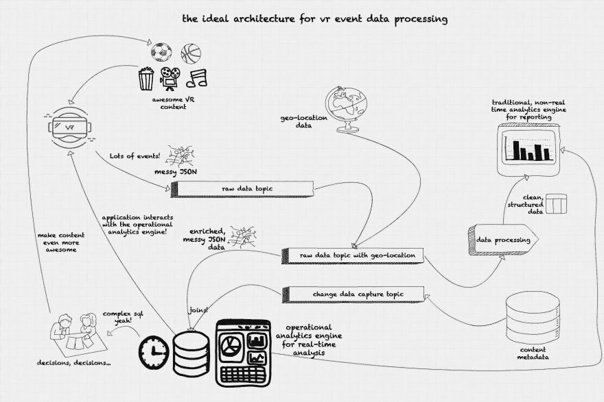

# 虚拟现实和直播世界中的实时分析

> 原文：<https://dev.to/rocksetcloud/real-time-analytics-in-the-world-of-virtual-reality-and-live-streaming-50h>

*作者[塞巴斯蒂安·赞加罗](https://www.linkedin.com/in/szangaro/)T3】*

“一个快速发展的技术领域，新工具、技术和平台被频繁引入，很难跟上新趋势。”我可以描述虚拟现实空间或数据工程，但事实上这篇文章是关于两者的交集。

### 虚拟现实——媒体的下一个前沿

我在虚拟现实领域的一家领先公司担任数据工程师，任务是以完美的保真度捕捉和传输现实。我们的内容多种多样，从点播体验到现场活动，如 NBA 比赛、喜剧表演和音乐会。内容通过我们的应用程序和 Oculus Venues 分发，前者适用于市场上的大多数 VR 头戴设备。

从内容流的角度来看，我们的用例与任何其他流平台没有太大不同。我们通过互联网传送视频内容；用户可以打开我们的应用程序，浏览不同的频道，选择他们想要观看的内容。但相似之处也就到此为止了；从用户戴上耳机的那一刻起，我们就吸引了他们的全部注意力。在传统的流媒体应用中，内容可以在设备中流式传输，但没有办法知道用户是否真的在关注甚至是在看设备。在 VR 中，我们确切地知道用户何时在主动消费内容。

### VR 事件数据流

我们提供的沉浸式体验的一个组成部分是现场活动。与传统视频点播内容的主要区别在于，这些体验仅在活动期间进行直播。例如，我们将 NBA 比赛直播传输到市场上的大多数 VR 头戴设备。直播事件在技术方面(摄像机、视频压缩、编码)以及它们从用户行为中产生的数据方面带来了一系列不同的挑战。

我们应用程序中的每个用户交互都会生成一个用户事件，并发送到我们的服务器:应用程序打开、滚动内容、选择特定内容以检查描述和标题、打开内容并开始观看、停止内容、快进、退出应用程序。即使在观看内容时，该应用程序也会每隔几秒钟生成一个“信标”事件。这些来自设备的原始数据需要用内容元数据和地理位置信息来丰富，然后才能进行处理和分析。

虚拟现实是一个身临其境的平台，所以当用户对某个特定的内容不感兴趣时，他们不能只是看向别处；他们可以继续观看，切换到不同的内容，或者在最坏的情况下，甚至摘掉耳机。了解什么内容能产生最吸引用户的行为，对于内容生成和营销目的至关重要。例如，当用户进入我们的应用程序时，我们想知道是什么驱动了他们的注意力。他们是对特定类型的内容感兴趣，还是只是浏览不同的体验？一旦他们决定了他们想看什么，他们是在整个过程中保持内容不变还是只看几秒钟？在观看特定类型的内容(体育或喜剧)后，他们是否会继续观看同一类型的内容？特定地理位置的用户是否对特定类型的内容更感兴趣？不同虚拟现实平台的市场渗透率如何？

从数据工程的角度来看，这是点击流数据的经典场景，用 VR 头戴设备代替鼠标。来自用户行为的大量数据从 VR 设备中生成，以 JSON 格式序列化并路由到我们的后端系统，在那里数据被实时和批量地丰富、预处理和分析。我们想知道此时此刻我们的平台上正在发生什么，我们还想知道本周、上个月或今年的不同趋势和统计数据。

### 对运营分析的需求

点击流数据场景有一些定义良好的模式，并提供了成熟的数据摄取选项:Kafka 和 Pulsar 等流和消息系统，Apache NiFi 的数据路由和转换，Spark、Flink 或 Kafka 流的数据处理。对于数据分析部分，事情就大不一样了。

存储和分析数据有几种不同的选择，但我们的用例有非常具体的要求:实时、低延迟分析，在没有固定模式的情况下快速查询数据，使用 SQL 作为查询语言。我们的传统数据仓库解决方案为我们的报告分析提供了良好的结果，但对于实时分析来说，扩展性不是很好。我们需要实时获取信息并做出决策:我们的用户认为哪些内容更有吸引力，他们在世界上的哪些地方观看，他们在特定内容中停留多长时间，他们对广告、A/B 测试等有什么反应。所有这些信息可以帮助我们为虚拟现实用户开发一个更有吸引力的平台。

Dhruba Borthakur 在他的六个[运营分析](https://rockset.com/blog/operational-analytics-what-every-software-engineer-should-know/)命题中对我们的用例给出了更好的解释:

*   复杂的查询
*   低数据延迟
*   低查询延迟
*   高查询量
*   与数据源实时同步
*   混合类型

我们对实时仪表板和实时分析的查询非常复杂，涉及连接、子查询和聚合。由于我们需要实时信息，低数据延迟和低查询延迟是至关重要的。我们称之为运营分析，这样的系统必须支持所有这些需求。

### 为人类效率而设计

大多数其他小公司可能面临的另一个挑战是数据工程和数据分析团队花费时间和资源的方式。数据管理市场上有许多令人惊叹的开源项目，尤其是数据库和分析引擎，但作为数据工程师，我们希望与数据打交道，而不是把时间花在开发、安装集群、设置 Zookeeper 以及监控数十个虚拟机和 Kubernetes 集群上。内部开发和托管服务之间的适当平衡有助于公司专注于创收任务，而不是维护基础设施。

对于小型数据工程团队，在选择合适的运营分析平台时有几个考虑因素:

*   SQL 支持是数据快速开发和民主化的关键因素。我们没有时间学习新的 API 和构建工具来提取数据，通过 SQL 暴露我们的数据，我们使我们的数据分析师能够构建和运行对实时数据的查询。
*   大多数分析引擎要求数据以特定的模式进行格式化和结构化。我们的数据是非结构化的，有时不完整且混乱。引入另一层数据清理、结构化和摄取也将增加我们管道的复杂性。

### 我们对虚拟现实事件数据进行运营分析的理想架构

**数据和查询延迟**

我们的用户对特定内容的反应如何？这个广告是不是侵入性太强导致用户停止观看内容？如今，来自特定地理区域的用户是否会消费更多的内容？现在有哪些平台在引领内容消费？所有这些问题都可以通过运营分析来回答。良好的运营分析将使我们能够分析我们平台的当前趋势，并采取相应的行动，如下例所示:

这些内容在特定地区是否越来越不受欢迎？我们可以在我们的应用程序上添加针对特定地理位置的宣传横幅。

这个广告是如此具有侵略性，以至于导致用户停止观看我们的内容吗？我们可以限制广告的出镜率或者即时改变广告的尺寸。

是否有大量旧设备访问我们的平台来获取特定内容？我们可以添加清晰度较低的内容，给那些用户更好的体验。

这些用例有一些共同点:对低延迟运营分析引擎的需求。所有这些问题都必须在几毫秒到几秒的时间内得到回答。

**并发**

除此之外，我们的使用模型需要多个并发查询。不同的战略和业务领域需要不同的答案。营销部门会对每个平台或地区的用户数量更感兴趣；工程人员想知道特定编码如何影响现场活动的视频质量。高管们会希望看到在直播活动期间的特定时间点有多少用户在我们的平台上，而内容合作伙伴会对通过我们的平台消费其内容的用户份额感兴趣。所有这些查询必须并发运行，查询不同格式的数据，创建不同的聚合并支持多个不同的实时仪表板。每个基于角色的仪表板将从不同的角度呈现同一组数据:运营、战略、营销。

**实时决策和实时仪表盘**

为了将数据快速发送到运营分析系统，我们的理想架构将花费尽可能少的时间来管理和清理数据。数据来自 JSON 格式的设备，带有一些标识设备品牌和型号、正在观看的内容、事件时间戳、事件类型(信标事件、滚动、点击、应用程序退出)和原始 IP 的 id。所有数据都是匿名的，只能识别设备，而不能识别使用设备的人。事件流在发布/订阅系统(Kafka，Pulsar)中被摄取到我们的系统中，作为原始输入数据的特定主题。数据带有 IP 地址，但没有位置数据。我们运行一个快速的数据丰富过程，将地理位置数据附加到我们的事件，并发布到另一个主题以获得丰富的数据。仅限快速富集阶段不会清除任何数据，因为我们希望这些数据能够快速被纳入运营分析引擎。这种丰富可以使用专门的工具来完成，比如 Apache NiFi，甚至是流处理框架，比如 Spark、Flink 或 Kafka Streams。在此阶段，还可以使用带有超时的窗口对事件数据进行会话，根据信标事件的频率(或缺席)确定特定用户是否仍在平台中。

第二个摄取途径来自内容元数据数据库。事件数据必须与内容元数据连接，以便将 id 转换成有意义的信息:内容类型、标题和持续时间。在运营分析引擎中而不是在数据丰富过程中加入元数据的决定来自两个因素:尽快处理事件的需要，以及从获取特定内容的元数据所需的恒定点查询中卸载元数据数据库。通过使用从原始内容元数据数据库捕获的变更数据并在运营分析引擎中复制数据，我们实现了两个目标:在我们的系统中保持运营和分析操作之间的分离，并使用运营分析引擎作为我们的 API 的查询端点。

数据加载到运营分析引擎后，我们使用 Tableau、Superset 或 Redash 等可视化工具来创建交互式实时仪表盘。这些控制面板通过使用 SQL 查询运营分析引擎进行更新，并且每隔几秒钟刷新一次，以帮助直观显示实时事件流数据的变化和趋势。

从实时分析中获得的见解有助于我们决定如何为用户提供更好的观看体验。我们可以决定在特定的时间点推广什么内容，使用特定的耳机型号面向特定地区的特定用户。我们可以通过检查内容的平均会话时间来确定哪些内容更吸引人。我们可以在我们的应用程序中包含不同的可视化，执行 A/B 测试并实时获得结果。

### 结论

运营分析允许企业基于当前的事件流实时做出决策。这种持续的分析是理解全球范围内 VR 内容流等平台中用户行为的关键，在这些平台中，可以根据用户地理位置、耳机制造商和型号、连接速度和内容参与度等信息实时做出决策。运营分析引擎提供对原始 JSON 数据的低延迟写入和查询，具有 SQL 接口和与我们的最终用户 API 交互的能力，为帮助我们的 VR 内容变得更加出色提供了无限的可能性！