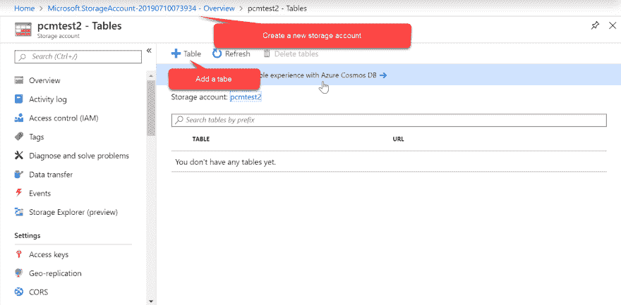
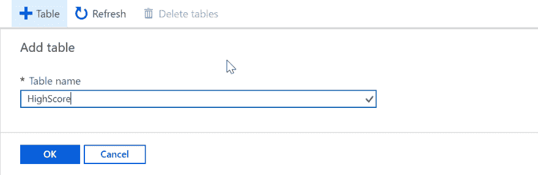
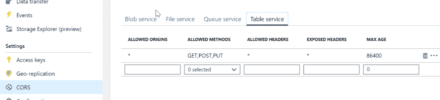
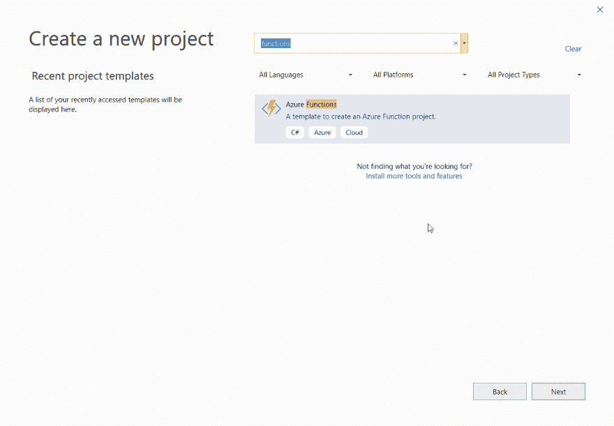
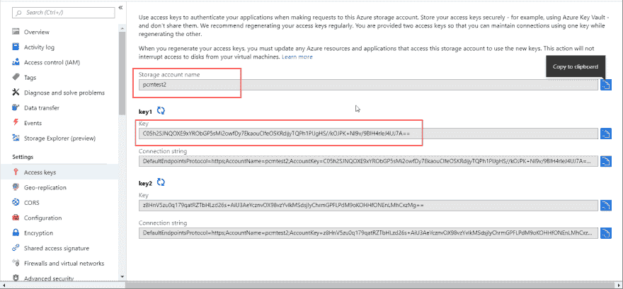
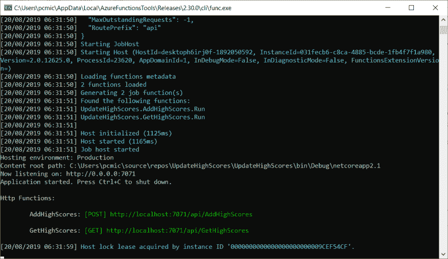
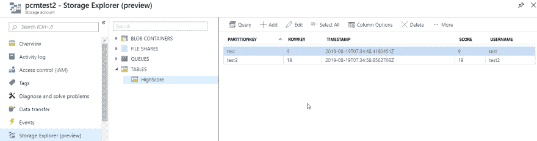

# 在 React 中创建汽车游戏-第 6 部分-增加高分

> 原文:[https://dev . to/PC Michaels/creating-a-car-game-in-react-part-6-adding-high-scores-4lb 1](https://dev.to/pcmichaels/creating-a-car-game-in-react-part-6-adding-high-scores-4lb1)

这是从[这里](https://www.pmichaels.net/2019/06/03/creating-a-car-game-in-react-part-1-drawing-and-moving/)开始的系列文章的第六篇。

和之前的帖子一样，如果你想下载代码，这里是；而且，和以前的帖子一样，我不会在这里涵盖所有的代码更改，所以如果您感兴趣，那么您应该下载代码。

在本帖中，我们将创建一个高分表。我们将创建一个 Azure 函数作为服务器，并将分数存储在 Azure 表中。

让我们从桌子开始。

在 Azure 中创建新的存储帐户，然后向其添加 Azure 表:

[T2】](https://www.pmichaels.net/wp-content/uploads/2019/08/trans-am-1.png)

你会在这里看到一个试图说服你使用 Cosmos DB 的标志。在撰写本文时，使用 Cosmos 比使用 Table Storage 要贵得多。显然，Cosmos 增加了吞吐量、分布式存储等。为此，我们不需要任何东西。

创建新表格:

[T2】](https://www.pmichaels.net/wp-content/uploads/2019/08/trans-am-2.png)

事实上，Azure 表不是 SQL 产品，因为你有一个键，然后是一个属性——属性可以是 JSON 文件，或者你选择的任何东西。在我们的例子中，我们将密钥设置为用户名，分数设置为属性。

一旦创建了表存储，您可能希望使用[存储浏览器](https://azure.microsoft.com/en-gb/features/storage-explorer/)来创建表，尽管这不是必需的。

最后，您需要添加一条 CORS 规则:

[T2】](https://www.pmichaels.net/wp-content/uploads/2019/08/trans-am-3.png)

显然，这实际上应该指向你正在使用的域，而不是一个笼统的“允许”，但这也适用于测试。

# 添加用户名

在我们存储高分之前，用户需要一个用户名。先加一个吧。

在游戏状态中，我们将添加一个文本框:

```
<div style={containerStyle}>
    <input type='text' value={props.Username} onChange={props.onChangeUsername} /> 
```

状态提升到主 Game.jsx:

```
<GameStatus Lives={this.state.playerLives} 
    Message={this.state.message} 
    Score={this.state.score} 
    RemainingTime={this.state.remainingTime}
    Level={this.state.level}
    Username={this.state.username} 
    onChangeUsername={this.onChangeUsername.bind(this)} 
/> 
```

onChangeUsername 在这里:

```
onChangeUsername(e) {
    this.updateUserName(e.target.value);
}

updateUserName(newUserName) {
    this.setState({
        username: newUserName
    });
} 
```

# 更新高分

我们将创建一个 Azure 函数来更新该表。在 Visual Studio 中，创建一个新的 Windows Azure Function 应用程序(如果您还没有安装 [Azure Workload](https://www.pmichaels.net/2017/09/17/function-apps-azure/) ，您将需要安装它):

[T2】](https://www.pmichaels.net/wp-content/uploads/2019/08/trans-am-5.png)

你会被问到这个函数的触发器应该是什么:我们会选择 *HttpTrigger* 。这允许我们随时调用我们的函数(而不是函数，比如说[预定的](https://www.pmichaels.net/2018/02/11/creating-scheduled-azure-function/))。)接下来，我们需要在项目中安装一个 NuGet 包，以便使用 Azure 存储客户端:

```
Install-Package WindowsAzure.Storage 
```

我们需要一些来自 Azure 的访问细节:

[T2】](https://www.pmichaels.net/wp-content/uploads/2019/08/trans-am-6.png)

## 创建函数

我们实际上需要两个函数:update 和 retrieve(在本文中我们不会使用 retrieve，但我们还是会创建它)。让我们从一个助手方法开始:

```
public static class StorageAccountHelper
{
    public static CloudStorageAccount Connect()
    {
        string accountName = Environment.GetEnvironmentVariable("StorageAccountName");
        string accountKey = Environment.GetEnvironmentVariable("StorageAccountKey");

        var storageAccount = new CloudStorageAccount(
            new Microsoft.WindowsAzure.Storage.Auth.StorageCredentials(
                accountName, accountKey), true);
        return storageAccount;
    }
} 
```

出于测试目的，将帐户名和密钥添加到 local.settings.json:

```
{
  "IsEncrypted": false,
  "Values": {
    "AzureWebJobsStorage": "UseDevelopmentStorage=true",
    "FUNCTIONS_WORKER_RUNTIME": "dotnet",
    "StorageAccountName": "pcmtest2",
    "StorageAccountKey": "C05h2SJNQOXE9xYRObGP5sMi2owfDy7EkaouClfeOSKRdijyTQPh1PIJgHS//kOJPK+Nl9v/9BlH4rleJ4UJ7A=="
  }
} 
```

这里的值取自上面——我们从 Azure 复制了访问密钥(虽然这些密钥是真正的密钥，但在帖子发布时它们会被更改——所以不要有任何想法！

首先，让我们创建一个函数来添加一个新的高分:

```
 [FunctionName("AddHighScores")]
    public static async Task<IActionResult> Run(
        [HttpTrigger(AuthorizationLevel.Function, "post", Route = null)] HttpRequest req,
        ILogger log)
    {
        log.LogInformation("C# HTTP trigger function processed a request.");

        var newScore = new HighScore(req.Query["name"], int.Parse(req.Query["score"]));            

        var storageAccount = StorageAccountHelper.Connect();

        CloudTableClient client = storageAccount.CreateCloudTableClient();
        var table = client.GetTableReference("HighScore");

        await table.ExecuteAsync(TableOperation.InsertOrReplace(newScore));

        return new OkResult();
    } 
```

如果你已经看过这个函数的默认例子，它实际上没有什么不同:它是一个 POST 方法，我们从查询字符串中获取 *name* 和 *score* 参数，建立一个记录并添加分数。该功能并不完美:任何冲突的名字将导致覆盖分数，但这是一个频谱游戏的副本-所以也许这是真实的！

第二个功能是读取它们:

```
 [FunctionName("GetHighScores")]
    public static async Task<IList<HighScore>> Run(
        [HttpTrigger(AuthorizationLevel.Function, "get", Route = null)] HttpRequest req,
        ILogger log)
    {
        log.LogInformation("C# HTTP trigger function processed a request.");

        var storageAccount = StorageAccountHelper.Connect();

        CloudTableClient client = storageAccount.CreateCloudTableClient();
        var table = client.GetTableReference("HighScore");
        var tq = new TableQuery<HighScore>();
        var continuationToken = new TableContinuationToken();
        var result = await table.ExecuteQuerySegmentedAsync(tq, continuationToken);

        return result.Results;
    } 
```

我们在这里真正做的是阅读表中的内容。这可能无法很好地扩展，但是对于测试来说，这很好。这里要注意的一件事是*ExecuteQuerySegmentedAsync*:关于它的文档似乎很少；而那里的似乎指的是 *ExecuteQueryAsync* (据我所知，不存在，或者至少不再存在)。

让我们在本地运行 Azure 函数，看看会发生什么:

[T2】](https://www.pmichaels.net/wp-content/uploads/2019/08/trans-am-7.png)

正如你所看到的，Azure 给了我们一些可以用来测试的端点。如果你还没有副本，那么下载 [Postman](https://www.getpostman.com/) 。在这里，您可以创建一个调用该函数的请求。

我不会详细说明 Postman 是如何工作的，但是请求可能是这样的:

```
http://localhost:7071/api/AddHighScores?name=test2&score=19

http://localhost:7071/api/GetHighScores?10 
```

为了向自己证明它们确实在工作，请看一下表格。

> Azure 门户中现在有一个在线存储浏览器。桌面版的详细信息可以在[这篇帖子](https://www.pmichaels.net/2017/08/13/creating-basic-azure-web-job/)中找到。

[T2】](https://www.pmichaels.net/wp-content/uploads/2019/08/trans-am-8.png)

## 从应用程序更新高分

从添加高分开始，让我们调用当玩家死亡时添加高分的方法(因为这是我们唯一知道最终分数的时间):

```
playerDies() { 
    this.setState({
        playerLives: this.state.playerLives - 1,
        gameLoopActive: false
    });

    if (this.state.playerLives <= 0) {
        this.updateHighScore();
        this.initiateNewGame();
    } else {
        this.startLevel(this.state.level);
    }

    this.repositionPlayer();
    this.setState({ 
        playerCrashed: false,
        gameLoopActive: true
    });
} 
```

updateHighScore 函数如下所示:

```
updateHighScore() {
    fetch('http://localhost:7071/api/AddHighScores?name=' + this.state.username + '&score=' + this.state.score, {
        method: 'POST'
    }); 
} 
```

注意(很明显)这里我使用本地运行的 Azure 函数实例进行更新。

就这样——我们现在有了一个玩家死亡时的分数更新。接下来我们需要显示高分——这将是下一篇文章。

# 参考

[https://developer . Mozilla . org/en-US/docs/Web/API/Fetch _ API/Using _ Fetch](https://developer.mozilla.org/en-US/docs/Web/API/Fetch_API/Using_Fetch)

[https://facebook.github.io/react-native/docs/network](https://facebook.github.io/react-native/docs/network)

这个本来贴[这里](https://www.pmichaels.net/2019/08/31/creating-a-car-game-in-react-part-6-adding-high-scores/)。