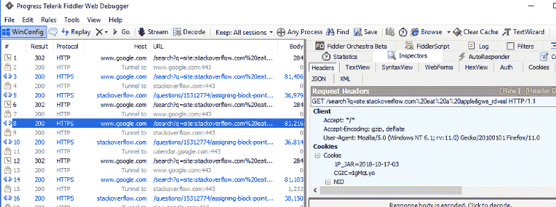

# 掉进兔子洞

> 原文:[https://dev.to/almenon/down-the-rabbit-hole-1cp7](https://dev.to/almenon/down-the-rabbit-hole-1cp7)

在我的文章[让自己保持动力](https://dev.to/almenon/keeping-yourself-motivated-as-acoder-5cah)中，我提到编程是现存的最令人分心的工作之一。最近 [1](#fn1) 我就碰到了这样一个具体的例子。工作了一整天后，我回到了家，感冒了，鼻子也发炎了，但是我很勤奋，一回家就开始写 s̶a̶t̶̶o̶n̶̶t̶h̶e̶̶c̶o̶u̶c̶h̶̶f̶e̶e̶l̶i̶n̶g̶̶t̶e̶r̶r̶i̶b̶l̶e̶̶a̶n̶d̶̶w̶a̶t̶c̶h̶i̶n̶g̶̶a̶n̶i̶m̶e̶̶started 程序。我在 arepl 中尝试使用 [pysimpleGui](https://pysimplegui.readthedocs.io) ，这是一个基于 tkinter 的非常容易使用的 Gui 库。它工作得很好——使用的简单性与 arepl 的实时评估配合得很好。制作一个 gui 从未如此简单。

直到我得到了一个[错误](https://github.com/PySimpleGUI/PySimpleGUI/issues/496#issuecomment-430480930)，那就是。没什么大不了的——我向 github 页面举报了，他很快就回复了。我继续阅读文档，注意到它提到了 [howdoi](https://github.com/gleitz/howdoi) ，这是一个 python 命令行实用程序，可以在 stackoverflow 中搜索您的问题。不是很革命的概念，但是用起来很方便。我一直在命令行中——从那里使用 howdoi 节省了我的 alt-tab 和几次点击。这让我想到——如果这是在一个地方会怎么样？想象一下编程和想知道如何做某事。比方说，得到桌面宽度。甚至不用切换应用程序，你就可以输入`howdoi('get the desktop width')`，arepl 会打印出答案供你使用。没有失去你的重点-只是一个问题和答案，无缝融入你的工作流程。

我得去工作了。我很快就明白了如何通过编程来调用 howdoi，并验证了它可以在 arepl 中运行。但是有一个小问题——在实时模式下，arepl 运行每一个代码更改，去抖到一个可定制的时间间隔，但是仍然非常频繁。这将导致许多不必要的重复请求。谢天谢地 howdoi 有缓存，跳过了这个问题。为了仔细检查，我打开了 fiddler 并捕获了网络流量:

[T2】](https://res.cloudinary.com/practicaldev/image/fetch/s--5Dvsy_rA--/c_limit%2Cf_auto%2Cfl_progressive%2Cq_auto%2Cw_880/https://thepracticaldev.s3.amazonaws.com/i/pd10y3nkhqq1cpdbwuef.png)

啊哦。你看到的是每个请求都有一个 stackoverflow 调用——根本没有缓存。howdoi 使用的库 requests_cache 应该在`%userprofile%/.howdoi/cache`中创建一个 sqlite 数据库，但它并不存在！我不打算在这篇文章中谈论整个问题——你可以在这里阅读一份全面的报告——但足以说这是一个真实的问题，需要大量的工作。在调查这两天过去的时候。然后周末来了，伴随着所有的徒步旅行、朋友和其他恶心的“户外”活动，我没有完成任何编程。终于在周一，我能够回到 arepl 上工作了。

因此，一开始只是对 arepl 中的一个库进行简单的测试，变成了为期一周的冒险。这就是互联网上的生活- [你永远不知道它会把你带到哪里](https://www.youtube.com/watch?v=oHg5SJYRHA0) [2](#fn2) 。

这不是一件坏事。这是我热爱互联网的部分原因——它充满了未知，每一个转折的背后都有新的事实有待发现。但有时你有一些紧迫的事情要做，转移话题会令人沮丧。你的好奇心和完美主义与你高效完成工作的愿望相冲突。如果你像我一样，你会继续偏离方向，可能会超过最后期限，并在事后对自己感到失望。

但是你需要做出正确的选择。艰难的选择。当你发现自己被转移话题时，记下需要做的事情，留着以后做。这遵循 MVP 的[敏捷](https://en.wikipedia.org/wiki/Agile_software_development)原则——首先生产最小可行的产品。完美主义可以以后再来。更早交付产品，即使不完美，也是更好的，原因有很多。更短的迭代时间。客户更快的反馈。消除潜在的不必要工作。更高的出票率。值了。

现在，我意识到了上述情况...但是我还是会分心🙈。所以这里有一些更实用的建议:

*   使用 [onetab](https://www.one-tab.com) 或类似的扩展来保存您的标签以备后用
*   保持你的票小。工作越少，复杂性和风险越低。这是另一个[敏捷推荐](https://agilepainrelief.com/notesfromatooluser/2010/09/story-slicing-how-small-is-enough.html#.XWfycChKiUk)。
*   给自己定一个期限。比如 [github 里程碑](https://github.com/Almenon/AREPL-vscode/milestones)。
*   当你为了研究某样东西而创作一个故事时，请记住你是*只是*要去研究它还是也要去尝试它？如果你也做后者，半小时的研究可能会变成几天的工作。
*   和上面类似，试着在一张票里详细列出你需要做的每一项任务。甚至可以列一个清单。如果工作是有计划的，不算跑偏:)
*   没有单元测试就修改代码？在添加单元测试时，您可能需要重构它。
*   使创建新票证变得容易。如果有一堆字段需要填写，也许你可以将其中一些字段配置成合理的默认值？或者，如果您无法控制您的票务系统，您可以编写一个快速脚本来实现自动化。
*   留出一些时间进行创新冲刺，这样你就可以处理你已经注意到的所有问题。

希望这些能帮到你，你还有其他建议吗？你的兔子洞有多深？下面评论！

* * *

1.  说实话去年。听着，我忘了这篇文章是我起草的，好吗？ [↩](#fnref1)

2.  包括我。我写这篇文章已经很久了，我都忘了它和什么有关。 [↩](#fnref2)