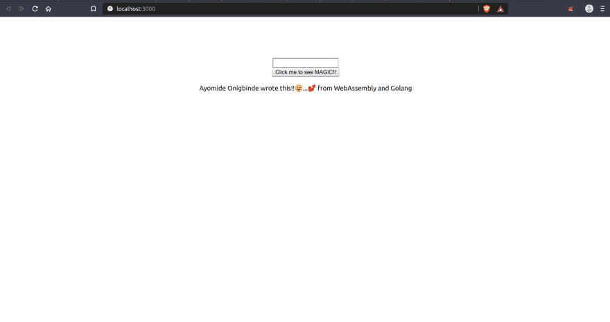

# 使用 React and Go 创建 WebAssembly 应用程序

> 原文:[https://dev . to/oayomide/create-a-web assembly-app-with-react-and-go-39j 7](https://dev.to/oayomide/create-a-webassembly-app-with-react-and-go-39j7)

# WASM 入门，反应过来就走

WebAssembly 太棒了——几乎算不上什么新闻，但是如何将它与 React and Go 一起使用呢？嗯，老实说，有很多资料可以帮助我们解决这个问题。但就我个人而言，这并不是一次顺利的经历。我想要一篇直截了当的最新文章。首先，我一直在寻找一个使用 Create-React-App 的解决方案，因为谁会想搞乱 Webpack 呢？🙃🙃

这个简短教程的目的是向你展示我是如何把所有的东西拼凑在一起，并让一个基于 React 的 Go 程序编译成 WebAssembly 并运行的。我假设如下:

*   您已经安装了 Go(1.11 及更高版本)。
*   NPM/纱线已安装。

所以让我们开始吧。

在本教程中，我们将在 react 的输入框中输入一个值，然后使用 WebAssembly 来呈现该值。简单有趣吧？

[T2】](https://res.cloudinary.com/practicaldev/image/fetch/s--WfPus55T--/c_limit%2Cf_auto%2Cfl_progressive%2Cq_auto%2Cw_880/https://thepracticaldev.s3.amazonaws.com/i/h4h0ur2eaig2lvjy0hkf.png)

在此克隆回购[。回购包含被弹出的应用程序。我试图使这篇文章尽可能简短，这样我可能会(无意中)错过一些东西。](https://github.com/oayomide/go-reactive)

在根中，我们有包含以下代码的`main.go`:

```
package main

import (
    "fmt"
    "syscall/js"
)

var c chan bool

// init is called even before main is called. This ensures that as soon as our WebAssembly module is ready in the browser, it runs and prints "Hello, webAssembly!" to the console. It then proceeds to create a new channel. The aim of this channel is to keep our Go app running until we tell it to abort.
func init() {
    fmt.Println("Hello, WebAssembly!")
    c = make(chan bool)
}

func main() {
    // here, we are simply declaring the our function `sayHelloJS` as a global JS function. That means we can call it just like any other JS function.
    js.Global().Set("sayHelloJS", js.FuncOf(SayHello))
    println("Done.. done.. done...")

    // tells the channel we created in init() to "stop".
    <-c
}

// SayHello simply set the textContent of our element based on the value it receives (i.e the value from the input box)
// the element MUST exist else it'd throw an exception
func SayHello(jsV js.Value, inputs []js.Value) interface{} {
    message := inputs[0].String()
    h := js.Global().Get("document").Call("getElementById", "message")
    h.Set("textContent", message)
    return nil
} 
```

<svg width="20px" height="20px" viewBox="0 0 24 24" class="highlight-action crayons-icon highlight-action--fullscreen-on"><title>Enter fullscreen mode</title></svg> <svg width="20px" height="20px" viewBox="0 0 24 24" class="highlight-action crayons-icon highlight-action--fullscreen-off"><title>Exit fullscreen mode</title></svg>

我们的函数 sayHello 有两个参数。我们更关心第二点。第二个函数的本质是它接受一个 js.Value 数组，这是因为我们可以从 JavaScript 传递任意多的参数。要获得这些值，我们只需使用索引。因此，在我们的例子中，我们希望获得输入框中输入的值。

```
message := inputs[0].String() 
```

<svg width="20px" height="20px" viewBox="0 0 24 24" class="highlight-action crayons-icon highlight-action--fullscreen-on"><title>Enter fullscreen mode</title></svg> <svg width="20px" height="20px" viewBox="0 0 24 24" class="highlight-action crayons-icon highlight-action--fullscreen-off"><title>Exit fullscreen mode</title></svg>

就像我之前说的，我们使用数组的索引来获取我们想要的值。

```
h := js.Global().Get("document").Call("getElementById", "message")
h.Set("textContent", message) 
```

<svg width="20px" height="20px" viewBox="0 0 24 24" class="highlight-action crayons-icon highlight-action--fullscreen-on"><title>Enter fullscreen mode</title></svg> <svg width="20px" height="20px" viewBox="0 0 24 24" class="highlight-action crayons-icon highlight-action--fullscreen-off"><title>Exit fullscreen mode</title></svg>

上面的代码类似于:

```
let h = document.getElementById("message")
h.textContent = message 
```

<svg width="20px" height="20px" viewBox="0 0 24 24" class="highlight-action crayons-icon highlight-action--fullscreen-on"><title>Enter fullscreen mode</title></svg> <svg width="20px" height="20px" viewBox="0 0 24 24" class="highlight-action crayons-icon highlight-action--fullscreen-off"><title>Exit fullscreen mode</title></svg>

所以我们所做的是用 id“message”和输入值来改变元素的文本。

运行以下命令来编译`main.go` :

```
GOOS=js GOARCH=wasm go build -o ../client/public/main.wasm 
```

<svg width="20px" height="20px" viewBox="0 0 24 24" class="highlight-action crayons-icon highlight-action--fullscreen-on"><title>Enter fullscreen mode</title></svg> <svg width="20px" height="20px" viewBox="0 0 24 24" class="highlight-action crayons-icon highlight-action--fullscreen-off"><title>Exit fullscreen mode</title></svg>

### [](#client-side-of-things)客户端的东西

在`App.js`中，我们在 componentDidMount()中有这个:

```
async componentDidMount() {
    let { instance, module } = await WebAssembly.instantiateStreaming(fetch("main.wasm"), window.go.importObject)
    await window.go.run(instance)
    this.setState({
      mod: module,
      inst: instance
    })
  } 
```

<svg width="20px" height="20px" viewBox="0 0 24 24" class="highlight-action crayons-icon highlight-action--fullscreen-on"><title>Enter fullscreen mode</title></svg> <svg width="20px" height="20px" viewBox="0 0 24 24" class="highlight-action crayons-icon highlight-action--fullscreen-off"><title>Exit fullscreen mode</title></svg>

我们正在实例化我们的`main.wasm`并运行实例。这意味着我们现在可以在应用程序中调用我们的 WASM 函数了。此外，将模块和实例设置为状态，以防我们以后需要它们。另外，**你会注意到我们在做`window.go.run(instance)`。**从哪里来的？好吧，它已经在 React 应用程序中处理了。你会注意到有一个包含一个`init_js`文件的`wasmjs`文件夹。使用 JS 的 WASM 文件所需的这个和`wasm_exec.js`文件已经被创建并与我们使用 webpack 的 React 应用捆绑在一起。**所以它将 Go()实例绑定到全局窗口。因此，它不是声明 Go()的新实例，而是作为窗口对象变量**
存在

```
 handleSubmit = async (e) => {
    e.preventDefault()
    window.sayHelloJS(this.state.message)
  } 
```

<svg width="20px" height="20px" viewBox="0 0 24 24" class="highlight-action crayons-icon highlight-action--fullscreen-on"><title>Enter fullscreen mode</title></svg> <svg width="20px" height="20px" viewBox="0 0 24 24" class="highlight-action crayons-icon highlight-action--fullscreen-off"><title>Exit fullscreen mode</title></svg>

这是我们调用之前在 Go 代码中注册的函数 sayHelloJS！注意我们是作为一个窗口对象属性来访问的。这是因为我们从 React 调用它。如果我们称它为`sayHelloJS`，它将是未定义的。

```
<span id="message">
    Ayomide Onigbinde wrote this!!😉...💕 from WebAssembly and Golang
</span> 
```

<svg width="20px" height="20px" viewBox="0 0 24 24" class="highlight-action crayons-icon highlight-action--fullscreen-on"><title>Enter fullscreen mode</title></svg> <svg width="20px" height="20px" viewBox="0 0 24 24" class="highlight-action crayons-icon highlight-action--fullscreen-off"><title>Exit fullscreen mode</title></svg>

我们有这个 HTML 元素。请注意，它有一个 id“message”。这个元素是我们在编译成 WebAssembly 的 Go 代码中操作的元素！所以这个元素必须存在，否则它会抛出异常。这就是我们在输入框中输入的任何值！而它的 WebAssembly(编译自 Go)在做这个！🎉🎉

我尽力解释了！如果有不清楚的地方，请评论，我们会一起解决😉😉。

非常感谢亚伦的[教程](https://www.aaron-powell.com/posts/2019-02-06-golang-wasm-3-interacting-with-js-from-go/)和非常感谢[在 LogRocket](https://github.com/Chrischuck/ai-tic-tac-toe/tree/master/client/src) 的克里斯。真是救命啊！[这篇文章](https://dev.to/brightdevs/using-webassembly-with-react-1led)也有助于理解与 WASM 的关系。