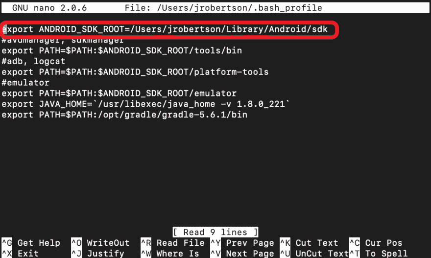

# Devlog #2: Firebase/Google 登录

> 原文:[https://dev . to/daydreamjesse/devlog-2-firebase-Google-log in-IPC](https://dev.to/daydreamjesse/devlog-2-firebase-google-login-ipc)

我今天没有我想要的那么多时间，但是我能够完成我计划要做的事情，所以我想这是值得的。

今天，我为我的应用程序设置了一个 Firebase 服务，并为本地设备集成了 Google login。消费者今天的主要时间是部署到我的 Android 上。我可以在我的 Macbook 上很好地模拟 iOS，但当我试图在 Android 上运行应用程序时，科尔多瓦一直给我带来麻烦。在多次刷新我的路径变量，确保我有正确的活动 JDK，以及多次重启之后，我在 Github 上找到了一个合适的解决方案。

显然，在声明 Android SDK 根目录的路径时，它更喜欢显式声明。因此，它想要的不是“$HOME/Library/Android/sdk”，而是“/Users/my account/Library/Android/SDK”。我不确定这是只影响少数人的 bug 还是使用 SDK 时的必需品；不管怎样，它解决了这个问题。

[T2】](https://res.cloudinary.com/practicaldev/image/fetch/s--MyPv-JGB--/c_limit%2Cf_auto%2Cfl_progressive%2Cq_auto%2Cw_880/https://thepracticaldev.s3.amazonaws.com/i/8qoyuurnthkmhrirwkst.png)

不管怎样，今天到此为止。明天我将主要使用纸笔来起草一些基本的用户界面/UX/导航结构，并与一些潜在用户朋友取得联系，了解他们对应用程序的具体需求。