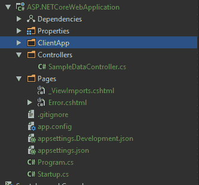
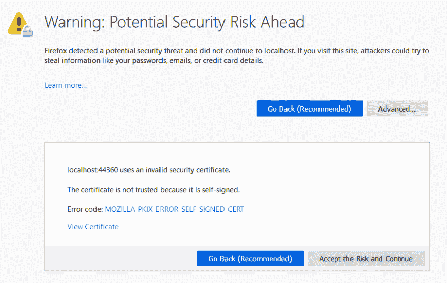
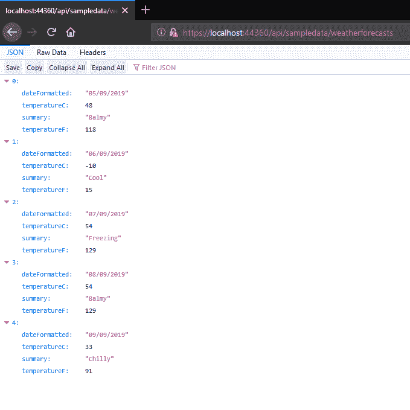
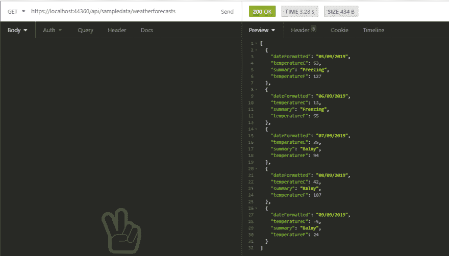

# 从 ASP.NET 核心 React 模板开始(第 2 部分- Web API)

> 原文:[https://dev . to/Jon hilt/start-out-with-the-ASP-net-core-react-template-part-2-we b-API-3 olm](https://dev.to/jonhilt/starting-out-with-the-asp-net-core-react-template-part-2-web-api-3olm)

现在我们已经了解了一个新的 React + Web API 项目的前端部分，那么 Web API 部分呢？

[T2】](https://res.cloudinary.com/practicaldev/image/fetch/s--iuDF6ew---/c_limit%2Cf_auto%2Cfl_progressive%2Cq_auto%2Cw_880/https://jonhilton.net/img/2019-7-18-dotnet-react-template-backend/2019-09-04-07-29-02.png)

新项目中的所有内容(除了 ClientApp 文件夹)都是为了让您的 Web API 工作。

首先我们有**控制器**文件夹。

## [](#api-controllers-for-your-data)API 控制器为您的数据

在 controllers 文件夹中，您将找到一个示例控制器，它为您的应用程序返回一些硬编码数据。

```
[Route("api/[controller]")]
public class SampleDataController : Controller
{
    // other code omitted

    [HttpGet("[action]")]
    public IEnumerable<WeatherForecast> WeatherForecasts()
    {
        var rng = new Random();
        return Enumerable.Range(1, 5).Select(index => new WeatherForecast
        {
            DateFormatted = DateTime.Now.AddDays(index).ToString("d"),
            TemperatureC = rng.Next(-20, 55),
            Summary = Summaries[rng.Next(Summaries.Length)]
        });
    }

    // other code omitted 
} 
```

在顶部，我们有一个`Route`属性，这意味着对我们的应用程序`/api/SampleData`的任何请求都将被路由到这里。

`WeatherForecasts`方法有自己的`HttpGet("[action]")`属性。

这告诉 ASP.NET 核心的路由引擎接受对`/api/sampledata/WeatherForecasts`的任何请求，并将它们转发给这个方法(我们的控制器动作)。

该方法中的其余代码(以及控制器中的更多代码，为了简洁起见，我省略了这些代码)只是生成一些随机的“天气”数据，并将其作为`WeatherForecast`的 IEnumerable 返回。

返回数据的形状由`WeatherForecast`类型定义，如下所示…

```
public class WeatherForecast
{
    public string DateFormatted { get; set; }
    public int TemperatureC { get; set; }
    public string Summary { get; set; }

    public int TemperatureF
    {
        get { return 32 + (int) (TemperatureC / 0.5556); }
    }
} 
```

## [](#testing-your-work)测试你的工作

要测试这样一个简单的 GET，您可以启动您的应用程序并点击您的前端应用程序中的各个屏幕，或者您可以采取一种更直接的方法，将 HTTP 请求直接发送到您的 API。

首先启动您的应用程序。

如果这是你第一次启动，你可能会遇到一个关于“潜在安全风险”的警告信息；这是因为 ASP.NET 试图使用 HTTPS 运行，但使用一个特殊的“自签名”开发证书使其工作。

您不希望将该证书用于生产部署，但是接受该证书并在您的本地机器上继续也是可以的。这是 Firefox 中的警告。

[T2】](https://res.cloudinary.com/practicaldev/image/fetch/s--nmbYQFYA--/c_limit%2Cf_auto%2Cfl_progressive%2Cq_auto%2Cw_880/https://jonhilton.net/img/2019-7-18-dotnet-react-template-backend/2019-09-04-07-55-30.png)

一旦它启动并运行，您只需在浏览器中输入 URL 就可以测试 GET 操作…

[T2】](https://res.cloudinary.com/practicaldev/image/fetch/s--e4uEX9nD--/c_limit%2Cf_auto%2Cfl_progressive%2Cq_auto%2Cw_880/https://jonhilton.net/img/2019-7-18-dotnet-react-template-backend/2019-09-04-08-00-47.png)

或者，您可以使用其他工具来测试您的 API。

邮递员和失眠是这份工作的两个主要竞争者，我个人最喜欢的是失眠。

为了使用失眠症测试你的 API，你需要[下载并安装它](https://insomnia.rest/)，然后记下你的应用程序运行的地址，并将其输入到屏幕顶部的 URL 框中。

确保请求类型为`GET`，点击`Send`，您应该会看到返回的可爱的随机天气数据。

[T2】](https://res.cloudinary.com/practicaldev/image/fetch/s--FHI3JToC--/c_limit%2Cf_auto%2Cfl_progressive%2Cq_auto%2Cw_880/https://jonhilton.net/img/2019-7-18-dotnet-react-template-backend/2019-09-04-07-56-29.png)

## [](#startupcs)Startup.cs

项目后端的另一个值得注意的文件是`startup.cs`。

在 ASP.NET 核心这是你会发现自己配置你的应用程序。

看一看，你会看到各种各样的电话告诉 ASP.NET 应该如何操作。

例如，如果我们在开发模式下运行(在开发机器上)，下面的代码告诉 ASP.NET 核心显示一条“开发人员友好”的错误消息……

```
if (env.IsDevelopment())
{
    app.UseDeveloperExceptionPage();
} 
```

该文件的大部分是 bog 标准 ASP.NET 核心，但也有一些 React/SPA 特定调用。

最值得注意的是，您将看到对`UseSpaStaticFiles`的调用。

当你在生产环境中运行你的应用程序时，你的 React 代码将被编译成静态的`.html`和`.js`文件，保存在`ClientApp/build`中。

`UseSpaStaticFiles`和对`AddSpaStaticFiles`的相应调用确保当用户访问您的应用程序时，这些编译和缩小的文件将被提供给浏览器。

类似地，确保当向应用程序发出请求时，React 应用程序的默认起始页被提供。

此代码……

```
if (env.IsDevelopment())
{
    spa.UseReactDevelopmentServer(npmScript: "start");
} 
```

…确保您的 React 应用程序在开发模式下运行时(在您的机器上)使用 React 开发服务器提供服务。

这在浏览器的控制台中为您提供了更详细的输出，并且还可以在您对应用程序进行更改时自动刷新浏览器。

## [](#launch-andor-publish-your-application)启动和/或发布您的应用

当您启动或发布您的应用程序时，了解发生了什么是值得的。

如果你看一下你的应用程序的`.csproj`文件，你会注意到一些对`npm`的调用。

```
<Target Name="PublishRunWebpack" AfterTargets="ComputeFilesToPublish">
        <!-- As part of publishing, ensure the JS resources are freshly built in production mode -->
        <Exec WorkingDirectory="$(SpaRoot)" Command="npm install"/>
        <Exec WorkingDirectory="$(SpaRoot)" Command="npm run build"/>

        <!-- rest of code omitted for brevity -->
</Target> 
```

当您发布您的应用程序时，这些`npm`调用确保任何前端依赖项被下载，并且您的应用程序被构建(编译和缩小)以准备在生产中服务。

要在本地运行您的项目，您只需按 CTRL+F5(在 VS 中),应用程序的两个部分(前端和后端)将一起启动，在同一个网址上运行。

您可以通过修改`Properties`文件夹中的`launchSettings.json`文件来控制使用哪个端口。

因此，在本例中，如果您使用 IIS Express 启动此应用程序，它将在端口 40512 (http)或 44360 (https)上运行。

```
"iisSettings":  {  "windowsAuthentication":  false,  "anonymousAuthentication":  true,  "iisExpress":  {  "applicationUrl":  "http://localhost:40512",  "sslPort":  44360  }  }, 
```

## [](#launching-the-react-application-on-its-own-url)在自己的 URL 上启动 React 应用程序

同时运行应用程序的 React 和 ASP.NET 核心部分的一个缺点是，对 C#代码的任何更改都会触发应用程序的重新编译和重新启动，导致 React 前端几秒钟没有响应。

ASP.NET 核心构建也将花费更长的时间，因为它还必须重新构建应用程序的 React 部分，即使您没有更改它。

要解决这个问题，您可以选择在自己的端口上单独启动应用程序的 React 部分。

为此，将一个`.env`文件添加到`ClientApp`目录中，并添加以下设置:

```
BROWSER=none 
```

现在您需要手动启动 React 应用程序(当您启动。net 应用):

```
cd ClientApp
npm start 
```

默认情况下，React 应用程序将在端口 3000 上启动。

现在您需要通过对`startup.cs`做一个小小的修改来提醒 ASP.NET 核心注意这个事实。

将`spa.UseReactDevelopmentServer`替换为以下代码:

```
spa.UseProxyToSpaDevelopmentServer("http://localhost:3000"); 
```

现在，当您构建并启动 ASP.NET 核心应用程序时，它不会启动自己的 React 服务器，也不会重启您手动启动的服务器。

您会发现您的应用程序在`http://localhost:3000`运行，而您的 ASP.NET 核心 API 继续在`launchSettings.json`中指定的端口上运行。

如果沿着这条路走下去，有几个问题需要注意:特别是您可能会发现对 API 的网络请求开始失败；我的下一篇文章将解释为什么(以及如何修复)。