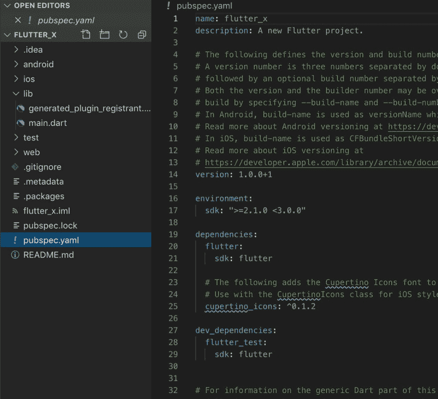
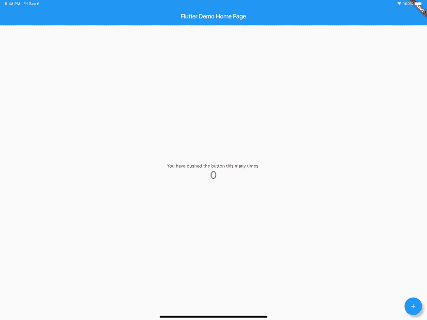
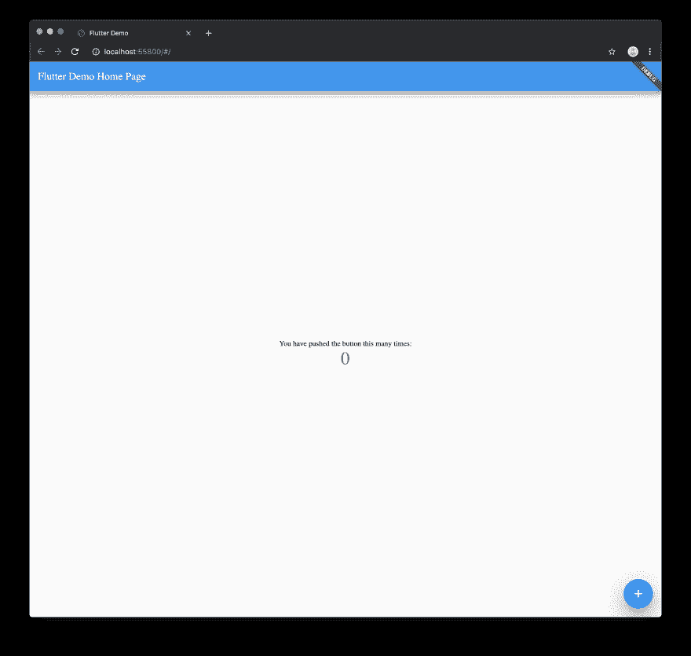
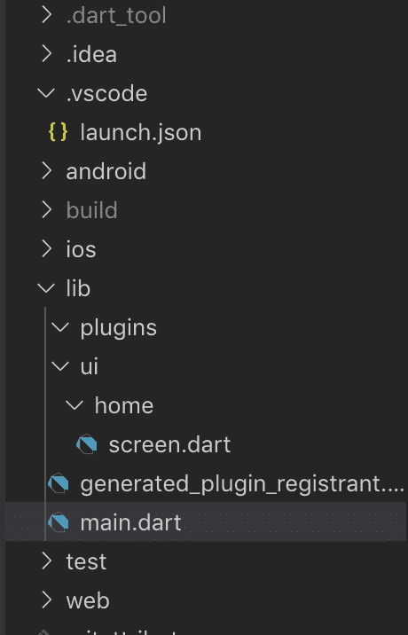
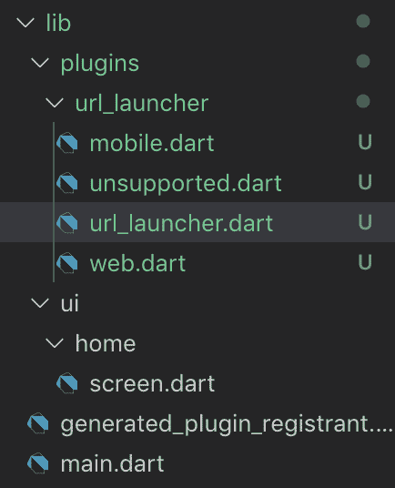
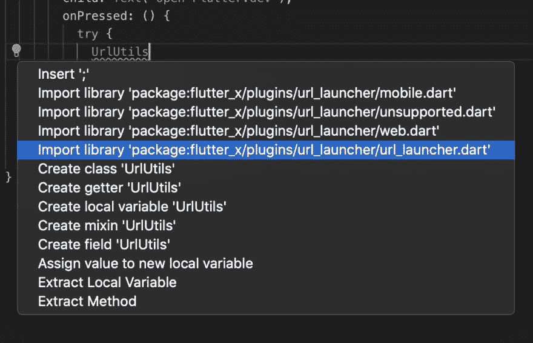
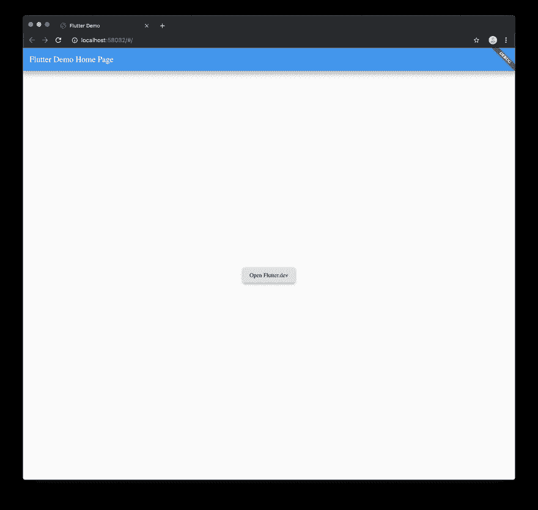
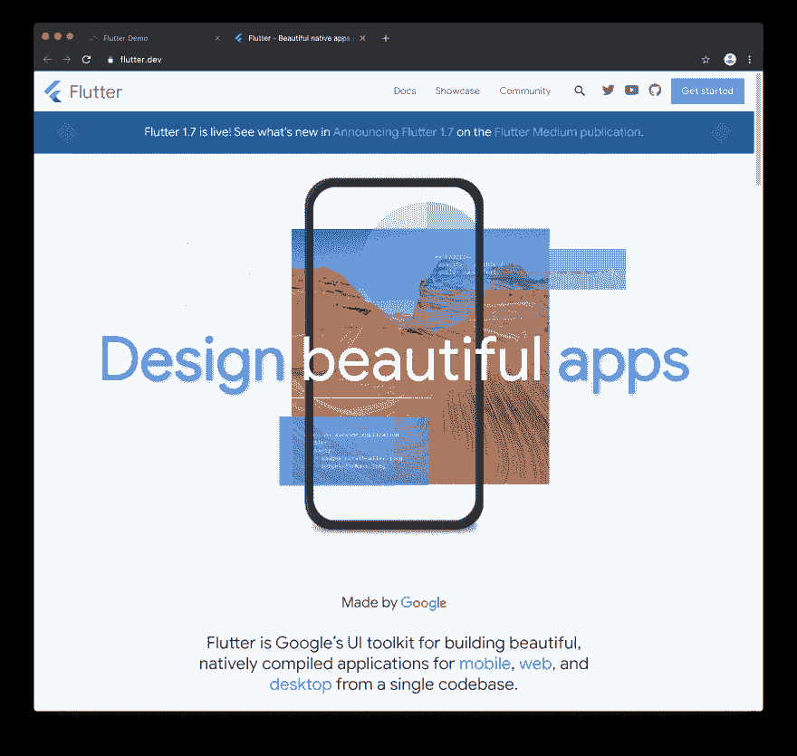
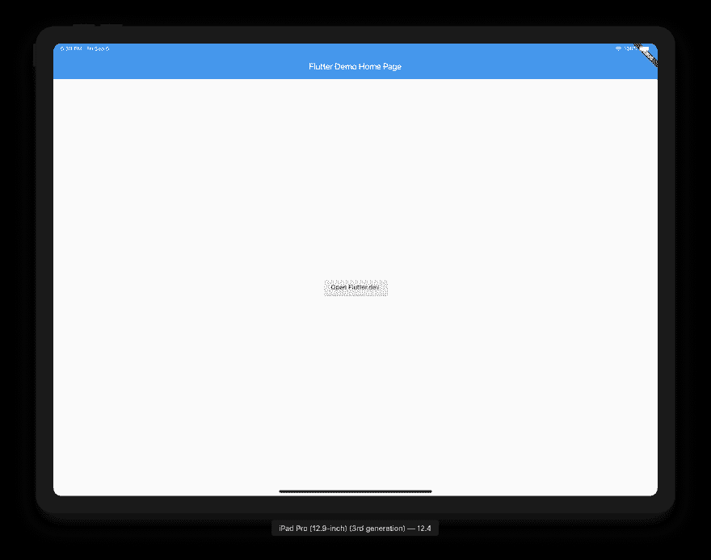
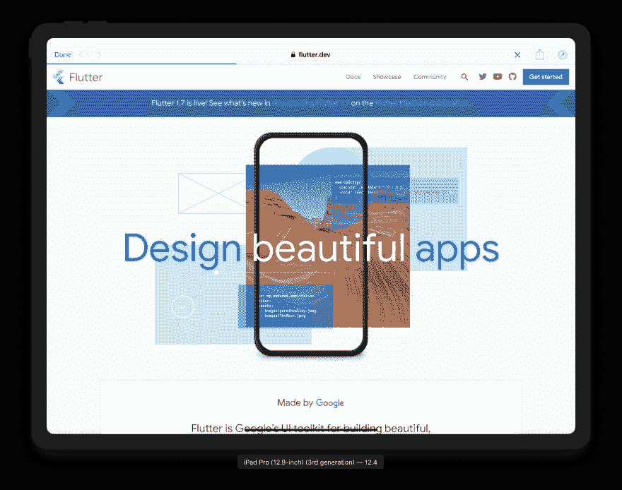

# 如何用 Flutter 构建原生跨平台项目

> 原文：<https://dev.to/rodydavis/how-to-build-a-native-cross-platform-project-with-flutter-ojg>

在同一个项目中导入 dart:html 和 dart:io！

你可以在这里找到最终项目[。](https://github.com/AppleEducate/flutter_x/tree/finish)

到目前为止，你已经可以用 Flutter 创建在 iOS/Android、Web 和桌面上运行的项目，但只能共享纯 dart 插件。Flutter 在 Google I/O 上推出了 Flutter for web，并且是一个临时分支，需要你从 import ' package:Flutter/material . dart '中更改 import；要导入“package:flutter _ web/material . dart”；。可以想象，这对于代码库来说非常困难，因为您必须创建一个分支并更改导入。这也意味着你不能导入任何需要路径或者依赖于 flutter 的包。时机成熟了，合并完成了。现在您不再需要更改导入！

[](https://res.cloudinary.com/practicaldev/image/fetch/s--wtuZE4ex--/c_limit%2Cf_auto%2Cfl_progressive%2Cq_66%2Cw_880/https://cdn-images-1.medium.com/max/2000/1%2AepSHkw0msNuaisyHy9yYAA.gif)

你现在可以使用任何插件，拥有一个调试器，创建新的添加了 web 文件夹的 flutter 项目，web 插件，等等..

## 免责声明 [#](#disclaimer)

你需要了解最新的动向，这样才能工作。

[下载颤振](https://flutter.io/get-started/install/)

[](https://res.cloudinary.com/practicaldev/image/fetch/s--NfOLlPM6--/c_limit%2Cf_auto%2Cfl_progressive%2Cq_auto%2Cw_880/https://cdn-images-1.medium.com/max/2000/1%2A1PVcOkDgx2p_G3Bou3IFsg.jpeg)

如果你是 Flutter 的新手，你可以看看[这个关于如何一步一步创建新项目的有用指南](https://flutter.io/get-started/codelab/)。

[](https://res.cloudinary.com/practicaldev/image/fetch/s--4RrI85fC--/c_limit%2Cf_auto%2Cfl_progressive%2Cq_auto%2Cw_880/https://cdn-images-1.medium.com/max/2000/1%2Ad6qN8hoGMwldMtIsQYIqrg.jpeg)

创建一个名为 flutter_x 的新项目，它应该如下所示:

[](https://res.cloudinary.com/practicaldev/image/fetch/s--bykuwGZh--/c_limit%2Cf_auto%2Cfl_progressive%2Cq_auto%2Cw_880/https://cdn-images-1.medium.com/max/2628/1%2Axe6ubLj5psVH4JQd-VqSAQ.png)

你也可以在这里下载启动项目[。](https://github.com/AppleEducate/flutter_x/tree/starter)

您的代码应该如下所示:

为了确保一切正常，请在 iOS/Android 上运行该项目。

[](https://res.cloudinary.com/practicaldev/image/fetch/s--dJuE38kM--/c_limit%2Cf_auto%2Cfl_progressive%2Cq_auto%2Cw_880/https://cdn-images-1.medium.com/max/5464/1%2AteDs_OqHkRdhwyuzyb2rVA.png)

您应该让计数器应用程序正常运行。现在退出，在 Chrome 上运行。它应该被列为设备。你也可以从命令行运行 flutter run -d chrome。

[](https://res.cloudinary.com/practicaldev/image/fetch/s--UdwYok9n--/c_limit%2Cf_auto%2Cfl_progressive%2Cq_auto%2Cw_880/https://cdn-images-1.medium.com/max/5248/1%2ACzZ28crDYxBEMaNVq9CtvQ.png)

> 你还不能在网上热重装，所以请注意这一点。
> 
> *这是可选的，但我在我所有的应用中使用这种结构*

[](https://res.cloudinary.com/practicaldev/image/fetch/s--7MSqTop4--/c_limit%2Cf_auto%2Cfl_progressive%2Cq_auto%2Cw_880/https://cdn-images-1.medium.com/max/2000/1%2Azr22DdSlEXlluwcki-ahEQ.png)

您的项目现在应该看起来像这样。

打开您的 pubspec.yaml 并导入以下包。

```
dependencies: universal_html: url_launcher: 
```

<svg width="20px" height="20px" viewBox="0 0 24 24" class="highlight-action crayons-icon highlight-action--fullscreen-on"><title>Enter fullscreen mode</title></svg> <svg width="20px" height="20px" viewBox="0 0 24 24" class="highlight-action crayons-icon highlight-action--fullscreen-off"><title>Exit fullscreen mode</title></svg>

> *您也可以删除在 pubspec.yaml* 中生成的评论

您的 pubspec.yaml 现在将如下所示:

```
name: flutter_xdescription: A new Flutter project.version: 1.0.0+1environment: sdk: ">=2.1.0 <3.0.0"dependencies: flutter: sdk: fluttercupertino_icons: ^0.1.2 universal_html: ^1.1.0 url_launcher: ^5.1.2dev_dependencies: flutter_test: sdk: flutterflutter:uses-material-design: true 
```

<svg width="20px" height="20px" viewBox="0 0 24 24" class="highlight-action crayons-icon highlight-action--fullscreen-on"><title>Enter fullscreen mode</title></svg> <svg width="20px" height="20px" viewBox="0 0 24 24" class="highlight-action crayons-icon highlight-action--fullscreen-off"><title>Exit fullscreen mode</title></svg>

默认情况下，如果你要检查设备是移动设备还是网络设备，当你试图导入一个不适合该平台的插件时，你会在编译时得到一个错误。为了解决这个问题，我们将使用动态导入。

[](https://res.cloudinary.com/practicaldev/image/fetch/s--6dd8Zgzv--/c_limit%2Cf_auto%2Cfl_progressive%2Cq_auto%2Cw_880/https://cdn-images-1.medium.com/max/2000/1%2AYCLt5ItFmyOmrd-CKgOQFQ.png)

创建一个 url_launcher 文件夹，并在 plugins 文件夹中创建 url_launcher.dart、mobile.dart、web.dart、unsupported.dart 文件。

在 url_launcher.dart 文件中添加以下内容:

```
export 'unsupported.dart' if (dart.library.html) 'web.dart' if (dart.library.io) 'mobile.dart'; 
```

<svg width="20px" height="20px" viewBox="0 0 24 24" class="highlight-action crayons-icon highlight-action--fullscreen-on"><title>Enter fullscreen mode</title></svg> <svg width="20px" height="20px" viewBox="0 0 24 24" class="highlight-action crayons-icon highlight-action--fullscreen-off"><title>Exit fullscreen mode</title></svg>

这将在运行时选择正确的文件，并在不支持时给出一个回退。

为了防止边缘情况，您需要为导入设置一个后备。在 unsupported.dart 中添加以下内容:

```
class UrlUtils { UrlUtils._();static void open(String url, {String name}) { throw 'Platform Not Supported'; }} 
```

<svg width="20px" height="20px" viewBox="0 0 24 24" class="highlight-action crayons-icon highlight-action--fullscreen-on"><title>Enter fullscreen mode</title></svg> <svg width="20px" height="20px" viewBox="0 0 24 24" class="highlight-action crayons-icon highlight-action--fullscreen-off"><title>Exit fullscreen mode</title></svg>

类 UrlUtils 和公共方法必须匹配所有三个文件才能正确工作。始终先设置不支持的，然后将文件复制到 mobile.dart 和 web.dart 中，以确保没有打字错误。

现在，每个类中应该有 3 个包含上述代码的文件。

在 mobile.dart 中添加以下内容:

```
import 'package:url_launcher/url_launcher.dart';class UrlUtils { UrlUtils._();static void open(String url, {String name}) async { if (await canLaunch(url)) { await launch(url); } }} 
```

<svg width="20px" height="20px" viewBox="0 0 24 24" class="highlight-action crayons-icon highlight-action--fullscreen-on"><title>Enter fullscreen mode</title></svg> <svg width="20px" height="20px" viewBox="0 0 24 24" class="highlight-action crayons-icon highlight-action--fullscreen-off"><title>Exit fullscreen mode</title></svg>

这将分别在 safari 视图控制器或 android 的默认浏览器中打开链接。

在 web.dart 中添加以下内容:

```
import 'package:universal_html/prefer_universal/html.dart' as html;class UrlUtils { UrlUtils._();static void open(String url, {String name}) { html.window.open(url, name); }} 
```

<svg width="20px" height="20px" viewBox="0 0 24 24" class="highlight-action crayons-icon highlight-action--fullscreen-on"><title>Enter fullscreen mode</title></svg> <svg width="20px" height="20px" viewBox="0 0 24 24" class="highlight-action crayons-icon highlight-action--fullscreen-off"><title>Exit fullscreen mode</title></svg>

这将在浏览器中打开一个带有指定链接的新窗口。

在屏幕中央添加一个按钮。ui/home/screen.dart 应如下所示:

```
import 'package:flutter/material.dart';class MyHomePage extends StatefulWidget { MyHomePage({Key key, this.title}) : super(key: key);final String title;@override _MyHomePageState createState() => _MyHomePageState();}class _MyHomePageState extends State<MyHomePage> { @override Widget build(BuildContext context) { return Scaffold( appBar: AppBar( title: Text(widget.title), ), body: Center( child: RaisedButton( child: Text('Open Flutter.dev'), onPressed: () {}, )), ); }} 
```

<svg width="20px" height="20px" viewBox="0 0 24 24" class="highlight-action crayons-icon highlight-action--fullscreen-on"><title>Enter fullscreen mode</title></svg> <svg width="20px" height="20px" viewBox="0 0 24 24" class="highlight-action crayons-icon highlight-action--fullscreen-off"><title>Exit fullscreen mode</title></svg>

将 onPressed 更新为以下内容:

```
onPressed: () { try { UrlUtils.open('[https://flutter.dev'](https://flutter.dev')); } catch (e) { print('Error -> $e'); }}, 
```

<svg width="20px" height="20px" viewBox="0 0 24 24" class="highlight-action crayons-icon highlight-action--fullscreen-on"><title>Enter fullscreen mode</title></svg> <svg width="20px" height="20px" viewBox="0 0 24 24" class="highlight-action crayons-icon highlight-action--fullscreen-off"><title>Exit fullscreen mode</title></svg>

现在，当您要导入 UrlUtils 时，导入正确的 URI 非常重要。

[](https://res.cloudinary.com/practicaldev/image/fetch/s--mTeuSiGU--/c_limit%2Cf_auto%2Cfl_progressive%2Cq_auto%2Cw_880/https://cdn-images-1.medium.com/max/2140/1%2A7OyxZG6557DYE1XiBscCtA.png)

确保导入导入' package:flutter _ x/plugins/URL _ launcher/URL _ launcher . dart '；只有。

> 如果你愿意的话，你可以使用相对导入。

你的用户界面代码将会如下所示:

```
import 'package:flutter/material.dart';import '../../plugins/url_launcher/url_launcher.dart';class MyHomePage extends StatefulWidget { MyHomePage({Key key, this.title}) : super(key: key);final String title;@override _MyHomePageState createState() => _MyHomePageState();}class _MyHomePageState extends State<MyHomePage> { @override Widget build(BuildContext context) { return Scaffold( appBar: AppBar( title: Text(widget.title), ), body: Center( child: RaisedButton( child: Text('Open Flutter.dev'), onPressed: () { try { UrlUtils.open('[https://flutter.dev'](https://flutter.dev')); } catch (e) { print('Error -> $e'); } }, )), ); }} 
```

<svg width="20px" height="20px" viewBox="0 0 24 24" class="highlight-action crayons-icon highlight-action--fullscreen-on"><title>Enter fullscreen mode</title></svg> <svg width="20px" height="20px" viewBox="0 0 24 24" class="highlight-action crayons-icon highlight-action--fullscreen-off"><title>Exit fullscreen mode</title></svg>

您在 web 上的应用程序应该是这样的:

[](https://res.cloudinary.com/practicaldev/image/fetch/s--lcw8gJJR--/c_limit%2Cf_auto%2Cfl_progressive%2Cq_auto%2Cw_880/https://cdn-images-1.medium.com/max/5248/1%2A6ni24NpLIULqi_Cd5NHh3Q.png)

当你点击按钮时..

[](https://res.cloudinary.com/practicaldev/image/fetch/s--t9pxVFaO--/c_limit%2Cf_auto%2Cfl_progressive%2Cq_auto%2Cw_880/https://cdn-images-1.medium.com/max/5248/1%2Atgcfnrgu9O4joiPeKFmqKw.png)

当你在 iOS/Android 上运行时，它应该是这样的:

[](https://res.cloudinary.com/practicaldev/image/fetch/s--UWfccR9k--/c_limit%2Cf_auto%2Cfl_progressive%2Cq_auto%2Cw_880/https://cdn-images-1.medium.com/max/5036/1%2AQEFw3xDevKMsjke4Dd06VA.png)

当你点击按钮时..

[](https://res.cloudinary.com/practicaldev/image/fetch/s---5WKmcwR--/c_limit%2Cf_auto%2Cfl_progressive%2Cq_auto%2Cw_880/https://cdn-images-1.medium.com/max/5036/1%2AlCvTvAvu0nI_dhgUUFHkWA.png)

恭喜你！你做到了:)

[](https://res.cloudinary.com/practicaldev/image/fetch/s--opTo_bpc--/c_limit%2Cf_auto%2Cfl_progressive%2Cq_66%2Cw_880/https://cdn-images-1.medium.com/max/2000/1%2AKowWujusMfDjlkjeeOFEBg.gif)

这是最后一个项目，位于[这里](https://github.com/AppleEducate/flutter_x/tree/finish)。

如有任何问题，请联系我们！

*最初发表于[http://github.com](https://gist.github.com/a2c38b2020d09e718c8d894d048e9c7e)。*

[](https://res.cloudinary.com/practicaldev/image/fetch/s--ti2tD55V--/c_limit%2Cf_auto%2Cfl_progressive%2Cq_auto%2Cw_880/https://rodydavis.com/.netlify/functions/ga%3Fv%3D1%26_v%3Dj83%26t%3Dpageview%26dr%3Dhttps%253A%252F%252Frss-feed-reader.com%26_s%3D1%26dh%3Drodydavis.com%26dp%3D%252Fposts%252Fnative-cross-platform-flutter%252F%26ul%3Den-us%26de%3DUTF-8%26dt%3DHow%2520to%2520build%2520a%2520native%2520cross%2520platform%2520project%2520with%2520Flutter%26tid%3DG-JQNPVBL9DR)