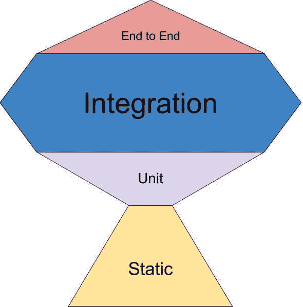

# JavaScript 项目中的测试和 CI/CD

> 原文:[https://dev . to/the fin menon/testing-ci-CD-in-JavaScript-projects-28cc](https://dev.to/thefinnomenon/testing-ci-cd-in-javascript-projects-28cc)

> "如果你不喜欢对你的产品进行单元测试，很可能你的客户也不会喜欢测试它."匿名的

很少有开发人员对为他们的代码编写测试的想法感到兴奋。特别是在尽可能快地完成新功能的压力下，编写不直接有助于项目进展的测试代码是一件令人烦恼的事情。当项目很小，你可以手动测试几个特性以确保一切正常时，这看起来不错，但是随着项目的增长，这种手动检查不仅非常低效和低质量，而且基本上是不可能的。

投资于前期测试是你在项目中所能做的最好的投资之一。它允许你写一个特性，几个星期不碰它，回来后，看到它通过了所有的测试，并有一定程度的信心认为世界上的一切都是好的。这篇文章将涵盖一些重要的测试概念，以及如何将它们应用到您的 JavaScript 项目中。

# [](#testing-basics)测试基础知识

## [](#principles)原则

测试应该，

*   简单、简短、易懂。在理解如何使用库或代码库方面，一个好的测试基本上和文档一样好。

## ——描述正在测试什么，在什么场景下，预期的结果是什么。

遵循 AAA 模式。

*   安排:设置测试要测试的场景所需的代码。
*   Act:调用您正在测试的代码。
*   断言:检查收到的结果是否与预期的结果匹配。
    *   使用**声明性**断言，而不是命令性断言。
    *   关注行为测试，即验证行为的测试，而不是具体的实现。这本质上可以归结为只测试公共方法，而不测试它们可能使用的私有方法。
    *   喜欢树桩和间谍胜过嘲笑。模拟侧重于服务的内部，因此与实现紧密耦合。另一方面，间谍和存根专注于监视服务的使用，而不是如何实现它。
    *   使用像 [faker](https://github.com/Marak/Faker.js) 这样的库来改进输入测试，它可以生成随机的名字、电话号码等。和/或基于属性的测试库，如[快速检查](https://github.com/dubzzz/fast-check)，它根据你定义的输入属性生成大量的输入。
    *   避免全局种子和文本设备，而是选择在每个测试的基础上添加所需的数据，这样它们就保持独立。
    *   期待错误，而不是试图尝试/捕捉它们(例如 expect(foo).to.throw(MyError))。
    *   被标记是为了允许在保存时运行快速测试，而在推送之前等更大的事件中运行较慢的测试。
    *   目标是大约 80%的代码覆盖率。
    *   使用像 [Stryker](https://stryker-mutator.io/stryker/) 这样的突变测试库来确认代码覆盖率报告所报告的测试实际上是有效的。
    *   使用类似于 [eslint-plugin-jest](https://github.com/jest-community/eslint-plugin-jest) 的测试工具。

# [](#types)类型

[T2】](https://res.cloudinary.com/practicaldev/image/fetch/s--61sc9obB--/c_limit%2Cf_auto%2Cfl_progressive%2Cq_auto%2Cw_880/https://thefinnternet.com/static/180315b765f1b8180bcc5625e930032b/c739e/testing-trophy.jpg)

## [](#static)静态

静态测试在您键入代码时运行。

这些包括:

*   棉短绒
*   类型系统
*   易受攻击的依赖扫描程序
*   代码复杂性分析
*   执照检查
*   剽窃检查

## [](#unit)单位

单元测试是一种测试，它验证一小部分代码**独立于其余代码**的行为。这些测试不是为了寻找 bug，而是为了确保一小部分代码按照预期工作，并且即使在重构(重构代码而不是功能)发生时也能继续工作。

这些是简短、快速、超级具体的错误区域、快速编写和廉价的，但是每次测试提供最小的实际总体测试置信度，并且需要大量的它们来具有良好的覆盖率。

## [](#principles)原则

*   快速:一个项目可以有数千个单元测试，所以它们需要快速。
*   **独立**:测试必须测试一段独立于项目其余部分的代码。
*   **可重复**:只要被测试的代码没有改变，每次测试都应该产生相同的结果。这意味着它不能依赖于可能改变的特定元素，如日期/时间、系统运行时间或任何 renadom 函数输出。
*   **自验证**:不需要任何人工检查来确定测试是否通过。
*   **彻底**:应该覆盖每一个用例场景，包括角落/边缘情况、异常/错误、错误输入等。

```
// What is being tested
describe("MathJS", () => {
  // Scenario
  describe("Addition (add)", () => {
    // Expected result
    test("should add 3 and 4 to get 7", () => {
      // Arrange
      const spy = jest.spyOn(mathjs, "add")

      // Act
      const result = mathjs.add(3, 4)

      // Assert
      expect(result).toBe(7)
    })
  })
}) 
```

## [](#integration)整合

集成测试验证几个单元一起正常工作。编写大量单元测试曾经很流行，但趋势似乎是转向更少的单元测试和更多的集成测试，因为一个集成测试可以测试需要几个单元测试才能测试的功能。显然，当测试失败时，它牺牲了对错误所在位置的细粒度了解的能力，但是在节省时间和您所拥有的特异性数量之间找到平衡是很重要的。

这些通常是单元测试大小的 4-5 倍，仍然非常快，相当小的错误区域，编写起来稍微复杂一点，没有单元测试便宜，但是仍然合理，并且为每个测试提供了相当好的实际总体测试信心，并且不需要太多的测试来获得良好的覆盖率。

## [](#end-to-end)首尾相连

端到端测试通过模拟用户实际操作来验证完整的用户流程。

这些是大、慢、巨大的错误区域，写起来非常密集，运行起来非常昂贵，但是提供非常高的置信度，并且不需要很多。

# [](#test-driven-development-tdd)测试驱动开发(TDD)

> “比起测试行为，设计测试的行为是已知的最好的错误预防措施之一。创建一个有用的测试所必须进行的思考可以在错误被编码之前发现并消除它们。”鲍里斯·贝泽尔

这种软件开发方法旨在通过首先编写失败的测试，然后编写通过测试的代码，来编写更可靠和设计更好的软件。通过专注于编写满足测试需要的代码，你的代码应该保持简洁。TDD 围绕 4 个主要周期。

## [](#the-three-laws)三大定律

1.  在编写任何产品代码之前，您必须编写一个失败的测试。
2.  你不能写太多的测试，以至于失败或者编译失败。
3.  您不得编写超过足以使当前失败的测试通过的生产代码。

这些定律在 TDD 中被一秒一秒地应用。

## [](#redgreenrefactor)红色/绿色/重构

1.  创建一个失败的单元测试
2.  编写通过测试的产品代码。
3.  清理你刚刚制造的混乱。

在 TDD 中，这些步骤每分钟都在进行。

## [](#specificgeneric)特定/通用

> 随着测试变得更加具体，代码变得更加通用。

每隔几分钟，您应该确保您正在编写的产品代码是通用的，而不是特定于您的测试的。如果你发现它变得特定于你的测试，你必须返回并使代码更加通用。

## [](#boundaries)界限

每小时，您都应该停下来检查一下，看看您是否已经到达或跨越了应用程序中一个重要的架构边界。这给了你一个机会在一个更高的层次上看这个项目，并且计划出你想要在哪里画界限，并且适当地聚焦你的下一个小时的 TDD 周期。

# [](#cicd)CI/CD

## [](#continuous-integration-ci)持续集成(CI)

持续入侵是一种软件开发实践，它经常对代码库进行小的修改。对于每次推送，都应该进行自动格式化和测试。这为开发人员提供了快速的反馈周期，以确定提交中的潜在冲突，同时还允许频繁地将新的更新合并到应用程序中。

## (CD)连续部署

也称为持续交付，持续部署与 CI 协同工作，将 CI 流程产生的经过测试和构建的应用程序部署(或交付)到预期的基础架构。有了 CD，团队可以每天甚至每小时将新代码推向生产。

# [](#conclusion)结论

在软件世界中，测试是一个复杂而重要的概念，经常被抛到一边，但是随着 CI/CD 等新实践的出现，可靠的测试比以往任何时候都更加重要。对于如何编写完美的测试没有金科玉律，但是使用 TDD 并尝试通过单元测试、集成测试和端到端测试的组合获得大约 80%的覆盖率应该会产生干净、自信的代码。一开始需要一些时间来设置，但是自动化测试最终给你的信心是无价的。试试这篇文章中的概念，我希望它有助于减轻开发人员在编程时的压力。