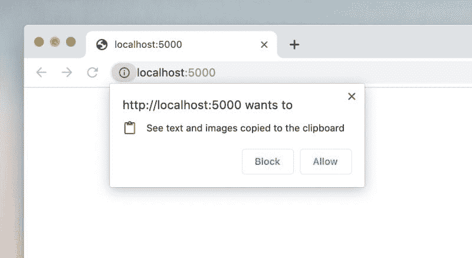

# 异步剪贴板 API:使用 JavaScript 访问剪贴板

> 原文：<https://dev.to/arnellebalane/async-clipboard-api-accessing-the-clipboard-using-javascript-36pb>

很长一段时间以来，访问用户的剪贴板都不是一件好事情。我们不得不使用 [`document.execCommand`](https://developer.mozilla.org/en-US/docs/Web/API/Document/execCommand) API 从用户的剪贴板中复制和粘贴文本，这包括以下步骤:

```
// #1\. Use an input element
const input = document.querySelector('input');

// #2\. Set the input's value to the text we want to copy to clipboard
input.value = 'hello there!';

// #3\. Highlight the input's value
input.select();

// #4\. Copy the highlighted text
document.execCommand('copy'); 
```

在这个过程中，可以动态地创建和删除`input`元素，或者对用户不可见。在我以前使用这种方法的时候，我总是认为它看起来很丑，不太优雅。幸运的是，一个新的 Web API 将使这变得更加容易！

## 异步剪贴板 API

[异步剪贴板 API](https://developer.mozilla.org/en-US/docs/Web/API/Clipboard_API) 为 Web 应用提供了以编程方式轻松读写系统剪贴板的能力。关于 API 的一些注意事项:

*   可以在`navigator.clipboard`访问
*   该网站需要通过 HTTPS 或本地主机服务
*   仅当页面是活动的浏览器选项卡时有效

现在让我们来看看与以前的方法相比，它实际上有多简单。

### 写入剪贴板

```
async function writeToClipboard(text) {
    try {
        await navigator.clipboard.writeText(text);
    } catch (error) {
        console.error(error);
    }
} 
```

这个方法返回一个`Promise`，我们可以通过链接一个`.then()`或者使用`async` / `await`来等待解析。通过这短短的一行代码，我们已经将文本写入了剪贴板！

> **注意:**在 Firefox 中，只有当调用`writeText()`来响应用户手势时，文本才会被写入剪贴板，否则它会抛出一个异常。Chrome 将文本写入剪贴板，而不考虑用户的手势。两者都允许写入剪贴板而无需请求许可。

### 从剪贴板中读取

```
async function readFromClipboard() {
    try {
        const text = await navigator.clipboard.readText();
        console.log(text);
    } catch (error) {
        console.error(error);
    }
} 
```

这个方法也返回一个`Promise`，就像写入剪贴板一样简单。站点第一次尝试读取剪贴板的内容时，浏览器会提示用户是否允许请求者不:

[](https://res.cloudinary.com/practicaldev/image/fetch/s--xL3fnwZc--/c_limit%2Cf_auto%2Cfl_progressive%2Cq_auto%2Cw_880/https://thepracticaldev.s3.amazonaws.com/i/p9goykbyq4vgkfnyy9a0.jpg)

> **注意:**在 Chrome 中，当用户多次解除(据我观察约 3 次)时，读取剪贴板的权限会被自动拒绝。
> 
> **注意:**在撰写本文时，Firefox(68 版)还不支持`readText()`方法，MDN 文档声明它只在浏览器扩展中受支持。

### 检查剪贴板访问权限

我们可以使用[权限 API](https://developer.mozilla.org/en-US/docs/Web/API/Permissions) :
来检查我们是否有权限访问剪贴板

```
await navigator.permissions.query({name: 'clipboard-read'});
// or 'clipboard-write' for permission to write

// sample result: {state: 'granted'} 
```

例如，我们可以使用这个结果来显示一些 UI，让用户知道我们是否可以访问剪贴板。

## 剪贴板事件

除了允许我们轻松地写入和读取剪贴板，同步剪贴板 API 还为我们提供了剪贴板事件。通过分别监听`copy`、`cut`和`paste`事件，我们可以知道用户何时执行与剪贴板相关的操作，比如复制、剪切或粘贴。

```
document.addEventListener('copy', event => {});
document.addEventListener('cut', event => {});
document.addEventListener('paste', event => {}); 
```

当使用异步 ClipboardAPI(即通过`writeText()`或`readText()`)访问剪贴板时，这些事件不会被触发，但是当调用相应的`document.execCommand`命令时，它们会被触发。调用`event.preventDefault()`取消动作，保持剪贴板的当前状态。

这些事件仅在页面上执行操作时触发，而在其他页面或应用程序中执行时不会触发。

剪贴板`event`对象有一个`clipboardData`属性，它是一个[数据传输](https://developer.mozilla.org/en-US/docs/Web/API/DataTransfer)对象。这允许我们覆盖将要写入剪贴板的数据，给我们机会以其他格式写入数据，例如`text/html` :

```
document.addEventListener('copy', event => {
    event.preventDefault();
    event.clipboardData.setData('text/plain', 'COPY ME!!!');
    event.clipboardData.setData('text/html', '<p>COPY ME!!!</p>');
}); 
```

在这样做的时候，我们需要调用`event.preventDefault()`,这样我们的定制数据就被写入剪贴板，而不是原始数据。对于`cut`和`paste`事件，我们需要自己处理删除/插入文档中的内容。

## 图像支持

到目前为止，我们只看到了异步剪贴板 API 的版本，它只支持读/写文本，它已经看起来很酷了！API 最近增加了对图像的支持，这使得通过编程读取图像和将图像写入剪贴板变得更加容易！

> **注意:**目前只支持 PNG 图像，但将来会增加对其他图像格式(可能是一般文件)的支持。

### 将图像写入剪贴板

在我们可以将图像写入剪贴板之前，我们首先需要获得图像的一个 [Blob](https://developer.mozilla.org/en-US/docs/Web/API/Blob) 。有几种方法可以获得图像斑点:

*   要求用户使用文件输入选择图像
*   `fetch()`来自网络的图像作为一个斑点(用`response.blob()`)
*   将图像绘制到一个`canvas`并调用`canvas.toBlob()`

一旦我们有了一个图像斑点(姑且称之为`imageBlob`，我们需要创建一个`ClipboardItem`的实例，包含我们的图像斑点:

```
new ClipboardItem({ 'image/png': imageBlob}) 
```

`ClipboardItem`构造函数接受一个对象，它的键是 MIME 类型，值是实际的 blobs 本身。我们可以提供多个 MIME 类型和 blob 对，使用不同的类型给出不同的数据表示。

现在我们可以使用`navigator.clipboard.write()` :
将我们的图像写入剪贴板

```
async function writeToClipboard(imageBlob) {
    try {
        await navigator.clipboard.write([
            new ClipboardItem({
                'image/png': imageBlob
            })
        ]);
    } catch (error) {
        console.error(error);
    }
} 
```

`navigator.clipboard.write()`接受一个由`ClipboardItem`组成的数组，但在编写时只支持一个单项。这在未来很可能会改变。

### 从剪贴板中读取图像

使用`navigator.clipboard.read()` :
可以从剪贴板中读取项目(不仅仅是文本)

```
async function readFromClipboard() {
    try {
        const items = await navigator.clipboard.read();
    } catch (error) {
        console.error(error);
    }
} 
```

它返回一个反映系统剪贴板内容的`ClipboardItem`数组，尽管目前在 Chrome 中它只返回剪贴板中的最新项目。

我们可以循环这个数组来得到每一项。我们可以通过`ClipboardItem`的`items`属性获得所有可用的 MIME 类型，并使用其异步`getType()`方法
获得特定类型的实际 blob 数据

```
for (let item of items) {
    console.log(item.types); // e.g. ['image/png']

    for (let type of item.types) {
        const blob = await item.getType(type);
    }
} 
```

在我们得到 blob 之后，我们现在可以对它做任何我们想做的事情。我们可以使用 [FileReader API](https://developer.mozilla.org/en-US/docs/Web/API/FileReader) 将 blob 转换成我们想要的适当格式:

```
const reader = new FileReader();
reader.onload = () => {
    const data = reader.result;
    // e.g. 'data:image/png;base64,...'
};

reader.readAsDataURL(blob); 
```

* * *

异步剪贴板 API 的`write()`和`read()`方法提供了访问剪贴板的通用方法。事实上，前面讨论的`writeText()`和`readText()`方法只是为了方便起见，也可以通过使用类型为`text/plain`的 blobs 使用`write()` / `read()`来实现。

```
async function writeToClipboard(text) {
    try {
        await navigator.clipboard.write([
            new ClipboardItem({
                'text/plain': new Blob([text], {type: 'text/plain'})
            })
        ]);
    } catch (error) {
        console.error(error);
    }
}

async function readFromClipboard() {
    try {
        const items = await navigator.clipboard.read();
        for (let item of items) {
            const data = item.getType('text/plain');
            // convert `data` to string using FileReader API's
            // `.readAsText(data)` method
        }
    } catch (error) {
        console.error(error);
    }
} 
```

## 浏览器支持&特征检测

在 **Chrome 66** 和 **FireFox 63** 中提供了带文本支持的异步剪贴板 API(其中`readText()`还不适用于 Web 应用)。对于 PNG 图片支持，编写时只有 Chrome 支持，出货在 **Chrome 76** 。更多信息请参见此[浏览器兼容性表](https://developer.mozilla.org/en-US/docs/Web/API/Clipboard_API#Browser_compatibility)。

通过检查`navigator.clipboard`是否存在，我们可以在支持特征检测的浏览器上利用这个 API。

```
if (navigator.clipboard) {
    // Safe to use Async Clipboard API!
} else {
    // Use document.execCommand() instead
} 
```

## 资源

感谢阅读这篇文章，我希望你喜欢它，并从中学到一些东西。以下是了解异步剪贴板 API 的更多资源:

*   [剪贴板 API 和事件，W3C 工作草案](https://www.w3.org/TR/clipboard-apis/)
*   [MDN 上的剪贴板 API](https://developer.mozilla.org/en-US/docs/Web/API/Clipboard_API)
*   [解锁剪贴板访问](https://developers.google.com/web/updates/2018/03/clipboardapi)
*   [异步剪贴板 API 的图像支持](https://developers.google.com/web/updates/2019/07/image-support-for-async-clipboard)