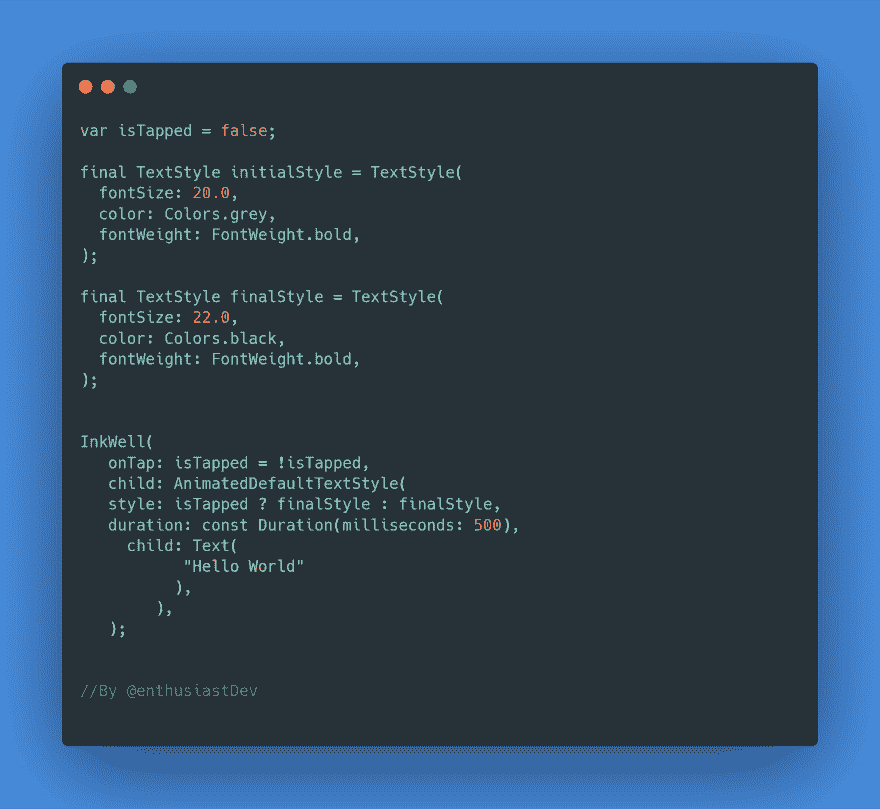

# 在 Flutter 中平滑过渡文本样式

> 原文:[https://dev . to/ethiel 97/smooth-transition-with text-styles-925](https://dev.to/ethiel97/smooth-transition-with-text-styles-925)

嘿伙计们！在这篇短文中，我将向您展示如何在同一个文本小部件的样式之间添加平滑过渡。

首先让我们声明初始样式:

```
final TextStyle initialStyle = TextStyle(
  fontSize: 20.0,
  color: Colors.grey,
  fontWeight: FontWeight.bold,
); 
```

然后最后的风格:

```
final TextStyle finalStyle = TextStyle(
  fontSize: 22.0,
  color: Colors.black,
  fontWeight: FontWeight.bold,
); 
```

我们还将使用一个布尔值来处理文本小部件的状态，无论它是否被点击:

`var isTapped = false;`

然后，将文本小部件包装在`the AnimatedDefaultTextStyle`小部件中，以实现样式之间的转换。最后，您可以在`InkWell`小部件中用 boolean 封装所有这些内容，以便在 tap 上切换样式。

```
InkWell(
        onTap: isTapped = !isTapped,
        child: AnimatedDefaultTextStyle(
          style: isTapped ? finalStyle : finalStyle,
          duration: const Duration(milliseconds: 500),
          child: Text(
           "Hello World"
          ),
        ),
      ) 
```

下图总结了所有情况。

[T2】](https://res.cloudinary.com/practicaldev/image/fetch/s--rFKOrbiJ--/c_limit%2Cf_auto%2Cfl_progressive%2Cq_auto%2Cw_880/https://imgur.com/qwTYOUj.png)

这个帖子到此为止。感谢您的关注:)