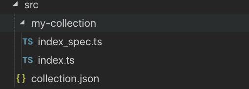
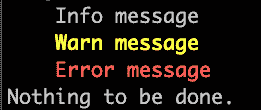
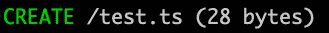
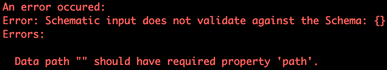
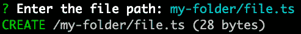
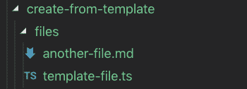
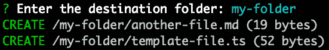

# 图例:建筑图块

> [https://dev . to/this dotmedia/schemaics-构建块-35nl](https://dev.to/thisdotmedia/schematics-bloques-de-construccion-35nl)

## [](#introducci%C3%B3n)导言

作为开发人员，Angular 生态系统为我们提供的最强大工具之一是其 CLI。∞曾经有人问，我们每次运行`ng generate`命令时，如何创建组件、服务等？
命令行在`Schematics`后面使用，特别是*图式*的集合默认为`@schematics/angular`。
在本文中，我们将探讨与*图式*合作时的一些关键概念，了解其基本操作，并利用自己的 CLI 从头开始构建自己的*图式*集。

## [](#el-tree)埃尔树

sistema 使我们能够在名为“`Tree`”的虚拟文件系统上运行。当我们运行一个 *schematic* 时，我们可以为它准备一系列转换(创建、更新或删除文件)，并最终应用(或不应用)这些更改。

## [](#creando-nuestro-primer-schematic)创造了我们的第一个示意图

为了创建我们的第一个*，首先安装图例 CLI，它将帮助我们构建我们的集合。* 

 *```
// instalar CLI
npm install -g @angular-devkit/schematics-cli

//crear colección
schematics blank my-collection // or schematics blank --name=my-collection 
```

<svg width="20px" height="20px" viewBox="0 0 24 24" class="highlight-action crayons-icon highlight-action--fullscreen-on"><title>Enter fullscreen mode</title></svg> <svg width="20px" height="20px" viewBox="0 0 24 24" class="highlight-action crayons-icon highlight-action--fullscreen-off"><title>Exit fullscreen mode</title></svg>

`schematics`命令根据使用的位置以两种方式工作。
如果我们不在*图式*项目的目录中，则将创建一个具有基本结构的新目录，并安装其依赖项；否则，会将新的`schematic`添加到集合中。

让我们看看项目结构。

[T2】](https://res.cloudinary.com/practicaldev/image/fetch/s--dC6qnK5M--/c_limit%2Cf_auto%2Cfl_progressive%2Cq_auto%2Cw_880/https://thepracticaldev.s3.amazonaws.com/i/7a5zmp5g4datyh85ka7y.png)

`collection.json`包含了我们收藏的信息，公开了将要包含的*图式*并将其链接到适当的方法。可以在此文件中执行更多设置，例如添加别名，但我们稍后会看到这些设置。

```
{  "$schema":  "../node_modules/@angular-devkit/schematics/collection-schema.json",  "schematics":  {  "my-collection":  {  "description":  "A blank schematic.",  "factory":  "./my-collection/index#myCollection"  }  }  } 
```

<svg width="20px" height="20px" viewBox="0 0 24 24" class="highlight-action crayons-icon highlight-action--fullscreen-on"><title>Enter fullscreen mode</title></svg> <svg width="20px" height="20px" viewBox="0 0 24 24" class="highlight-action crayons-icon highlight-action--fullscreen-off"><title>Exit fullscreen mode</title></svg>

默认情况下，创建新收藏时的*将与该收藏同名。Un *schematic* 必须汇出至少一个传回规则的函数，如`Rule`。我们新的 *schematic* 有一个小说明，以及包含它的文件的路径，后面是调用时将使用的函数名称。* 

 *```
// src/my-collection/index.ts
import { Rule, SchematicContext, Tree } from "@angular-devkit/schematics";

export function myCollection(_options: any): Rule {
  return (tree: Tree, _context: SchematicContext) => {
    return tree;
  };
} 
```

<svg width="20px" height="20px" viewBox="0 0 24 24" class="highlight-action crayons-icon highlight-action--fullscreen-on"><title>Enter fullscreen mode</title></svg> <svg width="20px" height="20px" viewBox="0 0 24 24" class="highlight-action crayons-icon highlight-action--fullscreen-off"><title>Exit fullscreen mode</title></svg>

`index.ts`导出单个函数，一个函数返回给我们一个规则(*规则*。`Rule`是给定一个`Tree`和一个上下文(`SchematicContext`的函数，它会给我们返回一个新的`Tree`
在上例中，没有应用任何变换。

> 您可以从单一档案汇出多个特征。也可以选择导出函数`default`，并省略`collection.json`中方法的路径的最后一部分。

## [](#build-y-ejecuci%C3%B3n)构建和执行

在我们能够运行我们的*示意*之前，我们必须从我们的集合中创建新的*构造*。为此，我们将使用两个命令:

```
// build
npm run build

// ejecutar
schematics .:my-collection 
```

<svg width="20px" height="20px" viewBox="0 0 24 24" class="highlight-action crayons-icon highlight-action--fullscreen-on"><title>Enter fullscreen mode</title></svg> <svg width="20px" height="20px" viewBox="0 0 24 24" class="highlight-action crayons-icon highlight-action--fullscreen-off"><title>Exit fullscreen mode</title></svg>

首先，我们使用`npm run build`构建我们的集合，然后使用架构 CLI 运行它们。我们指示 CLI 在当前收藏目录(“T2”)中运行 schematic `my-coleccion`。

> 在测试收藏之前，请记住运行收藏内部版本。我的建议是在开发时以`watch`旗标执行指令。(`npm run build -- --watch`

## [](#logs)日志

到目前为止，我们的*示意*什么都不做。在屏幕上显示信息可以向用户提供有价值的信息，或者在调试我们的收藏(`debug`时帮助我们。我们把我们的*示意*改为显示信息。

```
// src/my-collection/index.ts
export function myCollection(_options: any): Rule {
  return (tree: Tree, context: SchematicContext) => {
    context.logger.info('Info message');
    context.logger.warn('Warn message');
    context.logger.error('Error message');

    return tree;
  };
} 
```

<svg width="20px" height="20px" viewBox="0 0 24 24" class="highlight-action crayons-icon highlight-action--fullscreen-on"><title>Enter fullscreen mode</title></svg> <svg width="20px" height="20px" viewBox="0 0 24 24" class="highlight-action crayons-icon highlight-action--fullscreen-off"><title>Exit fullscreen mode</title></svg>

如果我们现在运行我们的 schematic(记得先做一个‘t0’build，我们可以根据日志类型查看我们的彩色消息。

[T2】](https://res.cloudinary.com/practicaldev/image/fetch/s--nLS1mqSn--/c_limit%2Cf_auto%2Cfl_progressive%2Cq_auto%2Cw_880/https://thepracticaldev.s3.amazonaws.com/i/9zayvcdae0lsi02hsvl6.png)

## [](#creando-archivos)创建文件

既然我们知道如何在屏幕上打印信息，就可以开始修改我们的*树*。我们将首先创建一个新的 *schematic* 来添加一个新文件。

```
schematics blank create-file 
```

<svg width="20px" height="20px" viewBox="0 0 24 24" class="highlight-action crayons-icon highlight-action--fullscreen-on"><title>Enter fullscreen mode</title></svg> <svg width="20px" height="20px" viewBox="0 0 24 24" class="highlight-action crayons-icon highlight-action--fullscreen-off"><title>Exit fullscreen mode</title></svg>

我们新的 *schematic* 已添加到集合中，您会注意到已创建了一个新的目录，`collection.json`已修改为包括这一新的 *schematic* 。我们现在可以编辑我们的方法`createFile`来修改我们的*树*。

```
// src/create-file/index.ts
import { Rule, SchematicContext, Tree } from "@angular-devkit/schematics";

export function createFile(_options: any): Rule {
  return (tree: Tree, _context: SchematicContext) => {
    tree.create("test.ts", "File created from schematic!");
    return tree;
  };
} 
```

<svg width="20px" height="20px" viewBox="0 0 24 24" class="highlight-action crayons-icon highlight-action--fullscreen-on"><title>Enter fullscreen mode</title></svg> <svg width="20px" height="20px" viewBox="0 0 24 24" class="highlight-action crayons-icon highlight-action--fullscreen-off"><title>Exit fullscreen mode</title></svg>

我们的规则或*规则*将取我们的*树*并将一个名为`test.ts`的文件添加到它的根目录中，然后返回这个新的*树*修改过的。

我们运行构建并运行。

```
schematics .:create-file 
```

<svg width="20px" height="20px" viewBox="0 0 24 24" class="highlight-action crayons-icon highlight-action--fullscreen-on"><title>Enter fullscreen mode</title></svg> <svg width="20px" height="20px" viewBox="0 0 24 24" class="highlight-action crayons-icon highlight-action--fullscreen-off"><title>Exit fullscreen mode</title></svg>

[T2】](https://res.cloudinary.com/practicaldev/image/fetch/s--4VIVaDBw--/c_limit%2Cf_auto%2Cfl_progressive%2Cq_auto%2Cw_880/https://thepracticaldev.s3.amazonaws.com/i/o0bujs9i1go8tw01jxcd.png)

□什么？如果您查看我们的目录，我们将无法找到您所创建的文件。那是因为我们的*示意*从相对路径调用时会以*调试*模式运行。这意味着您不会对文件系统进行真正的修改。要应用更改，我们必须在命令中添加“`--debug=false`”选项。如果我们再试一次的话，`test.js`最终会被创造出来里面有想要的内容。请先删除文件，然后再继续。

> 如果再次运行该命令，将会失败，因为“`create`”不会复盖已存在的文件。

## [](#argumentos-y-schemas)论据和方案

我们的*示意*到目前为止非常有限。无论我们做什么，都会创建相同的文件。如果我们能通过某些论点会更好吗？为此，我们将定义一个*方案*。我们在文件夹“`create-file`”内创建了一个名为“`schema.json`”的文件。我们还将在`schema.ts`上创建一个接口，相当于在`.json`
文件中声明的参数

```
{  "$schema":  "http://json-schema.org/schema",  "id":  "my-collection-create-file",  "title":  "Creates a file using the given path",  "type":  "object",  "properties":  {  "path":  {  "type":  "string",  "description":  "The path of the file to create."  }  },  "required":  ["path"]  } 
```

<svg width="20px" height="20px" viewBox="0 0 24 24" class="highlight-action crayons-icon highlight-action--fullscreen-on"><title>Enter fullscreen mode</title></svg> <svg width="20px" height="20px" viewBox="0 0 24 24" class="highlight-action crayons-icon highlight-action--fullscreen-off"><title>Exit fullscreen mode</title></svg>

```
// src/create-file/schema.ts
export interface CreateFileOptions{
  path:string;
} 
```

<svg width="20px" height="20px" viewBox="0 0 24 24" class="highlight-action crayons-icon highlight-action--fullscreen-on"><title>Enter fullscreen mode</title></svg> <svg width="20px" height="20px" viewBox="0 0 24 24" class="highlight-action crayons-icon highlight-action--fullscreen-off"><title>Exit fullscreen mode</title></svg>

我们宣布了一个名为`schema.json`的新论点，并在`schema.json`中将它标为`required`(必需)。

将*方案*和界面添加到我们的功能和*方案*的集合中。

```
import { Rule, SchematicContext, Tree } from '@angular-devkit/schematics';
import { CreateFileOptions } from './schema';

export function createFile(options: CreateFileOptions): Rule {
  return (tree: Tree, _context: SchematicContext) => {
    tree.create(options.path, "File created from schematic!");
    return tree;
  };
} 
```

<svg width="20px" height="20px" viewBox="0 0 24 24" class="highlight-action crayons-icon highlight-action--fullscreen-on"><title>Enter fullscreen mode</title></svg> <svg width="20px" height="20px" viewBox="0 0 24 24" class="highlight-action crayons-icon highlight-action--fullscreen-off"><title>Exit fullscreen mode</title></svg>

```
{  "$schema":  "../node_modules/@angular-devkit/schematics/collection-schema.json",  "schematics":  {  "my-collection":  {  "description":  "A blank schematic.",  "factory":  "./my-collection/index#myCollection"  },  "create-file":  {  "description":  "A blank schematic.",  "factory":  "./create-file/index#createFile",  "schema":  "./create-file/schema.json"  }  }  } 
```

<svg width="20px" height="20px" viewBox="0 0 24 24" class="highlight-action crayons-icon highlight-action--fullscreen-on"><title>Enter fullscreen mode</title></svg> <svg width="20px" height="20px" viewBox="0 0 24 24" class="highlight-action crayons-icon highlight-action--fullscreen-off"><title>Exit fullscreen mode</title></svg>

创建接口时，我们在函数的参数“`options`”中添加了类型推断。属性`schema`应添加到`collection.json`中的 *schematic* 的声明中，并带有 *schema* 的文件路径。
这个*方案*会使 CLI 在向我们提出`path`论点时失败。

我们构建并运行。

```
schematics .:create-file 
```

<svg width="20px" height="20px" viewBox="0 0 24 24" class="highlight-action crayons-icon highlight-action--fullscreen-on"><title>Enter fullscreen mode</title></svg> <svg width="20px" height="20px" viewBox="0 0 24 24" class="highlight-action crayons-icon highlight-action--fullscreen-off"><title>Exit fullscreen mode</title></svg>

如果我们不带参数`path`运行 schematic，它将失败。

[T2】](https://res.cloudinary.com/practicaldev/image/fetch/s--gNxIb6tM--/c_limit%2Cf_auto%2Cfl_progressive%2Cq_auto%2Cw_880/https://thepracticaldev.s3.amazonaws.com/i/os0i7hj8heetvammuq2f.png)

让我们通过传递一个参数再次运行它。

```
schematics .:create-file --path=test-path.ts 
```

<svg width="20px" height="20px" viewBox="0 0 24 24" class="highlight-action crayons-icon highlight-action--fullscreen-on"><title>Enter fullscreen mode</title></svg> <svg width="20px" height="20px" viewBox="0 0 24 24" class="highlight-action crayons-icon highlight-action--fullscreen-off"><title>Exit fullscreen mode</title></svg>

[T2】](https://res.cloudinary.com/practicaldev/image/fetch/s--BoChlaD7--/c_limit%2Cf_auto%2Cfl_progressive%2Cq_auto%2Cw_880/https://thepracticaldev.s3.amazonaws.com/i/ebv20l6l34w2t5dr1svj.png)

虽然不需要*方案*和接口，但它们为我们提供了验证和类型检查。命令`ng generate`将读取此模式，并在使用`--help`标志运行时向我们显示可用的参数。

## [](#consultando-al-usuario-y-alias)咨询用户和别名

一个 *schematic* 可能收到的所有论点可能难以回忆起来。我们可以让我们的*示意*更友好地询问用户所需的论据。另一方面，我们可以通过在我们的 *schematic* 上添加别名，使我们的命令更短或更易读。我们将通过修改我们的*方案*的一些属性来做到这一点。

首先，我们会在`schema.json`中加入条目`x-prompt`至所需的性质。如果未提供参数，则会询问您。

```
{  "$schema":  "http://json-schema.org/schema",  "id":  "my-collection-create-file",  "title":  "Creates a file using the given path",  "type":  "object",  "properties":  {  "path":  {  "type":  "string",  "description":  "The path of the file to create.",  "x-prompt":  "Enter the file path:",  }  },  "required":  ["path"]  } 
```

<svg width="20px" height="20px" viewBox="0 0 24 24" class="highlight-action crayons-icon highlight-action--fullscreen-on"><title>Enter fullscreen mode</title></svg> <svg width="20px" height="20px" viewBox="0 0 24 24" class="highlight-action crayons-icon highlight-action--fullscreen-off"><title>Exit fullscreen mode</title></svg>

为了创建别名，我们将在文件“`collection.json`”中的 schematic 中添加属性“`aliases`”。

```
{  "$schema":  "../node_modules/@angular-devkit/schematics/collection-schema.json",  "schematics":  {  "my-collection":  {  "description":  "A blank schematic.",  "factory":  "./my-collection/index#myCollection"  },  "create-file":  {  "description":  "A blank schematic.",  "factory":  "./create-file/index#createFile",  "schema":  "./create-file/schema.json",  "aliases":  ["cf"]  }  }  } 
```

<svg width="20px" height="20px" viewBox="0 0 24 24" class="highlight-action crayons-icon highlight-action--fullscreen-on"><title>Enter fullscreen mode</title></svg> <svg width="20px" height="20px" viewBox="0 0 24 24" class="highlight-action crayons-icon highlight-action--fullscreen-off"><title>Exit fullscreen mode</title></svg>

现在，我们可以使用别名`cf`来执行我们的架构，如果我们忘记参数`path`，CLI 将会要求我们这样做。

```
schematics .:cf 
```

<svg width="20px" height="20px" viewBox="0 0 24 24" class="highlight-action crayons-icon highlight-action--fullscreen-on"><title>Enter fullscreen mode</title></svg> <svg width="20px" height="20px" viewBox="0 0 24 24" class="highlight-action crayons-icon highlight-action--fullscreen-off"><title>Exit fullscreen mode</title></svg>

[T2】](https://res.cloudinary.com/practicaldev/image/fetch/s--sXY_abyH--/c_limit%2Cf_auto%2Cfl_progressive%2Cq_auto%2Cw_880/https://thepracticaldev.s3.amazonaws.com/i/2ezpdjdlv17lzs5amjna.png)

## [](#templates)模板

传递变文件的参数是可以的，但我们的内容总是一样的。将内容作为一个论点传递是不切实际的，因为这可能会很复杂。幸运的是，当我们不得不处理这种内容时，我们可以创建*【templates】*。模板只是可以在我们的*树*中复制、移动和修改的文件或模板。

我们通过应用我们以前看到的概念，创造了一种新的*示意*。

```
schematics blank create-from-template 
```

<svg width="20px" height="20px" viewBox="0 0 24 24" class="highlight-action crayons-icon highlight-action--fullscreen-on"><title>Enter fullscreen mode</title></svg> <svg width="20px" height="20px" viewBox="0 0 24 24" class="highlight-action crayons-icon highlight-action--fullscreen-off"><title>Exit fullscreen mode</title></svg>

`collection.json`(部分)

```
{  "$schema":  "../node_modules/@angular-devkit/schematics/collection-schema.json",  "schematics":  {  "create-from-template":  {  "description":  "A blank schematic.",  "factory":  "./create-from-template/index#createFromTemplate",  "schema":  "./create-from-template/schema.json",  "aliases":  ["cft"]  }  }  } 
```

<svg width="20px" height="20px" viewBox="0 0 24 24" class="highlight-action crayons-icon highlight-action--fullscreen-on"><title>Enter fullscreen mode</title></svg> <svg width="20px" height="20px" viewBox="0 0 24 24" class="highlight-action crayons-icon highlight-action--fullscreen-off"><title>Exit fullscreen mode</title></svg>

```
// src/create-from-template/schema.ts
export interface CreateFromTemplateOptions {
  folder: string;
} 
```

<svg width="20px" height="20px" viewBox="0 0 24 24" class="highlight-action crayons-icon highlight-action--fullscreen-on"><title>Enter fullscreen mode</title></svg> <svg width="20px" height="20px" viewBox="0 0 24 24" class="highlight-action crayons-icon highlight-action--fullscreen-off"><title>Exit fullscreen mode</title></svg>

```
//  src/create-from-template/schema.json  {  "$schema":  "http://json-schema.org/schema",  "id":  "my-collection-create-from-template",  "title":  "Creates files in the given folder",  "type":  "object",  "properties":  {  "folder":  {  "type":  "string",  "description":  "The destination folder of the files to create.",  "x-prompt":"Enter the destination folder:"  }  },  "required":  ["folder"]  } 
```

<svg width="20px" height="20px" viewBox="0 0 24 24" class="highlight-action crayons-icon highlight-action--fullscreen-on"><title>Enter fullscreen mode</title></svg> <svg width="20px" height="20px" viewBox="0 0 24 24" class="highlight-action crayons-icon highlight-action--fullscreen-off"><title>Exit fullscreen mode</title></svg>

为了创建模板，我们将在“*schematic*文件夹中创建一个目录“`/files`”并查找要复制的文件。

[T2】](https://res.cloudinary.com/practicaldev/image/fetch/s--c_mNhnGt--/c_limit%2Cf_auto%2Cfl_progressive%2Cq_auto%2Cw_880/https://thepracticaldev.s3.amazonaws.com/i/9kdpw9j5w3jmqra7zb67.png)

> 只要编译器忽略，您就可以使用任何文件夹名称。`/files`预设为忽略。

我们在文件夹中添加了两个文件。现在我们可以在我们的*示意*中使用它们。

```
// src/create-from-template/index.ts
import {
  Rule,
  SchematicContext,
  Tree,
  Source,
  url,
  mergeWith,
  move,
  apply
} from "@angular-devkit/schematics";
import { CreateFromTemplateOptions } from "./schema";
import { normalize } from "@angular-devkit/core";

export function createFromTemplate(options: CreateFromTemplateOptions): Rule {
  return (tree: Tree, context: SchematicContext) => {
    const source: Source = url("./files");
    const transformedSource: Source = apply(source, [
      move(normalize(options.folder))
    ]);

    return mergeWith(transformedSource)(tree, context);
  };
} 
```

<svg width="20px" height="20px" viewBox="0 0 24 24" class="highlight-action crayons-icon highlight-action--fullscreen-on"><title>Enter fullscreen mode</title></svg> <svg width="20px" height="20px" viewBox="0 0 24 24" class="highlight-action crayons-icon highlight-action--fullscreen-off"><title>Exit fullscreen mode</title></svg>

这里发生了几件事。首先，我们正在使用功能`Source`从我们的模板目录中读取，该功能将返回`Source`。然后，我们对每个源文件应用一组规则。在本示例中，我们将文件从根目录移动到给定的文件夹作为参数。最后，我们将修改后的字体与我们原来的 *tree* 合并。

构建并运行。

[T2】](https://res.cloudinary.com/practicaldev/image/fetch/s--6nQ6slhP--/c_limit%2Cf_auto%2Cfl_progressive%2Cq_auto%2Cw_880/https://thepracticaldev.s3.amazonaws.com/i/0sw67muc5nq4mvlhcatp.png)

我们的档案是从我们的 schematic a 到`/my-folder`的目录中复制而来的。

## [](#contenido-din%C3%A1mico)动态内容

让我们回顾一下*图式*的真实例子。使用 angular CLI 创建组件时，将创建一组文件和一个目录。这些文件根据用户的输入*更改名称和内容。∞我们能得到类似的东西吗？
我们将使用`angular-devkit/schematics`提供给我们的`template`功能，并将其应用于我们的源文件。* 

```
// ...imports
export function createFromTemplate(options: CreateFromTemplateOptions): Rule {
  return (tree: Tree, context: SchematicContext) => {
// ...
    const transformedSource: Source = apply(source, [
      template({
        filaname: options.folder,
        ...strings // dasherize, classify, camelize, etc
      }),
      move(normalize(folder))
    ]);

    return mergeWith(transformedSource)(tree, context);
  };
} 
```

<svg width="20px" height="20px" viewBox="0 0 24 24" class="highlight-action crayons-icon highlight-action--fullscreen-on"><title>Enter fullscreen mode</title></svg> <svg width="20px" height="20px" viewBox="0 0 24 24" class="highlight-action crayons-icon highlight-action--fullscreen-off"><title>Exit fullscreen mode</title></svg>

`template`将对象作为参数，并允许其所有属性供文件名及其内容使用。在本例中，我们将传递一个名为“纯目录”的对象，以及一组用于转换“*字符串”(*strings)的方法。
为了测试其功能，我们将创建两个文件。

```
// files/__filename@dasherize__.ts
export class <%= classify(filename) %> {
    constructor(){}
} 
```

<svg width="20px" height="20px" viewBox="0 0 24 24" class="highlight-action crayons-icon highlight-action--fullscreen-on"><title>Enter fullscreen mode</title></svg> <svg width="20px" height="20px" viewBox="0 0 24 24" class="highlight-action crayons-icon highlight-action--fullscreen-off"><title>Exit fullscreen mode</title></svg>

```
<!-- files/__filename@dasherize__.html -->
<ul>
  <li><%= dasherize(filename) %></li>
  <li><%= camelize(filename) %></li>
  <li><%= capitalize(filename) %></li>
  <li><%= underscore(filename) %></li>
</ul> 
```

<svg width="20px" height="20px" viewBox="0 0 24 24" class="highlight-action crayons-icon highlight-action--fullscreen-on"><title>Enter fullscreen mode</title></svg> <svg width="20px" height="20px" viewBox="0 0 24 24" class="highlight-action crayons-icon highlight-action--fullscreen-off"><title>Exit fullscreen mode</title></svg>

这些文件名！。`__`是默认的开始和结束分隔符，`@`将参数(在符号之前)传递给函数(在符号之后)。在本例中，文件名将作为参数传递给函数`dasherize`，返回值后接文件扩展名。

在我们的模板中，我们将继续使用函数来处理*字符串*和文件名

再一次，我们构建并运行。

```
schematics .:cft --folder=very-complexFolder_name 
```

<svg width="20px" height="20px" viewBox="0 0 24 24" class="highlight-action crayons-icon highlight-action--fullscreen-on"><title>Enter fullscreen mode</title></svg> <svg width="20px" height="20px" viewBox="0 0 24 24" class="highlight-action crayons-icon highlight-action--fullscreen-off"><title>Exit fullscreen mode</title></svg>

[T2】](https://res.cloudinary.com/practicaldev/image/fetch/s--_EqMVLE1--/c_limit%2Cf_auto%2Cfl_progressive%2Cq_auto%2Cw_880/https://thepracticaldev.s3.amazonaws.com/i/vsu0dg3mnggf4n21rd88.png)

文件名按我们想要的格式格式化(*【dashized】*或用连字符分隔单词。让我们看看文件的内容。(请记得使用--debug=false 选项执行命令，以便您可以看到它们)

```
<!-- very-complex-flder-name.html -->
<ul>
  <li>very-complex-folder-name</li>
  <li>veryComplexFolderName</li>
  <li>Very-complexFolder_name</li>
  <li>very_complex_folder_name</li>
</ul 
```

<svg width="20px" height="20px" viewBox="0 0 24 24" class="highlight-action crayons-icon highlight-action--fullscreen-on"><title>Enter fullscreen mode</title></svg> <svg width="20px" height="20px" viewBox="0 0 24 24" class="highlight-action crayons-icon highlight-action--fullscreen-off"><title>Exit fullscreen mode</title></svg>

```
// very-complex-folder-name.ts
export class VeryComplexFolderName {
    constructor(){}
} 
```

<svg width="20px" height="20px" viewBox="0 0 24 24" class="highlight-action crayons-icon highlight-action--fullscreen-on"><title>Enter fullscreen mode</title></svg> <svg width="20px" height="20px" viewBox="0 0 24 24" class="highlight-action crayons-icon highlight-action--fullscreen-off"><title>Exit fullscreen mode</title></svg>

我们的示意图开始变得更有用了！

## [](#eliminando-archivos)删除档案

列表中的下一个项目是“删除文件”

我们创造了一种新的*示意*。

```
schematics blank --name=remove-file 
```

<svg width="20px" height="20px" viewBox="0 0 24 24" class="highlight-action crayons-icon highlight-action--fullscreen-on"><title>Enter fullscreen mode</title></svg> <svg width="20px" height="20px" viewBox="0 0 24 24" class="highlight-action crayons-icon highlight-action--fullscreen-off"><title>Exit fullscreen mode</title></svg>

`collection.json`

```
{  "$schema":  "../node_modules/@angular-devkit/schematics/collection-schema.json",  "schematics":  {  "remove-file":  {  "description":  "Removes a file",  "factory":  "./remove-file/index#removeFile",  "schema":  "./remove-file/schema.json",  "aliases":  ["rm"]  }  }  } 
```

<svg width="20px" height="20px" viewBox="0 0 24 24" class="highlight-action crayons-icon highlight-action--fullscreen-on"><title>Enter fullscreen mode</title></svg> <svg width="20px" height="20px" viewBox="0 0 24 24" class="highlight-action crayons-icon highlight-action--fullscreen-off"><title>Exit fullscreen mode</title></svg>

`schema.json`

```
{  "$schema":  "http://json-schema.org/schema",  "id":  "my-collection-remove-file",  "title":  "Deletes a file using the given path",  "type":  "object",  "properties":  {  "path":  {  "type":  "string",  "description":  "The path of the file to remove.",  "x-prompt":"Enter the file path:"  }  },  "required":  ["path"]  } 
```

<svg width="20px" height="20px" viewBox="0 0 24 24" class="highlight-action crayons-icon highlight-action--fullscreen-on"><title>Enter fullscreen mode</title></svg> <svg width="20px" height="20px" viewBox="0 0 24 24" class="highlight-action crayons-icon highlight-action--fullscreen-off"><title>Exit fullscreen mode</title></svg>

```
// src/remove-file/schema.ts
export interface RemoveFileOptions {
  path: string;
} 
```

<svg width="20px" height="20px" viewBox="0 0 24 24" class="highlight-action crayons-icon highlight-action--fullscreen-on"><title>Enter fullscreen mode</title></svg> <svg width="20px" height="20px" viewBox="0 0 24 24" class="highlight-action crayons-icon highlight-action--fullscreen-off"><title>Exit fullscreen mode</title></svg>

```
// src/remove-file/index.ts
import { Rule, SchematicContext, Tree } from '@angular-devkit/schematics';
import { RemoveFileOptions } from './schema';

export function removeFile(options: RemoveFileOptions): Rule {
  return (tree: Tree, _context: SchematicContext) => {
    tree.delete(options.path);
    return tree;
  };
} 
```

<svg width="20px" height="20px" viewBox="0 0 24 24" class="highlight-action crayons-icon highlight-action--fullscreen-on"><title>Enter fullscreen mode</title></svg> <svg width="20px" height="20px" viewBox="0 0 24 24" class="highlight-action crayons-icon highlight-action--fullscreen-off"><title>Exit fullscreen mode</title></svg>

运行“t0”schematic 之前，请确保要删除的文件存在。请记住，默认情况下，我们是在“*调试”(*debug)模式下运行的，因此更改不会真正应用。

```
schematics .:rm --path=src/collection.json 
```

<svg width="20px" height="20px" viewBox="0 0 24 24" class="highlight-action crayons-icon highlight-action--fullscreen-on"><title>Enter fullscreen mode</title></svg> <svg width="20px" height="20px" viewBox="0 0 24 24" class="highlight-action crayons-icon highlight-action--fullscreen-off"><title>Exit fullscreen mode</title></svg>

[T2】](https://res.cloudinary.com/practicaldev/image/fetch/s--HOFqJyZ3--/c_limit%2Cf_auto%2Cfl_progressive%2Cq_auto%2Cw_880/https://thepracticaldev.s3.amazonaws.com/i/lfc077h252v1gt4jfjme.png)

## [](#actualizando-archivos)更新档案

删除文件似乎比创建文件简单得多。我将文件更新保留到最后一个版本，因为(我认为)它涉及最复杂的操作，具体取决于文件类型以及我们如何修改它们。它可以像在文件的开头(或结尾)添加几行代码一样简单，也可以像使用 Typescript 抽象语法树(AST)来确定更新的位置和执行方式那样复杂。

我们创造了一种新的*示意*。

```
schematics blank overwrite-file 
```

<svg width="20px" height="20px" viewBox="0 0 24 24" class="highlight-action crayons-icon highlight-action--fullscreen-on"><title>Enter fullscreen mode</title></svg> <svg width="20px" height="20px" viewBox="0 0 24 24" class="highlight-action crayons-icon highlight-action--fullscreen-off"><title>Exit fullscreen mode</title></svg>

```
// src/overwrite-file
export function overwriteFile(options: OverwriteFileOptions): Rule {
  return (tree: Tree, _context: SchematicContext) => {
    const buffer = tree.read(options.path);
    const content = buffer ? buffer.toString() : '';
    const comment = `// ¯\_(ツ)_/¯\n`;
    if(!content.includes(comment)){
      tree.overwrite(options.path, comment + content)
    }
    return tree;
  };
} 
```

<svg width="20px" height="20px" viewBox="0 0 24 24" class="highlight-action crayons-icon highlight-action--fullscreen-on"><title>Enter fullscreen mode</title></svg> <svg width="20px" height="20px" viewBox="0 0 24 24" class="highlight-action crayons-icon highlight-action--fullscreen-off"><title>Exit fullscreen mode</title></svg>

我省略了*方案的创建和馆藏的更新，因为它与我们对其馀部分所做的类似。
我们的功能从用户给出的路径读取文件。将该*缓冲区*转换为*字符串*，检查是否已将注释添加到文件中，如果不存在则将其添加到文件开头。然后，我们用更新的内容复盖该文件。我们可以执行其他类型的检查，例如，避免在文件“`.json`”中添加注释，使其无效，但这超出了本教程的范围。*

 *这不是更新文件的唯一方法。

```
schematics blank update-recorder 
```

<svg width="20px" height="20px" viewBox="0 0 24 24" class="highlight-action crayons-icon highlight-action--fullscreen-on"><title>Enter fullscreen mode</title></svg> <svg width="20px" height="20px" viewBox="0 0 24 24" class="highlight-action crayons-icon highlight-action--fullscreen-off"><title>Exit fullscreen mode</title></svg>

```
export function updateRecorder(options: RecorderOptions): Rule {
  return (tree: Tree, _context: SchematicContext) => {

    const comment = '// ᕙ(⇀‸↼‶)ᕗ\n';

    const updateRecorder: UpdateRecorder = tree.beginUpdate(options.path);

    updateRecorder.insertLeft(0, comment);
    updateRecorder.insertLeft(0, comment);
    updateRecorder.insertLeft(0, comment);
    updateRecorder.insertLeft(0, comment);

    tree.commitUpdate(updateRecorder);

    return tree;
  };
} 
```

<svg width="20px" height="20px" viewBox="0 0 24 24" class="highlight-action crayons-icon highlight-action--fullscreen-on"><title>Enter fullscreen mode</title></svg> <svg width="20px" height="20px" viewBox="0 0 24 24" class="highlight-action crayons-icon highlight-action--fullscreen-off"><title>Exit fullscreen mode</title></svg>

这与我们在之前的 *schematic* 中所做的相似，但工作方式略有不同。首先，我们阅读我们的文件，然后开始在给定位置的左侧或右侧插入值(`string`或`Buffer`。只有调用函数`commitUpdate`后，更改才会应用到树中。
有趣的部分是插入值的位置，以及我们将如何确定要进行修改的位置。在本示例中，位置并不重要，因为我们正在内容的开头插入，但现在我们将看到一个更复杂的方案。别忘了构建和运行！

## [](#usando-el-ast-de-typescript)Usando el AST de Typescript

例如，我们要读取 Typescript 文件，我们要找到其中声明的第一个接口，并在开头添加一个属性，在结尾添加另一个属性。我们可以尝试将所有内容作为文本读取，然后找到合适的字符，或者更好的是，我们可以使用 typescript para 来浏览文件，而不是考虑字符，而是考虑有意义的节点。

```
schematics blank ts-ast 
```

<svg width="20px" height="20px" viewBox="0 0 24 24" class="highlight-action crayons-icon highlight-action--fullscreen-on"><title>Enter fullscreen mode</title></svg> <svg width="20px" height="20px" viewBox="0 0 24 24" class="highlight-action crayons-icon highlight-action--fullscreen-off"><title>Exit fullscreen mode</title></svg>

```
import { Rule, SchematicContext, Tree, SchematicsException } from '@angular-devkit/schematics';
import * as ts from 'typescript';

export function tsAst(options: TsAstOptions): Rule {
  return (tree: Tree, _context: SchematicContext) => {
    const buffer = tree.read(options.path);
    if(!buffer){
      throw new SchematicsException(`File ${options.path} not found.`);
    } 

    const source = ts.createSourceFile(options.path, buffer.toString(), ts.ScriptTarget.Latest, true);
    const nodes = getSourceNodes(source);

    const interfaceDeclaration = nodes.find(n=>n.kind === ts.SyntaxKind.InterfaceDeclaration);
    if(!interfaceDeclaration){
      throw new SchematicsException(`No Interface found`);
    }

    const [openBrace, closeBrace] = [
      interfaceDeclaration!.getChildren().find(n=>n.kind===ts.SyntaxKind.OpenBraceToken),
      interfaceDeclaration!.getChildren().slice().reverse().find(n=>n.kind===ts.SyntaxKind.CloseBraceToken),
    ]

    const text = interfaceDeclaration!.getText();
    let indentation;
    const matches = text.match(/\r?\n\s*/);
    if (matches && matches.length > 0) {
      indentation = matches[0]
    } else {
      indentation= ''
    }

    const recorder = tree.beginUpdate(options.path);
    recorder.insertRight(openBrace!.end, `${indentation}first: string;`);
    recorder.insertLeft(closeBrace!.pos, `${indentation}last: string;`);
    tree.commitUpdate(recorder);
    return tree;
  };
}

// tomado de los schematics de angular. Retorna un array de Nodes
function getSourceNodes(sourceFile: ts.SourceFile): ts.Node[] {
  const nodes: ts.Node[] = [sourceFile];
  const result = [];

  while (nodes.length > 0) {
    const node = nodes.shift();

    if (node) {
      result.push(node);
      if (node.getChildCount(sourceFile) >= 0) {
        nodes.unshift(...node.getChildren());
      }
    }
  }

  return result;
} 
```

<svg width="20px" height="20px" viewBox="0 0 24 24" class="highlight-action crayons-icon highlight-action--fullscreen-on"><title>Enter fullscreen mode</title></svg> <svg width="20px" height="20px" viewBox="0 0 24 24" class="highlight-action crayons-icon highlight-action--fullscreen-off"><title>Exit fullscreen mode</title></svg>

让我们逐步浏览一下这个文件。
我们首先确保档案存在。否则，我们会犯错误。然后，使用 typescript 编译器读取文件，得到 AST 的所有节点。接下来，我们将查找第一个类型为`InterfaceDeclaration`的节点。节点类型清单非常广泛。此类型返回接口的完整声明，直到关闭键为止。对于每个节点，我们将获得起始位置和结束位置。(∞方法`insertLeft` e `insertRight`？)
我们还没有到达我们想到达的地方，我们可以从这个孤立的节点获得更多的信息。我们将首先获取其所有子节点，然后查找第一个出现的开口键(“T3”)和最后一个出现的闭合键(“T4”)。这些节点还包含开始和结束位置。

空白在我们的句法树中没有“意义”，所以我们将采取不同的策略。我们将阅读我们的接口声明文本，并获得空白厚度以便确定缩进。这只是出于美学原因，因为一条新的线就足够了。

现在是我们开始修改的时候了，我们将在我们的钥匙的右侧和钥匙的左侧插入。请记住，直到我们调用方法`commitUpdate`为止，什么都没有改变。虽然我们在开始键之后插入了一些东西，但结束键的位置仍然和以前一样，我们可以安全地插入到开始键的左侧。

我们将创建一个测试文件并运行我们的 schematic。(不要忘了`build`)

```
interface TestInterface {
  aProperty: string;
} 
```

<svg width="20px" height="20px" viewBox="0 0 24 24" class="highlight-action crayons-icon highlight-action--fullscreen-on"><title>Enter fullscreen mode</title></svg> <svg width="20px" height="20px" viewBox="0 0 24 24" class="highlight-action crayons-icon highlight-action--fullscreen-off"><title>Exit fullscreen mode</title></svg>

跑完我们的 *schematic* 之后，我们应该得到一个类似这样的文件:

```
interface TestInterface {
  first:string;
  aProperty: string;
  last:string;
} 
```

<svg width="20px" height="20px" viewBox="0 0 24 24" class="highlight-action crayons-icon highlight-action--fullscreen-on"><title>Enter fullscreen mode</title></svg> <svg width="20px" height="20px" viewBox="0 0 24 24" class="highlight-action crayons-icon highlight-action--fullscreen-off"><title>Exit fullscreen mode</title></svg>

！成功了！

# [](#palabras-finales)结语

*   虽然*图式*广泛应用于角型生态系统，但不限于角型生态系统。事实上，我们迄今为止所做的所有例子都已在角度项目之外使用。

*   在本系列的下一部分，我们将学习任务(*任务*)，以及如何测试*图式*，扩展并按顺序运行。

*   在第 3 部分中，我们将创建一个将向角项目添加 tailwindcss 的“*模式*”集合的“真实”示例。

*   你可以在[这个存储库](https://github.com/flakolefluk/schematics-tutorial)找到最终代码

## 参考文献

*   [角文件](https://angular.io/guide/schematics)
*   [CDK 示意图](https://github.com/angular/components/tree/master/src/cdk)
*   [ngrx 原理图](https://github.com/ngrx/platform/tree/master/modules/schematics)

## [](#art%C3%ADculoslibros-relacionados)相关文章/书籍

*   [示意图:使用 CLI 生成自定义角度代码](https://leanpub.com/angular-schematics)
*   [https://blog . angular . io/schematics-an-introduction-DC 1 DFB C2 a2 b 2](https://blog.angular.io/schematics-an-introduction-dc1dfbc2a2b2)
*   [https://medium . com/@ tomastrajan/total-guide-to-custom-angular-schematics-5c 50 cf 90 CD B4](https://medium.com/@tomastrajan/total-guide-to-custom-angular-schematics-5c50cf90cdb4)
*   [https://brianlove . com/2018/12/11/angular-schematics-tutorial/](https://brianflove.com/2018/12/11/angular-schematics-tutorial/)

*原来的邮局在[这里](https://dev.to/thisdotmedia/schematics-building-blocks-2mg3)*

*本文由软件工程师 Ignacio Falk 撰写于[本点](https://thisdot.co)。*

*他们可以在 Twitter 上跟踪它为 [@flakolefluk](https://dev.to/flakolefluk) 。*

*JavaScript 咨询、指导或培训？查看我们在[本点实验室](https://thisdot.co)的服务清单。****