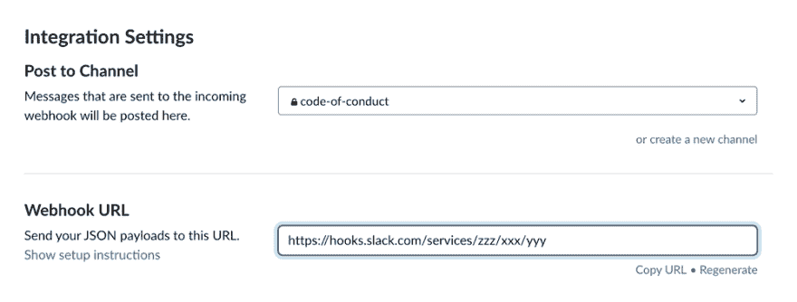
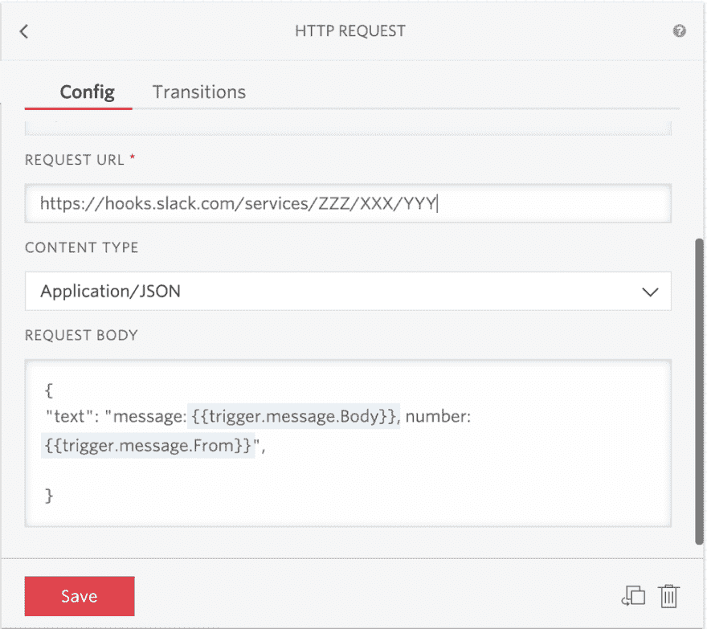
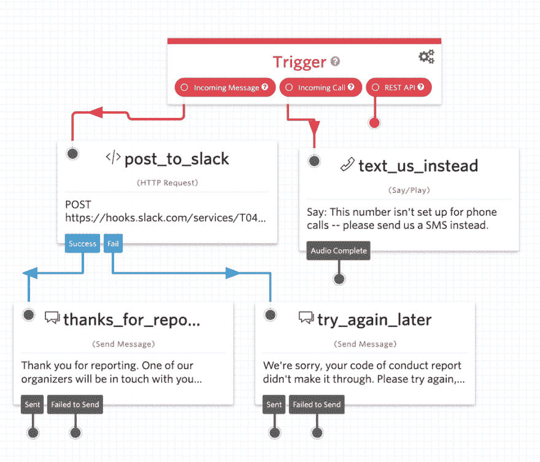

# Twilio Studio 和 Slack 的 SMS 行为准则报告

> 原文:[https://dev . to/twilio/SMS-code-of-conduct-reporting-with-twilio-studio-and-slack-lh4](https://dev.to/twilio/sms-code-of-conduct-reporting-with-twilio-studio-and-slack-lh4)

如果你关心确保你的社区的安全和舒适，你必须有一个[行为准则](https://www.ashedryden.com/blog/codes-of-conduct-101-faq)。撰写行为准则文档是必要的第一步，但这还不够。违规发生时会怎样？您需要报告和响应行为准则事件的流程。理想情况下，有多个报告渠道，以便人们可以通过文本或面对面交流。有些人可能不愿意(或[能够](https://researchautism.org/i-have-nonverbal-autism-heres-what-i-want-you-to-know/))当面举报违反行为准则的行为。

# [](#decisions-decisions)决策决策

基于文本的行为准则报告技术有多种可能性。列出需求将帮助我们缩小选择范围。

*   *可访问*。应该让尽可能多的活动参与者能够使用报告技术。这里的可访问性意味着可以访问运行该技术的设备，以及对残疾人的可用性。
*   *安全*。行为准则报告应该放在只有组织者才能看到的私密位置。
*   *快*。当有人报告违反行为准则时，他们应该尽快收到回复。不要让人们在脆弱的时候无所事事。
*   *可扩展*。当出现违反行为准则的情况时，[多个组织者应该能够做出反应](https://otter.technology/blog/2019/05/23/why-train-multiple-code-of-conduct-enforcers/)。
*   *健壮*。所有代码都需要维护，尽管越少越好。如果我们能避免运行自己的服务器，那太好了。组织者更替也很正常，也在意料之中。理想情况下，我们应该避免有一个硬编码的名单，需要随着人们的来来去去而更新。

基于我对这些优先级的排序，我决定为 [Write Speak Code](https://www.writespeakcode.com/) 社区构建一个与 Twilio Studio 和 Slack 的 SMS 集成。在您的社区或活动中，大多数人可能都可以使用支持 SMS 的设备，这在可访问性方面是一个胜利。Twilio Studio 为我们提供了发送和接收消息的条件逻辑，而无需运行我们自己的服务器。Slack 比 email“更快”,因为它通常以更同步的方式使用。电子邮件占据了一个不同的、更不同步的精神空间。根据你所在社区的需求和优先事项，你可能会做出不同的选择，这很好。

# [](#getting-started)入门

入门需要什么？首先，一个 Twilio 账户——你可以在这里注册一个免费的账户，或者如果你的社区是注册的非营利组织，你可以在 Twilio.org 的 T2 注册一个。你还需要一个宽松的工作空间。[在这里注册免费的](https://slack.com/get-started)。如果你从未使用过 Twilio Studio，请查看[快速入门指南](https://www.twilio.com/docs/studio/user-guide)。

首先，前往 Twilio 工作室仪表盘。创建一个新的流程并给它命名，比如*“行为准则报告”*从空白流程开始，这给了你 3 个触发器。我们将首先关注传入消息触发器。从右边的小部件库中创建一个新的 HTTP 请求小部件。称之为`post_to_slack`。通过拖放将小部件连接到传入的消息。

# [](#incoming-webhook-ahoy)呼入 Webhook Ahoy

`post_to_slack`小部件需要一个 URL 来知道将数据发送到哪里。去 Slack 买一个。启用传入的 webhook 集成。配置传入的 webhook 以发布到您的报告将被发送到的通道。接下来，将 Webhook URL 复制到剪贴板。

[T2】](https://res.cloudinary.com/practicaldev/image/fetch/s--AmdTRkOu--/c_limit%2Cf_auto%2Cfl_progressive%2Cq_auto%2Cw_880/https://thepracticaldev.s3.amazonaws.com/i/879823urvfyflvelnrrc.png)

抬头:频道下拉菜单只显示你加入的私人频道。如果你设置了一个 webhook，然后离开一个私有通道，webhook 会继续工作。

现在回到演播室仪表盘。在`post_to_slack`的配置中，粘贴 webhook URL 作为请求 URL。将请求方法改为“POST”，内容类型改为“Application/JSON”。在我们的回复中，我们需要发送者的电话号码以及他们发送的消息，以便组织者可以跟踪发送者。所以让我们把两者都放在 JSON 响应中。如果你想允许匿名举报，你可以省去电话号码，尽管匿名举报[可能更难正确回复](https://chromium.googlesource.com/chromium/src/+/master/CODE_OF_CONDUCT.md)。

```
{"text": "message: {{trigger.message.Body}}, number: {{trigger.message.From}}"} 
```

[T2】](https://res.cloudinary.com/practicaldev/image/fetch/s--Xgf9FHdp--/c_limit%2Cf_auto%2Cfl_progressive%2Cq_auto%2Cw_880/https://thepracticaldev.s3.amazonaws.com/i/jf8asbgf00v49ss8h40h.png)

# [](#finishing-touches)点睛之笔

接下来，我们将添加响应成功和失败消息，以便另一端的人知道是否收到了消息。添加一个新的发送消息小部件，并将其拖到画布上。补充一句温馨的话。也许可以这样说，“感谢您的报道，我们的组织者之一将很快与您联系。”将发送消息小部件连接到`post_to_slack`小部件上的成功节点。

是处理失败案例的时候了。添加另一个发送消息小部件。它可以说*“对不起，你的报告没有通过。请重试或亲自联系组织者。*将失败发送消息小部件与`post_to_slack`小部件上的失败节点连接起来。如果有人打这个号码，我们应该告诉他们尝试短信。将新的 Say/Play 小部件拖到画布上，编写您的消息。将小部件连接到“来电”节点。

整个工作室流程如下所示:

[T2】](https://res.cloudinary.com/practicaldev/image/fetch/s--6KKy7jAc--/c_limit%2Cf_auto%2Cfl_progressive%2Cq_auto%2Cw_880/https://thepracticaldev.s3.amazonaws.com/i/tbescuuxmblvxb6jvik5.png)

完成更改后，您需要保存并发布您的流程。

最后，[买一个 Twilio 的电话号码](https://www.twilio.com/console/phone-numbers/search)。配置电话号码，以便当有电话或消息进来时，我们用新的 studio flow 进行响应。拿出你的手机，试一试，看看信息是否成功发送到 Slack 频道。

[T2】](https://res.cloudinary.com/practicaldev/image/fetch/s--wjOkfm39--/c_limit%2Cf_auto%2Cfl_progressive%2Cq_auto%2Cw_880/https://thepracticaldev.s3.amazonaws.com/i/2ok443lvmbaz6qdi6k7m.png)

# [](#conclusion)结论

行为准则的实施可能不是一个轻松愉快的话题，但它很重要。为了让我们社区的人安全，有时我们不得不谈论一些困难的事情。幸运的是，许多人正在努力推进行为准则最佳实践。 [Otter.technology](https://otter.technology/) 撰写了[行为准则语言的最佳实践](https://otter.technology/blog/2018/08/09/evolving-code-of-conduct-language/)。 [WeAllJS](https://github.com/WeAllJS) 做了一个[很酷的命令行工具，让你的开源行为准则保持最新](https://www.npmjs.com/package/weallbehave)。我们可以一起朝着更好的包容性不断迭代，一次一小步。