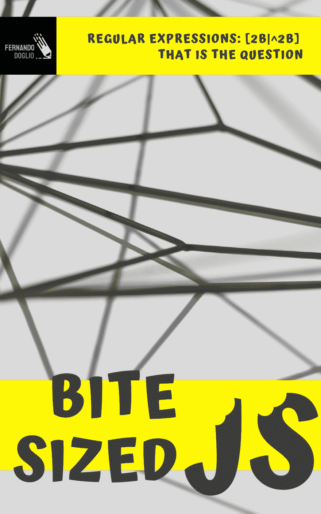

# 工作中的新书系列:一口大小的 JavaScript

> 原文:[https://dev . to/delete man 123/new-book-series-in-the-works-bite-size-JavaScript-3 PDN](https://dev.to/deleteman123/new-book-series-in-the-works-bite-sized-javascript-3pdn)

我非常激动地宣布，我将在不久的将来撰写一系列全新的书籍，该系列名为*“一口大小的 JavaScript”*，它将以处理 JavaScript 特定部分的小册子为特色。

这个系列的目的是提供实用的观点，深入了解这门语言的不同主题，这些主题要么经常被误解，要么因为看起来太难或太复杂而被忽视。本系列的第一部分将讨论正则表达式的主题，您可以在这里看到最初的封面:

[T2】](https://res.cloudinary.com/practicaldev/image/fetch/s--b8_NiJwp--/c_limit%2Cf_auto%2Cfl_progressive%2Cq_auto%2Cw_880/https://thepracticaldev.s3.amazonaws.com/i/2eshfsdtcrlrm01ls07g.png)

你可能知道也可能不知道，[我过去出版过几本技术书籍](https://www.fdoglio.com/technical-books)(其中大部分是 JavaScript 相关的)。我已经通过出版商如 PacktPub 和 Apress 这样做了。

然而，这一次，我打算自己出版，对此我非常兴奋！

不要误会我的意思，我有过与两家编辑部合作的最佳经历，但我一直想尝试写出我真正想要的东西，而不是一些出版商可能有的稍微严格的标准(如标题、格式或页面图形等)。

这既令人兴奋又令人恐惧，因为我不得不深入到我从未涉足的写作领域。这肯定会是一次学习经历，但我希望它会是一次有趣的经历，最终结果将是一系列有用的书籍(或者小册子，如果你愿意的话)，这对所有的开发者来说都是一个很好的参考！

## 你对第一本书有什么期待？

*正则表达式:【2b|^ 2b】这就是问题*(我知道，这个标题比较长，但我觉得很有趣，所以继续下去)将涵盖你想知道但不敢问的关于正则表达式的一切。

不过，我想用这些书来说明的一点是，这将是回答这些问题的一种实用方法。它将有一些您需要的文本和信息，但一半的书将充满实践练习和用例，以便您了解其他人如何使用这种技术，以及您如何将它应用到您自己的用例中。

这本书只有四章，它们将涵盖:

*   **第一章:**概念和历史的一点点介绍。不会太多，不要担心，这只是一个快速的介绍，这样你就知道你站在哪里，你要去哪里。

*   第 2 章:它将涵盖正则表达式的全部内容。里面是什么，它的基本结构是什么，你看到的那些奇怪的符号毫无意义地四处飞溅。一旦你完成了这一章，你将能够阅读正则表达式，并用你的头脑解析它们。

*   **第 3 章:**将涵盖如何开始用正则表达式思考的基本练习和示例。因为一件事是理解这些符号的意思，另一件事是在你试图解决问题时能够运用它们。

*   第 4 章:最后，我将回顾一下你能在“野外”找到的更复杂的用例，我将对它们进行剖析，以便你理解它们是如何工作的。

不用说，最后两章是 JavaScript 特有的，所以所有的例子都使用 ES6 语法。

## 敬请期待！

如果你到目前为止喜欢这个概念，请查看[的原始博文](https://www.fdoglio.com/post/bite-sized-javascript)，并在底部留下你的电子邮件，这样一旦书准备好了，我就可以通知你！

如果你想为我在这个系列中涉及的其他主题提出建议，请在下面留下评论，我将在不久的将来分享我计划写的那些主题，所以也请保持关注！

我真的很兴奋，我真的认为这将是一个非常有趣的资源，新的和有经验的开发人员都一样，不能等待！