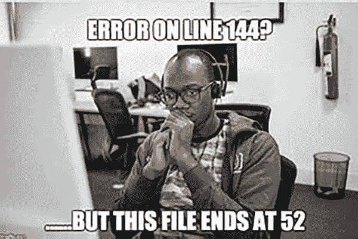

# 小锈菌启动提示系列:多态性和性状

> 原文：<https://dev.to/5422m4n/little-rust-starter-hint-series-polymorphism-and-traits-3n70>

今天我们将探索多态性，以及它在 Rust 中是如何实现的。对于那些还没有使用过 OOP 语言的人来说，多态只是一个描述行为或多态的花哨术语。例如，某事物的实例也可以是或表现为其他事物。在 Java 中，你可以使用`interfaces`来声明一些可以被类实现的行为。所以一个类可以实现一个或多个接口。在 rust 中，只有结构，没有作为接口的类和特征。就这么简单。

## 问题陈述

我们想要实现一个非常基本的 hexdump 工具，它要么接受一个文件作为参数，要么在没有提供该文件的情况下从`stdin`读取。

例如可以这样使用

```
hexdump README.md
0000000 23 20 48 65 78 64 75 6d 70 0a 0a 23 23 20 55 73
0000010 61 67 65 0a 0a 60 60 60 62 61 73 68 0a 68 65 78
0000020 64 75 6d 70 20 52 45 41 44 4d 45 2e 6d 64 0a 0a
0000030 60 60 60 0a 
```

<svg width="20px" height="20px" viewBox="0 0 24 24" class="highlight-action crayons-icon highlight-action--fullscreen-on"><title>Enter fullscreen mode</title></svg> <svg width="20px" height="20px" viewBox="0 0 24 24" class="highlight-action crayons-icon highlight-action--fullscreen-off"><title>Exit fullscreen mode</title></svg>

或者没有文件

```
hexdump
foo bar bak^D
0000000 66 6f 6f 20 62 61 72 20 62 61 6b 0a 
```

<svg width="20px" height="20px" viewBox="0 0 24 24" class="highlight-action crayons-icon highlight-action--fullscreen-on"><title>Enter fullscreen mode</title></svg> <svg width="20px" height="20px" viewBox="0 0 24 24" class="highlight-action crayons-icon highlight-action--fullscreen-off"><title>Exit fullscreen mode</title></svg>

## 基础知识

问:如何打开一个文件
答:`File::open(file)`

问:如何从文件
中读取

问:如何从 stdin
读取 A: `stdin().lock()`

### 解释

所以看起来`stdin().lock()`和`BufReader::new()`似乎有一些共同点。两者都允许从他们那里读到`bytes`。我们一会儿会谈到这个。现在让我们来看完整的代码:

```
use std::env;
use std::fs::File;
use std::io::prelude::*;
use std::io::stdin;
use std::io::BufReader;

fn main() -> std::io::Result<()> {
    let args: Vec<String> = env::args().collect();

    match args.get(1) {
        Some(file) => read_and_dump(BufReader::new(File::open(file)?)),
        None => read_and_dump(stdin().lock()),
        //      ^--- this function will be implemented later on, don't worry
    }
    Ok(())
} 
```

<svg width="20px" height="20px" viewBox="0 0 24 24" class="highlight-action crayons-icon highlight-action--fullscreen-on"><title>Enter fullscreen mode</title></svg> <svg width="20px" height="20px" viewBox="0 0 24 24" class="highlight-action crayons-icon highlight-action--fullscreen-off"><title>Exit fullscreen mode</title></svg>

## 特质`BufRead`

所以两者的共同点(`stdin().lock()`和`BufReader::new()`)是，两者在声明中都实现了特征 [`BufRead`](https://doc.rust-lang.org/std/io/trait.BufRead.html#provided-methods)
，我们可以看到`pub trait BufRead: Read`意味着`BufRead`通过更多的方法扩展了`Read`。

## 天真的做法

很好，现在让我们实现上面缺失的方法，并移交实现`BufRead`
的实例

```
fn read_and_dump(r: BufRead) {
    for (i, b) in r.bytes().enumerate() {
        print_line_no_once(i);    // <-- we'll come to that later
        print_byte(b.unwrap());   // <-- we'll come to that later
    }
    print!("\n");
} 
```

<svg width="20px" height="20px" viewBox="0 0 24 24" class="highlight-action crayons-icon highlight-action--fullscreen-on"><title>Enter fullscreen mode</title></svg> <svg width="20px" height="20px" viewBox="0 0 24 24" class="highlight-action crayons-icon highlight-action--fullscreen-off"><title>Exit fullscreen mode</title></svg>

酷，让我们问问编译器他觉得怎么样..

```
cargo build --release
   Compiling hexdump v0.1.0
warning: trait objects without an explicit `dyn` are deprecated
  --> src/main.rs:17:21
   |
17 | fn read_and_dump(r: BufRead) {
   |                     ^^^^^^^ help: use `dyn`: `dyn BufRead`
   |
   = note: #[warn(bare_trait_objects)] on by default

[...]

error[E0277]: the size for values of type `(dyn std::io::BufRead + 'static)` cannot be known at compilation time
  --> src/main.rs:17:18
   |
17 | fn read_and_dump(r: BufRead) {
   |                  ^ doesn't have a size known at compile-time
   |
   = help: the trait `std::marker::Sized` is not implemented for `(dyn std::io::BufRead + 'static)`
   = note: to learn more, visit <https://doc.rust-lang.org/book/ch19-04-advanced-types.html#dynamically-sized-types-and-the-sized-trait>
   = note: all local variables must have a statically known size
   = help: unsized locals are gated as an unstable feature 
```

<svg width="20px" height="20px" viewBox="0 0 24 24" class="highlight-action crayons-icon highlight-action--fullscreen-on"><title>Enter fullscreen mode</title></svg> <svg width="20px" height="20px" viewBox="0 0 24 24" class="highlight-action crayons-icon highlight-action--fullscreen-off"><title>Exit fullscreen mode</title></svg>

[](https://res.cloudinary.com/practicaldev/image/fetch/s--JWFMa-pn--/c_limit%2Cf_auto%2Cfl_progressive%2Cq_auto%2Cw_880/https://cupheadmemes.com/wp-content/uploads/2018/08/Best-Programming-Memes-94.jpg)

那太简单了。我确实花了一点时间来理解这个问题，我读了这些文件，但没有深入研究，直到我意识到特征不应该作为直接类型，而应该作为“标记”。

为了解释我所说的“标记”的意思，让我们来看看下一次迭代

## 版本 1:匿名类型上的 impl

```
fn read_and_dump(r: impl BufRead) {
    for (i, b) in r.bytes().enumerate() {
        print_line_no_once(i);
        print_byte(b.unwrap());
    }
    print!("\n");
} 
```

<svg width="20px" height="20px" viewBox="0 0 24 24" class="highlight-action crayons-icon highlight-action--fullscreen-on"><title>Enter fullscreen mode</title></svg> <svg width="20px" height="20px" viewBox="0 0 24 24" class="highlight-action crayons-icon highlight-action--fullscreen-off"><title>Exit fullscreen mode</title></svg>

所以这里我们没有命名任何类型，只是说无论我们提供什么类型，它都会实现特征`BufRead`。通过这样做，编译器一切都很好。

## 版本 2:通用短手

我很好奇泛型是否能很好地解决这个问题。不同之处在于编译器可能能够做进一步的优化。

```
fn read_and_dump<T: BufRead>(r: T) {
    for (i, b) in r.bytes().enumerate() {
        print_line_no_once(i);
        print_byte(b.unwrap());
    }
    print!("\n");
} 
```

<svg width="20px" height="20px" viewBox="0 0 24 24" class="highlight-action crayons-icon highlight-action--fullscreen-on"><title>Enter fullscreen mode</title></svg> <svg width="20px" height="20px" viewBox="0 0 24 24" class="highlight-action crayons-icon highlight-action--fullscreen-off"><title>Exit fullscreen mode</title></svg>

所以在`<>`中，我们指定了一个实现`BufRead`的类型`T`，它在 rust 中被称为[绑定泛型](https://doc.rust-lang.org/rust-by-example/generics/bounds.html)。

## 版本 3:通用详细

当你实现 traits 时你会经常看到那个语法，所以值得一提的是 [where 语法](https://doc.rust-lang.org/rust-by-example/generics/where.html)

```
fn read_and_dump<T>(r: T)
where
    T: BufRead
{
    for (i, b) in r.bytes().enumerate() {
        print_line_no_once(i);
        print_byte(b.unwrap());
    }
    print!("\n");
} 
```

<svg width="20px" height="20px" viewBox="0 0 24 24" class="highlight-action crayons-icon highlight-action--fullscreen-on"><title>Enter fullscreen mode</title></svg> <svg width="20px" height="20px" viewBox="0 0 24 24" class="highlight-action crayons-icon highlight-action--fullscreen-off"><title>Exit fullscreen mode</title></svg>

这里，我们直接在主体`{}`括号前用单词`where`来命名泛型的边界。不止一个可以被`,`追加。

## 总结起来

为了不遗漏其他功能，即使它们并没有显示太多

```
fn print_line_no_once(i: usize) {
    if i % 0x10 == 0 {
        if i > 0 {
            print!("\n");
        }
        print!("{:07x}", i);
    }
}

fn print_byte(b: u8) {
    print!(" {:02x}", b);
} 
```

<svg width="20px" height="20px" viewBox="0 0 24 24" class="highlight-action crayons-icon highlight-action--fullscreen-on"><title>Enter fullscreen mode</title></svg> <svg width="20px" height="20px" viewBox="0 0 24 24" class="highlight-action crayons-icon highlight-action--fullscreen-off"><title>Exit fullscreen mode</title></svg>

所以我们现在知道了如何使用匿名类型或泛型来将我们的函数松散地耦合到特征上，而不是将它们紧密地耦合到真正的结构上。这有时也被称为[开闭原理](https://en.wikipedia.org/wiki/Open%E2%80%93closed_principle)

## 参考文献

关于细微差别的进一步阅读可以在 reddit 上找到

标题图片属于暴雪娱乐，在 [CC BY-NC-SA 3.0](https://creativecommons.org/licenses/by-nc-sa/3.0/) 下有。

使用的版本:

```
$ rustc --version && cargo --version
rustc 1.37.0 (eae3437df 2019-08-13)
cargo 1.37.0 (9edd08916 2019-08-02) 
```

<svg width="20px" height="20px" viewBox="0 0 24 24" class="highlight-action crayons-icon highlight-action--fullscreen-on"><title>Enter fullscreen mode</title></svg> <svg width="20px" height="20px" viewBox="0 0 24 24" class="highlight-action crayons-icon highlight-action--fullscreen-off"><title>Exit fullscreen mode</title></svg>

请不要忘记分享你的反馈，如果有的话，请让我知道你学到了什么。如果你有更多我遗漏的变体，请分享。