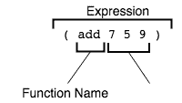

# 构建模块(学习 ClojureScript)

> 原文：<https://dev.to/kendru/building-blocks-learn-clojurescript-5162>

这篇文章是安德鲁的书[第三课](https://www.learn-clojurescript.com/section-0/lesson-3-building-blocks/)，[T3】学 ClojureScriptT5】](https://gum.co/learn-cljs)

* * *

了解了 ClojureScript 是什么以及它为什么重要之后，我们将从这门语言的基础概述开始我们的旅程。学习一门不熟悉的语言的最大障碍之一是理解语法。虽然语言之间在概念层面上有大量的交叉，但是这些概念的表达方式可能会非常不同。在接下来的两章中，我们将深入学习阅读 ClojureScript 代码的基本技能。尽管与 JavaScript 相比，语法非常简单，但对于大多数接触过类 C 语言(包括 JavaScript)的程序员来说，这看起来很不寻常。阅读 ClojureScript 的技能将有助于轻松阅读后面章节中较长的代码示例。

**本章内容:**

*   学习 ClojureScript 语法的基础知识
*   理解所有括号的用途
*   调查语言内置的核心数据类型

首先，在这一章中，我们将调查语言中最常见的语法元素，然后在下一章中，我们将看看 ClojureScript 代码实际上是如何评估的。理解评估模型将有助于我们理解我们阅读的代码，并编写出完全符合我们期望的代码。ClojureScript 是一种非常小的语言——比 JavaScript 小得多——所以非常容易理解。尽管有外来的语法，但由于语言的语法元素相对较少，我们可以惊人地快速达到熟悉的程度。

## 父母，父母无处不在！

正如我们在前几章的例子中看到的，ClojureScript 代码充满了括号。对许多人来说，这种语言的单一方面使它看起来令人生畏。括号是用来区分不同代码的主要符号。考虑到 JavaScript 和 C 系列中的其他语言同时使用圆括号和花括号——圆括号表示函数的参数并指定操作的顺序，花括号用于分隔相关语句块。一旦我们克服了最初的“paren shock ”, ClojureScript 开始看起来简单，甚至优雅。

### 表达式和函数求值

ClojureScript 中使用括号来表示要计算的表达式。我们将在下一章更深入地研究表达式，但它们是如此重要，我们至少必须在这里提到它们。在高层次上，每个 ClojureScript 程序基本上都有以下形式:

#### ClojureScript 程序提取

```
(some-function  arg1  arg2  ...) 
```

Enter fullscreen mode Exit fullscreen mode

每当有一个开括号，编译器期望的下一件事就是可以调用的东西——通常是一个函数。下一个右括号之前的所有内容都应该是参数。

[](https://res.cloudinary.com/practicaldev/image/fetch/s--JoQM3R7G--/c_limit%2Cf_auto%2Cfl_progressive%2Cq_auto%2Cw_880/https://kendru.github.io/img/learn-cljs/chapter3/simple-expression.png)

*简单表达式*

如果我们用 JavaScript 写同样的一般结构，它看起来会像下面这样:

```
someFunction(arg1, arg2, ...); 
```

Enter fullscreen mode Exit fullscreen mode

ClojureScript 和 JavaScript 代码都表明有一些函数应该用一些数字或参数来调用。JavaScript 代码通过将函数名放在前面，然后用括号将一些参数括起来来指示函数调用，而 ClojureScript 通过将函数名及其参数括在一组括号中来指示相同的事情。

## 核心数据类型

ClojureScript 拥有我们期望从任何编程语言中得到的所有原始数据类型:数字、字符串、布尔值等等。我们将这些简单的值称为标量。此外，该语言还有各种有用的*集合*类型——比如 JavaScript 中的数组和对象。这些集合被如此频繁地使用，以至于有特殊的语法来表示它们。在深入研究每种数据类型之前，有必要列举一个完整的数据类型列表以供参考。下表列出了具有文本语法表示形式的类型，以及如何用代码表示的简要说明和示例。

#### ClojureScript 数据文字

| 数据类型 | 描述 | 例子 |
| --- | --- | --- |
| 数字 | 整数或浮点数 | `17.4` |
| 线 | 文本数据 | `"Today is the first day..."` |
| 布尔代数学体系的 | 逻辑真/假 | `true` |
| 关键字 | 轻量标识符 | `:role` |
| 标志 | ClojureScript 内部广泛使用的标识符 | `'cljs-is-awesome` |
| 目录 | 支持高效遍历的有序集合 | `'(1 3 5 7 9)` |
| 矢量 | 支持高效索引访问的有序集合 | `[0 2 4 6 8]` |
| 地图 | 无序地将唯一键关联到值 | `{:name "Kayleigh", :age 29}` |
| 一组 | 唯一值的无序集合 | `#{true "ubiquity" 9.2}` |
| 无 | 空值 | `nil` |
| 目标 | JavaScript 对象-用于互操作 | `#js {"isJs" true, "isImmutable" false}` |
| 排列 | JavaScript 数组-互操作的用户 | `#js ["Lions" "Tigers" "Bears"]` |

我们现在将依次查看每种数据类型，并查看其用法的几个示例，以便我们可以识别任何给定的 ClojureScript 代码中的各种元素。

### 数字

ClojureScript 使用 JavaScript 的 Number 原语，因此它可以支持与 JavaScript 完全相同的整数和浮点数。下面是 ClojureScript 识别为有效数字的不同格式的示例。

#### 数字

```
32                                                            <1>

012                                                           <2>

0xbeef                                                        <3>

0.6                                                           <4>

1.719493e3                                                    <5>

-0.12e-4                                                      <6> 
```

Enter fullscreen mode Exit fullscreen mode

1.  十进制整数
2.  八进制整数
3.  十六进制整数
4.  浮动
5.  带指数的浮点数
6.  带符号的浮点数和带符号的指数

### 字符串

字符串和数字一样，使用 JavaScript 原语。然而，ClojureScript 的字符串语法比 JavaScript 的更受限制。值得注意的是，字符串*必须*包含在双引号中，因为 ClojuseScript 出于其他目的使用单引号。双引号和其他特殊字符用反斜杠转义。

#### 字符串

```
"Quick! Brown foxes!"                                           <1>

\a                                                              <2>

"Column 1\tColumn 2"                                            <3>

"foo                                                            <4>
bar" 
```

Enter fullscreen mode Exit fullscreen mode

1.  简单字符串
2.  单个字符串可以由以反斜杠开头的字符来表示
3.  特殊字符字符串
4.  字符串可以跨越多行

### 布尔

ClojureScript 也使用 JavaScript 布尔值。由于布尔值唯一可能的选项是`true`或`false`，我们将放弃一个扩展的例子。

### 关键词

我们现在遇到了一种没有对应 JavaScript 的数据类型。关键字由以冒号开头的名称表示。关键字自行评估，两个同名的关键字被视为相等。关键字的一个有趣的特性是它们可以作为一个函数来使用。当用作函数时，关键字需要一个映射作为参数，它将返回映射中的值，它是映射的键。当关键字以两个冒号开头时，当前名称空间将被添加到关键字的前面。

#### 关键词

```
:a-keyword                                                     <1>

::namespaced-keyword                                           <2>

{:name "Bill", :type "admin"}                                  <3>

(:type user)                                                   <4> 
```

Enter fullscreen mode Exit fullscreen mode

1.  简单关键字
2.  带有名称空间的关键字——缩写为`:cljs.user/namespaced-keyword`
3.  用作地图中的关键字
4.  用作执行地图查找的函数

### 符号

符号是一种有趣的数据类型，因为它们与派生 ClojureScript 的 Lisp 编程语言家族紧密相关。符号是通常被认为是其他对象的名字。我们几乎在每一个例子中都看到过符号，甚至都没有想过。

```
my-function                                                               <1>

first                                                                     <2> 
```

Enter fullscreen mode Exit fullscreen mode

1.  引用用户定义变量的符号
2.  引用内置函数的符号

在 ClojureScript 的数据类型中，符号可能是最难理解的。它们有一种非常元的性质，它们不直接对应于另一个熟悉的概念。因为它们在应用程序代码中并不常用，所以我们不会像对其他数据类型那样深入探讨符号。

### 列表

列表由括号内的一些表达式组成。然而，请记住 s 表达式也是以同样的方式编写的。出于这个原因，我们通过在它前面加上引号来指定一个不应该被评估为 s 表达式的列表。有趣的是，ClojureScript 代码实际上是由列表组成的。

#### 列表

```
(+ 1 2 3 4)                                                      <1>

'(+ 1 2 3 4)                                                     <2>

'(some data)                                                     <3> 
```

Enter fullscreen mode Exit fullscreen mode

1.  被解释为表达式并被求值的列表
2.  以单引号开始，防止对列表进行评估
3.  列表可以包含任何 ClojureScript 数据类型

### 向量

向量由方括号内的一些表达式组成。当 ClojureScript 遇到一个 vector 时，它将把它解释为一个数据结构，而不会试图把它作为一个函数调用来求值。它们的使用方式类似于 JavaScript 数组，是 ClojureScript 中最常见的数据结构。向量也用来列出一个函数的参数。

#### 向量

```
[]                                                                         <1>

["Alice" "Bob" "Carol"]                                                    <2>

(defn say-hello [name]                                                     <3>
  (println "Hello," name)) 
```

Enter fullscreen mode Exit fullscreen mode

1.  空向量
2.  用于定义字符串集合的向量
3.  用于声明函数参数列表的向量

### 地图

地图是类似于 JavaScript 对象的集合。它们将唯一键与值相关联，随后可用于按键查找值。map 的语法甚至类似于 JavaScript 对象的语法，因为它由花括号内的许多键值对组成。逗号或换行符通常用于分隔字符对。逗号在 ClojureScript 中是空格，我们会经常发现它们被省略。

#### 地图

```
{}                                                                         <1>

{"product" "Self-Sealing Stem Bolt"                                        <2>
 "sku" "CRD-SB09"
 "stock" 212}

{:name "Jorge", :age 29}                                                   <3> 
```

Enter fullscreen mode Exit fullscreen mode

1.  一张空地图
2.  使用字符串作为关键字的地图
3.  使用关键字作为关键字的地图

### 集

集合是唯一元素的无序集合。当我们想要避免重复或者需要快速确定一个元素是否在集合中时，经常使用它们。集合是用包含在以井号为前缀的花括号内的任意数量的元素来声明的。

#### 集

```
#{}                                                                        <1>

#{"admin" "editor" "author" "subscriber"}                                  <2> 
```

Enter fullscreen mode Exit fullscreen mode

1.  空集
2.  有几个独特的字符串的集合

在有自己语法的数据结构中，集合可能是最不常用的。能够识别它们仍然很重要，因为乍一看，它们看起来很像地图。

### 零

Nil 是空值，总是被写成`nil`。它相当于 JavaScript 中的
`null`，并且在布尔上下文中使用时总是相当于`false`。

JavaScript 互操作表单将在后面的章节中讨论，所以我们将推迟讨论。

### 快速回顾

*   哪种集合类型最类似于 JavaScript 对象？
*   哪种集合类型最类似于 JavaScript 数组？
*   在你感兴趣的领域中搜索 ClojureScript 库，并查看源代码。你能识别大部分的句法成分吗？

### 总结

在这一章中，我们第一次真正体验了 ClojureScript 代码，考察了该语言的基本结构和核心数据类型。我们还初步研究了表达式，它是 ClojureScript 的核心构件。事实上，表达式是如此重要，以至于整个下一章都将专门讨论它们。我们现在知道:

*   圆括号如何用于计算函数
*   标量数据类型:数字、字符串、布尔、关键字和符号
*   集合数据类型:列表、矢量、地图和集合
*   空值，`nil`