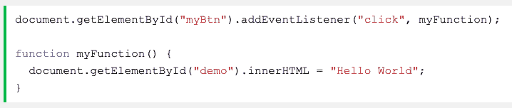
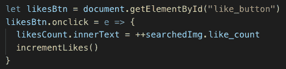

# JavaScript 语法:事件监听器

> 原文:[https://dev . to/bj Fairchild/JavaScript-syntax-event-listeners-1b3l](https://dev.to/bjfairchild/javascript-syntax-event-listeners-1b3l)

人们学习的方式多种多样。对一个人来说最容易和最符合逻辑的路径对另一个人来说可能是一个令人困惑的难题。幸运的是，对于编码社区来说，我们编写的代码可以是多样和灵活的。在最近的一堂 JavaScript 课上，我偶然发现了一个很好的例子，它是关于添加到按钮上的事件监听器的。

向按钮添加事件侦听器很简单。我们可以这样写:

[T2】](https://res.cloudinary.com/practicaldev/image/fetch/s--z8Q6UeFI--/c_limit%2Cf_auto%2Cfl_progressive%2Cq_auto%2Cw_880/https://thepracticaldev.s3.amazonaws.com/i/0f3vr0iiciwe0wtgebi2.png)

在这个例子中，每当“click”事件发生在我们指定的按钮上时，函数“myFunction()”就会被触发。然后你可以继续写下这个函数被触发时会做什么。这种方法最初是介绍给我的，但后来我的导师向我展示了一种对我来说更有意义的不同方法。

[T2】](https://res.cloudinary.com/practicaldev/image/fetch/s--6QSWXbUK--/c_limit%2Cf_auto%2Cfl_progressive%2Cq_auto%2Cw_880/https://thepracticaldev.s3.amazonaws.com/i/ctc2o36iyehwvphbvajq.png)

在这个例子中，我通过添加“.”将我的事件监听器添加到我的按钮。onclick”到我为按钮本身指定的变量。然后通过调用我的事件“e”，我使用一个箭头函数来深入了解按钮被点击后会有什么功能，而不用停下来定义另一个功能。

这两个例子完成了同样的事情，并且都按预期运行。我的一些同学更喜欢这种方式。关于编码，我最喜欢的是有几乎无限的方法去寻找问题的解决方案。有些可能比其他的更麻烦和复杂。有些可能更简洁，使用的代码更少。我们每个人都有自己解决问题的方式和方法。只要解决了，每一条路都是正确的。

[T2】](https://res.cloudinary.com/practicaldev/image/fetch/s--3M9a8LBs--/c_limit%2Cf_auto%2Cfl_progressive%2Cq_auto%2Cw_880/https://thepracticaldev.s3.amazonaws.com/i/pr0e6vum0hx55c7edn8l.jpg)