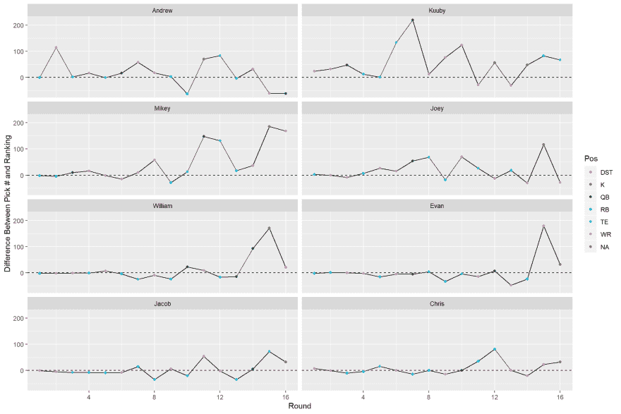

# Showdev:梦幻足球选秀分析

> 原文:[https://dev . to/EVA noman/show dev-fantasy-football-draft-analysis-5hc](https://dev.to/evanoman/showdev-fantasy-football-draft-analysis-5hc)

基于本关于梦幻足球的帖子，我决定分享我在过去几年中为我的主要梦幻足球联盟所做的分析草稿。

自 2016 年以来，我们一直在进行现场、面对面的草稿，没有小抄。这使得事情变得更有趣，并迫使每个人对联盟投入更多。再加上这是一个互相见面，享受美食+饮料的借口(今年我们都是在芝加哥的一个朋友家认识的)。

因为我们都很有竞争力，所以我决定做一个分析，看看相对于 ESPN 排名谁有最好的草案。虽然每个排名都是有争议的，但持续违背这个排名可能意味着你的起草工作做得不好。

所以我把草稿数据和 ESPN 排名转换成 CSV 格式，并使用`R`来分析数据。`R`有一些非常酷的工具，比如 [`rmarkdown`](https://rmarkdown.rstudio.com/) 和 [`knitr`](https://yihui.name/knitr/) 来制作这类报告。我将这些工具与所有`R`的数据操作工具和无与伦比的 [`ggplot2`](https://ggplot2.tidyverse.org/) 结合起来，用于数据可视化。我在本地使用`knitr`生成 HTML，然后使用 GitHub 页面托管它

无论如何，这里是有趣的部分:

*   [分析网页](https://evanoman.github.io/FantasyFootball2019/Draft/)
*   我最喜欢的图表:

[T2】](https://res.cloudinary.com/practicaldev/image/fetch/s--BKMqPyMu--/c_limit%2Cf_auto%2Cfl_progressive%2Cq_auto%2Cw_880/https://thepracticaldev.s3.amazonaws.com/i/tm5x26f5qee048yvqr15.png)

## 代码:

##  [【福音】](https://github.com/EvanOman)/[【2019 年幻想足球】](https://github.com/EvanOman/FantasyFootball2019)

<article class="markdown-body entry-content container-lg" itemprop="text">

# 梦幻足球 2019

这份报告包含了我对 2019 赛季梦幻足球联赛的一些`R`分析。

</article>

[View on GitHub](https://github.com/EvanOman/FantasyFootball2019)