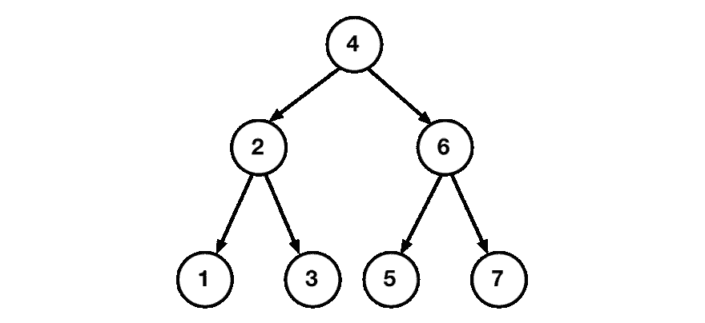
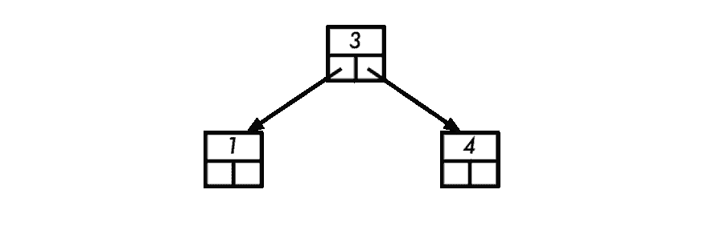
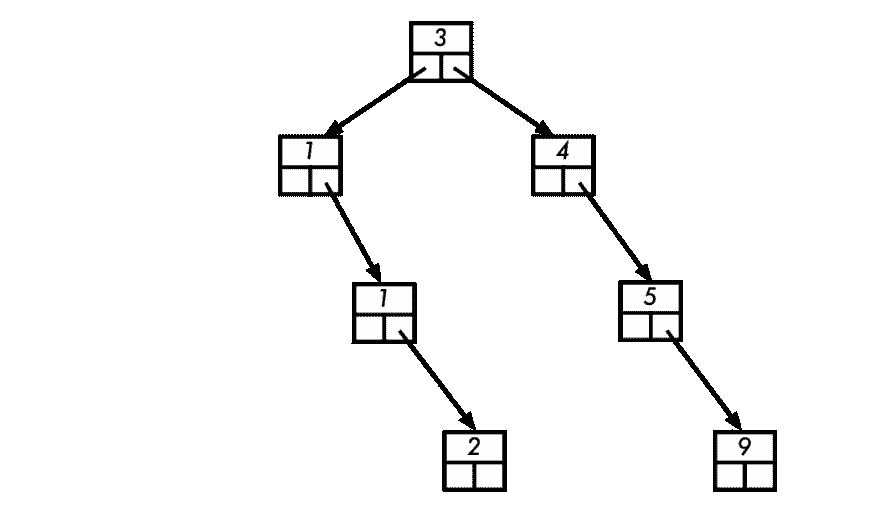

# 摇动树

> 原文:[https://dev.to/quoll/shaking-the-tree-2oi2](https://dev.to/quoll/shaking-the-tree-2oi2)

第 7 部分，用[第 6 部分回到这里](https://dev.to/quoll/mapping-the-way-3fn)，或者回到[这里开始](https://dev.to/quoll/what-s-with-data-structures-2fk7)。

# [](#a-new-structure)新结构

到目前为止，所有的例子都展示了链表。这些在某些情况下很有用，但功能有限。

我要考虑的下一个结构是一棵树。

树的元素(或节点)非常类似于链表中的元素，但是它们不是对链表中下一个元素有一个引用，而是对每个子元素有多个引用。让我们考虑一个简单的树，每个节点最多有 2 个子节点。这些被称为“二叉树”。
[](https://res.cloudinary.com/practicaldev/image/fetch/s--Qqbv5fHy--/c_limit%2Cf_auto%2Cfl_progressive%2Cq_auto%2Cw_880/https://github.com/quoll/raw-data/raw/master/binary-tree.png) 
很多人都熟悉与树木相关的术语，但我将快速浏览一些主要术语。

## [](#simple-tree)简单树

一棵树由*个节点*组成，每个节点都有值(在本例中，这些是数字)和 0 个或更多的*子节点*。这是一个二叉树，这意味着节点只有一个值，最多 2 个子节点。这些在上面显示为箭头。请注意，底部节点有 0 个子节点。

我们可以用一个基本的节点类来看一个简单的例子:

```
class Node {
  constructor(value) {
    this.value = value;
  }

  setLeft(left) {
    this.left = left;
    return this;
  }

  setRight(right) {
    this.right = right;
    return this;
  }
} 
```

<svg width="20px" height="20px" viewBox="0 0 24 24" class="highlight-action crayons-icon highlight-action--fullscreen-on"><title>Enter fullscreen mode</title></svg> <svg width="20px" height="20px" viewBox="0 0 24 24" class="highlight-action crayons-icon highlight-action--fullscreen-off"><title>Exit fullscreen mode</title></svg>

构造函数可以接受左值和右值，如果它们可用的话，但是现在我将保持这个类简单。

上图中显示的树是有序的，并遵循一个简单的规则，即左侧节点下的所有数字将具有较小的值，右侧节点下的所有数字将具有较大的值。树的顶部(包含值“4”)被称为*根*。

所以现在我们可以用值 1/2/3:
构建一棵小树

```
let one = new Node(1);
let two = new Node(2);
let three = new Node(3);
two.setLeft(one);
two.setRight(three); 
```

<svg width="20px" height="20px" viewBox="0 0 24 24" class="highlight-action crayons-icon highlight-action--fullscreen-on"><title>Enter fullscreen mode</title></svg> <svg width="20px" height="20px" viewBox="0 0 24 24" class="highlight-action crayons-icon highlight-action--fullscreen-off"><title>Exit fullscreen mode</title></svg>

结果是一个根值为“2”的小结构:

```
Node { value: 2, left: Node { value: 1 }, right: Node { value: 3 } } 
```

<svg width="20px" height="20px" viewBox="0 0 24 24" class="highlight-action crayons-icon highlight-action--fullscreen-on"><title>Enter fullscreen mode</title></svg> <svg width="20px" height="20px" viewBox="0 0 24 24" class="highlight-action crayons-icon highlight-action--fullscreen-off"><title>Exit fullscreen mode</title></svg>

您可能已经注意到，`setLeft`和`setRight`函数返回节点本身。这允许函数调用的链接，可以使代码更加紧凑。这也是为什么我没有对 Javascript 使用标准的 *setter* 语法，因为那不应该返回值。

链接函数调用意味着我们可以在不设置子节点的地方跳过保存带有标签的节点。

```
let two = new Node(2).setLeft(new Node(1)).setRight(new Node(3)); 
```

<svg width="20px" height="20px" viewBox="0 0 24 24" class="highlight-action crayons-icon highlight-action--fullscreen-on"><title>Enter fullscreen mode</title></svg> <svg width="20px" height="20px" viewBox="0 0 24 24" class="highlight-action crayons-icon highlight-action--fullscreen-off"><title>Exit fullscreen mode</title></svg>

这和上面的结果完全一样，但是写起来更快一点。

现在让我们构建初始图中的整个树:

```
let two = new Node(2).setLeft(new Node(1)).setRight(new Node(3));
let six = new Node(6).setLeft(new Node(5)).setRight(new Node(7));
let root = new Node(4).setLeft(two).setRight(six); 
```

<svg width="20px" height="20px" viewBox="0 0 24 24" class="highlight-action crayons-icon highlight-action--fullscreen-on"><title>Enter fullscreen mode</title></svg> <svg width="20px" height="20px" viewBox="0 0 24 24" class="highlight-action crayons-icon highlight-action--fullscreen-off"><title>Exit fullscreen mode</title></svg>

在一行代码中完成所有这些是可能的，但这超出了使代码更紧凑的范围，并开始使代码变得迟钝，所以我们不要这样做！

所有这些的结果就是最初的图中显示的树:

```
Node {
  value: 4,
  left:
   Node { value: 2, left: Node { value: 1 }, right: Node { value: 3 } },
  right:
   Node { value: 6, left: Node { value: 5 }, right: Node { value: 7 } } } 
```

<svg width="20px" height="20px" viewBox="0 0 24 24" class="highlight-action crayons-icon highlight-action--fullscreen-on"><title>Enter fullscreen mode</title></svg> <svg width="20px" height="20px" viewBox="0 0 24 24" class="highlight-action crayons-icon highlight-action--fullscreen-off"><title>Exit fullscreen mode</title></svg>

## [](#tree-properties)树属性

您可能会注意到，树中的任何节点都可以被认为是一个更小的树的根。其中的每一个都被称为树的一个分支。许多常见的树操作是通过在树根节点(可能是更大的树的一个分支)上执行一些任务以及对每个子分支执行相同的操作来定义的。这类似于处理链表，其中一个操作涉及列表当前头部的一些任务，然后是列表中该元素之后的操作。

例如，创建一个包含树的所有值的字符串。为此，节点可以获取左分支的字符串，添加当前值，然后添加右分支的字符串。
T2】

```
function treeString(node) {
  if (node === undefined) return null;                                                                                    
  let leftString = treeString(node.left);                                                                                 
  let rightString = treeString(node.right);
  let result = (leftString === null) ? node.value : leftString + ", " + node.value;
  if (rightString !== null) {
    result += ", " + rightString;
  }
  return result;
} 
```

<svg width="20px" height="20px" viewBox="0 0 24 24" class="highlight-action crayons-icon highlight-action--fullscreen-on"><title>Enter fullscreen mode</title></svg> <svg width="20px" height="20px" viewBox="0 0 24 24" class="highlight-action crayons-icon highlight-action--fullscreen-off"><title>Exit fullscreen mode</title></svg>

三元表达式(使用`?:`)和最后的`if`语句都有助于确定列表中是否需要逗号。

通过在第一行测试一个未定义的节点，函数可以在每个子节点上调用`treeString`,而不必先测试它们是否存在。您可能还会注意到这个函数是递归的，这个对`undefined`的测试确保了递归在到达每个分支的底部时停止。

调用`treeString(root)`我们现在可以以字符串的形式获得树的全部内容:
`1, 2, 3, 4, 5, 6, 7`

### [](#height)高度

一棵树的*高度*是你必须向下到达一个没有更多子节点的子节点的最大数量。所以整棵树的高度是 3。节点“2”和“6”处的分支高度为 2。底部的节点高度都是 1，也被称为*叶*。

计算高度可以递归完成。节点的高度是左边和右边的较大高度加一。如果没有节点，那么它的高度是`0`。

```
function height(node) {
  if (node === undefined) return 0;
  return 1 + Math.max(height(node.left), height(node.right));
} 
```

<svg width="20px" height="20px" viewBox="0 0 24 24" class="highlight-action crayons-icon highlight-action--fullscreen-on"><title>Enter fullscreen mode</title></svg> <svg width="20px" height="20px" viewBox="0 0 24 24" class="highlight-action crayons-icon highlight-action--fullscreen-off"><title>Exit fullscreen mode</title></svg>

用`height(root)`尝试这个会得到`3`

### [](#balance)平衡

这种特殊树的另一个特点是它是平衡的。这意味着每个子分支的高度相差不会超过 1。因此，这 7 个节点的树的高度只有 3。树不需要被平衡，但是当它们被平衡时，它们会更有效率，因为高度会更小。

不平衡树的一个极端例子是左节点总是未定义。我们的 7 节点树的根将是“1”，并且树将总是只有一个孩子在右边，一直到“7”。这相当于一个链表，这个不平衡树的高度是`7`。

当树木填满时，它们可能会变得不平衡，这可能需要量化。一般来说，向左不平衡会产生负数，向右不平衡会产生正数:

```
function balance(node) {
  return height(node.left) - height(node.right);
} 
```

<svg width="20px" height="20px" viewBox="0 0 24 24" class="highlight-action crayons-icon highlight-action--fullscreen-on"><title>Enter fullscreen mode</title></svg> <svg width="20px" height="20px" viewBox="0 0 24 24" class="highlight-action crayons-icon highlight-action--fullscreen-off"><title>Exit fullscreen mode</title></svg>

## [](#sorting)排序

到目前为止，我们已经展示了树可以保存您放入其中的数据，但是它以一种奇怪的结构保存数据。数据取出后，看起来就像存储在链表中的一样。所有这些复杂性带来了什么好处？最常见的优势是它们可以对数据进行排序。

上面构建树的示例代码是一个非常手工的操作，仔细地构建树的结构来精确地演示我们想要的。这在一般情况下不是特别有用，因为输入的数据不可能提前知道。相反，将数据插入树中的代码可以用于实现前面提到的排序规则:小于节点的数据将位于节点的左侧，等于或大于节点的数据将位于右侧。

为此，让我们构建一个`Tree`类，它存储一个根，并且可以插入数据。

```
class Tree {
  constructor(value = null) {
    this.root = value === null ? null : new Node(value);
  }

  add(value) {
    let node = new Node(value);
    if (this.root === null) {
      this.root = node;
    } else {
      this.insertNode(this.root, node);
    }
    return this;
  }
  // ... more ...
} 
```

<svg width="20px" height="20px" viewBox="0 0 24 24" class="highlight-action crayons-icon highlight-action--fullscreen-on"><title>Enter fullscreen mode</title></svg> <svg width="20px" height="20px" viewBox="0 0 24 24" class="highlight-action crayons-icon highlight-action--fullscreen-off"><title>Exit fullscreen mode</title></svg>

`add`方法首先构建一个节点来保存值。如果树还没有根，那么这个节点就成为根。否则，调用`insertNode`方法，传递根和要添加的节点。`insertNode`方法可以是类外部的一个函数，但是我希望在添加新特性时它会在树的上下文中，所以我们将它放在类内部:

```
 insertNode(node, newNode) {
    if (newNode.value < node.value) {
      if (node.left === undefined) {
        node.setLeft(newNode);
      } else {
        this.insertNode(node.left, newNode);
      }
    } else {
      if (node.right === undefined) {
        node.setRight(newNode);
      } else {
        this.insertNode(node.right, newNode);
      }
    }
    return this;
  } 
```

<svg width="20px" height="20px" viewBox="0 0 24 24" class="highlight-action crayons-icon highlight-action--fullscreen-on"><title>Enter fullscreen mode</title></svg> <svg width="20px" height="20px" viewBox="0 0 24 24" class="highlight-action crayons-icon highlight-action--fullscreen-off"><title>Exit fullscreen mode</title></svg>

这看起来更复杂，所以让我们考虑发生了什么。

第一个`if`语句检查被插入节点的值是否小于当前节点的值。如果是，应该插在左边，否则就插在右边。如果需要不同类型的分类模式，那么这个测试将使用与简单的*小于*运算符不同的运算。

下一部分类似于如何在`add`函数中寻址头部，如果左边没有节点，则将`left`设置为该节点，否则以`left`节点为起点调用`insertNode`。

如果`newNode`的值等于或大于当前节点的值，那么用`right`做完全相同的事情。

## [](#sorted-%CF%80)排序π

如果我们尝试将π的前几个数字插入到树中会发生什么？
*3.141592*

让我们从前三个数字开始。

```
let piTree = new Tree(3).add(1).add(4); 
```

<svg width="20px" height="20px" viewBox="0 0 24 24" class="highlight-action crayons-icon highlight-action--fullscreen-on"><title>Enter fullscreen mode</title></svg> <svg width="20px" height="20px" viewBox="0 0 24 24" class="highlight-action crayons-icon highlight-action--fullscreen-off"><title>Exit fullscreen mode</title></svg>

从`3`开始，这将成为树的根。添加`1`会到根的左边，添加`4`会到右边。这里显示了节点，用方框表示`left`和`right`引用。
[T8】](https://res.cloudinary.com/practicaldev/image/fetch/s--PBPh3zO9--/c_limit%2Cf_auto%2Cfl_progressive%2Cq_auto%2Cw_880/https://github.com/quoll/raw-data/raw/master/start-tree.png)

添加接下来的几个数字会进一步扩展树:

```
piTree.add(1).add(5).add(9).add(2); 
```

<svg width="20px" height="20px" viewBox="0 0 24 24" class="highlight-action crayons-icon highlight-action--fullscreen-on"><title>Enter fullscreen mode</title></svg> <svg width="20px" height="20px" viewBox="0 0 24 24" class="highlight-action crayons-icon highlight-action--fullscreen-off"><title>Exit fullscreen mode</title></svg>

添加的`1`会到`3`的左边，然后到另一个`1`。我们已经说过，所有大于或等于的值都向右，所以新节点位于这个`1`的右侧。`5`从根节点开始，一直到`4`节点，新节点放在它的右边。然后，`9`将从根部开始，并继续向右移动，直到到达底部。最后，`2`将首先到达根的左侧，然后向右直到底部。
[](https://res.cloudinary.com/practicaldev/image/fetch/s--o9gjjazi--/c_limit%2Cf_auto%2Cfl_progressive%2Cq_auto%2Cw_880/https://github.com/quoll/raw-data/raw/master/pi-tree.png)

这棵树不平衡。如果这棵树是完全平衡的，那么它的高度应该是 3，但是实际上，它的高度是 4。当根平衡时，两个分支不平衡，平衡为*2*(`1`和`4`节点左边的高度为 0，右边的高度为 2)。我现在还不打算解决如何平衡这个问题，但这不是一个应该被忽视的问题。

现在已经添加了数据，树看起来怎么样？
T0
T1】

这是所有的数据，以完全排序的形式。

## [](#sorting)排序

像这样排序数据是*索引*数据的基础。它允许快速找到存储的数据。例如，如果存储的数据是字典中的单词，它们可以按任何顺序插入，树会按字母顺序对它们进行排序。

如果数据更复杂，那么元素可以通过特定于该数据类型的函数进行排序。例如，学生记录可以先按姓氏，然后按名字，最后按学生 ID 的字母顺序排序。用于执行排序的函数将被提供给树构造器，并由`insertNode`函数使用。(回想一下我是如何希望这个函数出现在类中的？这使得它可以访问一个名为`this.comparator`的函数。

一旦对数据进行了排序，对其进行搜索就变得很有效率。当我们在标准印刷词典中查找一个单词时，我们通常从一个合理的地方开始，然后通过逐渐变小的跳跃来来回回地跳跃，直到我们缩小到我们想要的单词。树状结构也会做类似的事情。根类似于从字典的一半开始，沿着树向下的每一步都相当于在书中来回跳跃。

这是一种有效的查找单词的方法，因为你永远不需要超过树的高度。如果包含 *n* 个元素的树保持平衡，那么一棵二叉树的高度大约为 log <sub>2</sub> (n)。这意味着，每当数据大小增加一倍时，搜索只会增加一步。对于 1000 个项目，那么树将只有 10 步深。对于 2000 年来说，只需要 11 级台阶。这使得查找数据快速高效。

## [](#recap)重述

在这篇文章中，我们介绍了构建二叉树的基础知识，并提供了 Javascript 示例。一旦基本结构就绪，我们就添加代码来保持树的排序。这产生了一个有用的结构，它可以对数据进行排序，但不是完全有效的，因为生成的树是不平衡的。

接下来，我们将[把这个结构放到磁盘](https://dev.to/quoll/save-the-trees-4n4p)上，然后再考虑如何保持平衡。