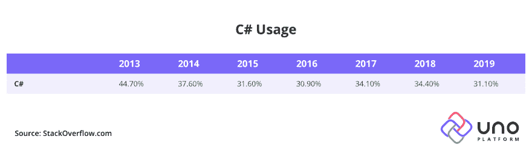
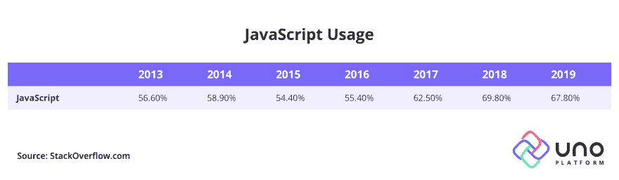
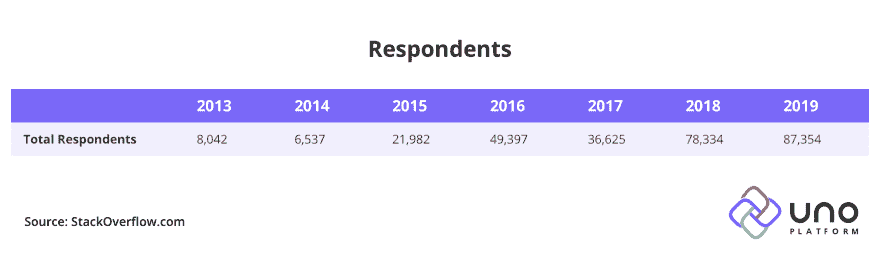
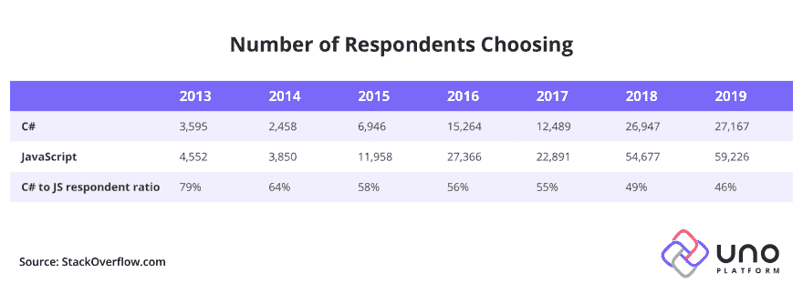

# C#开发者正在消失吗？(堆栈溢出 2020 年调查)

> 原文:[https://dev . to/uno-platform/are-c-developers-invising-stack-overflow-2020-survey-1 okh](https://dev.to/uno-platform/are-c-developers-disappearing-stack-overflow-2020-survey-1okh)

真正的 C#开发者请站起来，请站起来，请站起来…

**StackOverflow 调查，表面上观察，可能会让你认为 C#开发者的数量在快速下降。然而，通过进一步挖掘原始数据，我认为情况完全不同。**

首先，一些背景。StackOverflow 调查是 2010 年发起的年度软件开发人员调查。它通常在每年的秋冬季节进行，结果被广泛分享。这是业内最大的软件开发者调查之一。您可以在 StackOverflow insights 网站上查看所有调查的历史记录。

不应低估这项调查的重要性。我个人看到 StackOverflow 的调查数据在各种开发工具公司的内部会议上被引用了很多次，包括在访问微软的时候。尤其是当数字向上时，它们往往会被大量引用😊。我们行业中的许多人会认为它是事实上的标准，是开发人员和技术趋势的首选。**一些非常重大的商业决策是根据 StackOverflow 调查确定的趋势做出的。**

为什么我要深入研究调查和数据呢？答案很简单，我们的 [Uno 平台](http://www.platform.uno)专注于 C#和 XAML 开发者，我很好奇 C#开发者受众规模的趋势。此外，Uno Platform 的目标是让这些开发人员能够在网络(通过 WebAssembly)、移动(iOS 和 Android)和 Windows 上发布单一代码库应用程序，因此我自然也很想看到调查中的任何 WebAssembly 趋势。遗憾的是，WebAssembly 上的调查数据充其量也是有限的。我希望在 2020 年版的调查中包含更多关于这一关键行业话题的内容。但是有关于 C#开发者的数据，这是我最感兴趣的。注:对于这项小型研究，我仅使用了 2013 年至 2019 年的数据

1.  与以后几年相比，早期反应池较小
2.  最初几年的数据不容易从 StackOverflow 获得。

所以，快速总结一下这些年来 C#的使用情况应该是这样的: 

所以，微软的某个地方，以及周围的工具生态系统，应该敲响警钟了。C#使用率从 2013 年的近 45%到 2019 年的 31%？？？

相比之下，看看 JavaScript，同期增长了 10%。

[T2】](https://res.cloudinary.com/practicaldev/image/fetch/s--DOx0289F--/c_limit%2Cf_auto%2Cfl_progressive%2Cq_auto%2Cw_880/https://s3.amazonaws.com/uno-website-assets/wp-content/uploads/2019/09/05125051/Tableau_2.jpg)

所以，从表面来看，画面是清晰的。JavaScript (JS)呈上升趋势，C#呈下降趋势。随着网络占据博客头条，JS 的增长很大一部分可能是真实的。此外，随着脸书(react)和谷歌(angular)等公司推动 web stack 的发展，有理由期待 JavaScript 及其各种风格会崛起。此外，走出大学，甚至在大学期间，年轻学生被鼓励学习 JavaScript，因为这是进入编程和就业的第一步。

这就是微妙之处，除非你真正花时间从调查中提取数据，并从其他角度看待它，否则你永远不会注意到它。

[T2】](https://res.cloudinary.com/practicaldev/image/fetch/s--MmBOvNab--/c_limit%2Cf_auto%2Cfl_progressive%2Cq_auto%2Cw_880/https://s3.amazonaws.com/uno-website-assets/wp-content/uploads/2019/09/05125052/Tableau_3.jpg)

或者，如果您对这些数字进行逆向工程，得到所用技术的实际值:

[T2】](https://res.cloudinary.com/practicaldev/image/fetch/s--Msn6nafu--/c_limit%2Cf_auto%2Cfl_progressive%2Cq_auto%2Cw_880/https://s3.amazonaws.com/uno-website-assets/wp-content/uploads/2019/09/05125048/Tableau_4.jpg)

**所以，*一些*的事情首先在 2016 年发生，然后在 2018 年晚些时候推动回复数量上升。因此，随着响应的增加，C#的使用占总使用量的百分比下降了。**

从这个角度来看，C#开发人员(无论如何是调查者)的数量正在上升。它可能没有 JS 涨得快，但这比第一张图表显示的下降趋势要好。

** **现在**，**这篇博客中的内容纯属猜测，我相信 Twitter 会让我知道。**😊**

我在 JavaScript 社区的经验是，它的规模肯定比。NET(因此也是 C#)社区。过去，当我对各种来源的数据进行三角分析时，我发现 JavaScript 受众比。网络社区。同样重要的是(无论如何对于在线调查来说)JS 社区在线参与的可能性。JS 人群*非常*在线参与。我在这里的证据来自观察 Twitter 与这些各自社区的一些名人的互动。例如，如果您看到 React 团队的 Dan Abramov 获得的参与度，并将其与微软方面的 Scott Guthrie 或 Scott Hanselman 获得的参与度进行比较，您就会明白我的意思。

* *因此，我的印象是，除了 JavaScript 真正的提升和流行之外，JavaScript 受众也只是对 StackOverflow 调查做出了更多的回应。如果您是 C#开发人员，请务必回答下一个 StackOverflow 调查。**

为什么所有这些都很重要。大多数纯粹的开发者不会在意——他们会使用他们喜欢的任何技术，不管调查结果如何。但是，正如我在引言中所说的，重大决策部分是基于这项调查做出的。即假设你是工具公司 X 的产品经理，C#上的数据指向下。你会推荐进一步投资 C#吗？没错。那么，如果一切保持不变，在 2020 年的调查中，等待我们的是什么？

请记住，在分析调查结果时，您是在分析自愿收集的数据，这些数据可能并不代表真实情况。使用其他来源对这些数字进行三角测量是很重要的。然而，在我们的世界里，很难得到这些数据。但是，当一项调查得到 100，000 个回答时，很难用数字来反驳…

【2020 年烟囱溢流调查

1.  通过线性外推，堆栈溢出调查可能接近 10 万受访者。如果今年我是 StackOverflow (SO)的营销经理，我肯定会以这个数字为目标。我会给社区打一个又一个电话，帮助我们达到 10 万个号码。达到 100，000 名受访者意味着调查将比以往任何时候都更有意义。
2.  按照这种速度，如果 C#开发人员不花 10 分钟完成调查，数字可能会下降更多，降到 30%以下。
3.  确保你的声音被听到。帮助那些为你的筹码而战的人。帮助他们展示数字正在上升——他们将能够在未来几年为支持你提供充足的理由。

支持数据可在以下网址找到:

*   2019 年—[https://insights.stackoverflow.com/survey/2019#technology](https://insights.stackoverflow.com/survey/2019#technology)
*   2018 年—[https://insights.stackoverflow.com/survey/2018/#technology](https://insights.stackoverflow.com/survey/2018/#technology)
*   2017 年—[https://insights.stackoverflow.com/survey/2017#technology](https://insights.stackoverflow.com/survey/2017#technology)
*   2016 年—[https://insights.stackoverflow.com/survey/2016#technology](https://insights.stackoverflow.com/survey/2016#technology)
*   2015 年—[https://insights.stackoverflow.com/survey/2015/#tech](https://insights.stackoverflow.com/survey/2015/#tech)
*   2014 年(点击标签)–[https://insights.stackoverflow.com/survey/2015/#tech](https://insights.stackoverflow.com/survey/2015/#tech)
*   2013 年(点击标签)[https://insights.stackoverflow.com/survey/2015/#tech](https://insights.stackoverflow.com/survey/2015/#tech)

C#开发人员正在消失吗？(栈溢出 2020 调查)最早出现在 [Uno 平台](https://platform.uno)。