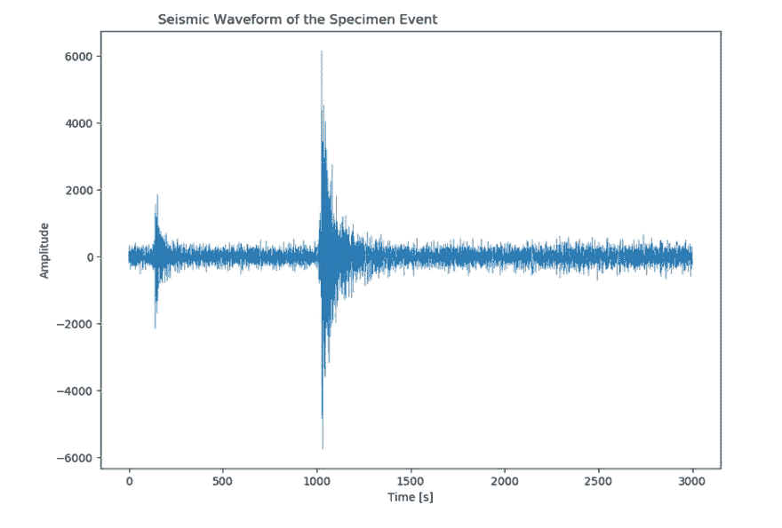
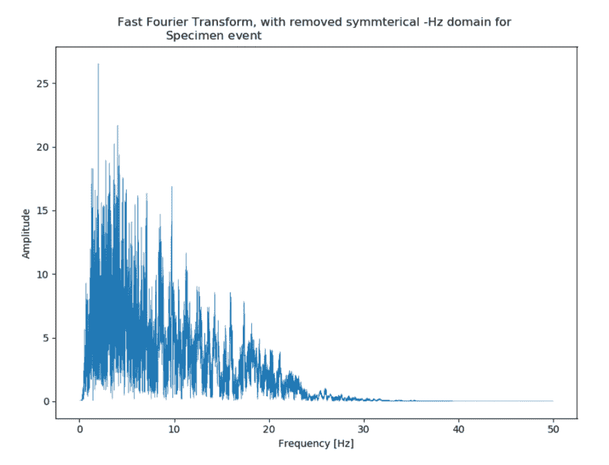
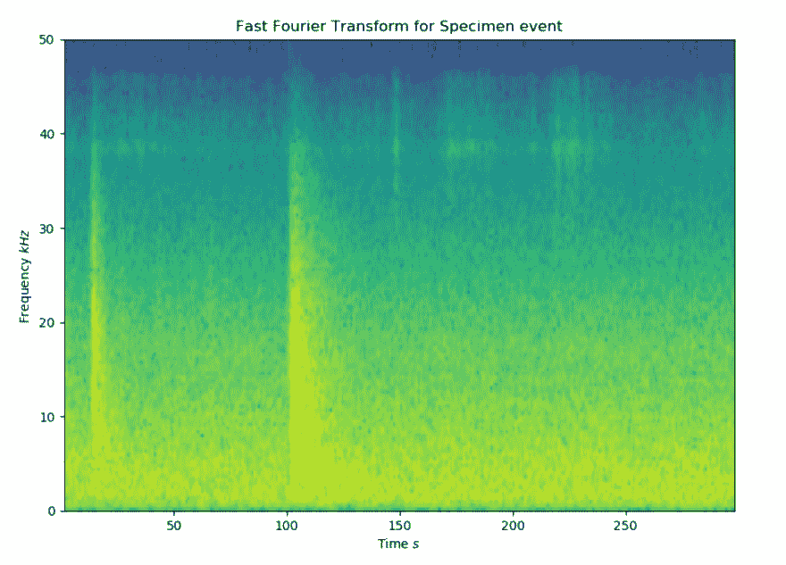

# 如何用小 Python 把火山地震变成有意义的数据

> 原文:[https://dev . to/rst range/visualizing-volcano seismic-events-an-exercise-in-signal-processing-5gal](https://dev.to/rstrange/visualising-volcanoseismic-events-an-exercise-in-signal-processing-5gal)

# TL；博士；医生

我不是一个优秀的程序员，但我认为我做的事情很有趣。其中之一就是研究火山爆发。岩浆向上推动产生了地震，我利用这些地震的传感器读数来进行研究。

*我需要的代码提取我需要的特征是:*

```
import <libraries>
#read in the raw data input_df = pd.read_csv("../Data/Specimen_Event.csv", index_col="Seconds")

#The output from the raw data isn't too useful, so let's look at the constituent frequencies 
fft_df = input_df.copy()

y_values = np.fft.fft(input_df.Amplitude.values)

no_of_datapoints = len(y_values)
time_interval = 0.01 

yf_values = 2.0/no_of_datapoints * np.abs(y_values[:no_of_datapoints//2])

x_values = fftfreq(no_of_datapoints, d=time_interval)
xf_values = fftfreq(no_of_datapoints, d=time_interval)[:no_of_datapoints//2]

#The frequency data is useful, but we've lost all temporal information - let's just take time slices and transform those, and glue it back together like a histogram - aka a seismogram 
window_size = 256

recording_rate = 100

frequencies, times, amplitudes = signal.spectrogram(input_df.Amplitude.values, fs = recording_rate, window='hanning', nperseg = window_size, noverlap= window_size - 100, detrend= False, scaling="spectrum")

decibels = 20 * np.log10(amplitudes)

f, ax = plt.subplots()
ax.pcolormesh(times, frequencies, decibels, cmap="viridis") 
```

这向我展示了这两个事件，以及一个 38Hz 的隐藏模式。这可以用来推测我们有一个大约 150 米的岩浆库。

# [](#where-do-i-start)从哪里开始？

我会试着像开始我的工作一样开始这篇文章——通过管理期望和诚实地对待我的能力。我不是 10x 工程师 *( [如果你相信神话](https://dev.to/pbeekums/the-problem-with-heroes-in-software-development) )* 或任何类似的东西，我也不是专注于激光的高级开发人员，有多年的开源贡献。我不会改变你编码的方式或者你处理工作的方式。

相反，我是一个骑墙派，习惯于在工业界和学术界之间摇摆不定；有足够的经验知道什么时候我正在编写糟糕透顶的代码(即使我一开始就无法阻止自己这么做)，但有足够的时间进行研究，将我平庸的技能应用到一些不同的东西上——特别是火山！

那么，火山学到底是如何融入编程的呢？嗯，这些年来，我们观察火山爆发的方式有了突破性的进展——不仅如此，我们测量火山爆发的方式也发生了变化，这是至关重要的部分。错误引用阿尼的话:*“如果它量化了，我们就能分析它”*。

[https://www.youtube.com/embed/eNr0WXQ3Ho4](https://www.youtube.com/embed/eNr0WXQ3Ho4)

那么，我们在衡量什么呢？很难窥视火山内部，我们也无法钻入活火山获取样本数据。但是我们确实有一些可以测量的替代指标来给我们提示，其中最好的一个是地震活动性——火山的地震活动。我们不可能在岩浆没有到达地表(或至少接近地表)的情况下爆发，但没有好的容易的预钻孔管道让它们跟随。每一英寸的通风口都必须与周围的岩石分开，有时长达数公里。

这种岩浆的喷射是一种非常活跃和嘈杂的事情，我们可以感受到。这些小裂缝产生了非常浅的、明显的、局部的地震，我们可以用地震仪检测到，倾斜/加速度计测量 x、y 和 z 轴上的运动。

# [](#cut-the-crap-show-me-the-code)废话少说，给我看看代码

那么，这个帖子有什么意义呢？好吧，知道这些地震正在发生是很好的，但是我们如何理解它们呢？

我们从我们经常做的地方开始，通过查看数据，但是首先，让我们得到我们将需要的库。

```
import pandas as pd
import numpy as np
import matplotlib.pyplot as plt
from numpy.fft import * # a library for carrying out Fourier Transforms from scipy import signal # further FFT functionality 
```

> 对于那些想在家编写代码的人，我在底部提供了指向样本数据的指针和一个笔记本

现在，我们需要得到我们的数据。它以简单的时序 csv 形式提供，这使得摄取非常容易，并且因为我们只加载了一个示例，所以我们不担心扩大规模，所以我们没有理由不使用`pandas`并使我们的生活更加轻松。

一旦我们加载了数据，我们将快速绘制原始数据。

```
input_df = pd.read_csv("../Data/Specimen_Event.csv", index_col="Seconds")

input_df.plot(lw = 0.3) 
```

这给了我们

[T2】](https://res.cloudinary.com/practicaldev/image/fetch/s--P0gdm6C1--/c_limit%2Cf_auto%2Cfl_progressive%2Cq_auto%2Cw_880/https://github.com/R-Strange/DEV-TO-posts/blob/master/190904_VisualisingVolcanoseismicEvenimg/raw_seismic_plot.png%3Fraw%3Dtrue)

我们似乎很幸运，在同一个 300 秒的窗口里发生了两件事；你可以看到一个较小的事件，接着是一个较大的事件。但是除此之外很难确定。我们需要更好的方法来理解传感器读数。

我们在图中看到的是振幅与时间的关系。当我们把同样的数据当作一个声音文件来听时，我们不仅会听到隆隆声，而且还能从中挑出更深更高频率的部分。谢天谢地，有一种方法可以从数学上挑选出频率——傅立叶变换。

我将在以后的帖子中详细解释，但我可以说，我们可以将*振幅与时间*的关系图(每 0.01 秒记录一次能量)转换为*振幅与频率*的关系图(每频率下数据文件*的能量)。你通常会听到人们将这些称为时域*-*或*时域*和频域*-*或*频域*。*

我们使用`SciPy/NumPy`库的快速傅立叶变换函数将事件转换到频域。

```
fft_df = input_df.copy()

y_values = np.fft.fft(input_df.Amplitude.values)

no_of_datapoints = len(y_values)
time_interval = 0.01 #the seismometers for this recording sample 100 times a second 
yf_values = 2.0/no_of_datapoints * np.abs(y_values[:no_of_datapoints//2])

x_values = fftfreq(no_of_datapoints, d=time_interval)
xf_values = fftfreq(no_of_datapoints, d=time_interval)[:no_of_datapoints//2]

fig, ax = plt.subplots()
ax.plot(xf_values, yf_values, lw=0.3)
ax.set_xlabel("Frequency [Hz]")
ax.set_ylabel("Amplitude")
ax.set_title("Fast Fourier Transform for Specimen event")
plt.show() 
```

我们将在后面的帖子中详细介绍这些步骤，但本质上，我们是在按任意周期计算振幅，但我们需要使用`fftfreq`函数独立计算出我们看到的实际频率(我们的 x 轴，频率全部取决于数据点的数量和记录速率)。有一个小杂耍，必须在一半，甚至长度范围内喂食。同样，在以后的文章中会有更多的介绍。

这给我们留下了这个情节:

[T2】](https://res.cloudinary.com/practicaldev/image/fetch/s--hUVMwQ-V--/c_limit%2Cf_auto%2Cfl_progressive%2Cq_auto%2Cw_880/https://github.com/R-Strange/DEV-TO-posts/blob/master/190904_VisualisingVolcanoseismicEvenimg/fft_seismic_plot.png%3Fraw%3Dtrue)

我们现在可以看到事件的频率分布。在 1 - 30 Hz 区域之间有许多低频隆隆声。人类的听觉范围从 20Hz 左右开始，因此这相对较低。但是有一个趋势。

现在唯一的问题是，通过将数据移动到频域，我们丢失了关于事件如何随时间变化的任何信息。对此的答案是将事件分割成窄的、稍微重叠的窗口，并在这些窗口上分别运行相同的傅立叶变换。然后，我们可以将这些叠加在一起，形成一个包含频率和时间信息的直方图，称为*频谱图*。

不过这也有好处——样本越短，傅里叶变换越不精确和灵敏，但样本越长，时间分辨率就越低。我们需要记住的另一件事是，使用 2^n 窗口大小在计算上更有效。

我们可以使用之前运行的相同代码手动完成这项工作，但是我们将使用一个捷径:一个预构建的 SciPy 库，它将运行转换并为我们可视化它们做准备。

```
window_size = 256

recording_rate = 100

frequencies, times, amplitudes = signal.spectrogram(input_df.Amplitude.values, fs = recording_rate, window='hanning', nperseg = window_size, noverlap= window_size - 100, detrend= False, scaling="spectrum")

decibels = 20 * np.log10(amplitudes)

f, ax = plt.subplots()
ax.pcolormesh(times, frequencies, decibels, cmap="viridis")
ax.set_ylabel("Frequency $kHz$")
ax.set_xlabel("Time $s$")
ax.set_title("Fast Fourier Transform for Specimen event")
plt.show() 
```

[T2】](https://res.cloudinary.com/practicaldev/image/fetch/s--XoiRjeD9--/c_limit%2Cf_auto%2Cfl_progressive%2Cq_auto%2Cw_880/https://github.com/R-Strange/DEV-TO-posts/blob/master/190904_VisualisingVolcanoseismicEvenimg/seismogram_plot.png%3Fraw%3Dtrue)

## [](#so-what)那又怎样？

在频域中重新捕捉数据的时间趋势的努力得到了回报。我们可以在最后一张图中看到，随着你向右移动，时间在前进，随着你向上移动，记录的频率越来越高——颜色越亮，能量越多。我们可以很清楚地看到这两个事件，但有一个模式不太明显，但更令人兴奋。

如果你没有发现它，有一个大约 38Hz 的信息带，在 150 秒后变得非常活跃。很难对我们所看到的有信心，但我们有两种可能性。更平凡的答案是，有一些背景噪音-像海洋中的风暴，共振到这个波段-一个频率-回声。如此稳定地保持在大约 38Hz 的信号将支持这种机制。

然而，海洋噪声通常不高于约 0.14 赫兹。发现它高达 38 赫兹是不可能的。虽然有许多其他噪声源，但没有多少噪声源**始终保持在那个频率范围内。**

 **另一个答案是，在这些更重大的事件之后，岩浆通常会重新定居，并移动到新裂缝中的空间，而岩浆房中的压力也会重新定居。由于信号更多地出现在事件之后，而且相当连续，这更有可能是岩浆的晃动，而不是单一的脆性破坏。

让我们进行最后一次幻想飞行。我不是说这最后一部分只是猜测，所以怀疑论者会转移你的视线！

奇怪的是，信号在频率上如此一致，所以它可能就像吹过啤酒瓶的风一样。当风速足够快穿过光圈时，它会发出哨声并产生共振。在我们的例子中，它可能是反过来的——孔的大小对压力波来说是合适的。

所以也许我们可以推断出岩浆房的形状？如果腔室有特定的长度或宽度，它会在与其波长相关的特定频率下共振。

我们知道频率 *f* ，我们想要波长*λ*。我们需要知道的最后一件事是声音在岩浆中的速度——虽然它是一个变化的数字，但为了进行粗略的计算，我们假设每秒 5 千米。

让我们做一下数学计算:

[T2】](https://res.cloudinary.com/practicaldev/image/fetch/s--yhh4wDYv--/c_limit%2Cf_auto%2Cfl_progressive%2Cq_auto%2Cw_880/https://github.com/R-Strange/DEV-TO-posts/blob/master/190904_VisualisingVolcanoseismicEvenimg/maths.png%3Fraw%3Dtrue)

因此，为了使它变得完整，我们可以估计正在破裂的房间或通风孔或管道的尺寸大约为 131 米——所有这些都来自一个音频剪辑！

# [](#resources)资源

对于那些想在家玩的人，你可以在这里找到数据和笔记本[这里](https://github.com/R-Strange/DEV-TO-posts/blob/master/190904_VisualisingVolcanoseismicEvents/Code/Example%20Notebook.ipynb)**