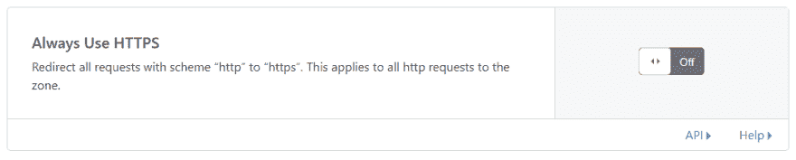

# 让我们加密 Cloudflare

> 原文:[https://dev.to/wesmharris/let-s-encrypt-cloudflare-42ae](https://dev.to/wesmharris/let-s-encrypt-cloudflare-42ae)

TL；Cloudflare 博士的“始终使用 https”打破了 letsencrypt 更新

有时候你在浏览一个应用程序的设置时，你会发现一些看起来很好的想法，然后你就打开了开关。然后三个月后…你发现它有真正的后果。

让我告诉你我如何度过我的下午的故事。外面阳光明媚，所以我负责任地呆在家里，这样我的痣就不会像癌症一样了。我终于有了一点空闲时间来处理几天前收到的一封讨厌的电子邮件……来自《让我们加密吧》。

这是一个证书即将到期的通知。我讨厌那些邮件。为什么我得到了这么多形成如此强烈的意见？嗯，可能是因为在 certbot 在 Windows 上工作之前，我花了太长时间使用 IIS 作为 web 服务器。即使有了我的黑客脚本，我仍然不得不手动调用这该死的东西。

Certbot 是一个天赐之物——就像你的个人摩西为你分开红海，并在你走过潮湿的道路前往应许之地时握着你的手。作为一个凡人，我并不假装理解其核心的神秘魔力，我只是在网络服务器的大方向上挥舞着它，并希望有最好的结果。因此，当出现问题时，我会像每个肤色苍白、身上布满斑点的埃及奴隶一样——问万能的谷歌(Google)错误信息到底是什么意思。

这通常是有效的。谷歌是一个仁慈的上帝，拥有无人能完全掌握的丰富知识。但是今天，他像一个淘气的孩子，用令人厌恶的故事来嘲弄我，说人们解决了非常相似但不完全相同的问题。好像我的航海问题可以通过自助飞行指南来解决(但它们都是交通工具！)

在绝望中，我开始摆弄 nginx 配置&开始费力地查看 curl 响应，试图说服自己，我正在做的事情，哪怕只是一点点，指向了正确的方向。

```
301 http to https
    But LE doesn’t listen to https
So why doesn’t it pick up the http
        What else could be doing the redirect??!1 
```

## [](#cloudflare)Cloudflare

Cloudflare 是你永远可以指望向他讨根烟抽的有钱人。但他喜欢酱汁，所以当你乘他的游艇出去时，当你说你想“跳大麻吉格舞”并开始系绳子时，他会真的带你去，而不是烤那个挂在他衬衫口袋外面的胖子。

总之，它在 curl 头中。平淡如红海泥。Cloudflare 按你说的做了。让我们取消那个小开关，然后…

[T2】](https://res.cloudinary.com/practicaldev/image/fetch/s--lUH5fDbQ--/c_limit%2Cf_auto%2Cfl_progressive%2Cq_auto%2Cw_880/https://miro.medium.com/max/1042/1%2AHNr8pno_67JdSvM5JzaIrg.png)

嘭嘭。哇哦，鞭子！突然，你内心的隐喻风暴减弱了，你的小船又开始快乐地航行了。有点虎头蛇尾。也许我们应该庆祝一下——不。我们刚刚因为鲁莽地拨动开关而浪费了 3 个小时。三个小时了，我们回不来了。没必要庆祝消除愚蠢。第 12 杯咖啡是可以接受的安慰奖。

* * *

经过一段时间的反思，喝了足够的咖啡，看起来像个冰毒瘾君子，我意识到，作为开发人员，我们生活在信息的量子状态中。答案要么是谷歌搜索 42 秒，要么是无法到达。在你谷歌错误信息之前，没有人能知道，这样做会把你压得喘不过气来，让你把咖啡溅得键盘到处都是。

我们的系统现在变得如此复杂，以至于我们需要一个完整的团队来掌舵 SS Kubernetes，打造一条通往宝藏的道路。你曾经坐在你的小船上贪婪地从论坛上抓取瓶装消息，徒劳地希望他们有答案，现在你坐在你的华丽的船上，周围是同志，做着同样的事情，因为摘下耳机太费力，松弛又下来了。

也许有一天，我们会穿越商业模式的棘手海峡，在新发行日凯旋而归，得到我们应得的那份战利品。也许在那一天，我们将能够回到，破碎和孤独，我们的小艇孤独，在那里我们将最终找到一些时间为我们开始的副业项目。