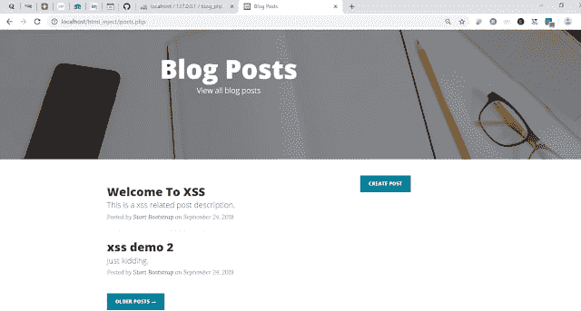
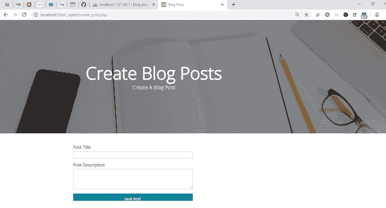
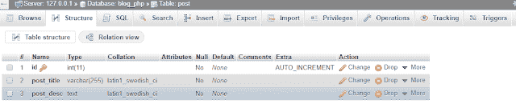
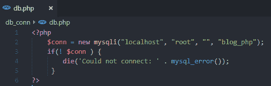
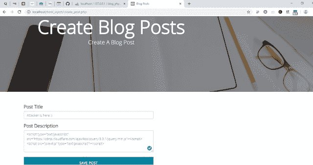
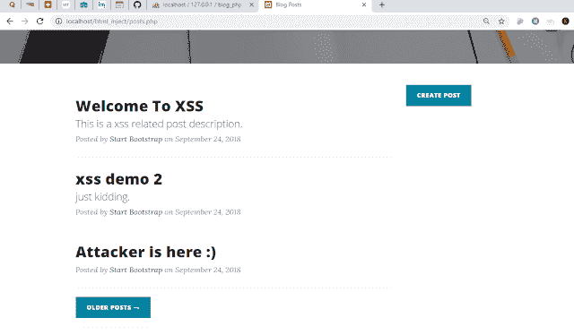
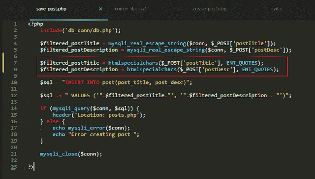
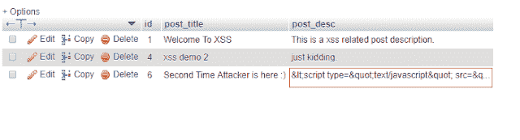

# 跨站点脚本的分步指南

> 原文:[https://dev . to/nileshshanyal/step-by-step-guide-on-cross-site-scripting-45kg](https://dev.to/nileshsanyal/step-by-step-guide-on-cross-site-scripting-45kg)

*阅读原文[此处](https://www.devhelperworld.in/2019/07/cross-site-scripting-example.html)T3】*

这篇文章是跨站点脚本系列的最后一部分。如果你因为某些原因错过了第一部分，可以在这里阅读[。](https://dev.to/nileshsanyal/never-mess-with-cross-site-scripting-and-here-is-the-reason-why-4bhl)

# **重要提示**

请注意，本文提供的所有信息仅用于教育目的。

## **我们将创造什么**

我们将创建两个页面；文章创建和文章列表页面。

文章列表页面的屏幕截图如下所示。

[T2】](https://res.cloudinary.com/practicaldev/image/fetch/s--6Ri2ckLR--/c_limit%2Cf_auto%2Cfl_progressive%2Cq_auto%2Cw_880/https://1.bp.blogspot.com/-dW3RsYAR1lQ/XRpHIKpqE7I/AAAAAAAABGo/20J-oE6vBJEQX5Ag1YNS8iXaojBIOf-XACLcBGAs/s640/post_listing.png)

帖子创建页面的屏幕截图如下所示。

[T2】](https://res.cloudinary.com/practicaldev/image/fetch/s--119Pf6Qx--/c_limit%2Cf_auto%2Cfl_progressive%2Cq_auto%2Cw_880/https://1.bp.blogspot.com/-vSsIbiVfqkQ/XRpHgl1zgQI/AAAAAAAABGw/03zzEI9K8yQ8LC3OCmCCquYGnNDdjmrFgCLcBGAs/s640/post_creation.png)

为了理解本文，您需要使用 php myadmin 在数据库中创建一个 post 表。

post 表的表结构如下。

[T2】](https://res.cloudinary.com/practicaldev/image/fetch/s--AXPAyq_C--/c_limit%2Cf_auto%2Cfl_progressive%2Cq_auto%2Cw_880/https://1.bp.blogspot.com/-FRVbfapr4tc/XRpIL5VGCRI/AAAAAAAABG8/UIVvdJMoHlAUTBB77LMShhp-zcq6L2LjACLcBGAs/s640/posts_table_structure.png)

下面的屏幕截图是包含数据库连接代码的 db.php 文件的代码。

[T2】](https://res.cloudinary.com/practicaldev/image/fetch/s--XM5Hydi7--/c_limit%2Cf_auto%2Cfl_progressive%2Cq_auto%2Cw_880/https://1.bp.blogspot.com/-GFnS_4eiMQU/XRpK2QPqZyI/AAAAAAAABHU/r29WFHCW-ho9oksh7yURjHMZkENX5ThiQCLcBGAs/s640/xss_db_connectivity.png)

点击[这里](https://www.devhelperworld.in/p/download-link-page.html)下载整个项目。

### **posts . PHP 的解释:**

在 posts.php 文件中，文章标题和描述保存在文章表中。在保存 post 之前，我们确保我们的应用程序不会被 sql 注入。为了做到这一点，我们使用了*mysqli _ real _ escape _ string()*函数。如果你对 sql 注入一无所知，可以在这里阅读[。](https://dev.to/nileshsanyal/know-all-about-sql-injection-in-depth-4lb8)

### **通过存储的跨站点脚本利用应用程序**

我们已经为该应用程序添加了创建后功能。让我们看看如何利用这个应用程序，以便当任何人访问这个页面时，他或她的会话 cookie 将被窃取并发送给攻击者。

在下面的屏幕截图中，攻击者在注释框中注入 javascript 代码，通过 AJAX 调用执行 php 代码。

[T2】](https://res.cloudinary.com/practicaldev/image/fetch/s--bwChyIqA--/c_limit%2Cf_auto%2Cfl_progressive%2Cq_auto%2Cw_880/https://1.bp.blogspot.com/-1MlfHEsGn24/XRpMHEYPkkI/AAAAAAAABHg/mm7xGWrAcLUmETHXhDty4ijvJBFpJKM-wCLcBGAs/s640/injected_xss_code.png)

从上面的截图中我们可以看到，在添加 jquery cdn 链接之后，添加了对一个名为 *evil.js* 的文件的引用。为了让这个例子成功运行，您需要在当前项目根目录的 js 文件夹中创建一个文件 *evil.js* 。

### **邪之解说. js:**

*evil.js* 文件收集存储在浏览器中的 cookies，然后在**getCookiedata.php**文件中发送。

### **getcookiedata . PHP 解释:**

被盗 cookie 信息存储在*“cookie _ data . txt”*文件中。如果代码第一次执行，那么该文件将在应用程序的根目录中创建。如果该文件已经存在，则新内容将被追加到该文件中。

为了确保您理解存储的 xss 攻击，我们将 *cookie_data.txt* 文件存储在应用程序的根目录中。但是，通常，攻击者将信息存储到他或她自己的服务器上。

### **获取会话 Cookie 值**

在攻击者注入 javascript 代码后，我们可以从下面的屏幕截图中看到，在帖子列表页面中没有显示任何帖子描述。

[T2】](https://res.cloudinary.com/practicaldev/image/fetch/s--90THRpMi--/c_limit%2Cf_auto%2Cfl_progressive%2Cq_auto%2Cw_880/https://1.bp.blogspot.com/-NHWltzETXAY/XRpO__UNQAI/AAAAAAAABIE/moLEzA4-99gLVIxH4Vmk2pdJW07ELpJjwCLcBGAs/s640/after_xss_injection.png)

但是，如果我们打开 *"cookie_data.txt"* 文件，我们可以看到会话 cookie 内容就在那里！

[T2】](https://res.cloudinary.com/practicaldev/image/fetch/s--QpCYvgAg--/c_limit%2Cf_auto%2Cfl_progressive%2Cq_auto%2Cw_880/https://1.bp.blogspot.com/-dPHSITreSao/XRpPb8PmMEI/AAAAAAAABIM/Nh2bb1bMgKwchufus8yxLVhEPewsmCJfwCLcBGAs/s640/session_cookie_revealed.png)

## **防止跨站脚本攻击**

我们在前面的屏幕截图中看到了攻击者如何利用 **xss** 来窃取会话 cookie。现在，我们将阻止攻击者这样做。

对*“save _ post . PHP”*文件中以红色突出显示的内容进行更改，如下所示。

[T2】](https://res.cloudinary.com/practicaldev/image/fetch/s--dBi8jIDQ--/c_limit%2Cf_auto%2Cfl_progressive%2Cq_auto%2Cw_880/https://1.bp.blogspot.com/-kTyVGCOOdtw/XRpP9xN5f1I/AAAAAAAABIY/TnprZJdJQkwsdFSXJdSXdwTRv5rk7Jq1QCLcBGAs/s640/prevent_xss.png)

## **解说:**

我们使用了， *htmlspecialchars()* 函数，该函数将一些特殊字符转换为 HTML 实体，这样 xss 将不再工作。比如*>*会转换成*>*。

现在，如果我们清除 *cookie_data.txt* 文件的内容，之前的 post 记录将注入的 javascript 代码存储在 post 表中，然后再次尝试重复我们之前所做的，看看会发生什么！

按下保存帖子按钮后，如果我们打开帖子表，我们会看到类似下面的屏幕截图。

[T2】](https://res.cloudinary.com/practicaldev/image/fetch/s--_l7DfyJu--/c_limit%2Cf_auto%2Cfl_progressive%2Cq_auto%2Cw_880/https://1.bp.blogspot.com/-LnEYmhTw0b4/XRpQwO9pbNI/AAAAAAAABIg/D77sE6M8x_AqLg3ytXiQdgDtPmpl7STUwCLcBGAs/s640/protection_xss_db.png)

现在，如果我们打开*“cookie _ data . txt”*文件，我们将不再看到其中的任何内容。完全是空的。

## **最后的话**

如果你觉得这篇文章有帮助，请分享给其他人。