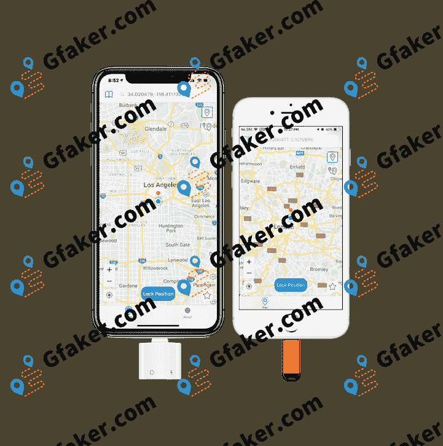
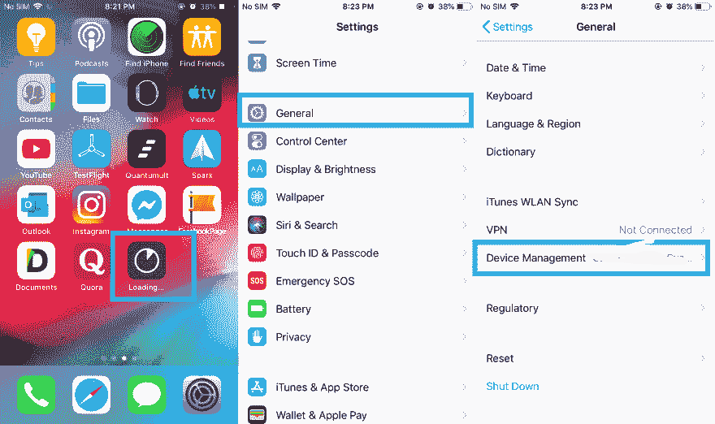
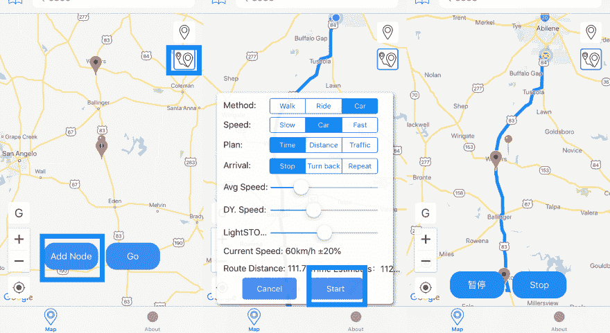

# 如何使用 Gfaker 更改 iPhone GPS 位置——分步指南(2021)

> 原文:[https://dev . to/hilton/2019-how-to-change-iphone-GPS-location-with-g faker-a-step-by-step-guide-2hka](https://dev.to/hilton/2019-how-to-change-iphone-gps-location-with-gfaker-a-step-by-step-guide-2hka)

Gfaker 是一个 iPhone 外部设备，这是一个 iOS 系统级的外部 GPS 修改器，它只需插入 iPhone 就可以更改 iPhone 或 iPad 上所有应用程序的 GPS 位置。
[T3】](https://res.cloudinary.com/practicaldev/image/fetch/s--ET1oeumI--/c_limit%2Cf_auto%2Cfl_progressive%2Cq_auto%2Cw_880/https://thepracticaldev.s3.amazonaws.com/i/puis113n7b0f9ncl5z0j.png)

**工作应用包括:**

**GPS 位置追踪器**:找 iPhone、找朋友、Life360、GeoVilla、谷歌地图、Waze、苹果地图等。
**基于 GPS 的游戏**:口袋妖怪 Go、Ingress、哈利波特巫师联合等。
**拼车或送货应用**:优步、Lyft、Grab、Ola 等。

***该设备安全易用。***
任何时候都不需要越狱，不需要电脑，也不需要使用经过调整的应用。只需插入此设备或通过蓝牙连接设备。没有一个应用程序公司可以检测硬件使用情况。

***GPS 模拟有四个功能。***
1。锁定到特定位置。
2。用谷歌地图自动生成的路线模拟步行、骑自行车或开车的运动。
3。游戏中的定向运动通过倾斜 iOS 设备来控制移动。
4。同一 WiFi 下其他设备(任何 Android/iOS 智能手机、平板电脑或 Windows/Mac 电脑)的内置外部操纵杆。

### 1。如何操作 Gfaker Plus 或 Mini(Lightning Dock)

*   步骤 1:在我们的网站上安装控制应用程序

    *   打开我们提供的页面。
    *   按下安装按钮。
    *   按安装。
    *   回到 iPhone 主屏幕。
    *   正在等待安装过程完成。
*   第二步:打开安装的应用程序

    *   在你的 iPhone 上进入设置-通用-设备管理。
    *   信任企业应用。
    *   回到主屏幕，打开安装的应用程序。
*   第三步:通过 Lightning Dock 连接 Gfaker Plus 或 Mini

    *   通过 Lightning Dock 将 Gfaker 设备与 iPhone 连接。
    *   等待设备激活。
    *   出现“锁定位置”按钮。
*   第四步:尝试更改 iPhone 在地图上的位置

    *   滑动地图以选择您想要的位置。
    *   按下“锁定位置”按钮。
    *   蓝点出现了
    *   现在，您当前的 GPS 位置已成功更改。
*   第五步:在谷歌地图上测试你当前的位置

如果您想将您的位置更改为某个指定的位置。你可以在应用程序上搜索这个位置。

*   步骤 6:在地图上搜索位置名称

    *   键入您想要的职位名称并进行搜索。
    *   按下“锁定位置”。
    *   现在，您当前的 GPS 位置已成功更改。

### 2。Gfaker BW(蓝牙无线)

这款 Gfaker 设备是为了不占用 iOS only Lightning Dock 而打造的。您可以使用电源组或任何其他 USB 坞站(如车载 USB 坞站)为本设备供电。用 iPhone 上的蓝牙连接设备。那就好好享受吧。
[https://www.youtube.com/embed/Y7C8szJ1I6g](https://www.youtube.com/embed/Y7C8szJ1I6g)T2】

### 3。如何用 Gfaker 模拟路线

*   第一步:确定你在路线起点的位置
*   步骤 2:按下路由欺骗按钮
*   步骤 3:在地图上滑动大头针来添加节点。
*   第四步:走！
*   第五步:调整你的动作设置。按开始。
*   尽情享受吧！

官网: [Gfaker](https://www.gfaker.com)