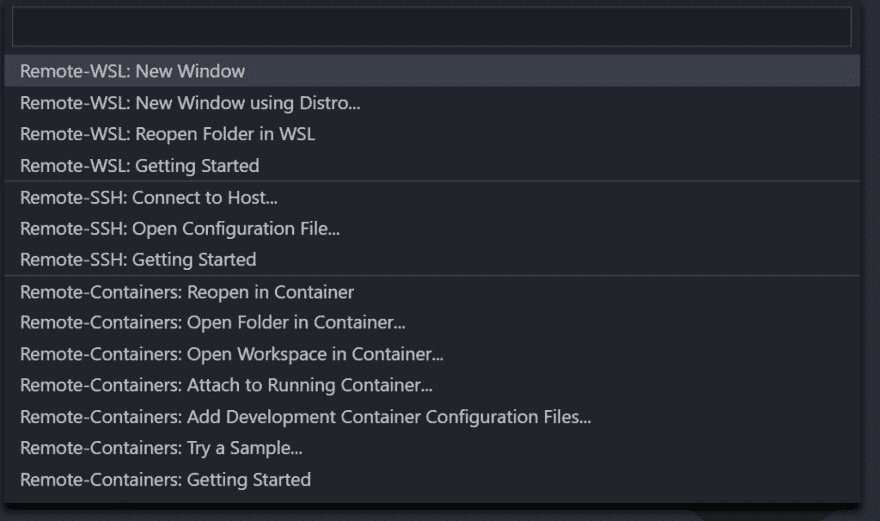
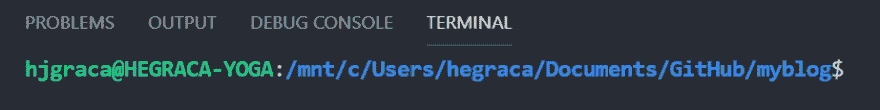

# 在 Windows 10 上使用 WSL2 + Visual Studio 代码编写 Jekyll 博客

> 原文:[https://dev . to/hjgraca/using-wsl 2-visual-studio-code-for-Jekyll-blogging-on-windows-10-516g](https://dev.to/hjgraca/using-wsl2-visual-studio-code-for-jekyll-blogging-on-windows-10-516g)

如果你像我一样，把你的博客放在 GitHub 页面上，你就是在用 Jekyll 作为你的博客生成引擎。原来 Jekyll 不支持 Windows，所以你必须做一些黑客，以使它在 Windows 上工作。在这篇文章中，我将向你展示如何利用 [**WSL2**](https://docs.microsoft.com/en-us/windows/wsl/wsl2-about) 和 Ubuntu 18.04 来安装 Jekyll 并在本地运行你的博客。

### Linux 2 的 Windows 子系统是什么？

Windows Subsystem for Linux (WSL)是 Windows 10 的一项新功能，使您能够直接在 Windows 上运行原生 Linux 命令行工具。

WSL 2 是该体系结构的一个新版本，它支持 Linux 的 Windows 子系统在 Windows 上运行 ELF64 Linux 二进制文件。这种新的架构改变了这些 Linux 二进制文件与 Windows 和计算机硬件的交互方式，但仍然提供了与 WSL 1(当前广泛使用的版本)相同的用户体验。单个 Linux 发行版既可以作为 WSL 1 发行版运行，也可以作为 WSL 2 发行版运行，可以随时升级或降级，并且可以同时运行 WSL 1 和 WSL 2 发行版。WSL 2 使用一种全新的架构，该架构使用真正的 Linux 内核。

如何安装 WSL2 的文档[在这里](https://docs.microsoft.com/en-us/windows/wsl/wsl2-install)

### Visual Studio 远程 WSL

如果您已经安装了 VS 代码，您将需要安装远程 WSL 扩展，这样您就能够在您的 Jekyll 博客所在的 Windows 文件夹中运行 linux 命令和应用程序。

这里的扩展是[这里的](https://marketplace.visualstudio.com/items?itemName=ms-vscode-remote.remote-wsl)

安装完扩展后，你会在 VS 代码的左下方看到一个小图标

<figure> 

<figcaption>VS 代码远程图标</figcaption>

</figure>

在开始远程会话之前，我通常会打开作为博客的文件夹。在 VS 代码中打开文件夹后，单击远程 WSL 图标，出现以下选项:

<figure> 

<figcaption>远程 WSL 选项</figcaption>

</figure>

然后您将选择 **Remote-WSL:在 WSL** 中重新打开文件夹(如果您已经打开了文件夹)。完成所有操作后，图标将变为:

<figure> 

<figcaption>会期成立</figcaption>

</figure>

现在打开终端窗口，你会看到上下文是你的 Ubuntu 机器，文件夹是你的 Jekyll 博客文件夹的挂载

[T2】](https://res.cloudinary.com/practicaldev/image/fetch/s--n1kIHCfm--/c_limit%2Cf_auto%2Cfl_progressive%2Cq_auto%2Cw_880/https://cdn-images-1.medium.com/max/922/1%2AOru1mLVcQqsScP8u5JqbSA.png)

### [T1】在 WSL Ubuntu 18.04 中安装 Jekyll](#installing-jekyll-in-wsl-ubuntu-1804)