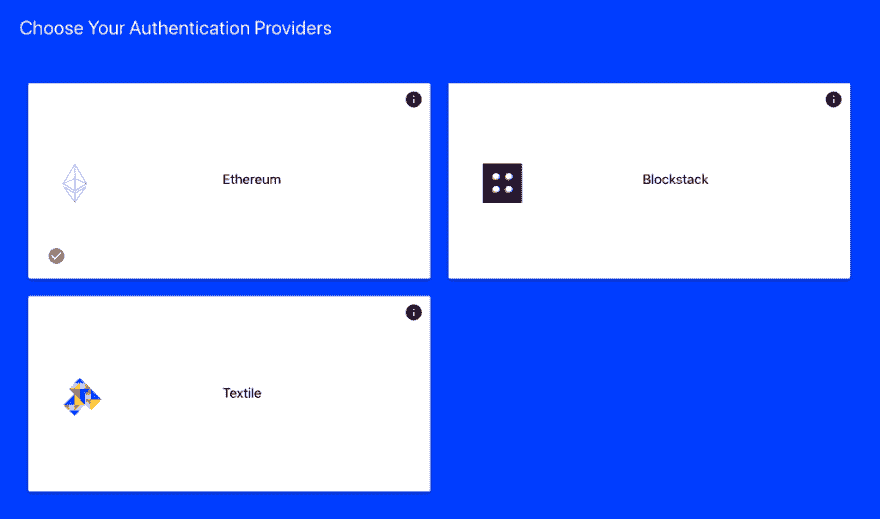
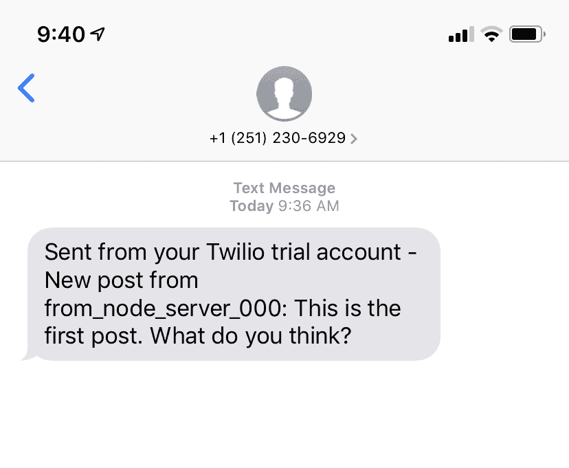

# 教程:如何建立一个 IPFS 和文本通知应用程序

> 原文:[https://dev . to/contaminerofminds/tutorial-how-to-build-an-ipfs-text-notification-app-kil](https://dev.to/polluterofminds/tutorial-how-to-build-an-ipfs-text-notification-app-kil)

<figure>[](https://res.cloudinary.com/practicaldev/image/fetch/s--uB9UhWdK--/c_limit%2Cf_auto%2Cfl_progressive%2Cq_auto%2Cw_880/https://cdn-images-1.medium.com/max/1000/0%2AkeRpS6JiyNSG8MHx) 

<figcaption>照片来自[https://unsplash.com/@hckmstrrahul](https://unsplash.com/@hckmstrrahul)</figcaption>

</figure>

采用新技术的最佳方式是与现有技术相结合。与已知数量的人合作，让用户更容易接触到新事物。因此，本着这种精神，让我们在本教程中将 Web 2.0 技术与 Web 3.0 技术结合起来。

对于本教程，您将使用两个第三方服务: [SimpleID](https://www.simpleid.xyz/?t=txt_tut) 和 [Twilio](https://www.twilio.com/) 。

我们不打算为此应用程序构建前端。相反，我们将设置一个 NodeJS 服务器(当使用 SimpleID 和任何其他需要保护 API 键和秘密的服务时，推荐使用这个服务器)。这个服务器端应用程序将允许用户创建帐户，登录这些帐户，并发布消息。但有一点很有趣:当每条新消息发布后，你会收到一条包含消息内容的短信提醒。您还可以查询发布的消息。

这种类型的功能可以以多种方式使用。我可以把论坛看作一个例子，把博客上的评论看作另一个例子，等等。最终如何使用该功能由您决定，但是在本教程结束时，您将拥有一台能够完成以下任务的服务器:

*   接受获取请求
*   接受发布请求
*   验证请求
*   创建用户会话
*   向 IPFS 发布与特定用户相关的数据
*   从 IPFS 获取数据
*   发送文本提醒

以下是您需要遵循本教程的内容:

*   安装的节点
*   NPM 安装
*   文字编辑器

在开始之前，让我们对这个项目进行更多的规划。我们将需要用户能够张贴原始数据(评论，文本，无论什么)，这是与他们相关联的，但与其他人共享。我们需要能够获取所有这些数据。我们还需要给你，也就是开发者，发送一条文本消息，记录每一条发布的内容。

这并不十分奇特。无线索内容。只是原始资料。

让我们开始吧。你需要注册一个 SimpleID 账户，你可以在这里注册和一个 [Twilio](https://www.twilio.com) 账户，你可以在这里注册。让我们先看看 SimpleID 需要什么。

注册帐户时，会要求您验证您的电子邮件地址。去做吧。验证完成后，您就可以创建项目了。给它一个名称和一个 url，您可以在那里托管这个项目。它需要是一个 https url。这是 SimpleID 的一个安全限制。创建项目后，转到 Modules 页面，为您的身份验证模块选择 Ethereum，为您的存储模块选择 Pinata。保存您的选择，然后返回到帐户页面。在那里，您可以单击查看项目按钮来获得项目所需的两个项目:apiKey 和 devId。

[T2】](https://res.cloudinary.com/practicaldev/image/fetch/s--4qPJA1B8--/c_limit%2Cf_auto%2Cfl_progressive%2Cq_auto%2Cw_880/https://cdn-images-1.medium.com/max/1024/1%2AOls8dqQUoauwE0jkQ0NsrQ.png)

现在这已经完成了，让我们开始与 Twilio 的设置。注册时，你还需要向他们核实你的电子邮件。这样做，然后你需要验证你的手机号码短信。执行此操作时，您应该会收到一条验证文本。在 Twilio 屏幕上的框中输入代码。现在，Twilio 将尝试定制您的入职培训。请继续回答问题，但无论您如何回答，我们都会带您到达您需要去的地方。当你完成这个过程时，你将登陆到你的仪表板，在那里你可以得到一个试用号。这样做是因为它是免费的。暂时把号码记在某个地方。您现在还可以记录帐户 SID 和身份验证令牌。

现在，让我们建立一些东西！

继续，在您喜欢的任何地方创建一个文件夹来保存您的开发项目:

mkdir 文本-注释&& cd 文本-注释

在该文件夹中，让我们通过运行 npm init 来初始化我们的项目。在此过程运行时，您可以接受所有默认值。一旦完成，我们需要安装一些依赖项。

NPM I express simpleid-node-SDK twilio 主体解析器

使用该命令(可能需要一段时间运行),您将安装本项目所需的三个依赖项:

*   ExpressJS —用于我们的服务器
*   简单 cd
*   twilio——发短信
*   body-Parser——用于轻松解析 json 请求

安装完成后，让我们创建一个 index.js 文件。您可以从命令行使用 touch index.js 来完成这项工作。然后，在您最喜欢的文本编辑器中打开您的项目。

我们需要为我们的 Express 服务器设置一些样板文件。所以把这个添加到你的 index.js 文件中:

```
const express = require('express');
const app = express();
const port = 3000;
const bodyParser = require("body-parser");

app.use(bodyParser.json());

app.get('/content', (req, res) => {
  //this is where we will fetch the IPFS content
  res.send('Eventually content will be here')
})

app.post('/auth/create', async (req, res) => {
  //this is where we will create a user account
  res.send("Account Creation Here");
})

app.post('/auth/login', async (req, res) => {
  //this is where we will log a user in
  res.send("Log in Here");
})

app.post('/postContent', async (req, res) => {
  //this is where we will post the IPFS content
  res.send("IPFS Content Posted Here");
})

app.post('/sendText', async (req, res) => {
  //this is where we will trigger the outbound text
  res.send("Text sent here");
})

app.listen(port, () => console.log(`Example app listening on port ${port}!`)) 
```

<svg width="20px" height="20px" viewBox="0 0 24 24" class="highlight-action crayons-icon highlight-action--fullscreen-on"><title>Enter fullscreen mode</title></svg> <svg width="20px" height="20px" viewBox="0 0 24 24" class="highlight-action crayons-icon highlight-action--fullscreen-off"><title>Exit fullscreen mode</title></svg>

有了这些代码，我们现在可以通过调用一些 API 来测试我们的服务器代码。让我们通过打开 package.json 文件并将其添加到脚本部分来轻松启动我们的服务器:

```
"start": "node index.js", 
```

<svg width="20px" height="20px" viewBox="0 0 24 24" class="highlight-action crayons-icon highlight-action--fullscreen-on"><title>Enter fullscreen mode</title></svg> <svg width="20px" height="20px" viewBox="0 0 24 24" class="highlight-action crayons-icon highlight-action--fullscreen-off"><title>Exit fullscreen mode</title></svg>

这样，我们现在可以从命令行运行 npm start 来启动我们的服务器。试一试，您应该会看到命令行打印出来:

```
Example app listening on port 3000! 
```

<svg width="20px" height="20px" viewBox="0 0 24 24" class="highlight-action crayons-icon highlight-action--fullscreen-on"><title>Enter fullscreen mode</title></svg> <svg width="20px" height="20px" viewBox="0 0 24 24" class="highlight-action crayons-icon highlight-action--fullscreen-off"><title>Exit fullscreen mode</title></svg>

您现在有了一个可以测试的工作 API。您可以使用 Postman 或命令行来测试这一点，这取决于您喜欢什么。我将使用 cURL 脚本来简化事情。因此，在你的终端中打开一个新的标签或者窗口，运行这个:

```
curl -X GET \
[http://localhost:3000/content](http://localhost:3000/content) 
```

<svg width="20px" height="20px" viewBox="0 0 24 24" class="highlight-action crayons-icon highlight-action--fullscreen-on"><title>Enter fullscreen mode</title></svg> <svg width="20px" height="20px" viewBox="0 0 24 24" class="highlight-action crayons-icon highlight-action--fullscreen-off"><title>Exit fullscreen mode</title></svg>

你应该得到回应，最终内容会在这里。不错！现在尝试发布请求:

```
curl -X POST \
[http://localhost:3000/auth/create](http://localhost:3000/auth/create)

curl -X POST \
[http://localhost:3000/auth/login](http://localhost:3000/auth/login)

curl -X POST \
[http://localhost:3000/postContent](http://localhost:3000/postContent)

curl -X POST \
[http://localhost:3000/sendText](http://localhost:3000/sendText) 
```

<svg width="20px" height="20px" viewBox="0 0 24 24" class="highlight-action crayons-icon highlight-action--fullscreen-on"><title>Enter fullscreen mode</title></svg> <svg width="20px" height="20px" viewBox="0 0 24 24" class="highlight-action crayons-icon highlight-action--fullscreen-off"><title>Exit fullscreen mode</title></svg>

当您运行其中的每一个时，您应该得到我们作为占位符输入的响应。如果成功了，我们准备开始真正的建造它。我们将直接从 SimpleID 和 Twilio 文档中获取资料来帮助我们。因此，从 SimpleID 配置开始，我们需要将它添加到 index.js 文件的顶部:

```
const simple = require('simpleid-node-sdk');
const config = {
  apiKey: ${yourApiKey}, //found in your SimpleID account page
  devId: ${yourDevId}, //found in your SimpleID account page
  authProviders: ['ethereum'], //array of auth providers that matches your modules selected
  storageProviders: ['pinata'], //array of storage providers that match the modules you selected
  appOrigin: "https://yourapp.com", //even if using SimpleID on a server or as a desktop/mobile app, you'll need to pass an origin for reference
  scopes: ['publish\_data', 'store\_write'], //array of permission you are requesting from the user
  development: false
} 
```

<svg width="20px" height="20px" viewBox="0 0 24 24" class="highlight-action crayons-icon highlight-action--fullscreen-on"><title>Enter fullscreen mode</title></svg> <svg width="20px" height="20px" viewBox="0 0 24 24" class="highlight-action crayons-icon highlight-action--fullscreen-off"><title>Exit fullscreen mode</title></svg>

有了这个配置，您就可以为您的用户创建一个帐户了(只需确保您确实用自己的信息填写了配置)。在您之前创建的/auth/create 端点，我们将获取用户名、电子邮件和密码的有效负载。然后，我们将把它与我们的配置设置结合起来，为用户创建一个分散的标识符(我们将为他们返回一个以太坊地址)。这样，我们就可以让用户登录了(注意:创建一个帐户会自动让用户登录，并返回一个用户会话对象)。

在/auth/create 端点中，让我们替换占位符响应并添加以下内容:

```
app.post('/auth/create', async (req, res) => {
  const { email, id, password } = req.body;
  const credObj = {
    email,
    id,
    password,
    hubUrl: "https://hub.blockstack.org" //this is for blockstack storage, but needs to be sent even when not in use
  }
  const account = await simple.createUserAccount(credObj, config);
  res.send(account);
}) 
```

<svg width="20px" height="20px" viewBox="0 0 24 24" class="highlight-action crayons-icon highlight-action--fullscreen-on"><title>Enter fullscreen mode</title></svg> <svg width="20px" height="20px" viewBox="0 0 24 24" class="highlight-action crayons-icon highlight-action--fullscreen-off"><title>Exit fullscreen mode</title></svg>

这直接来自于 [SimpleID 文档](https://docs.simpleid.xyz)。我们获取用户凭证，将它们与我们的配置对象相结合，并创建一个用户帐户。让我们通过发送 post 请求来测试这一点。首先，我们需要关闭服务器并重启它，这样它就会知道我们的更改。让我们来解决这个问题，因为当我们对代码进行修改时，这个问题会变得非常烦人。

在您终止服务器之后(` ctrl + c 或 cmd+c)，安装 nodemon，如下所示:npm i -g nodemon。然后我们需要做的就是更新 package.json 中的启动脚本:

 ``"scripts": {
"start": "nodemon index.js"
},`` 

 ``现在，运行 npm start，我们不应该不断杀死和重启服务器！

让我们用传递给端点的一些 JSON 数据来测试我们的端点:

 ``curl -X POST \
[http://localhost:3000/auth/create](http://localhost:3000/auth/create) \
-H 'Content-Type: application/json' \
-d '{
"id": ${uniqueUserName},
"email": ${anyEmailAddress},
"password": ${somePassword}
}'`` 

 ``如果您在 uniqueUserName、anyEmailAddress 和 somePassword 中填入自己的值，那么现在您应该能够从服务器获得响应。如果您选择了一个已经存在的用户名，您将得到如下响应:

 ``{
"message": "name taken",
"body": null
}`` 

 ``否则，该过程将一直工作到登录并返回用户会话对象，如下所示:

``
{
"消息": "用户会话已创建"，
"正文":{
" appConfig ":{
" appDomain ":"[https://yourapp.com](https://yourapp.com)"，`

 `///
}
`

 `我在示例中截断了响应，因为考虑到教程的原因，它太长了。但是恭喜你！如果您得到这样的响应，那么您的用户现在已经登录。

但是，如果我们希望该用户再次登录呢？我们不希望他们创建一个新帐户。让我们现在更新我们的/auth/登录端点:

``
app.post('/auth/login '，async (req，res) = > {
const { id，password } = req.body
const credObj = {
id，
密码，
hub URL:"[https://hub.blockstack.org](https://hub.blockstack.org)"
}
const params = {
cred obj，
appObj: config
}`

 `const loggedIn = await simple . log in(params)；

res.send(登录)；
})；
`

 `这里，我们获取了一个包含用户 id 和密码的 JSON 数据。我们将它合并到一个凭证对象中，并将我们的配置对象合并到一个参数对象中。我们将它发送给登录函数以获得我们的响应。让我们来试试:

 ``curl -X POST \
[http://localhost:3000/auth/login](http://localhost:3000/auth/login) \
-H 'Content-Type: application/json' \
-d '{
"id": "from\_node\_server\_000",
"password": "super secure password"
}'`` 

 ``如果成功，您将看到与成功创建帐户帖子结束时相同的回复。消息将是:用户会话已创建。

好了，现在我们有了身份验证，这意味着我们可以开始向 IPFS 发送数据，并将其与登录的用户相关联。让我们从设置我们的/postContent 端点开始。因为我们不是为这个应用程序构建前端，所以我们可以采取几种方法。我们可以在登录或帐户创建时发送一个有效载荷，其中包括用户凭证以及要发布的内容。或者，我们可以从帐户创建或登录中获取响应，保存在某个地方，并使用它将用户与帖子联系起来。

我认为，当像这样的应用程序连接到前端时，第二种选择最有意义。所以，让我们开始吧。在我们的/postContent 端点中，将占位符替换为:

``
app.post('/postContent '，async (req，res) = > {
const { id，ethAddr，content } = req.body
const contentToPin = {
id，
date: Date.now()，【ethAddr，
content

}`

 `const params = {
devId:config . devId，//在您的 SimpleId 帐户页面
中找到的您的开发 Id 用户名:ID，//您登录的用户的用户名
id: "ipfs-text "，//稍后您可以用来引用您的内容的标识符
content: contentToPin，//我们之前讨论的内容
apiKey: config.apiKey，//在您的 SimpleID 帐户页面
中找到的 api 键

const posted content = await simple . pincontent(params)；

RES . send(posted content)；
})
`

 `我们在这里所做的只是获取用户的 id(您可以从您在测试中创建的任何帐户中获取)和用户的以太坊地址。以太坊地址在用户会话对象中返回，可以这样访问:

``
//如果登录
logged in . body . store . session data . wallet . ethaddr`

 `或者

//如果创建新账户
account . body . store . session data . wallet . et addr
`

 `我们试着贴一些内容:

 ``curl -X POST \
[http://localhost:3000/postContent](http://localhost:3000/postContent) \
-H 'Content-Type: application/json' \
-H 'Host: localhost:3000' \
-d '{
"id": ${username},
"ethAddr": ${ethereumAddress},
"content": "This is the first post. What do you think?"
}'`` 

 ``如果成功，您将得到一个表明成功的响应，其中包含一个 IPFS 散列。它应该是这样的:

 ``{
"message": "content successfully pinned",
"body": "QmNZqBFvZq24GuP9H8B3ae1YXAHd8VY8H56PwcWQhrs5Kc"
}`` 

 ``我们现在可以在 IPFS 上查看这些内容。因为我们使用 [Pinata](https://pinata.cloud) 来固定 IPFS 内容(以确保可用性)，所以我们将使用他们的 IPFS 网关来获取这个例子。你可以在这里看到它。

相当酷！现在，我们需要向您，即开发者发送一条关于发布新内容的文本警报。输入 Twilio。

在 index.js 文件的顶部，添加以下内容:

 ``const accountSid = ${yourAccountSID};
const authToken = ${yourAuthToken};
const client = require('twilio')(accountSid, authToken);`` 

 ``您的 accountSid 和 authToken 是在您创建 Twilio 帐户时生成的。只需将它们插入此处，然后我们就可以专注于/sendText 端点了。我们需要获取帖子的内容，并通过文本发送出去。或者至少通过文本发送一些版本。让我们填写端点代码，然后我们可以考虑如何发布到该端点。将/sendText 终结点中的占位符代码替换为:

``
app.post('/sendText '，async (req，res) = > {
const { content，from } = req.body`

 `client.messages
创建({
正文:`New post from ${from}: ${content}`，
from: ${yourTwilioNumber，
to:$ { your actual number
})
。然后(message =>RES . send(message))；
})；
`

 `因此，这个端点现在需要一个 JSON 有效负载，其中包括帖子的内容和发帖子的人。该信息随后作为 Twilio 文本的主体发送。您需要获取免费试用 Twilio 时获得的电话号码，并将其插入 from 字段。假设你想成为接收这些信息的人，在“收件人”字段中输入你的电话号码。

现在的问题是，我们如何发布到这个端点？我们希望它在 IPFS 的内容发布后立即发生。因此，在端点响应中调用/发送文本端点是有意义的。但是为什么/sendText 还要有一个单独的端点呢？难道我们不能将 Twilio 代码转储到/postContent 端点中吗？

我们可以，但是如果我们希望在一些内容被以某种方式操纵后能够发送文本呢？也许在客户端，在内容被发布到 IPFS 后会有一些交互，然后我们想调用/sendText 端点。通过将它作为一个独立的端点，我们给了自己灵活性，即使我们今天不会使用这种灵活性。

为了从/postContent 端点的响应中发送到/sendText 端点，我们将使用请求模块。我们可以通过终止服务器并运行 npm i 请求来安装它。

在 index.js 文件的顶部，添加:

 ``const request = require('request');`` 

 ``现在，在我们的/postContent 端点内部，让我们更新 const posted content = await simple . pincontent(params)下面的代码:

``
///
const postData = {
from:params . username，
content:params . content . content
}`

 `var options = {
method: 'POST '，
URL:'[:http://localhost:3000/send text](http://localhost:3000/sendText)'，
headers:{
Host:' localhost:3000 '，
' Content-Type ':' application/JSON ' }，
body: postData，
JSON:true }；

请求(选项、功能(错误、响应、正文){

if (error)抛出新的错误(Error)；
console . log(body)；
})；
///
`

 `让我们现在试试这个。如果一切顺利，内容将被发布到 IPFS，然后我们会收到一个文本。下面是 curl 再次发送给 IPFS 的命令:

 ``curl -X POST \
[http://localhost:3000/postContent](http://localhost:3000/postContent) \
-H 'Content-Type: application/json' \
-H 'Host: localhost:3000' \
-d '{
"id": ${username},
"ethAddr": ${ethereumAddress},
"content": "This is the first post. What do you think?"
}'`` 

 ``如果你愿意，你可以改变内容。我离开我的是为了简单。试一试，您应该会收到类似这样的文本:

[T2】](https://res.cloudinary.com/practicaldev/image/fetch/s--LuJ04CU0--/c_limit%2Cf_auto%2Cfl_progressive%2Cq_auto%2Cw_880/https://cdn-images-1.medium.com/max/828/1%2A5MoExIHIvTvVTc3F5Fei9A.png)

厉害！我们刚刚使用 web2 和 web3 技术的组合构建了一个非常简单的通知系统。我们要做的最后一件事是列出给定用户的所有帖子。为此，我们可以使用之前创建的 GET 端点/内容。在 index.js 文件中找到它，并将占位符替换为:

``
app.get('/content '，async (req，RES)=>{
const username = req . query . username；
const params = {
devId:config . devId，//在您的 SimpleID 帐户页面中找到您的开发 ID
用户名:${username}，//您登录的用户的用户名
id: "ipfs-text "，//您用于引用固定内容的标识符
api key:config . API key//在您的 SimpleID 帐户页面中找到的 API 键
}`

 `const fetchedContent = await simple . fetchpinnedcontent(params)；
RES . send(fetched content)；
})；
`

 `确保传入您想从中获取帖子的用户名，填写您的其他参数，然后让我们试一试:

 ``curl -X GET \
'[http://localhost:3000/content?username=${username}'](http://localhost:3000/content?username=from_node_server_000') \`` 

 ``注意，我们将用户名作为查询字符串参数传入。我们在/content 端点的顶部添加了一行代码，这将在服务器上进行处理:

 ``const username = req.query.username;`` 

 ``您应该得到这样的回应:

 ``{
"message": "Found pinned content",
"body": "{\"id\":\"from\_node\_server\_000\",\"date\":1567694211655,\"address\":\"0x91702078DeA9D1d9354467F58E0225AD2C8445Ab\",\"content\":\"This is the first post. What do you think?\"}"
}`` 

 ``就是这样！我们刚刚构建了一个支持以太坊认证、IPFS 内容存储和检索以及文本消息的服务器端应用程序。如果你想看完整的源代码，可以在这里找到。

凭借您新获得的能力，您现在可以将其连接到前端应用程序，并创造性地使用它。您可以也应该对服务器代码进行一些增强。现在，您的服务器路由不受保护。任何人都可以向他们提出请求。您可能希望基于 IP 地址进行节流，以帮助避免 DOS 攻击。你可能想要一些你要找的不记名令牌。从这里开始，您可以做很多事情来改进您的代码。但是，请欣赏这样一个事实:您构建了一个非常复杂的应用程序，其实现实际上非常简单。

* * *``````````````````````````````````````