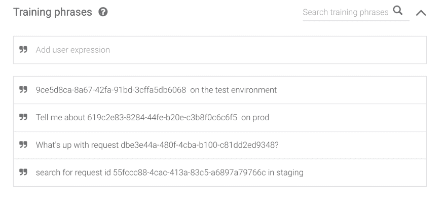
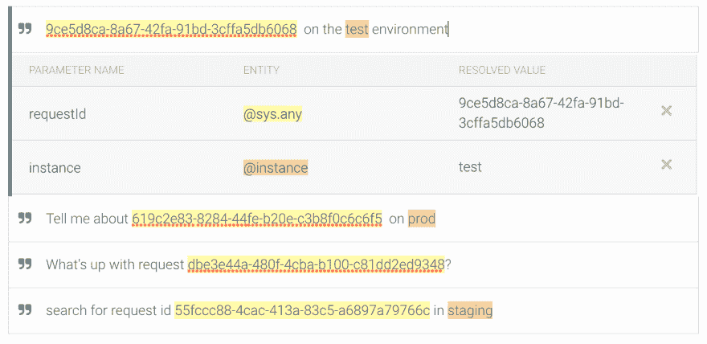
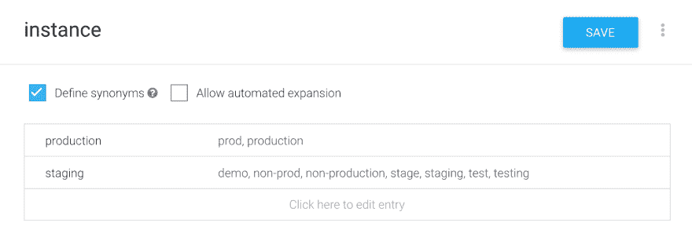
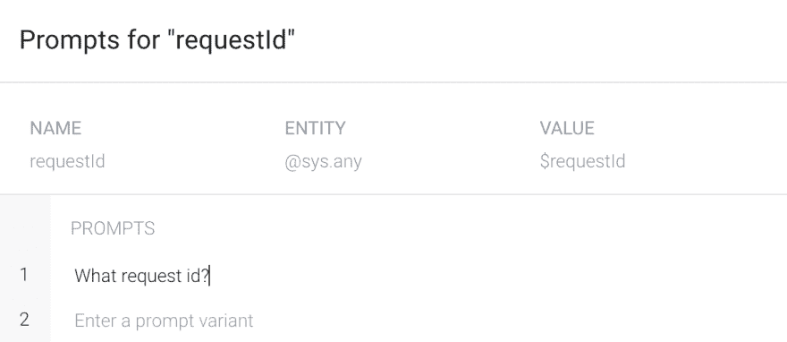
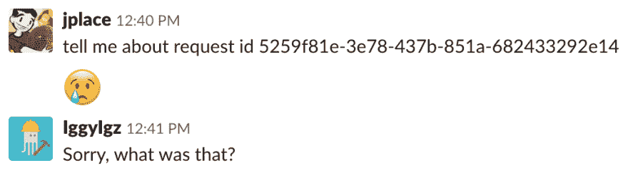
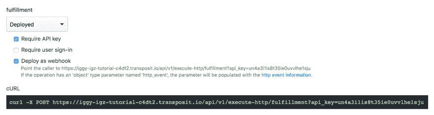
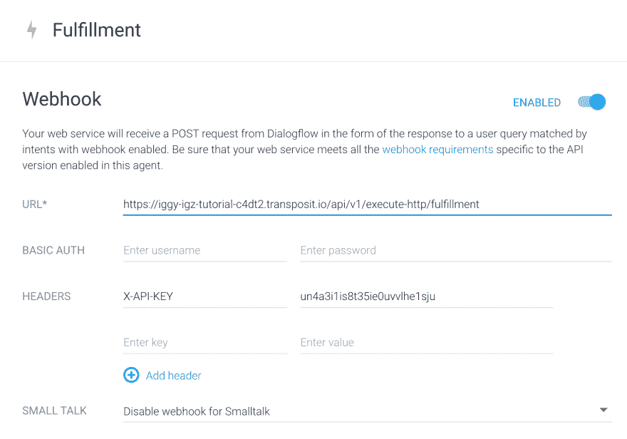
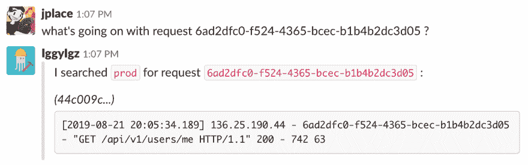

# 构建一个我一直用在 Dialogflow 上的对话松弛机器人

> 原文:[https://dev . to/j place/building-a-conversation-slack-bot-I-use-all-the-time-with-dialog flow-4i8a](https://dev.to/jplace/building-a-conversational-slack-bot-i-use-all-the-time-with-dialogflow-4i8a)

当生产出现问题时，我渴望调查。我喜欢调试，狩猎开始了。但是，几乎每次，我的动力都被同一个敌人所阻碍:AWS CloudWatch UI。

没有什么委婉的说法——我真的不擅长 CloudWatch UI。在浏览它的过程中有很多“陷阱”!我一直对日志过滤语法感到惊讶。当我打算使用本地时间时，我通过 UTC 时间戳来查找日志。我无意中为图表选择了误导性的坐标轴(然后盯着它们看了太久)。尽管练习了多年，我的 CloudWatch 曲目仍然有限。

我想知道，更好的 CloudWatch 体验会是什么样的？嗯，实习生帮我用一下 UI 怎么样？我可以问他们这样的问题:

*   "嘿，获取请求 id db E3 e 44 a-480 f-4c ba-b100-c 81 DD 2 ed 9348 的堆栈跟踪."
*   "告诉我昨晚 5-6 点之间的请求数量."
*   "你给我端上咖啡后，看看这个错误昨天发生了多少次."

对他们来说幸运的是，我们的实习生从事更重要的项目。事实证明，我可以通过一些自动化和 [NLP](https://en.wikipedia.org/wiki/Natural_language_processing) 获得同样的体验。在 Transposit 中花了几个小时的实验，产生了我的调试 Slack bot，IggyIgz。

IggyIgz 使用 [Dialogflow](https://dialogflow.com/) ，所以我可以和它聊天，而不是把它当成一个美化的 CLI。它使用 Transposit 从 CloudWatch 拉数据，所以我们的对话实际上是有用的(抱歉 SmarterChild)。我开始在 Slack 中调试，只有在紧急情况下才会升级到 CloudWatch UI。完美。

在这篇博文的剩余部分，我将介绍我是如何构建 IggyIgz 的。以此为路线图，为您自己的数据构建一个有用的 NLP 聊天机器人。

## [](#dialogflow)安静

Dialogflow 是一个构建对话界面的平台。你给它传递自然语言输入，训练它理解一系列意图。

IggyIgz 是一个只理解一个意图的代理:通过 requestId 搜索 CloudWatch 日志。这个意图需要两个参数:

*   `requestId` -查找此 HTTP 请求的日志语句
*   `instance` -搜索“暂存”或“生产”日志流

首先，我写下了我认为应该表明这一意图的短语。我对它们进行了注释，以训练我的代理解析参数。

[T2】](https://res.cloudinary.com/practicaldev/image/fetch/s--PY1stPNr--/c_limit%2Cf_auto%2Cfl_progressive%2Cq_auto%2Cw_880/https://www.transposit.com/blog/img/2019.08.29a.png)

[T2】](https://res.cloudinary.com/practicaldev/image/fetch/s--1hndbkdL--/c_limit%2Cf_auto%2Cfl_progressive%2Cq_auto%2Cw_880/https://www.transposit.com/blog/img/2019.08.29b.png)

Dialogflow 给了我对参数的细粒度控制。我可以教我的代理理解同义词、假定默认值，甚至在聊天消息中遗漏了一个必需的参数时进行跟进。

[T2】](https://res.cloudinary.com/practicaldev/image/fetch/s--F_9kFe3R--/c_limit%2Cf_auto%2Cfl_progressive%2Cq_auto%2Cw_880/https://www.transposit.com/blog/img/2019.08.29c.png)

[T2】](https://res.cloudinary.com/practicaldev/image/fetch/s--lQrejPU_--/c_limit%2Cf_auto%2Cfl_progressive%2Cq_auto%2Cw_880/https://www.transposit.com/blog/img/2019.08.29d.png)

我用 Dialogflow 的 Slack 集成把我的代理暴露为一个 Slack bot。我可以用 DM @IggyIgz 来测试解析。收到的每条消息都被保存为训练数据，因此我可以纠正错误以改进代理。

## [](#transposit)换位

在大约 100 条训练消息之后，我的 Slack 机器人可靠地理解了我。但它还不知道如何应对。

[T2】](https://res.cloudinary.com/practicaldev/image/fetch/s--MVLH5oyS--/c_limit%2Cf_auto%2Cfl_progressive%2Cq_auto%2Cw_880/https://www.transposit.com/blog/img/2019.08.29e.png)

为了让它响应，我配置了一个 Dialogflow webhook 来调用 Transposit 以实现意图。

[T2】](https://res.cloudinary.com/practicaldev/image/fetch/s--jq40XXTh--/c_limit%2Cf_auto%2Cfl_progressive%2Cq_auto%2Cw_880/https://www.transposit.com/blog/img/2019.08.29f.png)

[T2】](https://res.cloudinary.com/practicaldev/image/fetch/s--gNvbIJ3_--/c_limit%2Cf_auto%2Cfl_progressive%2Cq_auto%2Cw_880/https://www.transposit.com/blog/img/2019.08.29g.png)

我用一个简单的 webhook 进行了测试，它与 Slack 相呼应。我的机器人工作了！

```
// fulfillment
({ http_event }) => {
  return {
    status_code: 200,
    headers: { "Content-Type": "application/json" },
    body: {
      payload: {
        slack: {
          text: `\`\`\`${JSON.stringify(http_event.parsed_body, null, 2)}\`\`\``
        }
      }
    }
  };
}; 
```

[T2】](/blog/img/2019.08.29h.png)

作为最后一步，我修改了 webhook 来按照用户的意图来操作。我使用我们的 [AWS CloudWatch 数据连接器](https://www.transposit.com/docs/references/connectors/aws-cloudwatch-logs-documentation/)来查询日志。SQL 是通过 requestId 查找日志组和过滤日志语句的最简单的方法。

```
-- describe_log_groups
SELECT * FROM aws_cloudwatch_logs.describe_log_groups
-- ---->
-- [
--   {
--     "arn": "arn:aws:logs:us-west-2:967604848322:log-group:/aws/ecs/staging/web:*",
--     "creationTime": 1554959217198,
--     "logGroupName": "/aws/ecs/staging/web",
--     "metricFilterCount": 15,
--     "storedBytes": 892687097
--   },
--   ...
-- ] 
```

```
-- describe_log_streams
SELECT logStreamName FROM aws_cloudwatch_logs.describe_log_streams
  WHERE $body.logGroupName="/aws/ecs/" + @instance + "/web"
  AND $body.orderBy="LastEventTime"
  AND $body.descending=TRUE
  LIMIT 1 
```

```
-- filter_log_events
SELECT * FROM aws_cloudwatch_logs.filter_log_events
  WHERE $body.logGroupName="/aws/ecs/" + @instance + "/web"
  AND $body.filterPattern='"' + @requestId + '"'
  AND $body.logStreamNames = (
    SELECT [logStreamName] FROM this.describe_log_streams
      WHERE instance = @instance
  ) 
```

我使用 JavaScript 将这些数据格式化为 Slack 消息，并通过 Dialogflow 发布响应。

```
// fulfillment
({ http_event }) => {
  const parsed_body = http_event.parsed_body;
  const intent = parsed_body.queryResult.intent.name;
  const parameters = parsed_body.queryResult.parameters;

  // fetch logs from AWS
  const log_events = api.run("this.filter_log_events", {
    instance: parameters.instance,
    requestId: parameters.requestId
  });

  // format a message for slack
  const message = [
    {
      type: "section",
      text: {
        type: "mrkdwn",
        text: `I searched \`${parameters.instance}\` for request \`${parameters.requestId}\` :`
      }
    }
  ];
  if (log_events.length === 0) {
    message.push({
      type: "section",
      text: {
        type: "mrkdwn",
        text: "_No logs matched_  :cry:"
      }
    });
  }
  for (const log_event of log_events) {
    const short_log_stream_name = log_event.logStreamName.substring(0, 7);
    const log_message = log_event.message;
    message.push({
      type: "section",
      text: {
        type: "mrkdwn",
        text: `_(${short_log_stream_name}...)_\n\`\`\`${log_message}\`\`\``
      }
    });
  }

  // post message to slack
  return {
    status_code: 200,
    headers: { "Content-Type": "application/json" },
    body: {
      payload: {
        slack: {
          attachments: [
            {
              blocks: message
            }
          ]
        }
      }
    }
  };
}; 
```

我提交了我的代码，我的 Slack bot 开始工作了！

[T2】](https://res.cloudinary.com/practicaldev/image/fetch/s--Gk3JayM1--/c_limit%2Cf_auto%2Cfl_progressive%2Cq_auto%2Cw_880/https://www.transposit.com/blog/img/2019.08.29i.png)

## [](#next-steps)下一步

除了我在这里概述的，还有很多方法可以让 IggyIgz 成为最好的 CloudWatch 体验。

### [](#teach-new-intents)传授新的意图

教 IggyIgz 接管更多 CloudWatch 的繁琐:

*   在一个时间范围内搜索 CloudWatch 日志
*   检查日志语句的频率
*   绘制云观察指标图

在 Dialogflow 中创建每个新意图。然后，用 Transposit 编写代码来实现它们。

### [](#improve-responsiveness)提高反应能力

当 IggyIgz 需要一点时间来回应时，让它发布一条简短的消息:“稍等一下！让我看看……”

使用我们的 Slack 数据连接器发布一个短暂的消息,而不是通过 Dialgflow 进行响应。这会让你更好地控制对话。

### [](#post-interactive-messages)发布互动消息

让 IggyIgz 在执行特别昂贵的 CloudWatch 查询之前请求批准。

在 Slack 中发布一条[交互消息](https://api.slack.com/messaging/interactivity)，给用户一个明确的是/否界面。

## [](#build-your-own-iggyigz)打造自己的 IggyIgz

我为自己的特定需求构建了 IggyIgz，所以它与 Transposit 的 AWS 基础设施紧密相关——这就是它有用的地方。要构建您自己的 bot，请派生我的代码并针对您自己的基础架构进行调整！[从这里开始](https://console.transposit.com/t/transposit-sample/iggy_igz?readme=true)。