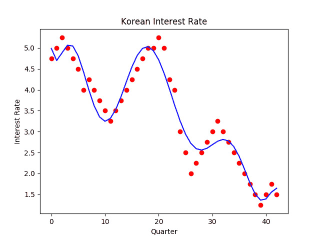

# 用 Python 实现多项式回归

> 原文:[https://dev . to/codesharedot/polynomial-regression-with-python-2470](https://dev.to/codesharedot/polynomial-regression-with-python-2470)

回归是一种观察趋势和进行预测的方法。如果您有 X 个数据点，您希望找到紧密遵循该模式的 Y 线。

让我们从韩国中央银行收集数据(利率)。你可以在这里拿到那些东西。

我们将使用 [Python 编程](https://pythonbasics.org/)语言。

然后我们用 sklearn 加载多项式。Numpy 来处理数据。Matplotlib 用于绘制数据点和直线。

您可以复制下面的(快速和肮脏)代码:

```
#!/usr/bin/python3
from sklearn.preprocessing import PolynomialFeatures
from sklearn import linear_model
from sklearn.linear_model import LinearRegression
from sklearn.model_selection import train_test_split 
import numpy as np
import matplotlib.pyplot as plt

y = [
    4.75,
    5.00,
    5.25,
    5.00,
    4.75,
    4.50,
    4.00,
    4.25,
    4.00,
    3.75,
    3.50,
    3.25,
    3.50,
    3.75,
    4.00,
    4.25,
    4.50,
    4.75,
    5.00,
    5.00,
    5.25,
    5.00,
    4.25,
    4.00,
    3.00,
    2.50,
    2.00,
    2.25,
    2.50,
    2.75,
    3.00,
    3.25,
    3.00,
    2.75,
    2.50,
    2.25,
    2.00,
    1.75,
    1.50,
    1.25,
    1.50,
    1.75,
    1.50
    ]    

X = np.array(range(0,len(y))).reshape(-1,1)
Y = np.array(y).reshape(-1,1)

print(X)
print(y)
print(len(X[0]))
print(len(y))

from sklearn.preprocessing import PolynomialFeatures
poly_reg = PolynomialFeatures(degree=9)
X_poly = poly_reg.fit_transform(X)
pol_reg = LinearRegression()
pol_reg.fit(X_poly, y)

# Visualizing the Polymonial Regression results
def viz_polymonial():
    plt.scatter(X, y, color='red')
    plt.plot(X, pol_reg.predict(poly_reg.fit_transform(X)), color='blue')
    plt.title('Korean Interest Rate')
    plt.xlabel('Quarter')
    plt.ylabel('Interest Rate')
    plt.show()
    return
viz_polymonial() 
```

这将使直线符合数据点。您可以选择多项式的次数。你要防止过度拟合和拟合不足。

[T2】](https://res.cloudinary.com/practicaldev/image/fetch/s--tLUq-9D7--/c_limit%2Cf_auto%2Cfl_progressive%2Cq_auto%2Cw_880/https://thepracticaldev.s3.amazonaws.com/i/qwx9moyyy5tpxiwozx5s.png)

相关链接:

*   [多项式回归](https://pythonbasics.org/polynomial-regression-in-python/)
*   [Python 教程](https://pythonbasics.org/)
*   [Sklearn 模块](https://scikit-learn.org/stable/index.html)