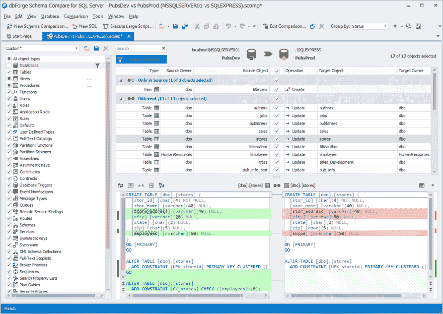

# 针对 SQL Server 的 dbForge 比较包的重大更新

> 原文:[https://dev . to/devart software/a-huge-update-of-dbforge-compare-bundle-for-SQL-server-2jfm](https://dev.to/devartsoftware/a-huge-update-of-dbforge-compare-bundle-for-sql-server-2jfm)

*Devart 推出了新版本的 db forge Compare Bundle for SQL Server，其中包括全新的和显著改进的核心特性。*

[T2】](https://res.cloudinary.com/practicaldev/image/fetch/s--ov69dkh7--/c_limit%2Cf_auto%2Cfl_progressive%2Cq_auto%2Cw_880/https://i.ibb.co/kJ0TNXf/a-variety-of-supported-schema-objects-1.png)

Devart 是一家公认的数据库工具和数据连接解决方案软件供应商，它对其 SQL Server 比较工具包进行了重大更新。针对 SQL Server 的 **dbForge Compare Bundle，v. 5.8** 的发布为其组件[db forge Schema Compare for SQL Server](https://www.devart.com/dbforge/sql/schemacompare/)和[db forge Data Compare for SQL Server](https://www.devart.com/dbforge/sql/datacompare/)带来了众多更新。

模式比较包括以下主要更新:

**-对象过滤器**-此新功能允许在比较文档中过滤对象。该功能还允许应用多个过滤器和创建自定义过滤器与过滤器编辑器，可以保存；
**-对象文本区分控件(重新设计)**-获得区分高亮的着色模型；
**-HTML 中的模式比较报告(重新设计)**-现在除了关于对象的信息之外，还包括实际的脚本差异；
**-** 生成比较报告窗口&模式比较 MS SSMS 插件窗口也被重新设计。

新版数据比较包括:

**-数据比较控件(重新设计)**-网格的选项卡变得更加丰富，突出显示了更加清晰的数据差异；
**-CSV 格式的数据对比报告(重新设计)**-现在可以生成多个 CSV 格式的报告文件。其中一个包含汇总结果，其余的文件包含特定的数据 diffs info
**-** 生成比较报告窗口&数据比较 SSMS 插件窗口也被重新设计。

无论这些工具是如何下载的，无论是单独下载还是捆绑下载，所有更新的功能都将可用。请访问 Devart 的博客文章[https://blog . Devart . com/a-new-look-of-differences-in-compare-bundle . html](https://blog.devart.com/a-new-look-of-differences-in-compare-bundle.html)了解更多关于最新版本的信息

**关于德瓦特**

Devart 是数据库工具和管理软件、ALM 解决方案、各种数据库服务器的数据提供商、数据集成和备份解决方案的领先开发商之一。该公司还实施网络和移动开发项目。
欲了解更多关于德瓦特的信息，请访问[https://www.devart.com/](https://www.devart.com/)