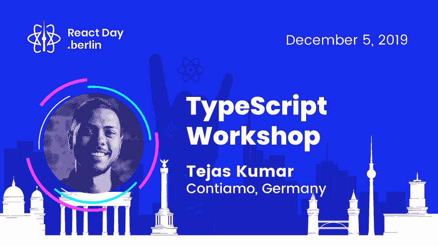
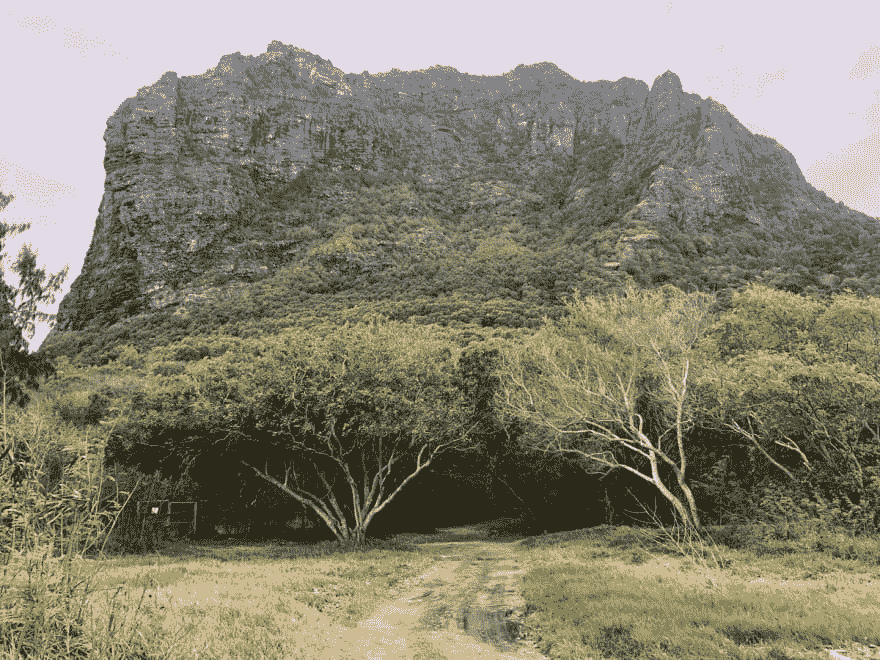
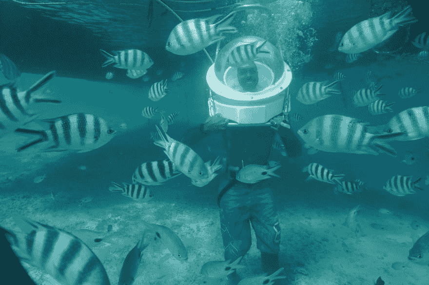

# Tejas Kumar:作为一个前端领导者意味着鼓励我的团队做令人难以置信的工作

> 原文:[https://dev . to/git nation/tejas-Kumar-being-a-frontend-lead-mean-increasing-my-team-do-incredible-work-4j 49](https://dev.to/gitnation/tejas-kumar-being-a-frontend-lead-means-encouraging-my-team-to-do-incredible-work-4j49)

### 我们采访了 Tejas Kumar，他是 [Contiamo](https://www.contiamo.com) 的一名前端主管，也是 [add-gitignore](https://github.com/TejasQ/add-gitignore) 和 [restful-react](https://github.com/contiamo/restful-react) 的作者

Tejas Kumar 在 15 岁时开始了他的 web 开发生涯。后来他为了工作从卡塔尔移民到德国，并一直呆在那里。在这次采访中，他分享了他与自己的健康、自我形象和冒名顶替综合症进行终生斗争的鼓舞人心的故事。他还谈到了他最喜欢的技术栈，他维护的 OSS 项目，以及社区的重要性。Tejas 于 2019 年 12 月 5 日至 6 日在柏林举行的 [React Day 上发表演讲并教授研讨会。](https://reactday.berlin/?utm_source=devto&utm_medium=blogpost&utm_campaign=interview)

[T2】](https://res.cloudinary.com/practicaldev/image/fetch/s--fku7qq6D--/c_limit%2Cf_auto%2Cfl_progressive%2Cq_66%2Cw_880/https://thepracticaldev.s3.amazonaws.com/i/qsqgw8t46g93mh7sf5m8.gif)

#### 你好，Tejas，欢迎来到《柏林反应日》的访谈节目！请分享你的故事。

我从小就是一个生病的孩子。我不被允许做需要大量身体运动的事情，比如上下楼梯或背着书包去学校。因此，我唯一能做的事情就是在电脑上玩。最终，我哥哥向我展示了一些编程代码，用文本从无到有地创造一些东西的想法真的打动了我。从那里，我开始写代码。当时我 8 岁。

[https://www.youtube.com/embed/TUIcTl9Hto4](https://www.youtube.com/embed/TUIcTl9Hto4)

#### 你是出生在德国还是从其他地方移居到德国的？

我在卡塔尔长大。当我还是个孩子的时候，我们家奇迹般地搬到了那里。原来，在那里可以免费获得维持我生命所需的药物(在其他国家，包括我的出生国，每周大约花费 1 万欧元)。最终，我为了工作搬到了德国。

从卡塔尔保守的伊斯兰文化到德国，这是一个巨大的文化冲击。此外，根据当地的一项调查，三分之一的柏林人没有可以称之为“朋友”的人——只有同事。搬到这里非常孤独和困难，尽管我设法在柏林马鞍峰找到了一个很好的社区——其中许多人现在是我的朋友。

#### 能否请你至少简要地描述一下你在[康蒂雅莫](https://www.contiamo.com)目前职位上的工作经历？

我很早就开始了我的“职业生涯”——15 岁时成为卡塔尔大学的初级 Web 开发人员。从那以后，我在 17 岁时继续为我的高中开发网站，并最终在卡塔尔一家令人惊叹的创意公司找到了一份工作。我是数字团队的一员。

最终，在从 Grow 令人难以置信的团队学到很多东西后，我搬到了德国，主要是为了更好的医疗前景，但也是为了在一家名为 McMakler 的初创公司工作，在那里我是前端团队的负责人。在那里，我从其他工程师那里学到了很多东西——特别是阿德里安·胡米纽克和 T2·萨奇塔南德。我最终以同样的职位加入了 Contiamo，但面临更大的技术挑战。

#### 你目前的专业领域是什么？

我目前的专业领域是学习和交流。我的技术不如软技能强。

#### 你最喜欢的技术栈是什么，为什么？

我最喜欢的技术堆栈是:React、TypeScript 和 GraphQL，在一个无服务器的架构中，带有一个智能 ORM，有点像 Hasura 的路线，因为这些技术提供了重要的安全保证，同时通过相当直接和声明性的方式保持了对日常开发人员的“连接”感。特别是 React，不要试图做太多，而是做一件事，并且做好。

[https://www.youtube.com/embed/lKG3nYpPgtM](https://www.youtube.com/embed/lKG3nYpPgtM)

#### 做前端领导意味着什么？

在 Contiamo 做一个前端领导，或者在任何地方做一个领导，意味着做一个仆人。这意味着授权给我的团队，鼓励他们做令人难以置信的工作。这比我之前想的要简单得多，它涉及到对我的团队有一种深刻的、真实的兴趣，并且真诚地关心他们的灵魂。这是我每天努力做到最好的事情。技术方面的东西在后面。

#### 您是否维护任何 OSS 项目？

我确实维护着我自己的 ( `add-gitignore`等)的一些 [OSS 项目，它们相对较小，不需要很多维护。为了工作，我主要维护`contiamo/restful-react`和`contiamo/operational-ui`。我没有计算我所有的贡献，因为我只是为了好玩。](https://github.com/tejasq)

#### 描述几个你最自豪的项目…

我参与的很多项目都让我很开心。我认为`add-gitignore`就是其中之一。这是一个简单的项目，它自动化并简化了开发人员在每一个绿地项目中重复的事情。这一个帮助通过使过程互动和有趣。

我喜欢的另一个项目是`restful-react`。我写它是因为我们想在我的工作中[标准化我们跨产品的数据获取。让我们在这里把功劳归于作者:](https://github.com/contiamo/restful-react)

最终，我那令人难以置信的同事兼朋友[杨奇煜·伯纳德](https://twitter.com/fabien0102)添加了一个类型声明生成器，它读取 OpenAPI/Swagger 定义并输出现成的类型安全的 React 组件！这是我很自豪的事情，我将在柏林的[反应日谈论它。](https://reactday.berlin)

[https://www.youtube.com/embed/IPEzwWt4adY](https://www.youtube.com/embed/IPEzwWt4adY)

#### 近年来你做过哪些讲座？

近年来，我谈到了社区、JavaScript 和设计系统。到目前为止，我认为我最喜欢的一次演讲是在芬兰举行的。这很有趣，它传递了我知道人们已经在使用的技术理念，这是一个小型的家庭式会议。那是一段美好的时光。

#### 为什么你认为在社区内参加和组织会议很重要？

我认为参加和组织这样的会议是很重要的，这样可以把人们聚集在一起，交流思想，产生一种社区感和归属感。毕竟我们在一起都更好。

#### 你的社区中有激励你的人吗？

我尤其钦佩昆西·拉森和 T2，他们让尽可能多的人能够接触到代码。

此外，社区中有些人是我真正的兄弟姐妹——看着他们为社区工作和服务总能激励我。举几个例子， [@cassidoo](https://twitter.com/cassidoo) 、 [@mweststrate](https://twitter.com/mweststrate) 、 [@left_pad](https://twitter.com/leftpad) 和 [@gabe_g2i](https://twitter.com/gabe_g2i) 是我寻找真正灵感的人。

#### 你如何保持工作与生活的平衡？

为了工作，我经常忽视自己的身体健康，结果是我觉得自己很失败，变得越来越胖——在很多层面上，我讨厌自己在镜子里看到的东西。我认为保持健康的工作与生活的平衡非常重要，这有助于我保持良好的状态，并时刻注意我做这些事情的原因和目的，而不会偏离正题。

> Tejas Kumar[@ tejaskumar _](https://dev.to/tejaskumar_)今天爬了一座山。2019 年 9 月 02 日下午 19:01

#### 你有没有遇到过类似“冒名顶替综合症”的情况，如果有，你是如何克服的？

我肯定与冒名顶替综合症作过斗争，现在仍然如此，因为我没有接受过计算机科学方面的正规教育。我还没有克服它，但是让我意识到我可以用自己的方式贡献一些东西来增加价值。

#### 你有什么爱好吗？它们是什么？

我喜欢大自然。运动、游泳、爬山、骑自行车——所有这些都让我快乐。我也是音乐人！我弹吉他和唱歌。最近，我是一个新丈夫。我的头号爱好是我的妻子。

> 特哈斯库马尔[@特哈斯库马尔 _](https://dev.to/tejaskumar_)14:41pm-04 Sep 2019

#### 对于即将在柏林召开的会议，你感到兴奋吗？你将谈论什么，你对这次活动有什么期望？

我很兴奋！我要说的是我们的 OpenAPI/Swagger 代码生成器！我的期望是至少 20，000 互联网点。开玩笑的。我没有期望；我只是希望能玩得开心！

* * *

### [预订 React 日柏林的一个名额](https://reactday.berlin/?utm_source=devto&utm_medium=blogpost&utm_campaign=interview)

[https://www.youtube.com/embed/GGY_WSFlkNI](https://www.youtube.com/embed/GGY_WSFlkNI)

* * *

来自[Soshace.com](https://soshace.com/)的文案玛丽娜·沃龙索娃协助准备了这次采访。Soshace 是一个招聘网站开发者的平台:[招聘一个开发者](https://soshace.com/jobs)或者[申请一个远程工作](https://soshace.com/developers)。

* * *

## 关于 GitNation

GitNation 是一个通过组织关注开源软件的活动来促进技术发展的基金会。我们组织有意义且有趣的 JavaScript 会议，将有才华的工程师、研究人员和重要库和技术的核心团队联系起来。

除了提供[单个会议门票](https://gitnation.org/#events)，该组织还出售 GitNation Multipass，提供对多个[远程 JavaScript 会议和研讨会](https://portal.gitnation.org/multipass)的折扣访问。