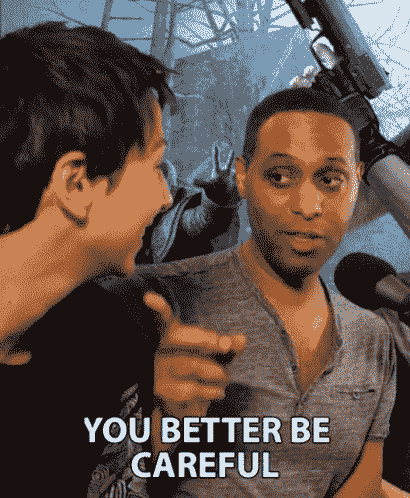
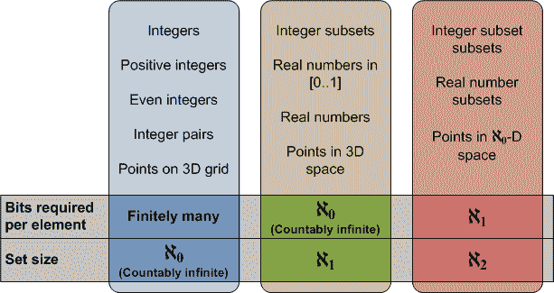
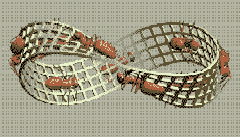
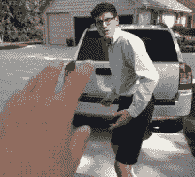
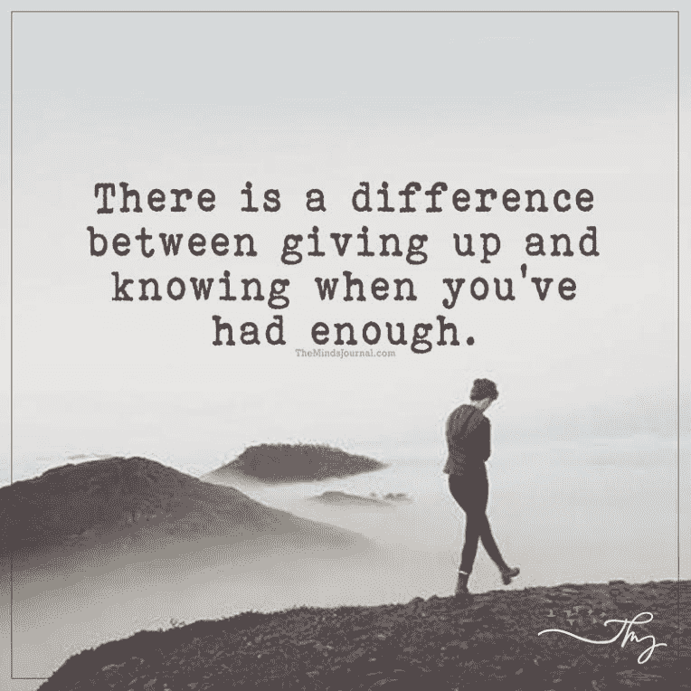

# 第一篇文章:从数学到数据科学的转变

> 原文:[https://dev . to/williamhuybui/first-post-transition-from-mathematics to-data-science-12cl](https://dev.to/williamhuybui/first-post-transition-from-mathematics-to-data-science-12cl)

这篇文章是一个关于我如何“放弃”数学并创建数据科学的个人故事。我不打算鼓励任何人也这样做。影响我选择的因素很多，所以请慎重。
[T3】](https://res.cloudinary.com/practicaldev/image/fetch/s--dHuQDgW2--/c_limit%2Cf_auto%2Cfl_progressive%2Cq_66%2Cw_880/https://thepracticaldev.s3.amazonaws.com/i/df05rnfgor7zzhhf3pjt.gif)

## 为什么不是数学？

三个月前，我还是一名数学博士生。我正与退出这个项目的决定作斗争。做这个决定的过程是两年的噩梦。伽罗瓦理论，扩展图，混沌理论，放电法...这些都是我自己花了很多时间研究的有趣话题。但是我研究的越多，我就越远离现实。我每天早上醒来都感觉完全迷失了。我将用集合论中的一个例子来解释我的内在冲突。连续统假说认为:

`There does not exist a set with a size less than the reals and no set strictly greater than the natural numbers. - Georg Cantor`

如果我们可以找到两个集合之间的 1-1 对应映射，那么它们具有相同的大小(基数)。换句话说，自然数、整数和有理数具有相同的基数，即无穷大。有比无穷大更大的东西吗？

[T2】](https://res.cloudinary.com/practicaldev/image/fetch/s--FE07inaU--/c_limit%2Cf_auto%2Cfl_progressive%2Cq_auto%2Cw_880/https://thepracticaldev.s3.amazonaws.com/i/ge720gciwfuuzpdc5vyv.png)

答案是肯定的！有些集合，比如实数集合，不可能找到它本身和自然数集合之间的 1-1 映射。通过研究每个集合的可数性，你可以很快明白为什么。自然数集是可数的，而实数集是不可数的。连续统假说强调什么才真正介于自然数和实数之间？

研究不同类型的无穷是非常有趣的。但是，结果对社会来说是不切实际的。为什么会有人(集合论者)花一生的时间研究无穷大？这个问题我自己回答不了。总体来说，我尊重数学家，因为他们对科学或艺术做出了不言而喻贡献。尽管如此，我的心态并不适合处理这种朝九晚五的工作。这个道理我花了很长时间才明白。

[T2】](https://res.cloudinary.com/practicaldev/image/fetch/s--1Q6zNEyE--/c_limit%2Cf_auto%2Cfl_progressive%2Cq_66%2Cw_880/https://thepracticaldev.s3.amazonaws.com/i/7f2ymdaxwqdnq5tzyysa.gif)

重要的一点是我家生活在贫困线以下。他们总是支持我的职业决定，对此我很感激。但作为家中的长子，我仍然为无法提供而感到严重的糟糕。研究生水平的纯数学是一种艺术形式，需要七年才能掌握。相反，一个纯数学的博士在大多数行业是不可雇佣的，在学术界也是有竞争力的。因此，我继续下去是不明智的。

## Let 说家庭不是问题。你会继续吗？

我开始了全额资助的数学博士项目。我想象自己在起立鼓掌中高昂着头完成了这个项目。然而，数学博士需要的不仅仅是喜欢。这需要大量的承诺、牺牲和心理能力。我一点也没准备好。我带着一把木剑来到战场。

[T2】](https://res.cloudinary.com/practicaldev/image/fetch/s--3f-V6Gie--/c_limit%2Cf_auto%2Cfl_progressive%2Cq_66%2Cw_880/https://thepracticaldev.s3.amazonaws.com/i/d4qqr74eoqi70wm1mz0b.gif)

读研的第一个月，我患上了*的冒名顶替综合症。我的学校在抽象代数方面是全国顶尖之一。我被我的同学吓坏了，因为每当老师在黑板上写下**希腊语**时，他们总是“静静地点头”，不管是字面意思还是比喻意义。我努力工作以变得更好，但是进展几乎没有被注意到。在我来之前，我是小池塘里的一条大鱼，但在这里，我在鲨鱼和鲸鱼的海洋中是一个小人物。第一年结束时，我遇到了生存危机。我非常沮丧，以至于我给大学里的一些教授发了道歉信，告诉他们我是个失败者，没有达到他们的期望。幸运的是，我设法通过了所有的课程，并在项目中保持良好的地位。然而，我感觉很累，我的头一直很模糊。我意识到有些事情不对劲。但是，我太害怕去想它。*

 *## 是什么让我选择数据科学？

创伤过后，我重新评估了我的人生目标。我试图说服自己学术界以外的机会。然而，我为不能完成我开始的事情而感到惭愧。有一天，我看到一个博士的帖子改变了我的想法，

这个建议抚平了创伤。几天后，我和系主任谈了我的情况。这是我毕业前的四个月。

我想找一份需要定量领域硕士学位的工作，数据科学引起了我的注意。我知道一点 Python，组合学和图论。我只是希望我在这里的时间不会被浪费。

## 我现在感觉如何？

毕业后我回到家乡，和父母以及三个弟弟妹妹住在一起。我需要一段时间来调整我的日常生活。我离开了两年，很多事情都变了。我哥哥成长了很多。他患有焦虑症，并多次让我的父母头疼。我只希望我能早点来做他的哥哥。我也吃了很多妈妈做的食物，和我那时吃的相比，简直是天堂。

一周前，我在熨斗启动了一个数据科学项目。我不得不花很多钱才能进去，但是到目前为止我感觉很好。这个项目很有挑战性，非常有趣。编程有很多类似数学的逻辑思维。虽然课程很紧凑也很辛苦，但是员工们都很乐于助人。他们刚刚从这个项目毕业，所以他们理解我们的感受，并给予了很多帮助。这里的学生来自不同的背景:石油和天然气，地质，IT，教师，...我们有一个共同点，那就是我们都努力推进我们的事业。

[T2】](https://res.cloudinary.com/practicaldev/image/fetch/s--7gpsy2U---/c_limit%2Cf_auto%2Cfl_progressive%2Cq_66%2Cw_880/https://thepracticaldev.s3.amazonaws.com/i/qp54f3ulxptugeooetp9.gif)

## 结尾注释

我从不后悔读研的两年。交了一堆聪明的朋友，体验了大学生活。通过艰难困苦，我也对自己有了更多的了解。

我给仍在寻找激情的朋友们的建议是。很难改变，但值得一试！T3】*