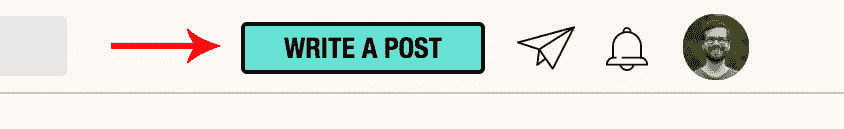
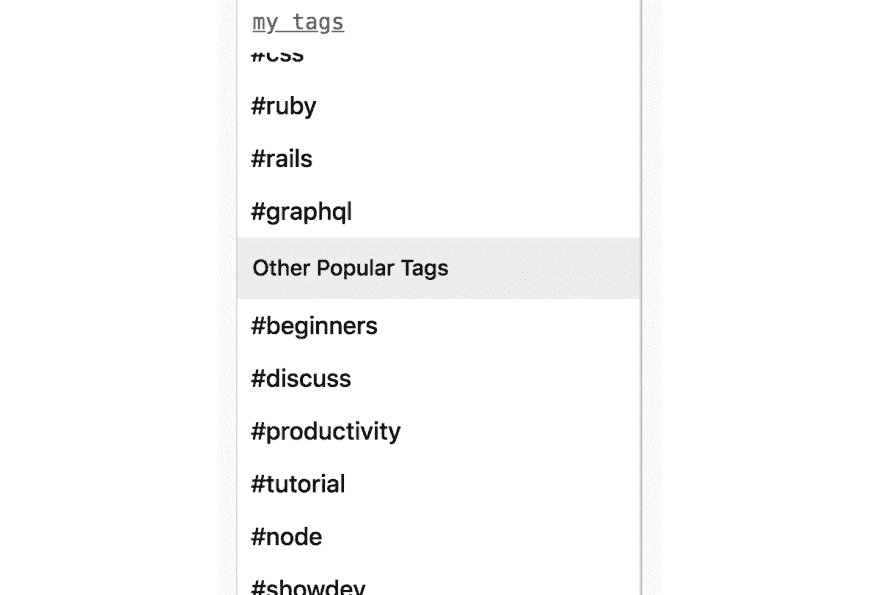
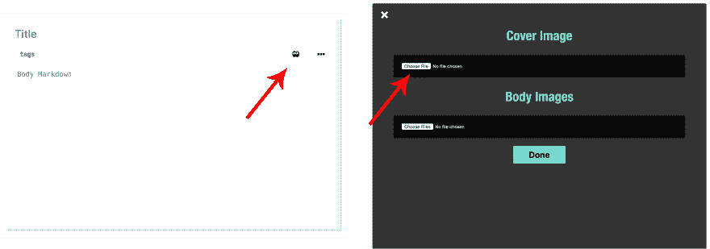
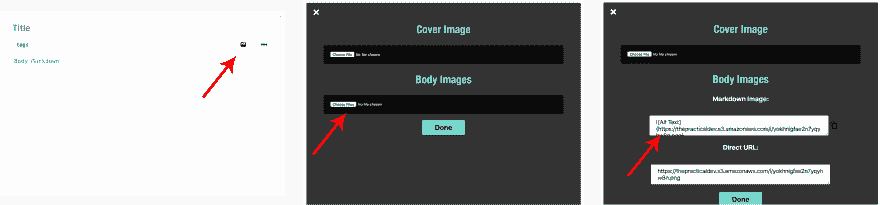
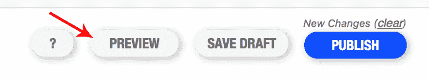
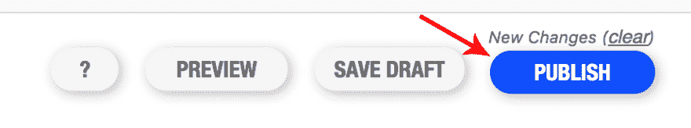

# 如何在 DEV 上写第一篇文章

> 原文:[https://dev . to/chrisachard/how-to-write-your-first-post-on-dev-c3k](https://dev.to/chrisachard/how-to-write-your-first-post-on-dev-c3k)

所以你一直在阅读 dev.to，你准备张贴。太好了！下面是**如何做到这一点**，以及**接下来**会发生什么:

# [](#0-sign-up)0。签约雇用

如果您还没有 DEV 帐户，您需要一个来发布。[在这里报名](https://dev.to/enter)

# [](#1-click-write-a-post)1。点击“写文章”

登录后，右上角会有一个绿色的大按钮，上面写着“写帖子”——点击它！

[T2】](https://res.cloudinary.com/practicaldev/image/fetch/s--rRKjOJnG--/c_limit%2Cf_auto%2Cfl_progressive%2Cq_auto%2Cw_880/https://thepracticaldev.s3.amazonaws.com/i/k89k9tnqraqxs992212q.png)

# [](#2-pick-a-good-descriptive-title)2。选择一个好的，描述性的标题

大多数时候，人们只会看到你的标题，他们不得不根据这个来决定是否点击。所以，让你的标题脱颖而出！准确地告诉读者他们会从这篇文章中得到什么，然后兑现这个承诺。

下面是你的帖子的一个例子:

[](/chrisachard) [## ES6 迷你速成班:如何编写现代 JavaScript

### 克里斯·阿查德 9 月 4 日 193 分钟阅读

#javascript #webdev #node](/chrisachard/es6-mini-crash-course-javascript-can-actually-be-fun-to-write-3b9l)

# [](#3-add-some-tags)3。添加一些标签

标签超级重要！DEV 上的读者可以关注某些标签，所以适当地标记你的帖子会让你的帖子出现在大多数人的订阅源中(实际上是想阅读这些内容的人！)

对于标签的想法，请在登录后查看 DEV 的左侧栏。您将能够看到您关注的标签，以及网站上其他受欢迎的标签(如下例所示)

你还可以看到[所有时间最受欢迎的标签](https://dev.to/tags)

[T2】](https://res.cloudinary.com/practicaldev/image/fetch/s--09Bu19wq--/c_limit%2Cf_auto%2Cfl_progressive%2Cq_auto%2Cw_880/https://thepracticaldev.s3.amazonaws.com/i/9677bpzmd3mirejy8ooa.png)

# [](#4-optional-choose-a-cover-image)4。(可选)选择封面图像

点击文章编辑器中的“添加图片”按钮打开图片添加对话框，然后选择一个文件作为你的封面图片上传。封面图片给你的帖子带来视觉上的兴趣，而且如果有人在推特上发布你的帖子的链接，它们就会出现在推特上！

[T2】](https://res.cloudinary.com/practicaldev/image/fetch/s--qkWn-7YW--/c_limit%2Cf_auto%2Cfl_progressive%2Cq_auto%2Cw_880/https://thepracticaldev.s3.amazonaws.com/i/hjy6z6cvynmbzo8fz0y4.png)

# [](#5-write-your-post)5。写你的帖子！

有趣的是:)你可以直接在 DEV 编辑器中写文章，或者从其他地方复制粘贴——但是在这里你可以告诉人们你想告诉他们的事情！

# [](#6-add-some-formatting)6。添加一些格式

DEV 使用 markdown 来格式化帖子中的文本，他们有一个方便的[编辑指南](https://dev.to/p/editor_guide)

该指南中有许多很棒的内容，所以请查看一下！包括如何使用三个反勾号格式化代码:

```
console.log("Woo!") 
```

<svg width="20px" height="20px" viewBox="0 0 24 24" class="highlight-action crayons-icon highlight-action--fullscreen-on"><title>Enter fullscreen mode</title></svg> <svg width="20px" height="20px" viewBox="0 0 24 24" class="highlight-action crayons-icon highlight-action--fullscreen-off"><title>Exit fullscreen mode</title></svg>

以及如何嵌入类似 codesandbox 或其他开发人员帖子的链接。

# [](#7-add-images-in-the-body-of-a-post)7。在文章正文中添加图片

我第一次花了一分钟才弄明白的一件事是，如何在文章正文中添加图片。

使用与步骤 4 中相同的图像上传按钮，但使用“身体图像”上传框。然后:**等待一秒钟**让它上传。

一旦完成，将会有一个链接到你上传的图片的降价片段。复制它，并将其粘贴到开发编辑器中！将 alt 标签(在方括号内)改为描述性的，这样就可以了。

[T2】](https://res.cloudinary.com/practicaldev/image/fetch/s--vxPPt_R7--/c_limit%2Cf_auto%2Cfl_progressive%2Cq_auto%2Cw_880/https://thepracticaldev.s3.amazonaws.com/i/0ngknk0ef5z6u2xol3cp.png)

# [](#8-review-your-post-in-preview-mode)8。在预览模式下查看您的帖子

一旦你写完了一篇文章，很容易兴奋起来并发表出来——但我建议至少在“预览”模式下通读一遍文章。

点击屏幕底部的“预览”来查看格式化后的文章。

[T2】](https://res.cloudinary.com/practicaldev/image/fetch/s--qASiYecN--/c_limit%2Cf_auto%2Cfl_progressive%2Cq_auto%2Cw_880/https://thepracticaldev.s3.amazonaws.com/i/jm3iikny2k97k51pfkum.png)

# [](#9-publish)9。发布！

你完成了——发布时间到了！

点击底部的链接，你的帖子就可以发布了！

DEV 不会在你的帖子发布之前审查它，所以当你点击发布时，确保你已经准备好让人们阅读它。

[T2】](https://res.cloudinary.com/practicaldev/image/fetch/s--g5gi2wcx--/c_limit%2Cf_auto%2Cfl_progressive%2Cq_auto%2Cw_880/https://thepracticaldev.s3.amazonaws.com/i/vu7i9ayoqsy3j7s6n6q8.png)

# [](#congratulations)恭喜恭喜！🎉

你正式成为 DEV 上的海报了:)

如果你在发布过程中遇到任何问题或有疑问，请在下面自由提问。我来回应！

**如果你喜欢这篇文章**，你可以通过:

*   在推特上关注我: [@chrisachard](https://twitter.com/chrisachard)
*   加盟快讯:[chrisachard.com](https://chrisachard.com/)

感谢阅读！