# 亚马逊的非原始方法:AWS 物联网如何应对物联网挑战

> 原文：<https://dev.to/indeemasoftware/the-non-primitive-approach-of-amazon-how-aws-iot-meets-iot-challenges-2gln>

作为一家深度参与开发针对[物联网](https://indeema.com/services/iot)环境的各种解决方案的公司，我们大概应该提升物联网这一领域以及我们的相关开发技能和能力。傲慢的自我推销——几乎不提及任何热门话题的取舍——似乎是一种被广泛接受的做法，因为潜在客户更喜欢只与在活动中没有重大困难的善意专业人士打交道。

然而，我们的博客被我们的同事——除了潜在客户之外的其他物联网开发者——阅读的事实使我们从另一个角度来讨论物联网话题。说实话，在诚实和永远积极之间保持一个适当的平衡并不是那么简单。物联网这样一个不成熟领域的本质让我们不得不承认，天堂里其实也有麻烦。一方面，物联网提供了新的机会，其范围是当今难以把握的。另一方面，物联网引入了独特的风险，能够在安全性和运营可靠性方面危及任何[物联网项目](https://indeema.com/blog/how-to-create-a-startup--iot-project-from-idea-to-production)。

我们认为，揭示风险并分享如何应对物联网挑战的最佳实践，比仅仅讲述幸运的“没问题”故事更能提高潜在客户对物联网的兴趣。

这一次，我们将研究 AWS 物联网解决方案，它在许多物联网开发人员中日益流行。在这种情况下，广告和促销都是多余的。让我们更好地尝试认识到，AWS IoT 是否真的像它的创造者所说的那样，对开发者和最终用户都有那么好。另外，一些健康的批评不会有坏处，对吗？

[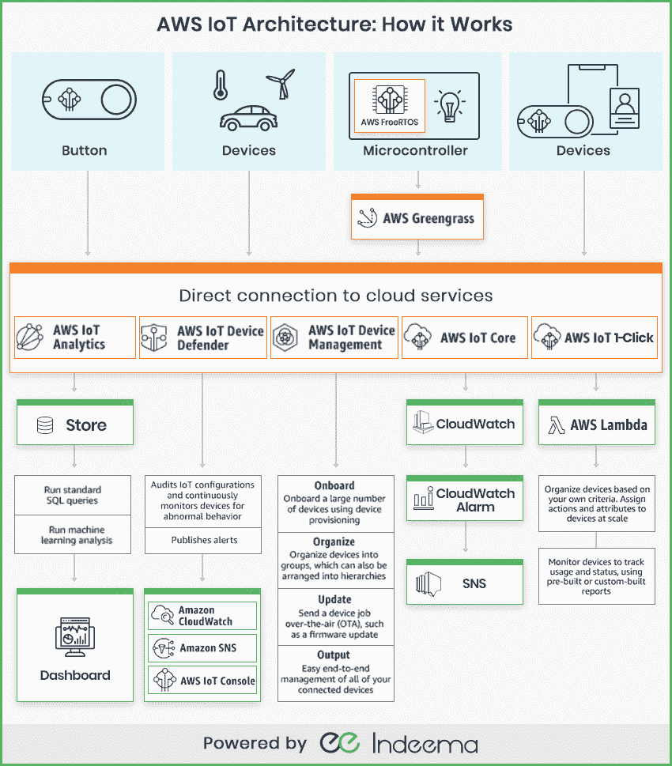](https://res.cloudinary.com/practicaldev/image/fetch/s--QlO2-UHL--/c_limit%2Cf_auto%2Cfl_progressive%2Cq_auto%2Cw_880/https://indeema.cimg/articles/the-non-primitive-approach-of-amazon-how-aws-iot-meets-iot-challenges/aws_iot_architecture.png)

## 什么是 AWS IoT

亚马逊物联网或亚马逊网络服务平台是一个复杂的解决方案，能够从各种物联网设备收集数据，并将它们连接到云应用。亚马逊早就意识到，当代物联网市场很难满足于一刀切的服务。由于物联网设备的多样性不断增长，多服务平台应该更符合各个业务部门的需求。因此，AWS 物联网包括几个专用于不同操作任务的特定服务。这样的做法代表了亚马逊是一个真正的数字巨头，拥有丰富的开发能力(1 万亿美元的资本化反映了这一地位，呵呵:)

顺便说一下，作为商业巨擘的亚马逊清楚地知道，在当代全球化的商业环境中，只有一种方法可以在竞争中取得成功——提高运营效率。如何实现这一点？业务流程越智能，效率就越高，因此利润也就越大。仅物联网服务就允许来自众多行业的各种规模的企业分析从工业设备收集的海量数据。如今，在机器学习的帮助下，机器变得可以教育。用 AWS 物联网创建的机器学习模型既可以在云中工作，也可以直接在现场工作。因此，物联网使任何设备都能通过智能响应对本地事件做出反应。

我们不能不提到 AWS 令人印象深刻的基础设施覆盖，它在 AWS 云服务的种类及其定价方面为客户提供了真正灵活的选择。

最后但同样重要的是，AWS IoT 提供的物联网安全性和运营稳定性表明亚马逊是一个非常务实的物联网平台提供商(不过，稍后会有更多介绍)。

在其他服务中，有以下 AWS 物联网服务:\
亚马逊 FreeRTOS 和 AWS green grass(edge)；\
AWS 物联网核心、AWS 物联网设备管理、AWS 物联网设备卫士(云)；\
AWS 物联网分析(Analytics)。

但是我们想从一个按钮开始:)

## AWS 物联网按钮

按钮形式的简单易调节 Wi-Fi/LTE-M 设备是为物联网开发人员设计的，他们希望开始使用 AWS 物联网核心、AWS Lambda、Amazon DynamoDB、Amazon SNS 等服务以及其他 AWS 服务，而不必为设备编写专有代码。按钮激活的逻辑可以根据特定的任务进行配置。例如，它可以远程启动汽车，打开/关闭车库门，控制各种家用电器。该设备可以与一些第三方 API 集成，如 Twitter、脸书、Slack 以及一些定制软件。

该按钮由 AWS 的硬件合作伙伴专门为 AWS 物联网服务生产。事实上，该按钮有两个版本:\
1)通过 Wi-Fi 通信的 AWS 物联网企业按钮。它拥有 2000 次点击的生命周期，使用 TLS 加密出站数据，并可以使用 BLE 和移动应用程序进行配置。它的零售价为 19.99 美元(不包括运费和手续费)，可以在美国、欧洲和日本使用。

2)美国电话电报公司 LTE-M 按钮，通过 LTE-M 蜂窝网络进行通信。它的生命周期为 1500 次点击，它还使用 TLS 加密出站数据。该设备和捆绑数据计划的介绍价格为 29.99 美元(不包括运费和手续费)，可在美国使用。

这两个版本都已准备好使用 X.509 证书进行预调整，以便通过安全连接与云连接。

你可能会问为什么亚马逊要让一些第三方硬件厂商参与生产一个特殊的按钮。原因如下:

## AWS 物联网 1-Click

AWS IoT 1-Click 是一项特殊的云服务，仅适用于专门设计的硬件设备-上述按钮。多好的解决方案！这个解决方案已经被许多著名的数字巨头测试过，这些巨头希望将他们的客户与一些特定的设备和小工具联系起来。典型的孤注一掷的垄断意图。当然，亚马逊将其视为客户关怀的一部分:客户不再需要绞尽脑汁去哪里找到一些完全兼容所提供云服务的预调设备。亚马逊已经代表他们做出了选择。史上最佳选择。尤其是因为云服务在开箱即用方面看起来确实对客户友好。

AWS IoT 1-Click 是一项服务，它使特殊的物联网设备能够从 AWS Lambda(一种特殊的事件驱动服务，允许开发人员在按使用付费的基础上对功能进行编程)获取功能，以执行某些操作。例如，通过按下一个按钮，可以向技术支持团队发送消息，跟踪库存过程，或远程喂狗。\
AWS IoT 1-Click 支持的应用类型可以有很大不同:公寓商店、学校、办公楼、医疗设施和各种车辆都可以配备与云服务完全集成的物联网设备。

AWS IoT 1-Click 的主要优势是开发者不需要在硬件端编写代码。他们所要做的只是使用已经可用的操作。此外，在 AWS Lambda 函数的帮助下，他们可以轻松地创建新的。他们既不需要安装证书，也不需要配置边缘设备。关心固件更新也是多余的。同时，管理员可以跟踪每台设备的状态和功能，并在使用寿命到期时得到通知。

为了 AWS 按钮而牺牲第三方物联网设备的更广泛选择，上述优势值得吗？从市场上不断出现的新设备的角度来看，这仍然是一个问题。但就目前而言，这种方法似乎仍然合理。

然而，亚马逊也有一个免费的解决方案，兼容第三方制造商的各种设备。见下文。

## 亚马逊 FreeRTOS

这个微控制器操作系统是为低能耗设备设计的。Amazon FreeRTOS 通过简化的编程简化了对一系列此类设备的部署和控制。该系统属于免费发布的开源软件。支持 ARM、MIPS 等多种架构。这意味着开发人员可以自由地从众多可靠的制造商中选择芯片组，如:Espressif、Microchip、恩智浦半导体、意法半导体、德州仪器等。

Amazon FreeRTOS 提供了提供数据加密和密钥管理的库。此外，系统遵循 TLS (TLS v1.2)协议将设备与云连接。此外，Amazon FreeRTOS 允许在部署和 OTA 更新期间添加安全代码。

在这里，我们可以看到亚马逊如何回应任何与第三方硬件供应商之间缺乏选择有关的指控。开发人员可以自由选择他们需要的任何东西，以创建高度定制的解决方案，而 Amazon FreeRTOS 则帮助他们开发具有适当功能的相关软件。

因此，亚马逊对开源并不陌生。

物联网开发的简化编程并不是许多开发者可以从亚马逊获得的唯一支持类型。我们评论的下一项服务可以帮助应对与不可靠的互联网连接相关的挑战。

## AWS 绿草

互联网连接故障等现实环境可能会阻止许多企业实施物联网。为了减轻这种风险，亚马逊提供了 AWS Greengrass。该解决方案支持多组设备以安全的方式与云同步。此外，即使互联网连接中断，连接的设备也可以相互通信。AWS Greengrass 允许设备运行 AWS Lambda 功能。这种组合提供了本地执行无服务器功能。这意味着运行在 ARM 或 x86 架构上的各种基于 Linux 的设备可以使用 Greengrass Core 来执行 AWS Lambda 代码。

事实上，这是关于数据流的优化。例如，如果您有几个基于 Raspberry Pi 的设备，您的代码可以在这些设备上本地运行。这样，您可以收集数据，过滤数据，并只将您认为重要的数据发送到云，以便进行后续分析。这样的做法显然可以节省你的时间和金钱。因此，在某些情况下，基于 AWS Greengrass 的解决方案可能比基于 AWS IoT Core 的解决方案更具成本效益。

此外，AWS Greengrass 是少数几个能够在非常轻量级的设备上运行的亚马逊服务之一。这是管理员在本地使用 AWS 编程的好机会。AWS Greengrass 似乎是亚马逊的另一个激励措施，帮助物联网开发者说服一些犹豫不决的客户，对吗？

## AWS 物联网设备管理

服务的名称不言自明。这是关于你的物联网环境的规模。您的设备群可能包括数百、数千甚至数百万个终端。所有这些都需要组织良好的控制和监测。而这正是 AWS 物联网设备管理服务所提供的。它有助于物联网开发者不再关心规模。分组方法与部署灵活性的结合使开发人员能够创建具有单独访问策略的物联网设备组，而不管整个系统的规模如何。简而言之，AWS 物联网设备管理有助于远程管理您的物联网设备。无论是个人还是团体，您都可以通过 OTA(空中下载)发送固件更新，排除功能故障并监控设备状态。除了数量上的可扩展性之外，还有质量上的可扩展性，因为设备的特定操作系统与服务无关。这意味着各种各样的设备，从廉价的温度计到豪华的自动驾驶汽车。从而实现安全的物联网规模化管理。值得称赞。但是，另一个服务负责安全性。

## AWS 物联网设备卫士

如果物联网服务提供商有一些安全实践，它们应该以某种方式实施到服务中。物联网设备的身份验证及其通过整个车队的持续审计进行的安全授权都属于完全托管服务 AWS 物联网设备卫士。毫无疑问，亚马逊在物联网安全问题上已经获得了丰富的经验。亚马逊的相关建议以实践的形式提供，这些实践构成了 AWS 物联网设备防御能力。\
AWS 物联网设备 Defender 与其他亚马逊服务的集成是隐含的 AWS Greengrass 和亚马逊 FreeRTOS 都可以自动与该服务集成。AWS IoT Device Defender 可以通过 AWS IoT 控制台、亚马逊 CloudWatch 和亚马逊 SNS 向用户通知问题。这些警报可能是关于什么的？\
例如，它可以识别物联网设备和云之间异常密集的数据流量，这可能反映了数据泄漏。此外，该服务可以对网络中出现的未经授权的 IP 地址发出警告。它可以跟踪设备的各种状态，如设备上启用的端口数量、设备连接的对象、设备发送的数据量等等。定期检查设备证书的有效期和到期日期也是一种有用的安全做法，亚马逊通过 AWS 物联网设备卫士与物联网开发者分享了这一做法。

几乎不可能预测物联网领域内所有可能的安全问题，因为许多定制的解决方案可能会产生绝对独特的风险。然而，亚马逊分享了一套最佳安全实践，其中的偏差可以通过 AWS IoT Device Defender 识别为某种警报。这种方法符合我们的期望吗？确实如此。AWS 物联网设备 Defender 能保证我们物联网系统的整体安全吗？不，当然不是。我们稍后将不得不回到这个问题上来。

## AWS 物联网分析

正如当代大数据战略的许多支持者所言，数据就是金钱。确实是这样，但只是在这种情况下，您可以有效地分析数据，从您的数据馈送中检索一些有价值的信息。每个物联网解决方案都完全依赖于物联网设备生成的数据流。亚马逊提供了一项特殊的服务，能够正确格式化从你的物联网设备不断传来的千兆字节的数据——AWS 物联网分析。这是一项完全托管的服务，允许对从您的物联网设备收集的大量数据进行复杂的分析，而不必花费任何额外的时间和金钱来建立您自己的专有物联网分析基础设施。

事实上，AWS 物联网分析是一种自动化所有复杂步骤的方法，您需要继续分析来自物联网设备的数据。该服务有助于过滤、选择、处理和丰富您的数据流，然后将它们发送到云存储，以进行更深入的后续分析。因此，通过一些特殊的数据处理数学操作，有可能只收集和保存有价值的数据。例如，您可以使用一些元数据(如设备类型及其位置)来丰富您的数据，同时可以清除由于测量不准确而产生的一些“坏数据”。稍后，您可以通过嵌入式 SQL 数据请求程序发送计划的和单独的查询，以提供您的数据分析。此外，真正的深度分析可以在可用的机器学习工具的帮助下实现。因此，AWS 物联网分析可以成为大多数物联网开发者及其客户的相关默认服务。

假设，是时候深入了解亚马逊物联网解决方案的本质了。让我们稍微练习一下如何处理 AWS IoT。

## AWS 物联网核心

AWS 物联网核心可能是亚马逊致力于物联网的基础服务中最重要的服务。它通过可靠的扩展将物理物联网端点连接到云。AWS 物联网核心负责在物联网设备及其外围软件和上述 AWS 物联网服务之间建立完整的交互。

为了开始使用 AWS 物联网，让我们安排一个测试设备的试验连接，该测试设备包含一个微控制器以及以下传感器 HDC1080 -(温度、湿度)、BME280 -(压力)、MH-Z19 - (CO2)、CCS811 - (eCO2、tVOC)到 AWS 物联网核心，以进行试验数据传输。

[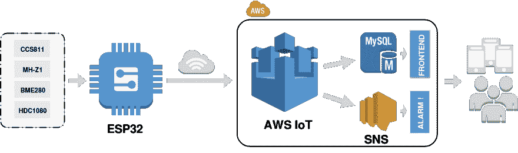](https://res.cloudinary.com/practicaldev/image/fetch/s--N2T_3VR3--/c_limit%2Cf_auto%2Cfl_progressive%2Cq_auto%2Cw_880/https://indeema.cimg/articles/the-non-primitive-approach-of-amazon-how-aws-iot-meets-iot-challenges/esp32.png)

在我们的情况下，设备的安全连接至关重要。提供安全数据传输的最流行方法之一是通过 TLS 1.2 使用端到端加密。协议。只有少数基于微控制器解决方案能够满足 TLS 1.2。由于缺乏计算能力。这次我们使用 ESP32，因为微控制器是最容易使用的解决方案之一。

首先，我们应该创建我们的 AWS 用户名，同时我们的 ESP32 微控制器应该连接到互联网。

登录后，在[https://aws.amazon.com/iot](https://aws.amazon.com/iot)打开 AWS 物联网控制台。在欢迎页面上，选择开始。\
如果这是你第一次使用 AWS 物联网控制台，你会看到欢迎使用 AWS 物联网控制台页面。在左侧导航窗格中，选择管理以展开选项，然后选择事物。\
在显示您还没有任何东西的页面上，选择注册一个东西。(如果你之前已经创建了一个东西，选择创建)。

[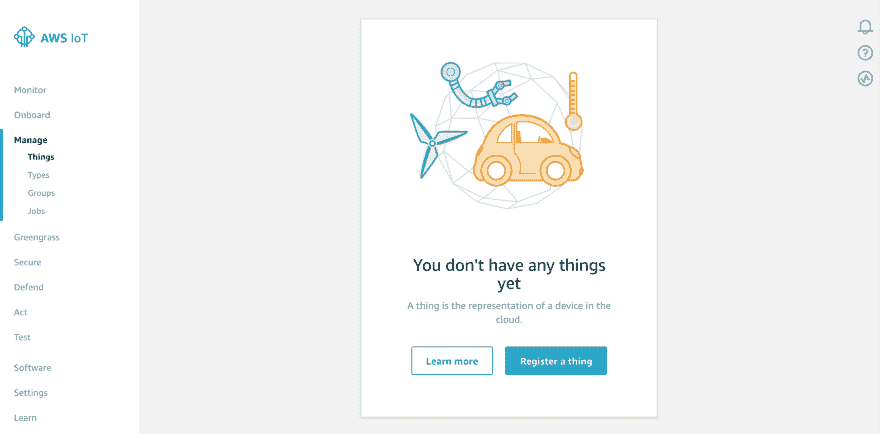](https://res.cloudinary.com/practicaldev/image/fetch/s--egJ2J_LB--/c_limit%2Cf_auto%2Cfl_progressive%2Cq_auto%2Cw_880/https://indeema.cimg/articles/the-non-primitive-approach-of-amazon-how-aws-iot-meets-iot-challenges/01.png)

一个事物代表一个设备，其状态或数据存储在 AWS 云中。这种存储的状态或数据被称为设备的影子。设备影子服务为连接到 AWS IoT 的每个设备维护一个影子。

键入事物的名称，然后选择下一步。

[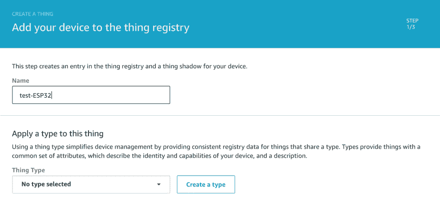](https://res.cloudinary.com/practicaldev/image/fetch/s--FS94DoHE--/c_limit%2Cf_auto%2Cfl_progressive%2Cq_auto%2Cw_880/https://indeema.cimg/articles/the-non-primitive-approach-of-amazon-how-aws-iot-meets-iot-challenges/02.png)

[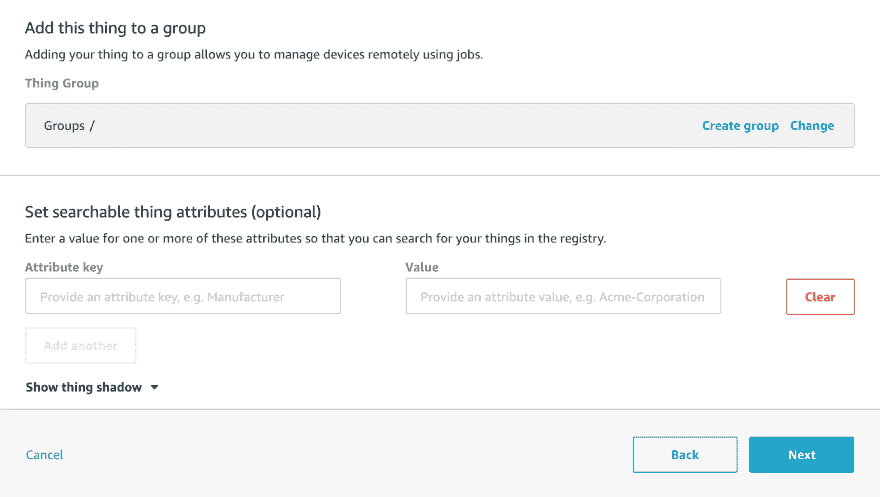](https://res.cloudinary.com/practicaldev/image/fetch/s--2HoRYWSf--/c_limit%2Cf_auto%2Cfl_progressive%2Cq_auto%2Cw_880/https://indeema.cimg/articles/the-non-primitive-approach-of-amazon-how-aws-iot-meets-iot-challenges/03.png)

之后，我们应该为安全连接创建证书。

[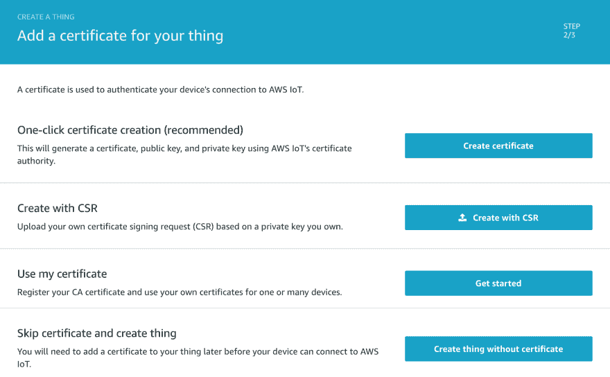](https://res.cloudinary.com/practicaldev/image/fetch/s--Tye54LTw--/c_limit%2Cf_auto%2Cfl_progressive%2Cq_auto%2Cw_880/https://indeema.cimg/articles/the-non-primitive-approach-of-amazon-how-aws-iot-meets-iot-challenges/04.png)

然后我们应该加载证书，点击“完成”，并获得授权的东西

[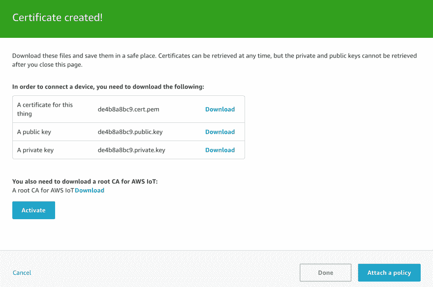](https://res.cloudinary.com/practicaldev/image/fetch/s--oid3KQyX--/c_limit%2Cf_auto%2Cfl_progressive%2Cq_auto%2Cw_880/https://indeema.cimg/articles/the-non-primitive-approach-of-amazon-how-aws-iot-meets-iot-challenges/05.png)

[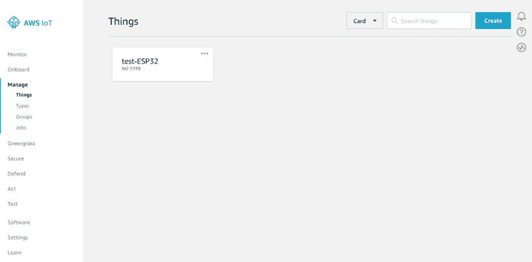](https://res.cloudinary.com/practicaldev/image/fetch/s--4cr1xl22--/c_limit%2Cf_auto%2Cfl_progressive%2Cq_auto%2Cw_880/https://indeema.cimg/articles/the-non-primitive-approach-of-amazon-how-aws-iot-meets-iot-challenges/06.png)

然后，我们应该转到安全并选择策略以创建策略。

[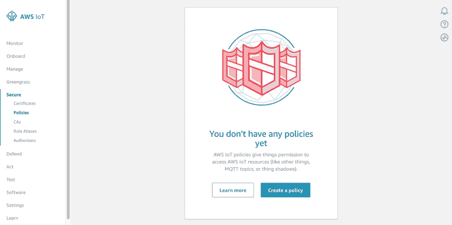](https://res.cloudinary.com/practicaldev/image/fetch/s--ZtcpNTi9--/c_limit%2Cf_auto%2Cfl_progressive%2Cq_auto%2Cw_880/https://indeema.cimg/articles/the-non-primitive-approach-of-amazon-how-aws-iot-meets-iot-challenges/07.png)

在“创建策略”页面的“名称”字段中，键入策略的名称。在操作字段中，键入 iot: *。在“资源 ARN”域中，键入*。选中“允许”复选框。这允许您的 Raspberry Pi 向 AWS IoT 发布消息。\
IOT:*-使用此证书订阅和发布的策略\

*   -所有客户端都可以使用此证书发布/订阅此内容

[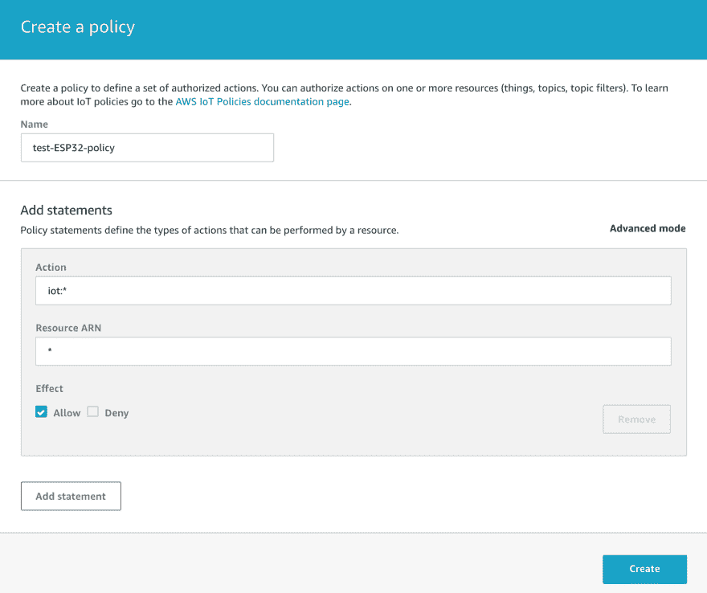](https://res.cloudinary.com/practicaldev/image/fetch/s--jJ7ZMCNM--/c_limit%2Cf_auto%2Cfl_progressive%2Cq_auto%2Cw_880/https://indeema.cimg/articles/the-non-primitive-approach-of-amazon-how-aws-iot-meets-iot-challenges/08.png)

[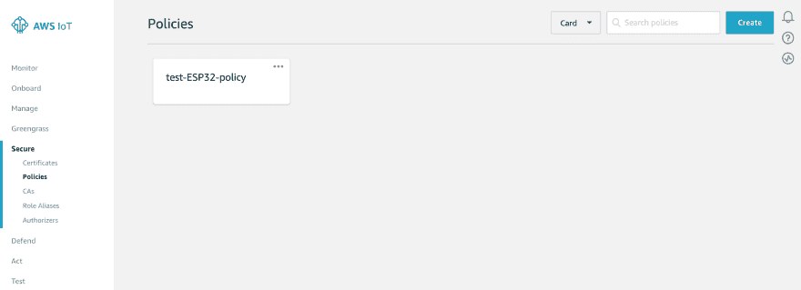](https://res.cloudinary.com/practicaldev/image/fetch/s--JTUGkb74--/c_limit%2Cf_auto%2Cfl_progressive%2Cq_auto%2Cw_880/https://indeema.cimg/articles/the-non-primitive-approach-of-amazon-how-aws-iot-meets-iot-challenges/09.png)

在左侧导航窗格中的安全性下，选择证书。

在您创建的证书框中，选择...打开下拉菜单，然后选择附加策略。

[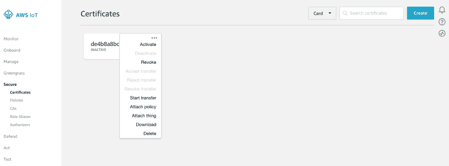](https://res.cloudinary.com/practicaldev/image/fetch/s--KWChuUZP--/c_limit%2Cf_auto%2Cfl_progressive%2Cq_auto%2Cw_880/https://indeema.cimg/articles/the-non-primitive-approach-of-amazon-how-aws-iot-meets-iot-challenges/10.png)

[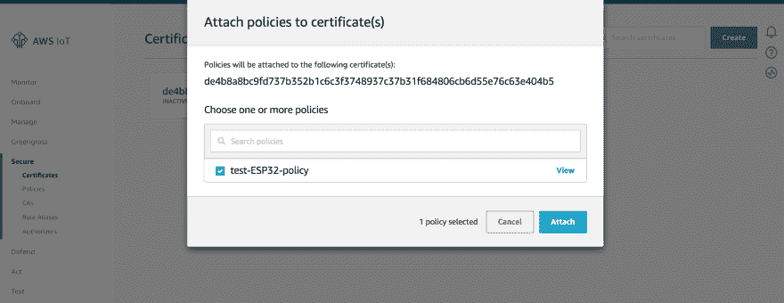](https://res.cloudinary.com/practicaldev/image/fetch/s--CQW4KRrp--/c_limit%2Cf_auto%2Cfl_progressive%2Cq_auto%2Cw_880/https://indeema.cimg/articles/the-non-primitive-approach-of-amazon-how-aws-iot-meets-iot-challenges/11.png)

在您创建的证书框中，选择...打开下拉菜单，然后选择附件。

[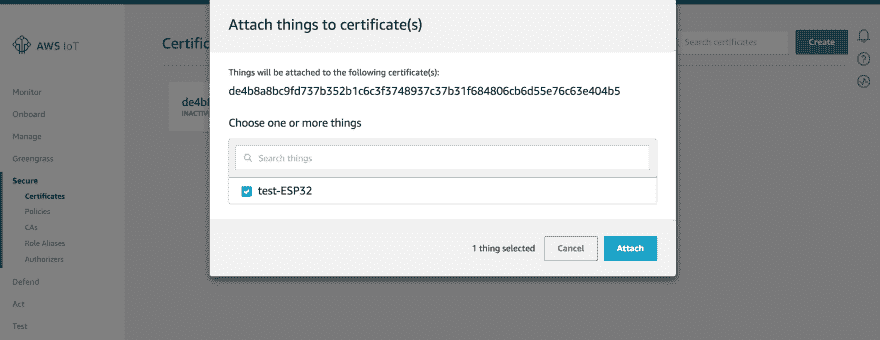](https://res.cloudinary.com/practicaldev/image/fetch/s--91Z_jKs7--/c_limit%2Cf_auto%2Cfl_progressive%2Cq_auto%2Cw_880/https://indeema.cimg/articles/the-non-primitive-approach-of-amazon-how-aws-iot-meets-iot-challenges/12.png)

最后一步是激活证书:\
在您创建的证书框中，选择...打开下拉菜单，然后选择活动

[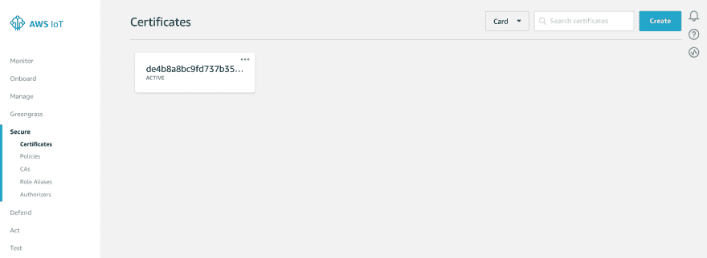](https://res.cloudinary.com/practicaldev/image/fetch/s--3nxOG_z_--/c_limit%2Cf_auto%2Cfl_progressive%2Cq_auto%2Cw_880/https://indeema.cimg/articles/the-non-primitive-approach-of-amazon-how-aws-iot-meets-iot-challenges/13.png)

让我们考虑一下，当 Rest API 端点、端口和协议已知，并且所有必要的证书可用时，我们的 ESP32 微控制器已经预配置为与 AWS IoT 交互。

现在我们需要检查在 ESP32 和 AWS 物联网云之间传输数据的可能性。进入管理，点击我们的东西 test-ESP32，在左边菜单选择交互，在“更新到这个东西影子”一行下面复制一个话题地址。

[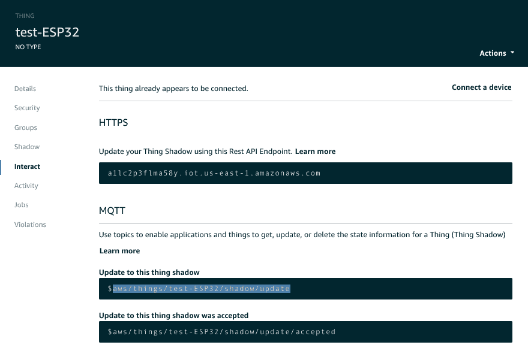](https://res.cloudinary.com/practicaldev/image/fetch/s--g6S1xQ9a--/c_limit%2Cf_auto%2Cfl_progressive%2Cq_auto%2Cw_880/https://indeema.cimg/articles/the-non-primitive-approach-of-amazon-how-aws-iot-meets-iot-challenges/14.png)

之后订阅选定的题目，等待数据。

[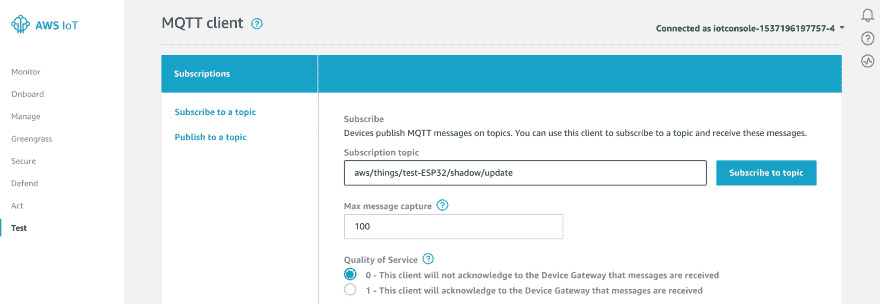](https://res.cloudinary.com/practicaldev/image/fetch/s--Bd5kIiq_--/c_limit%2Cf_auto%2Cfl_progressive%2Cq_auto%2Cw_880/https://indeema.cimg/articles/the-non-primitive-approach-of-amazon-how-aws-iot-meets-iot-challenges/15.png)

[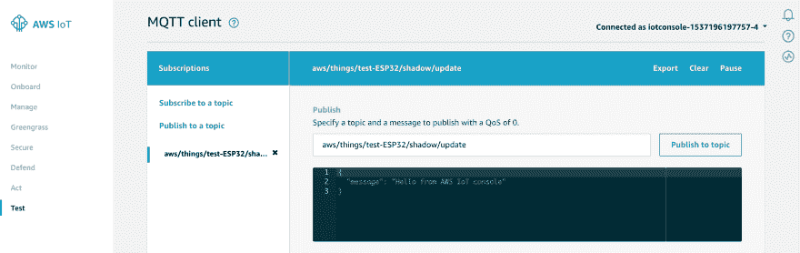](https://res.cloudinary.com/practicaldev/image/fetch/s--P_71hSQM--/c_limit%2Cf_auto%2Cfl_progressive%2Cq_auto%2Cw_880/https://indeema.cimg/articles/the-non-primitive-approach-of-amazon-how-aws-iot-meets-iot-challenges/16.png)

几秒钟后，我们将看到 MQTT 代理成功接收到数据。

[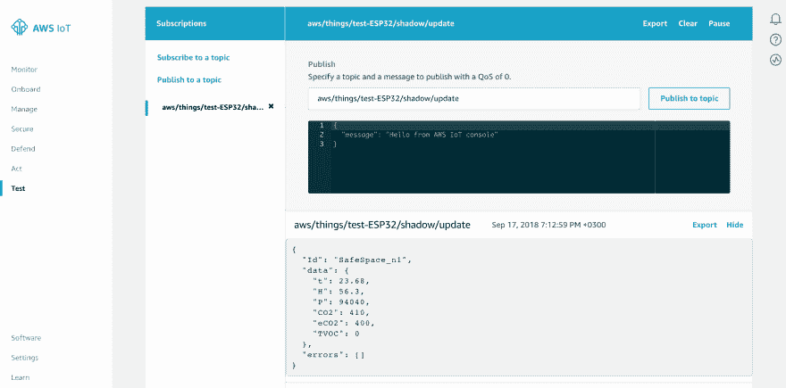](https://res.cloudinary.com/practicaldev/image/fetch/s--HRMYVtf9--/c_limit%2Cf_auto%2Cfl_progressive%2Cq_auto%2Cw_880/https://indeema.cimg/articles/the-non-primitive-approach-of-amazon-how-aws-iot-meets-iot-challenges/17.png)

最后，我们可以在 AWS 物联网服务或我们自己的解决方案的帮助下收集、分析和可视化我们的数据。

**美中不足的是**

前面提到的都太乐观了，对吗？这很好解释，因为亚马逊的资本化意味着它的物联网开发者远不只是一个庭院团队。然而，有一个问题可以被认为是亚马逊物联网服务整个方法的一个具体缺点。我们应该再次回到安全实践上来。举个生动的例子不会有坏处。

就看看[一位从安全角度推广 AWS 物联网服务的专业人士建议的](https://searchaws.techtarget.com/tip/Enlist-AWS-IoT-security-tools-to-defend-your-network)是什么吧。与赞扬 AWS 物联网提供的铁一般的安全性的整个内容相比，最后的建议是一些琐碎的建议，如更改默认密码，使用加密，分配专用的物联网材料等。如果我们将 AWS 物联网替换为内容中一些更差的解决方案，这些建议听起来会更相关。安全总比后悔好？多余的过度反应？

事实上不是。这是一个可悲的事实，它意味着相当大一部分人的因素仍然必须参与安全实践，无论他们是属于亚马逊还是其他一些物联网服务提供商。人为因素总是意味着错误和误用。

那么，亚马逊的物联网开发者在安全性方面遗漏了哪项技术呢？我们敢假设，像亚马逊这样的数字巨头是时候开始开发基于 DLT(分布式账本技术)的解决方案了。一旦 DLTs 的本质意味着在某种程度上消除数字交互中的人为因素，就没有什么可以阻止亚马逊在 AWS 物联网解决方案中使用 IOTA Tangle、Hashgraph，甚至是专有的定制分布式账本。即使是一个功能非常有限的基于 DLT 的简单试用解决方案也比没有好，因为它遵循了有前途的 IT 趋势(毫无疑问，DLT 是当今最热门的趋势之一！)将代表亚马逊成为最进步的物联网服务提供商。而且，谁知道呢，也许关于默认密码和注册设备的琐碎安全建议甚至不再有必要了。

在本文中，我们已经尽了最大努力来展示 AWS 物联网服务的基本特性。希望你能理解我们的努力。除了已经描述的 AWS 和 Predix 平台，我们还将研究其他[物联网解决方案](https://indeema.com/blog/how-we-created-iot-system-for-managing-solar-energy-usage)，如 IBM Watson、MS Azure 和 Google IoT。请关注我们的帖子，并向我们建议您希望我们在物联网环境中研究的其他内容。