# 如何快速简单地调试 Chrome 中的 Javascript

> 原文:[https://dev . to/indeem software/how-to-debug-JavaScript-in-chrome-quick-and-easy-5823](https://dev.to/indeemasoftware/how-to-debug-javascript-in-chrome-quick-and-easy-5823)

概观

* * *

原文- [如何在 Chrome 中调试 Javascript](https://indeema.com/blog/how-to-debug-javascript-in-chrome-quick-and-easy)

在本文中，您将了解如何使用 Chrome DevTools 和 VS 代码在前端和后端调试 JavaScript 代码。

目标

* * *

1.  学习调试前端和角度
2.  分析如何调试 Node.js

## 前端 JavaScript/角度调试

目前，很多工具，如 Chrome DevTools(也称为 chrome debugger)和 Firefox 开发工具都支持前端调试。虽然这两个是最受欢迎的，但其他浏览器也有自己的工具。让我们考虑 Chrome DevTools 来进行我们的消除 bug 的冒险。

### 调试 JavaScript

说实话，调试有时候真的很费时间。尤其是如果简单的命令比如 **console.log()** 或者 **window.alert()** 。

您必须编写并删除额外的代码，有时，您甚至可以提交包含这些方法的代码(即使您认为已经删除了它们)。但是如果设置了任何 linters，控制台或警报方法将在代码中突出显示。

Chrome DevTools 带着一个崇高的使命走上舞台，在没有这些繁琐工具的情况下调试代码。在它的其他福利中，CSS 和 HTML 编辑、测试网络和网站速度是我们最喜欢的。

让我们用 JavaScript 方法 **getData()** 创建一个简单的 web 页面，它简单地从 **name** 输入字段中收集数据，创建一个带有 **dataSpan ID** 的 DOM 节点，然后将输入字段值添加到那个 **DOM** 元素中。

我们的页面看起来是这样的:

**在 HTML 中:**

[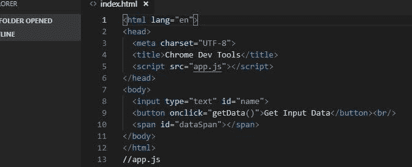T2】](https://res.cloudinary.com/practicaldev/image/fetch/s--OOgbLKi7--/c_limit%2Cf_auto%2Cfl_progressive%2Cq_auto%2Cw_880/https://indeema.cimg/articles/How-to-debug-javascript-in-Chrome-quick-and-easy/1.jpg)

**在 JavaScript 中:**

[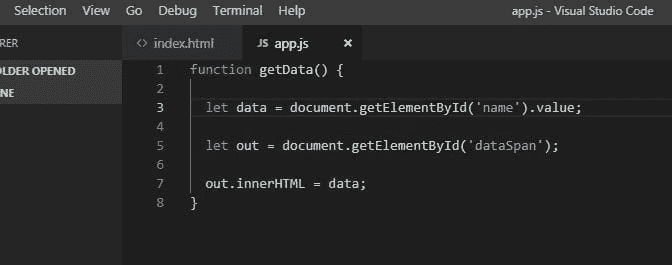T2】](https://res.cloudinary.com/practicaldev/image/fetch/s--0xLwVoHL--/c_limit%2Cf_auto%2Cfl_progressive%2Cq_auto%2Cw_880/https://indeema.cimg/articles/How-to-debug-javascript-in-Chrome-quick-and-easy/2.jpg)

先存到 **app.js** 名下吧。

页面在浏览器中就是这样出现的:\
[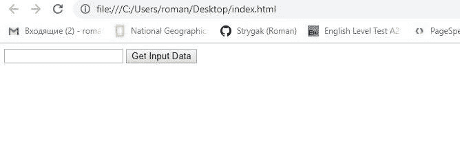](https://res.cloudinary.com/practicaldev/image/fetch/s--znJSG3gR--/c_limit%2Cf_auto%2Cfl_progressive%2Cq_auto%2Cw_880/https://indeema.cimg/articles/How-to-debug-javascript-in-Chrome-quick-and-easy/3.jpg)

为了在将该方法存储到 **dataSpan** 中之前查看它是如何工作的，我们可以使用老式的 **console.log(data)** 或 **window.alert(data)** 。下面是我们在 VS 代码中启动文件时将看到的内容:

[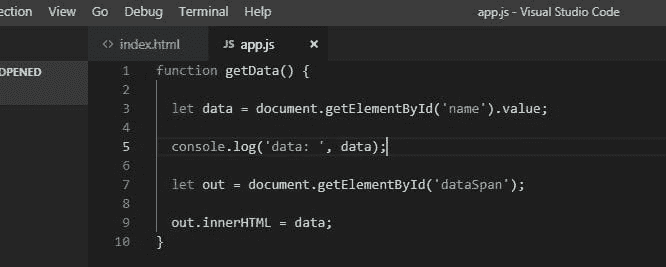T2】](https://res.cloudinary.com/practicaldev/image/fetch/s--JPJd81KN--/c_limit%2Cf_auto%2Cfl_progressive%2Cq_auto%2Cw_880/https://indeema.cimg/articles/How-to-debug-javascript-in-Chrome-quick-and-easy/22.jpg)

然而，这是最原始的方法。

因此，取而代之的是，我们将使用 **Chrome DevTools** 并使用断点验证一切是否如我们计划的那样工作。

**断点**只是一行代码，我们希望在此处停止运行代码，以准确检查它如何工作(或不工作)。

回到正题，让我们在 Google Chrome 中启动页面:

1.  要打开 Chrome 开发工具，在浏览器的右上角，点击打开**自定义和控制谷歌 Chrome** 菜单。
2.  从菜单中选择**更多工具**，然后选择**开发者工具**。

或者，我们可以使用 **Ctrl+Shift+I** 键盘快捷键(我们更喜欢这种方法，但这取决于您)。

[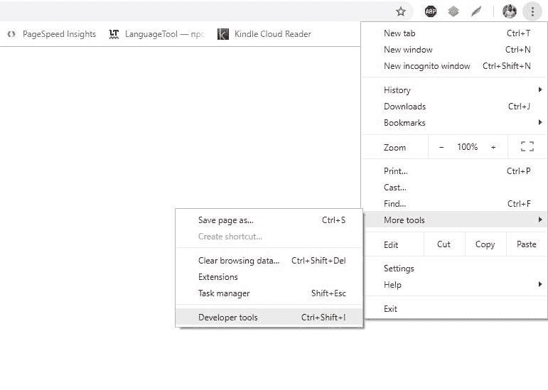T2】](https://res.cloudinary.com/practicaldev/image/fetch/s--sIm744o0--/c_limit%2Cf_auto%2Cfl_progressive%2Cq_auto%2Cw_880/https://indeema.cimg/articles/How-to-debug-javascript-in-Chrome-quick-and-easy/4.jpg)

进入后，让我们在断点处暂停代码:

1.  随着 **Chrome DevTools** 的启动，选择**源**标签。
2.  从 **Sources** 窗格的**页面**视图中，选择 **app.js** (我们之前创建的 JavaScript 文件)。
3.  在**编辑器窗格**的左边，让 data**= document . getelementbyid(' name ')。价值；**行代码，点击行号 **3** 。

准备就绪后，我们将设置一个**代码行断点**，它用蓝色突出显示，这样我们就可以看到我们设置它的确切位置。还要注意，在 **JavaScript 调试**窗格中，所选变量的名称会自动添加到**断点>本地**部分。

### 管理功能执行的增量

设置断点意味着函数将在断点处停止执行。然后，我们必须逐行执行代码来检查变量的变化。

在 **JavaScript 调试**窗格的左上角是基本的断点运行命令:

[T2】](https://res.cloudinary.com/practicaldev/image/fetch/s--T2bGcEWt--/c_limit%2Cf_auto%2Cfl_progressive%2Cq_auto%2Cw_880/https://indeema.cimg/articles/How-to-debug-javascript-in-Chrome-quick-and-easy/6.jpg)

第一个， **Resume script execution** 按钮将继续执行代码，直到代码结束或下一个断点。

让我们在名称字段中输入 **hello world** 。这条线将随着数据 **=【你好世界】**而扩展。现在让我们点击**跳过**下一个函数调用按钮。

[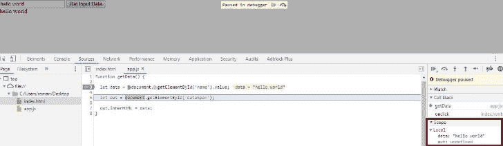T2】](https://res.cloudinary.com/practicaldev/image/fetch/s--LAH11I6b--/c_limit%2Cf_auto%2Cfl_progressive%2Cq_auto%2Cw_880/https://indeema.cimg/articles/How-to-debug-javascript-in-Chrome-quick-and-easy/7.jpg)

执行选定的断点行，调试器将选择下一行。展开**范围**窗格，查看**数据**变量的值。已经改成了我们之前进入的“ **hello world** ”。它只是在特定的代码行显示我们的变量。再次点击**跳过** **下一个函数调用**运行所选方法并进入下一行。

如果刷新页面，变量 **out** 的值将被更新到 DOM 元素。在变量的左边，你可以点击**展开**()图标来查看它的值。如果点击**跳过** **下一个函数调用**，浏览器中的“hello world”文本将再次添加到**数据面板**中。

### 更复杂的 Javascript 调试

假设我们想要执行更复杂的函数，这肯定需要一些调试。例如，我们希望用户输入空格分隔的数字。然后，该函数将计算并输出这些数字、它们的总和以及乘法结果(乘积)。

[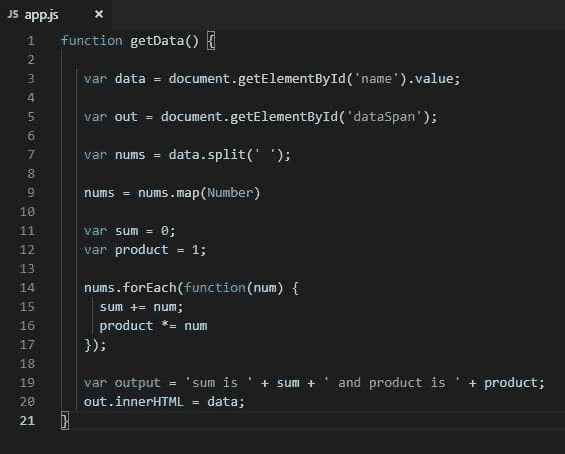T2】](https://res.cloudinary.com/practicaldev/image/fetch/s--H-QcY46u--/c_limit%2Cf_auto%2Cfl_progressive%2Cq_auto%2Cw_880/https://indeema.cimg/articles/How-to-debug-javascript-in-Chrome-quick-and-easy/8.jpg)

为此，我们将修改我们的 app.js，使其看起来像上面的屏幕截图。让我们刷新页面并进行一些调试:

[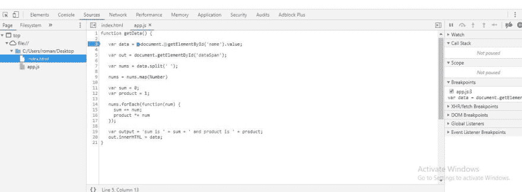T2】](https://res.cloudinary.com/practicaldev/image/fetch/s--Sv-wlDeK--/c_limit%2Cf_auto%2Cfl_progressive%2Cq_auto%2Cw_880/https://indeema.cimg/articles/How-to-debug-javascript-in-Chrome-quick-and-easy/9.jpg)

1.  点击 **3** ，let data = document . getelementbyid(' name ')的行号。价值；，以设置断点。
2.  在浏览器的输入栏中输入 **23 24 e** 。在这里，我们有意地将数字和一个字母相加来产生一个错误——它们不能相加或相乘。
3.  点击**步过** **下一个函数调用**。

在屏幕截图上，我们可以看到 sum 和 product 都有一个 NaN(不是数字)值。这表明我们必须马上修复我们的代码。

### 设置断点的另一种方式

在大多数情况下，您的代码要长得多，并且可能被连接成一行。例如，假设我们有 1000 行代码。在这种情况下，通过每次点击行号来设置断点看起来很不现实，不是吗？

为此，DevTools 提供了一个优秀的工具，用于在与浏览器交互时设置事件断点。在 **JavaScript 调试**窗格中，点击**事件监听器断点**来展开事件类别。

[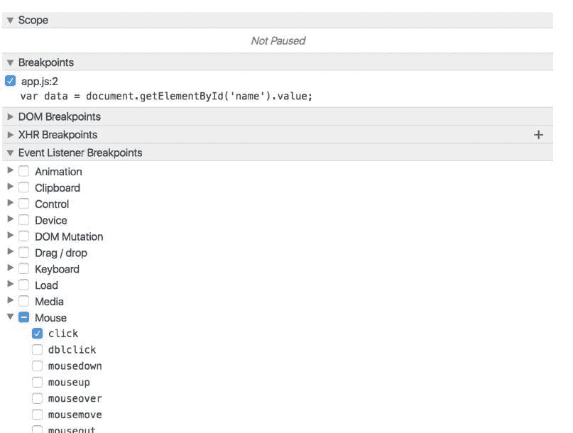T2】](https://res.cloudinary.com/practicaldev/image/fetch/s--PTa7pNji--/c_limit%2Cf_auto%2Cfl_progressive%2Cq_auto%2Cw_880/https://indeema.cimg/articles/How-to-debug-javascript-in-Chrome-quick-and-easy/11.jpg)

正如你所看到的，我们已经在代码中的任何地方为**鼠标>点击**事件设置了一个断点。所以，不需要手动添加断点，当你点击**获取输入数据**按钮时，执行将在这个 **onclick** 事件上暂停。

[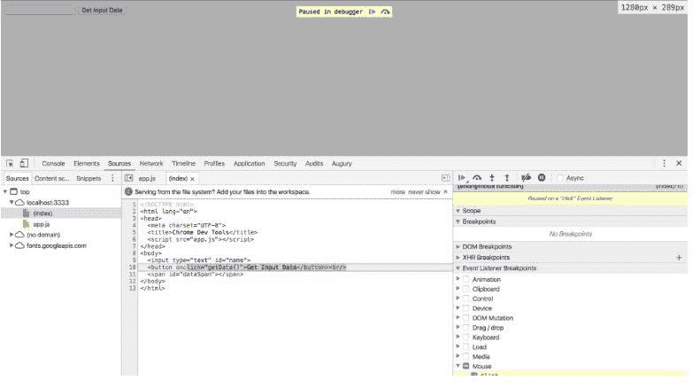T2】](https://res.cloudinary.com/practicaldev/image/fetch/s--5MzOoinm--/c_limit%2Cf_auto%2Cfl_progressive%2Cq_auto%2Cw_880/https://indeema.cimg/articles/How-to-debug-javascript-in-Chrome-quick-and-easy/12.jpg)

点击**跳过** **下一个函数调用**将依次引导我们通过用于处理点击动作的代码。

通过**事件监听器断点**，您可以在多种事件类型上设置断点，例如键盘、触摸和 XHR。

### “调试器”关键字

当你在代码的任何地方键入 **debugger** 关键字时，Chrome DevTools 会在那一行暂停执行，并像对待断点一样高亮显示。你可以用这个工具在 Chrome 或者其他浏览器中调试 JavaScript。完成后，记得从代码中删除这个单词。

[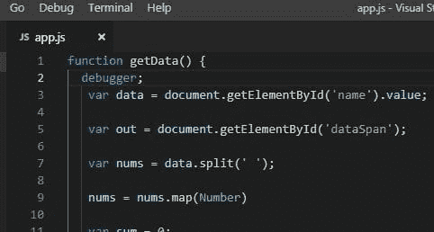T2】](https://res.cloudinary.com/practicaldev/image/fetch/s--4iTJvJ85--/c_limit%2Cf_auto%2Cfl_progressive%2Cq_auto%2Cw_880/https://indeema.cimg/articles/How-to-debug-javascript-in-Chrome-quick-and-easy/13.jpg)

上面截图中的代码将暂停在包含调试器单词的那一行，并将启动 Chrome DevTools。这相当于在特定的代码行上设置一个断点。您也可以像我们之前所做的那样，使用**单步执行下一个函数调用**和**单步执行下一个函数调用**按钮来管理代码执行。

### 总结一下

一开始，我们考虑了 **console.log()** 和 **window.alert()** ，发现它们并不是真的有用。我们应该在整个代码中大量使用它们，如果我们在提交时忘记删除这些命令，会使代码变得更重更慢。

随着代码的增长，Chrome 开发者工具可以更有效地捕捉任何错误并评估总体性能。

### 如何调试角形

通过 Visual Studio 代码(VS 代码)调试 Angular 代码最简单的方法。要开始调试，您需要在 Chrome 浏览器上安装[调试器](https://marketplace.visualstudio.com/items?itemName=msjsdiag.debugger-for-chrome)扩展:

1.  启动当前项目的 VS 代码，打开**扩展**标签。或者按键盘上的 **Ctrl+Shift+X** 。
2.  在搜索栏中输入 **Chrome** 。
3.  从搜索结果中，选择 Chrome 的**调试器**，点击**安装**。
4.  安装完扩展后，会出现**重新加载**按钮。单击它以完成安装并在浏览器中激活调试器。

### 设置断点

正如我们之前所做的，在 **app.component.ts** 中，点击该行左边的行号。设置的断点将用红色圆圈图标表示。

[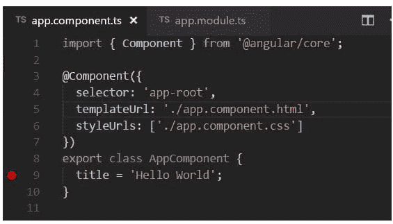T2】](https://res.cloudinary.com/practicaldev/image/fetch/s--xabqhGmt--/c_limit%2Cf_auto%2Cfl_progressive%2Cq_auto%2Cw_880/https://indeema.cimg/articles/How-to-debug-javascript-in-Chrome-quick-and-easy/14.jpg)

### 调试器配置

首先，我们需要配置调试器:

1.  从**文件浏览器**，导航到**调试**视图。也可以使用 Ctrl+Shift+D 快捷键。
2.  点击**设置**图标按钮，创建 **launch.json** 。这是我们将使用的配置文件。
3.  从**选择环境**下拉菜单中，选择 **Chrome** 。这将创建一个新的。**项目中带有 **launch.json** 文件的 vscode** 文件夹。
4.  启动文件。
5.  为了适应我们的目的，在 **url** 方法中，将本地主机端口从 8080 更改为 4200。
6.  保存更改。您的文件将如下所示:\ 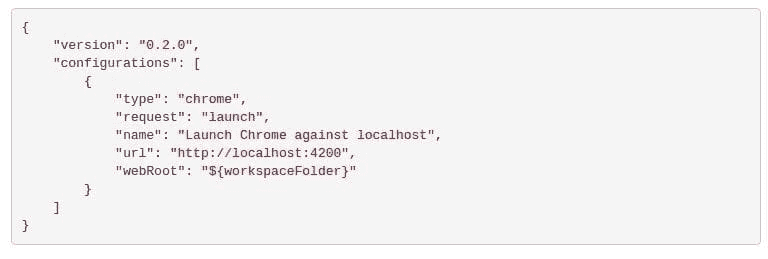
7.  按键盘上的 **F5** 或点击**开始调试**按钮启动调试器。
8.  推出 Chrome。
9.  刷新页面以在设置的断点处暂停代码。

[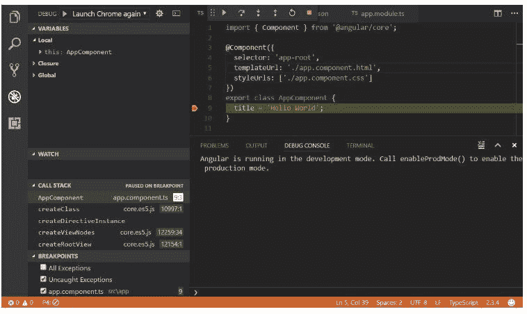T2】](https://res.cloudinary.com/practicaldev/image/fetch/s---k5EArTj--/c_limit%2Cf_auto%2Cfl_progressive%2Cq_auto%2Cw_880/https://indeema.cimg/articles/How-to-debug-javascript-in-Chrome-quick-and-easy/16.jpg)

您可以使用 F10 按钮检查变量及其变化，依次浏览代码。

[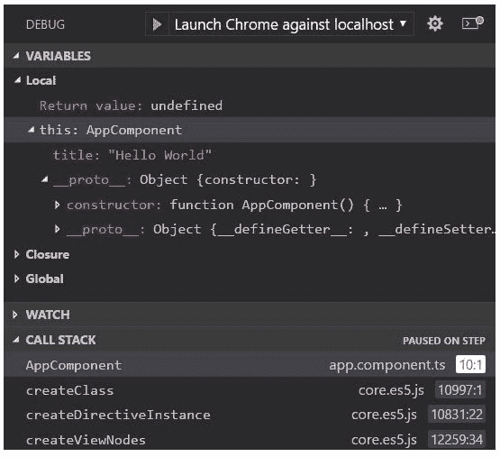T2】](https://res.cloudinary.com/practicaldev/image/fetch/s--1-cTd8X5--/c_limit%2Cf_auto%2Cfl_progressive%2Cq_auto%2Cw_880/https://indeema.cimg/articles/How-to-debug-javascript-in-Chrome-quick-and-easy/17.jpg)

### 自述

Chrome extension 的调试器包含了很多关于额外配置、使用 sourcemaps 和解决各种问题的信息。您可以通过点击扩展并选择 **Details** 选项卡直接在 VS 代码中查看它们。

[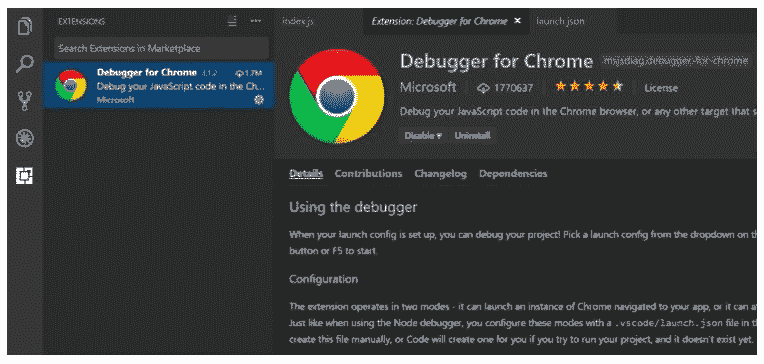T2】](https://res.cloudinary.com/practicaldev/image/fetch/s--Vz9ComHU--/c_limit%2Cf_auto%2Cfl_progressive%2Cq_auto%2Cw_880/https://indeema.cimg/articles/How-to-debug-javascript-in-Chrome-quick-and-easy/18.jpg)

## 如何调试后端(Node.js)

在这里，您将了解如何调试 Node.js 代码。以下是最常见的方法:

*   使用 Chrome DevTools(嗯，这是目前为止我们最喜欢的)。
*   使用 Visual Studio Code、Visual Studio、WebStorm 等 ide。

我们将使用 VS 代码和 Chrome DevTools 进行说明。

Chrome 和 Node.js 使用相同的 JavaScript 引擎 Google V8，这意味着我们可以使用我们用于前端调试的工具。

为此:

1.  用 VS 代码启动你的项目。
2.  导航至**控制台**选项卡。
3.  输入或粘贴 **npm 启动-检查**命令，按**进入**。
4.  忽略建议的“chrome-devtools://...”URL(有更好的方法)。\ 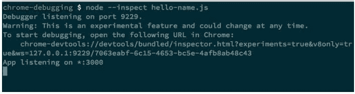
5.  启动 Chrome，输入或粘贴“ **about:inspect** ”。这将把您重定向到 DevTools 的**设备**页面。
6.  点击**打开节点**的专用开发工具超链接。

[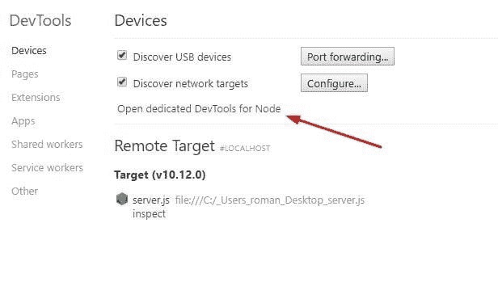T2】](https://res.cloudinary.com/practicaldev/image/fetch/s--Fj1-4gXe--/c_limit%2Cf_auto%2Cfl_progressive%2Cq_auto%2Cw_880/https://indeema.cimg/articles/How-to-debug-javascript-in-Chrome-quick-and-easy/20.jpg)

node.js 调试过程与我们在前端使用断点的方式相同。这是非常有用的，你不需要切换到 IDE。这样，后端和前端都可以使用同一个接口进行调试。

感谢阅读，希望你喜欢这篇文章。订阅我们的更新，我们还有很多更酷的东西:)