# 为什么以及何时应该使用 React with Ruby on Rails

> 原文:[https://dev . to/solute labs/why-and-when-you-use-react-with-ruby-on-rails-2 CFC](https://dev.to/solutelabs/why-and-when-should-you-use-react-with-ruby-on-rails-2cfc)

除了编码和经营一家 RoR 发展机构，独自旅行是我非常喜欢的另一件事。在一次去柬埔寨的旅行中，我碰巧遇到了一位美国退伍军人。这次邂逅让我和一个陌生人进行了人生中最棒的一次对话。它改变了我对生活和事业的看法。

当我们在讨论他的经历和冒险时，话题转向了视野狭窄。

> 您可能想知道，这种对话与 React 和 Ruby on Rails 有什么关系？

任何一个在军队中的人都知道在训练期间教给他们的一个基本课程- **情景意识**。

对这些人来说，关注细节是非常重要的。对他们来说这是生死关头。如果他们倾向于只关注大事情，而忽略较小的细节，这可能是胜利和失败的区别。

记住绊网的细节，谁在监视谁，坐标等等。对他们来说很重要。他们被训练成没有隧道视野，而是有周边视野。他们对事物有 180 度的视角，也就是说，他们不用移动眼睛就能看到左右两边的东西。

同样，当涉及到开发产品时，作为一名开发人员，你的责任不仅仅是技术。人们必须意识到以下事情(正如弗朗索瓦·兰蒂尔·纳多在这篇[文章](https://medium.com/free-code-camp/a-basic-guide-to-choosing-the-right-tech-stack-for-client-work-adbd0e056742)中所强调的)

*   客户的业务及其面临的问题
*   时间框架和预算需求
*   需要构建什么，预期结果是什么？
*   什么样的技术组合是正确的？你不想参与过度杀戮和产品动力不足。
*   有人有技术专长来处理它吗？
*   产品的技术债务和安全性呢？

如果你正在思考这一切，谢天谢地，你有一个周边视野。

因此，在使用任何技术为任何客户制造任何产品之前，我总是牢记 veteranís 的体验。

在我们的 [RoR 咨询公司](https://www.solutelabs.com/ruby-on-rails-development-services/)，我们为我们的副业项目做了大量的技术实验，以确保我们为客户选择了正确的技术。最近，关于使用 React with Ruby on Rails 框架和 2019 年[RoR 是否重要有很多讨论。这促使我在这篇文章中写下我的想法。所以，我们开始吧。](https://blog.solutelabs.com/ruby-on-rails-in-2019-c11956d8cc6f)

# React+Ruby on Rails 的“超能力”的基本原理

[文化 Amp(员工反馈平台)](https://www.cultureamp.com)案例就是一个经典的例子。我偶然发现了工程主管 Jo Cranford 的这个[精彩演讲](https://www.youtube.com/watch?v=GW9qgIYfzEI&t=805s)，她谈到了他们是如何开始使用 React with Ruby on Rails 的。

[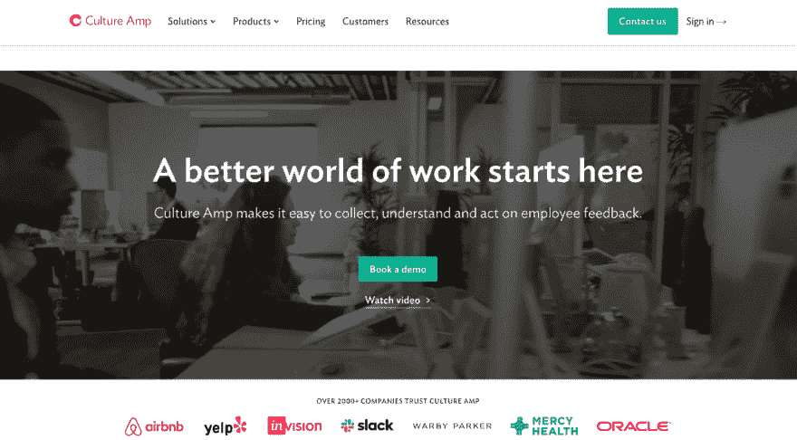T2】](https://res.cloudinary.com/practicaldev/image/fetch/s--hKY0P2vt--/c_limit%2Cf_auto%2Cfl_progressive%2Cq_auto%2Cw_880/https://miro.medium.com/max/1400/0%2AuA0K1zx-5nnfRNq1.png)

大约十年前，文化 Amp 由四个人创立。员工反馈通常由顾问收集，然后他们自己进行分析。这意味着大量的时间花在了分析上。谷歌表单和 SurveyMonkey 是备选方案。

当然，这些提供了实时结果，但很难用数据做任何事情。人们最终还是做了分析。

该团队使用 Ruby on Rails 作为后端，jQuery & Bootstrap 作为前端，组装了一个产品。一些实时分析和结果中的一些基本交互导致了一个功能良好的产品。

请记住，我们在这里谈论的是 2011 年。你现在可能意识到为什么他们首先使用 jQuery，但它在当时是一个非常流行的框架。React 在 2013 年才被开源。

随着时间的推移，该平台需要更多的功能，如复杂的数据分析、权限和类似的其他工具。团队意识到前端仍然不在它应该在的地方。

> 在其他问题中有-意大利面条代码和升级噩梦。修复一个 bug，却看到另一个 bug 迅速出现，这很令人沮丧。

类似的事情也发生在 B2C 应用 FriendsandGuests.com 的贾斯汀·戈登身上。

[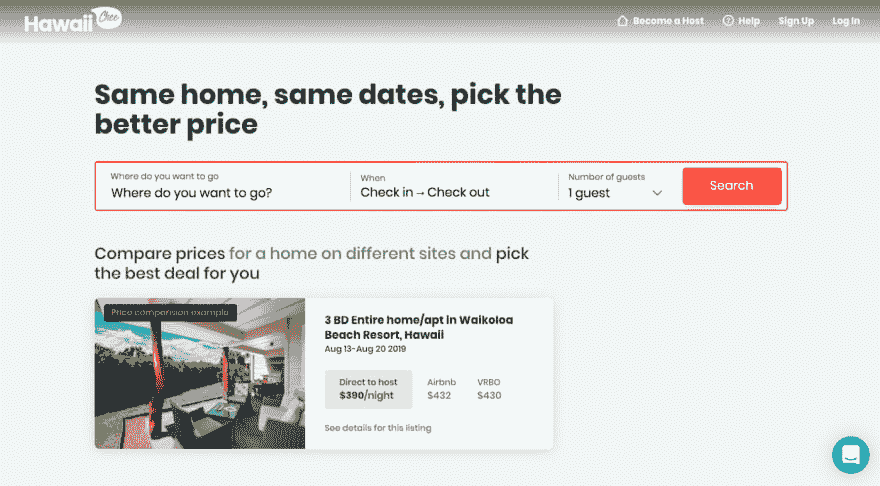T2】](https://res.cloudinary.com/practicaldev/image/fetch/s--JRPhT1mh--/c_limit%2Cf_auto%2Cfl_progressive%2Cq_auto%2Cw_880/https://miro.medium.com/max/1400/0%2A2JPYNpyLmfyrIuEY.png)

想象一下使用 jQuery 和 Rails 在 Airbnb 上构建一个消费者应用程序。这是 2014 年人们的首选。但是这并没有让开发者高兴。

<figure>

[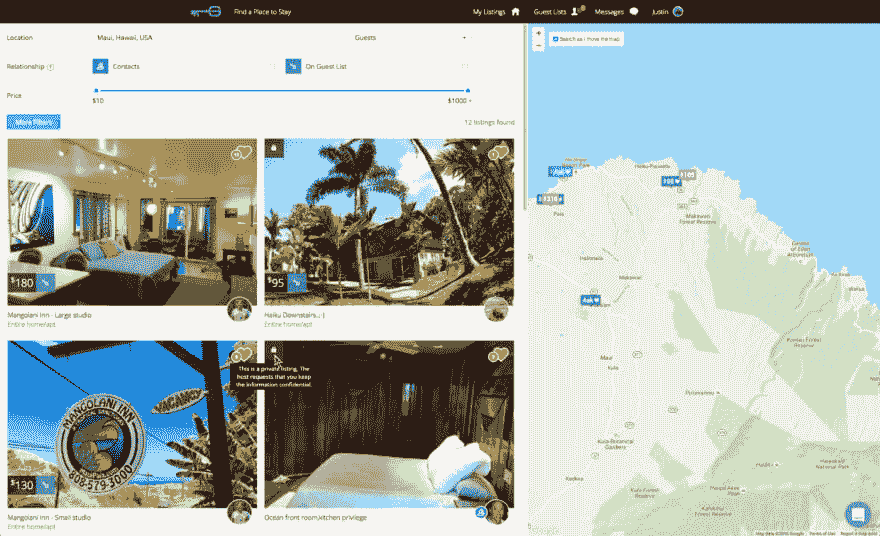T2】](https://res.cloudinary.com/practicaldev/image/fetch/s--WJ4twB_b--/c_limit%2Cf_auto%2Cfl_progressive%2Cq_auto%2Cw_880/https://miro.medium.com/max/1400/0%2AplaN85c3-nawihZX.png)

<figcaption>Image credit - ShakaCode</figcaption>

</figure>

现在，这个 web 应用程序是 Airbnb 和 LinkedIn(隐私选项)的混合体。您能想象在这样的 web 应用程序中使用 jQuery 操作 DOM 元素会是什么样子吗？不仅如此，考虑处理多个 ui，基于交互跟踪元素，同时关注业务逻辑。我确信任何开发者都希望远离这种情况。

这里使用 jQuery 和普通 javascript 还有一个问题。当用户从一个页面跳到下一个页面时，无限地重新加载资源会导致糟糕的 web 性能和用户体验。

正如贾斯汀自己在他的演讲中指出的，在现代 UX 使用 jQuery 是一个大禁忌

# 为什么这些人最终选择了 React with Ruby on Rails？

**缩短服务器响应时间** -网站/网络应用的速度至关重要。一个加载缓慢的应用程序可能会成为商业杀手。许多公司已经证明，通过结合使用 Ruby on Rails 和 React，他们的服务器响应时间缩短了 90%。

HVNM(网上补剂店)就是这方面最好的参考。

[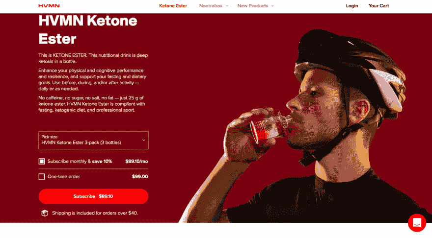T2】](https://res.cloudinary.com/practicaldev/image/fetch/s--DlyiF8z0--/c_limit%2Cf_auto%2Cfl_progressive%2Cq_auto%2Cw_880/https://miro.medium.com/max/1400/0%2A8ft5vPsrXMwcA7MT.png)

任何人都知道网页性能对电子商务搜索引擎优化有多重要。在将 Ruby on Rails 的强大功能用于 React 之前，平均响应时间是 1100 毫秒，现在下降到了 120 毫秒。这意味着更好的用户体验和更多的转化。

*点击此处阅读完整的案例研究[。](https://blog.shakacode.com/hvmns-90-reduction-in-server-response-time-from-react-on-rails-pro-eb08226687db?gi=e2af69960723)T3】*

这一改进是通过使用贾斯汀·戈登开发的 React on Rails Gem 实现的。你可能会争论为什么不使用 Rails/webpacker？它缺乏服务器渲染，这是超级重要的 UX 和搜索引擎优化。

**减少内存使用** - [Egghead.io](https://egghead.io/) 每小时都有很多超时，他们似乎对此一无所知。在部署了[和 Ruby on Rails](https://github.com/shakacode/react_on_rails/wiki/Egghead-React-on-Rails-Pro-Deployment-Highlights) 之后，内存使用和响应时间有了显著的改善。

<figure>

[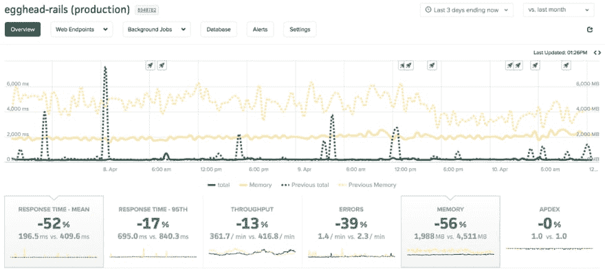T2】](https://res.cloudinary.com/practicaldev/image/fetch/s--fh2EFTAR--/c_limit%2Cf_auto%2Cfl_progressive%2Cq_auto%2Cw_880/https://miro.medium.com/max/1400/0%2AIxqzqdDuOQ5urIaB.png)

<figcaption>Via Github</figcaption>

</figure>

**开发速度、质量&商业模式**——当你最关心的是上市时间时，Rails 与 React 的结合创造了奇迹。如果你正在寻找一个基于免费增值模式的东西，Rails 的工作非常棒。你可能必须尽快扩大规模，但收入会照顾这一点。

另一个重要的方面是，如果你正在试水，你将更快地了解成功/失败，以便做出适当的未来决策。相反，如果你打算从广告收入中获利，并且拥有大量的免费用户，Rails 可能不会选择 React。

学习曲线低(T1)——如果你正在建造一个原型并且时间紧迫，这两种技术都有神奇的效果。用 Ruby on Rails 来发布你的 MVP 并作出反应会更容易、更快。后端使用 RoR，前端使用 React，创建交互式用户界面。

享受稳定的生活 - RoR 有一个很棒的社区做后盾，这里有不一样的东西。React 来自脸书，API 变化不大。所以，你可以期待你的应用有一个稳定的版本。

# 全球 6 家知名 B2B 公司正在使用 React with Ruby on Rails

**[Klarx](https://www.klarx.de/)**

[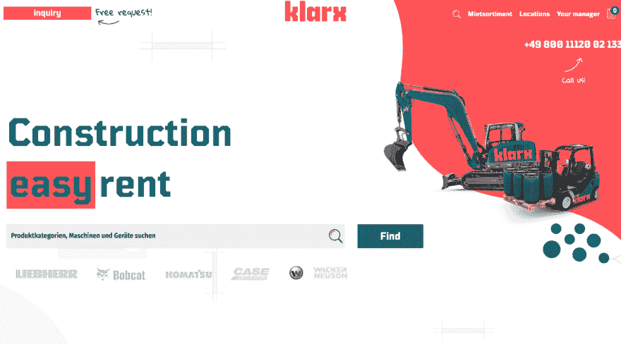T2】](https://res.cloudinary.com/practicaldev/image/fetch/s--KClVPNrm--/c_limit%2Cf_auto%2Cfl_progressive%2Cq_auto%2Cw_880/https://miro.medium.com/max/1400/0%2A1S8mBMVd4fhVvxWC.png)

总部位于德国的建筑机械在线租赁平台使用 Rails 作为业务逻辑，使用 React 作为前端用户体验。

**[Airbnb](https://www.airbnb.co.in/?_set_bev_on_new_domain=1560943052_8dkWcieP7qlonBxo)**

[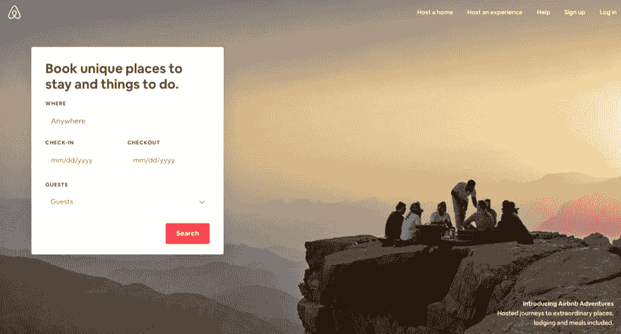T2】](https://res.cloudinary.com/practicaldev/image/fetch/s--y6g1qruC--/c_limit%2Cf_auto%2Cfl_progressive%2Cq_auto%2Cw_880/https://miro.medium.com/max/1400/0%2AyDtBh_6BpLv_a7ej.png)

使用 Ruby 作为主要编程语言，Rails 用于服务器端配置，React 用于 UI 端。

**[兴致勃勃](https://gusto.com/)**

[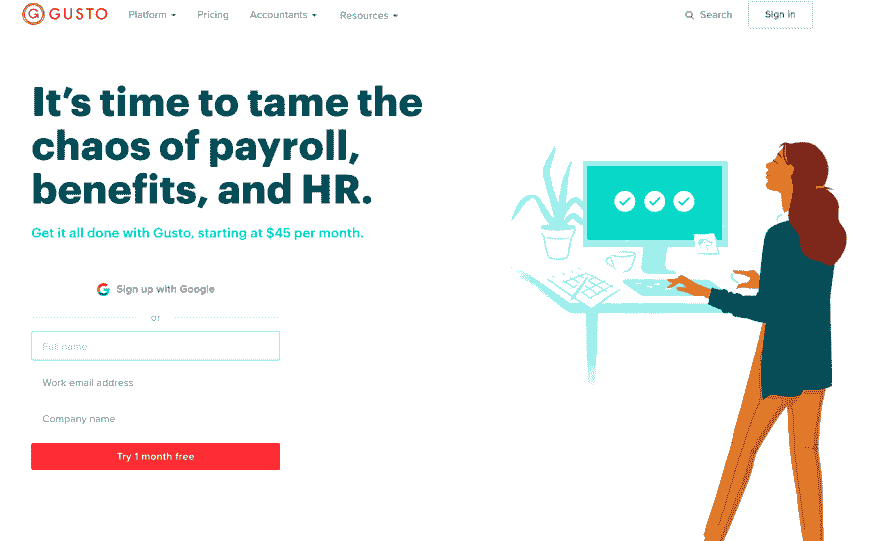T2】](https://res.cloudinary.com/practicaldev/image/fetch/s--pGjlXuGw--/c_limit%2Cf_auto%2Cfl_progressive%2Cq_auto%2Cw_880/https://miro.medium.com/max/1266/0%2A_tMjvTkWw662aTm3.png)

[在线薪资平台](https://stackshare.io/gusto/how-gusto-processes-billions-of-dollars-in-annual-payroll)在其主堆栈中使用 Rails 和 React 来处理数十亿美元的在线薪资。Rails 之所以被选为主要语言，是因为他们可以快速推出自己的产品。

**[task rabbit](https://www.taskrabbit.com/)T3**

[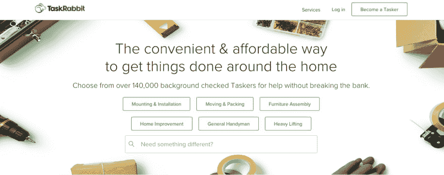T2】](https://res.cloudinary.com/practicaldev/image/fetch/s--hG4bGbXU--/c_limit%2Cf_auto%2Cfl_progressive%2Cq_auto%2Cw_880/https://miro.medium.com/max/1400/0%2ATkcsnD88bG1X9t6p.png)

TaskRabbit 的 Brian Leonard 解释了他们决定同时使用 React 和 Rails 的原因——React 是 Javascript 开发思维方式的一个进步。用简单的输入/输出范式处理世界减少了错误，提高了速度。更好的是，React Native 允许有效的跨平台开发，但仍然感觉是本机的。对于如何让它们一起工作，没有一个清晰的路径(关于使用 React with)。我们决定与资产管道整合，而且效果很好

**[开门](https://www.opendoor.com/)**

[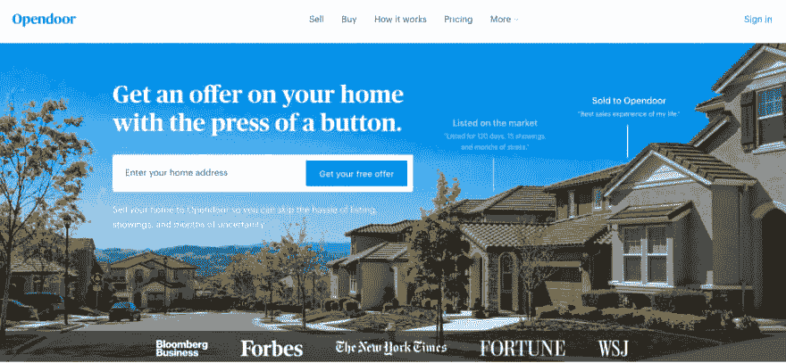T2】](https://res.cloudinary.com/practicaldev/image/fetch/s--EEWVu8c4--/c_limit%2Cf_auto%2Cfl_progressive%2Cq_auto%2Cw_880/https://miro.medium.com/max/1400/0%2Ao2ptlmI3XKWwCTNQ.png)

已经处理了 4800 多宗房地产交易和 10 亿美元的销售额， [Opendoor](https://stackshare.io/opendoor/the-stack-that-helped-opendoor-buy-and-sell-over-%241b-in-homes) 是任何想在美国买卖房产的人的首选网站。当他们在 2014 年启动时，RoR 和 Angular 被用来建立 MVP(一个多页表格)。他们逐渐转向对前端做出反应。

**卡斯珀 T3**

[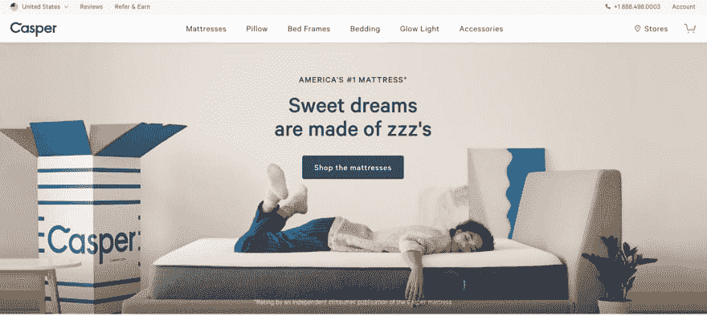T2】](https://res.cloudinary.com/practicaldev/image/fetch/s--ZfbNyeaO--/c_limit%2Cf_auto%2Cfl_progressive%2Cq_auto%2Cw_880/https://miro.medium.com/max/1400/0%2AortiWMmpVb4vC293.png)

他们的 jQuery 代码导致了糟糕的、低效的性能。React 之所以被选中，是因为它的受欢迎程度以及速度和质量的好处。Casper 使用 Redux +React 的混合物，而不是仅仅依赖 Angular。网站前端是静态的，使用 Rails API 端点。他们的收银台也集成了 Rails。

# 结尾注释

老实说，我觉得更多的是一个人对什么感到舒服。当然，人们必须考虑社区、未来发展、框架/技术已经存在多久。最终，它归结为你如何使用技术栈来让你的用户满意。当您构建和扩展大型 web 应用程序时，您肯定需要考虑上述事项，并了解什么是适合您的业务和用户的。

关于您是否一直在使用 Ruby with React 以及您的总体体验如何，请在下面留下您的评论。

感谢阅读！

-
这篇文章最初发表在[溶质实验室博客](https://blog.solutelabs.com/)