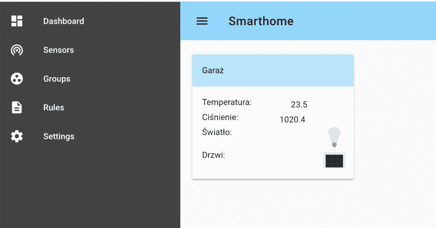
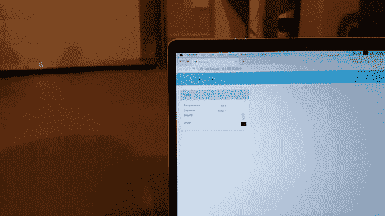
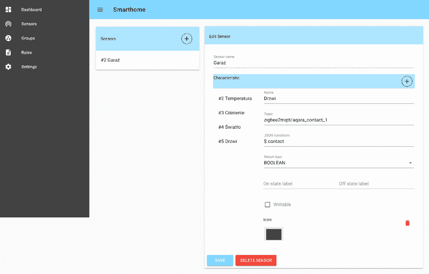
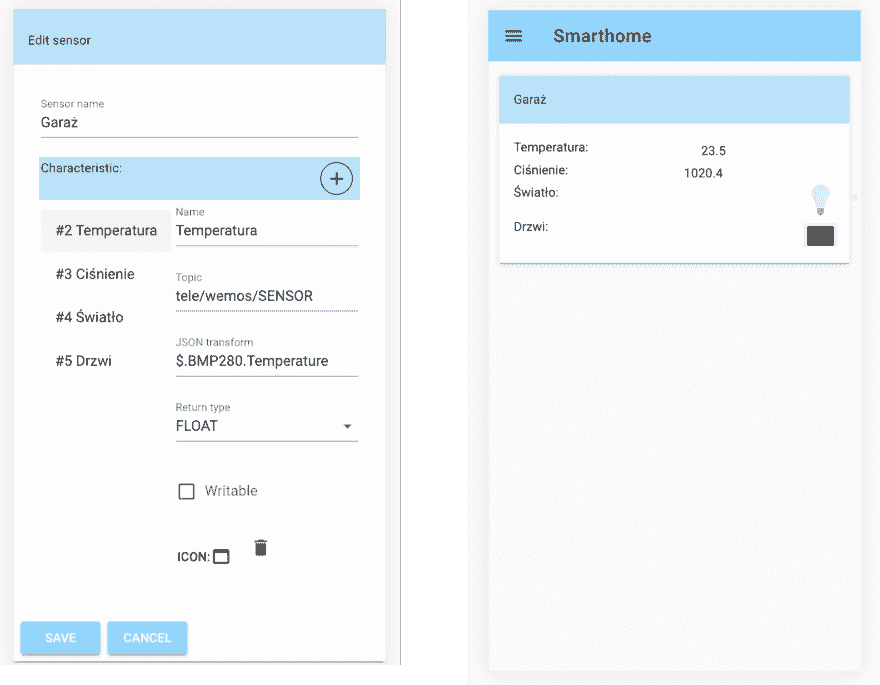

# 简单智能家居系统简介

> 原文：<https://dev.to/netguru/introducing-simple-smarthome-system-1c3i>

一些开发人员喜欢在空闲时间做一些兼职项目。我是其中之一。我总是有一些代码和电子产品躺在周围，等待完成。这次我想在后端测试我的技能，并在这个过程中学到一点东西。我有使用 Kotlin 的经验，所以对我来说显而易见的选择是尝试 Ktor。

这种方法的好处是可以看到 Kotlin 在其他平台上的运行，因为 Kotlin multi platform 可能是我工具箱中的一个有价值的工具。作为前端，我选择了 Vue.js，因为我过去已经尝试过 React。好的，我已经有了工具，但是我应该做什么呢？当我对智能家居仪表板环境中的现有解决方案不满意时，我找到了答案。

我不喜欢现有解决方案的什么？

*   它们很难配置
*   他们有太多的特点
*   它们是通过带有少量文档的配置文件来配置的

所以我决定自己造一个。能有多难？

半年多后，我为您呈现简单的智能家居系统:

在手机上也有效:

我能做什么

*   它可以显示设备的最新状态。
*   将设备按逻辑分组，如房间或车库
*   将事件发送回 mqtt 代理

少了什么？

*   可以根据事件改变传感器状态的规则引擎。

在开发 SSS 时，我尝试遵循几个概念:

1.  它基于 MQTT。MQTT 是物联网世界的标准，已经有很多设备支持它。
2.  它应该很容易与我使用的两个工具集成: [zigbee2mqtt](https://www.zigbee2mqtt.io/) (网关软件，允许你使用专有的 zigbee 设备而无需专有网关)和 [Tasmota](https://github.com/arendst/Sonoff-Tasmota) (基于 ESP8622 芯片的设备的开源固件)。
3.  一切都应该通过用户界面配置。

安装详情和源代码请见 [github](https://github.com/netguru/smarthome) 。

在开发过程中，我学到了一些东西。我想我更喜欢 React 而不是 Vue。Vue 的 MVVM 方法很好，但是可观察变量并不总是像预期的那样工作。即使在后端，Kotlin 也是一流的技术，但是 Ktor 一点也不固执己见，所以我需要弄清楚很多事情，比如使用哪个数据库，什么是数据库连接池:)

我需要提到 Netguru 在开发这个工具时给予的巨大支持。不仅我有机会在这里推广它，在 netguru github 上主持它，而且 Vue 团队的优秀人员也帮助我完成了这个框架。在 Netguru 成长是一种享受:)