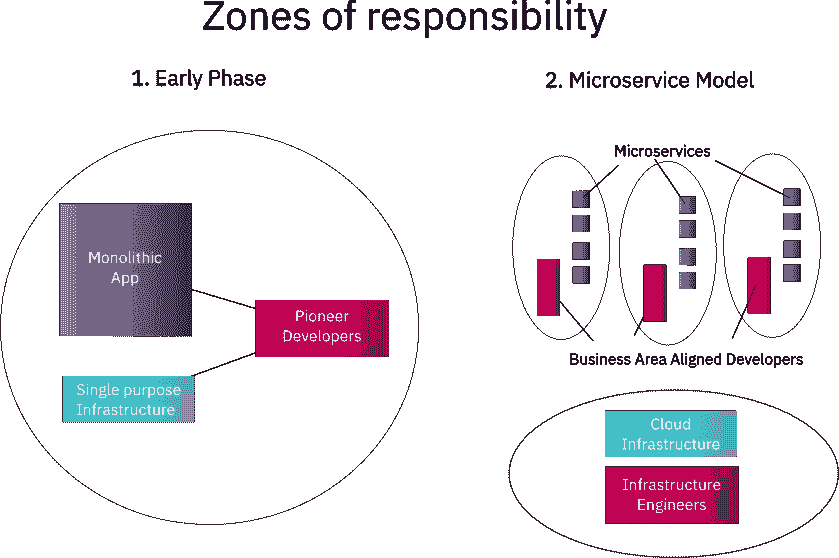
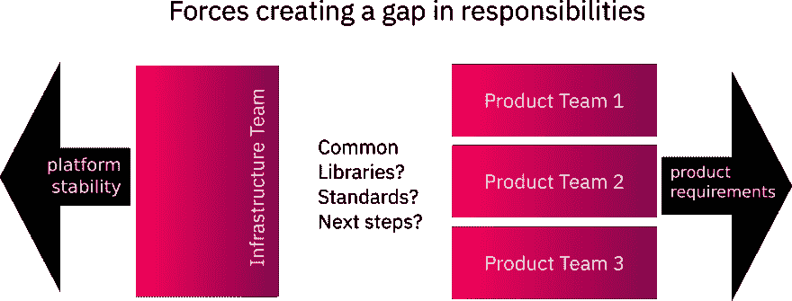
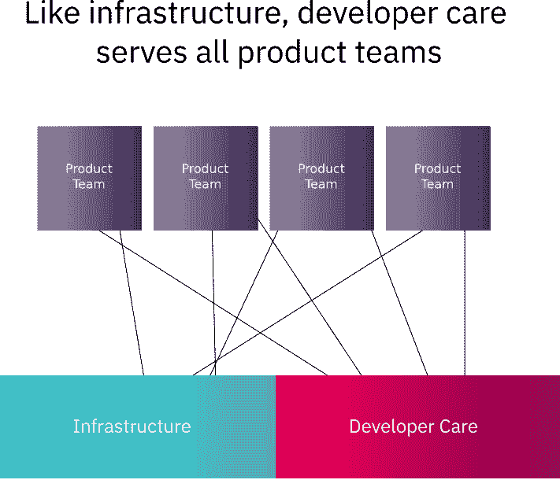

# 开发者关怀

> 原文:[https://dev.to/heetch/developer-care-22i](https://dev.to/heetch/developer-care-22i)

这篇文章最初出现在 [Heetch 工程博客](https://eng.heetch.com/developer-care-3e22a4d7ff54)上。

# 简介

在这篇文章中，我们将谈论我们在 Heetch 扩大开发团队的经验。特别是，我们将关注成长和技术变革中出现的组织问题。最后，我们将介绍“开发者关怀”的概念，以及我们如何用它来克服这些挑战。

# 一点历史

在希契的早期，生活很简单。我们有一个用 Ruby on Rails 开发的整体式 web 应用程序和一个小型的先锋团队。在这一点上，沟通是容易的。每个人都知道谁在做什么。想法被自由地分享。在如何、何时和为什么做事上达成了共识。

随着 Heetch 用户群的增长，我们开始遇到技术挑战。处理应用程序增加的负载变得越来越困难。我们必须实时处理数千名司机的位置数据。

我们开始努力将业务不同方面的竞争需求集成到一个应用程序中。正是在这种背景下，我们决定转向微服务架构，利用 Docker，并用 Go 编写。后来，我们在 Elixir 中添加了更多的服务。

根据这个新的技术架构，我们的开发团队分成了特定于产品领域的团队。每个团队负责自己的需求列表。每个团队都有自己的微服务集合。一个独立的基础设施团队提供了一个公共平台来运行微服务。

[T2】](https://res.cloudinary.com/practicaldev/image/fetch/s--3oJDcSM4--/c_limit%2Cf_auto%2Cfl_progressive%2Cq_auto%2Cw_880/https://miro.medium.com/max/839/1%2Alt2LO1baCQvKPQKcCCxV0g.png)

# 一个问题解决了，一个问题发现了

Heetch 的微服务架构和相关的业务领域一致的团队结构已经存在一段时间了。这些团队已经成功地工作，并在紧密关注业务需求的情况下成长，并且摆脱了对相同应用程序逻辑和数据结构的竞争需求的复杂性。

尽管取得了这些成功，但我们也看到了随之而来的新问题。

# 队伍之间的距离

尽管每个单独的团队都保留了先锋团队中存在的交流的便利性，但是跨团队的交流更加难以管理。这是大型或成长型公司的常见问题，但我们注意到这对我们的技术输出有特定的影响。

共同的背景和共享的想法不再是整个工程团队互动的自然结果——根本不可能进行那种规模的非正式对话。每个团队都不太了解其他团队发现的问题和解决方案。

当每个团队面临新的技术挑战时，他们会找到自己的解决方法。团队中并不缺乏技能，但是每个团队的优先级都与业务需求相关联，截止日期也是如此。这意味着基础架构的设计，以及围绕项目的工具，必须作为产品工作的副产品来完成。

在这种情况下，证明维护和改进这些解决方案的时间是一个挑战，也是一些工程师感到沮丧的原因。

# 拖技术债

为每个团队定制解决方案的缓慢构建给整个公司带来了拖累因素。每个团队都为自己的敏捷性付出了代价，当维护工作不是一个明确的优先事项时，技术债务就会出现。

整个组织在重复努力方面付出了代价，错过了从一个团队产生的好想法中获益的机会。虽然高级管理人员有时可以看到这些机会，但团队的现有结构并不适合分配资源来进行跨团队项目，如果多个团队已经找到或构建了解决方案，这种努力可能会加剧工作重复的问题。

# 对于这些问题缺乏明确的主人

新组织中的共享基础架构团队最初旨在负责上述一些问题，并为这些问题提出解决方案。然而，提供基础云服务和基础设施的业务一直是一个更紧迫的问题。

支持这样的基础设施所需的技能并不总是与构建和维护库和工具所需的技能重叠。这样，当试图解决这类问题时，基础结构团队和产品团队感受到了同样的压力。

众所周知，谷歌开发了他们的网站可靠性工程师角色，以应对运营工程师和开发人员之间的优先事项和技能差异。许多公司也认为 DevOps 的作用是将软件开发和生产需求放在相同的上下文中(并共享范围和优先级)。

我们面临的问题有些不同。我们的工程团队对基础设施团队提供的生产平台和工具感到满意。我们不需要将每个开发团队与生产环境联系起来，而是找到跨多个团队和多种服务在该平台上高效开发的方法。

我们确定了缺少负责人的团队之间共同关心的以下领域，并在公司范围内解决这些问题:

*   度量、监控、缓存和日志记录的工具和标准
*   服务间通信的常见模式
*   建立习惯用法和良好实践
*   从一种技术迁移到另一种技术
*   样板代码的简化
*   后端工具和基础架构使用的简化
*   通过提供通用解决方案来消除重复工作
*   解决其他常见的技术问题，如高效存储和性能改进

[T2】](https://res.cloudinary.com/practicaldev/image/fetch/s--Ia2e9UKv--/c_limit%2Cf_auto%2Cfl_progressive%2Cq_auto%2Cw_880/https://miro.medium.com/max/1118/1%2AjVnr_6uKOZSZBKhUtwTMIQ.png)

# 填补空白的计划

我们决定建立一个新型的开发团队来填补我们组织中的这一空白。

这个新团队独立于产品团队。它不局限于任何一个业务领域的需求或优先级，而是努力为那些。

我们不关注“这个应用程序应该做什么来更好地服务于业务和它的客户？”，而是“应该如何构建这个应用程序，以使产品开发人员更容易完成他们的工作？”。

从业务角度来看，这是一个更广的范围，但从技术角度来看，范围要窄得多。

[T2】](https://res.cloudinary.com/practicaldev/image/fetch/s--U3sHPvQu--/c_limit%2Cf_auto%2Cfl_progressive%2Cq_auto%2Cw_880/https://miro.medium.com/max/711/1%2AaUdhbEIauBV_uYcldBzkyg.png)

通过倾听每个产品团队的需求，我们看到了共同的痛点。我们可以预测同样的问题在其他团队中可能发生在哪里。

通过拥有基础库和工具，我们已经填补了我们看到的责任空缺。维护和改进这些解决方案是我们的首要任务。

为了阐明这些想法，我们现在为这个被我们称为“开发者关怀”的新团队制定了以下宣言:

# 开发者关怀宣言

## 知道我们的使命

*   不要照看云基础设施。它需要不同的技能，并且与产品优先级有不同的关系。
*   不要创造或维护“商业逻辑”，保持清晰的分界线。
*   一定要创建工具和库，保护产品工程师免受基础设施问题的困扰。
*   一定要与人交谈。倾听他们的痛点。记录这些痛点，即使它们是短暂的。
*   一定要跟上时代，不要忘记行业的发展方向。
*   务必预测明天的需求，并在手边准备好合适的工具。
*   遵循开源方法，即使我们不做开源。发布尽可能多的代码。假设有人会读你写的东西。

## 按正确的时间尺度行事

*   一定要满足迫切的需求。有时候绷带是合适的。
*   不要过度承诺“换绷带”。计划手术。
*   一定要寻找我们面前的问题，努力创造“科技信贷”，而不仅仅是对抗“科技债务”。
*   不要被产品团队的发布时间表束缚。
*   不要浪费其他团队的时间。当产品准备好时交付。记住，“欲速则不达”。

## 我们是什么样的人？

*   我们是为工程师服务的工程师。我们不通过非技术经理进行沟通。
*   我们是关心代码和使用代码的工程师的人。
*   我们是谦卑的。
*   我们知道复杂性和复杂化之间的区别。我们接受第一种，拒绝第二种。
*   我们练习安全编码。我们通过广泛的测试覆盖和详细的文档向其他人发布我们的代码。
*   我们是好的倾听者。
*   我们是优秀的沟通者。我们解释我们在做什么，以及为什么要这么做。我们在被要求解释之前先解释。

# 建设团队

新团队开始时有两名工程师，但很快就清楚我们需要招聘。宣言的“人民”部分列出了一系列非常具体的品质。它们不纯粹是关于技术能力，而是关于性格和人格类型。

我们需要有灵感的人来帮助其他开发者。找到这样的人可能很难。通过精心制定工作规范来传达团队的意图，我们成功地找到了合适的人。我们正在建立一个团队，这个团队将我们的工作视为一种热爱。

我们的候选人通常在没有接触过 Heetch 的情况下主动申请。理解角色意图的人会被角色的本质和它所传达的态度所吸引。

我们有幸成为 100%远程团队。它将我们的服务范围扩大到生活在欧洲主要时区的任何人。我们认为这是成功招聘的关键因素。

建立开发人员关怀团队也对我们招聘的其他角色产生了影响。通过去除阻力因素，我们使这些角色更加清晰，更有吸引力。包括开发人员关怀在内的各种角色的工作规范示例可以在这里找到:[https://www.heetch.com/jobs/](https://www.heetch.com/jobs/)

# 测量有效性

从交付给我们的最终用户的东西中抽象出目标来衡量团队的有效性是令人畏惧的。我们的成功是通过减少面临的问题和其他开发团队的积极经验来定义的。

测试不存在问题比测试积极指标更难。我们仍然需要注意几个关键点。

在开发人员维护团队到位并且运行良好的情况下，我们应该看到什么？

产品团队应该:

*   动作要快。
*   面对与 Heetch 日常业务相关的挑战，而不是低级架构或环境问题。
*   不要在不同的解决方案上重复工作。
*   体验更少的技术阻挡。
*   主动向开发人员关怀团队报告问题。

开发人员关怀团队应该:

*   查看收到的修复我们已经有解决方案的问题的请求。
*   从与产品团队的互动中获得一个清晰的需求列表。
*   拥有“技术信贷”项目，在需要时随时推动组织前进。

虽然这些因素中的一些并不总是容易辨别，但我们可以尝试收集关于它们的数据。与产品团队交谈，在回顾和调查中收集反馈会有所帮助。我们关注开发者在日常工作中发表的评论。

# 结论

到目前为止，我们对自己创建的团队非常满意。我们发现，产品团队尽可能多地关注产品优先级，我们能够以更平稳的方式引入变化。

我们分享了许多我们在 Heetch 的 github.com 组织下的成果(“开发者关怀”工作被标记为“团队提升”)。我们也想分享我们的一些想法。我们现在希望扩大我们的开发人员关怀团队，并与多家公司交流他们的经验，看看我们是否可以进一步改进。

你有一个微服务架构，但是仍然发现很难处理技术债务吗？您的开发人员是否感到受到紧迫的产品或基础设施需求的制约？你感觉到你的团队正在慢慢停下来吗？你可能需要一个“开发者关怀”团队。

如果你真的尝试建立这样的团队，我们很乐意听到你的意见并交流我们的经验。