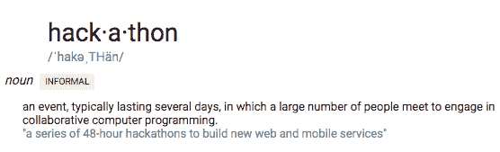
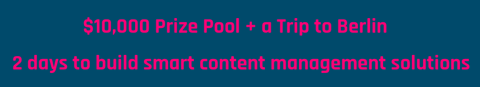
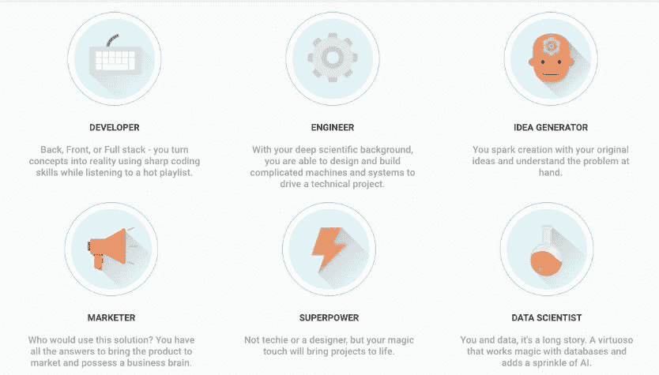
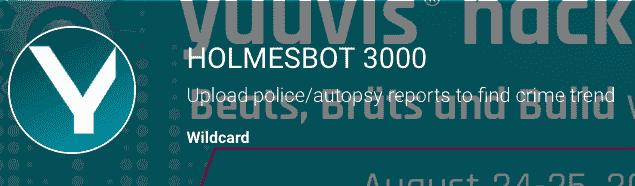
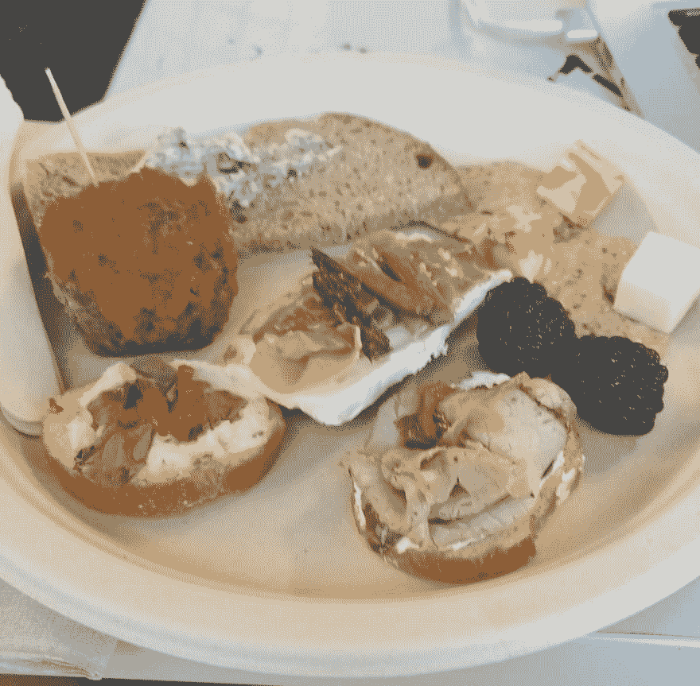

# 我参加了我的第一次黑客马拉松。

> 原文:[https://dev . to/williamjfermo/I-attended-my-first-hackathon-1jfh](https://dev.to/williamjfermo/i-attended-my-first-hackathon-1jfh)

[T2】](https://res.cloudinary.com/practicaldev/image/fetch/s--OcDRkiHB--/c_limit%2Cf_auto%2Cfl_progressive%2Cq_auto%2Cw_880/https://thepracticaldev.s3.amazonaws.com/i/dj11jk4c1ct0af51umjf.png)

黑客马拉松是由内容管理 API yuu vis 组织的。Yuuvis 允许企业有效地获取、组织、存储和交付关键信息。这是所有团队在项目中需要使用的平台。大奖奖金为 10，000 英镑，外加一次柏林之旅。因此，如果团队赢得其中一个类别，他们至少可以赢得 2500 美元。

[T2】](https://res.cloudinary.com/practicaldev/image/fetch/s--DjmaxcHM--/c_limit%2Cf_auto%2Cfl_progressive%2Cq_auto%2Cw_880/https://thepracticaldev.s3.amazonaws.com/i/hxyn7fh4edh6ci7ylu66.png)

我的技术知识基本上是我为 [Flatiron](https://flatironschool.com/) 做的一些准备工作，关于黑客马拉松的一件好事是，你不一定需要成为一名程序员才能参加。我认为拥有高质量的程序员、web 开发人员和数据科学是很重要的，但有时成为一个有伟大想法的人也会有所帮助。在注册之前，我必须选择一个个人资料，然后选择了超级力量，这意味着我不是一个技术人员，而是有能力帮助项目实现。

[T2】](https://res.cloudinary.com/practicaldev/image/fetch/s--qhdPvrTC--/c_limit%2Cf_auto%2Cfl_progressive%2Cq_auto%2Cw_880/https://thepracticaldev.s3.amazonaws.com/i/rin8ctbe04uznp5hj9qa.jpg)

周六早上有很多人都带着笔记本电脑，几乎所有的桌子都被占满了。Yuuvis 介绍了他们自己，以及他们对举办这次黑客马拉松有多兴奋。我能感觉到我内心的紧张，因为我不知道我能为任何项目做出什么贡献。第一个问题是有没有人不属于任何团体。可能不到十个人举手，不包括我在内的一组。我认为许多小组要么彼此认识，要么通过 slack 建立小组。我在黑客马拉松开始前几天刚刚安装了 slack，所以使用它对我来说是新的。为了帮助需要成员的团体，每个没有成员的人都必须向人群讲述他们的证书，或者像我这样缺乏证书的人。之后，每个人都进入各自的小组，开始工作。我必须给自己找一个团队。我和几个团体谈过，他们都不感兴趣。终于找到一个对我感兴趣的团体，我决定加入他们。

现在我们有几个程序员，一个数据科学家，一个网络开发人员，一个有想法的人，还有我。我们的项目是基于收集警方报告和尸检报告，以了解数据趋势，从而找到连环杀手 Holmesbot3000。我们做的第一件事是研究市场上是否有类似的想法，以及这是否是一个可行的项目。其中一个人是解决方案架构师，这也是他的第一次黑客马拉松，但他加入是为了回到编码上。他开始为我们写一份计划，以及我们需要做些什么来完成它。民事司法机构会将警方报告和尸检报告导入我们的网络项目。程序会弹出一个警告，提示有类似的案例，可能是连环杀手。Holmesbot 3000 诞生于我的第一个黑客马拉松项目。我负责研究、幻灯片，并找到用于警方报告和尸检报告的标准数据集。黑客马拉松感觉类似于在熨斗学习，但在白天，他们会有免费的食物和小吃来保持我们的能量水平。他们还会休息一会儿，做做伸展运动，玩玩虚拟现实游戏 beat sabre。我们早上 8 点开始，下午 6 点左右结束。在我们离开之前，我们安排了一些事情要做，然后我们将在星期天重新开始。我们会在空闲时彻夜交流。

[T2】](https://res.cloudinary.com/practicaldev/image/fetch/s--2zrfvUuH--/c_limit%2Cf_auto%2Cfl_progressive%2Cq_auto%2Cw_880/https://thepracticaldev.s3.amazonaws.com/i/sm01wva4p8djyv2vmlp2.png)

星期天到了，项目在上午 11 点到期。我小组中的每个人似乎都急于把事情做完，更糟糕的是，我们团队中的一个成员认为这个项目在最后一天被跳过了。他将会是做演讲的人，他走后，我自愿为演讲做介绍。我们打算跳过推销练习，以便在项目中投入更多时间，但在提交项目之前，我们得到了最后一个推销练习的机会。推销练习包括我们与 Yuuvis 的一些成员进行非正式的推销。所有的陈述都必须有 4 分钟的时间和问题。他们给了我们一些快速的提示，然后我们回去继续工作。小组演示很有趣，因为似乎有各种不同的小组，甚至有人单独演示一个项目。这个房间看起来也不像周六那样挤满了根本没有提交项目的小组。我说话很紧张，但我想为团队做更多贡献，而不仅仅是研究和制作幻灯片。除了对尤维斯的快速投球，我们没有练习。事情并不像我希望的那样顺利，如果我们对演示做一次实际的预演，事情是可以避免的。当该说的都说了，该做的都做了，我们提交了一个项目，我很高兴能够说我是那个[项目](https://yuuvishackaustin-platform.bemyapp.com/#/projects/5d62bff66abe17001b5ce02c)的一部分。

我从第一次黑客马拉松中学到的东西。你只要出现就能赢得奖品。编码知识很重要，但不是做出贡献的必要条件。需要有人带头制定计划并分配任务来完成项目。Slack 是与人交流和项目的一个很好的工具。出色的演示技巧有助于你的项目为人所知。黑客马拉松是一个很好的社交场所，有些人已经建立了团队，但也有像我的团队这样的人在最后一分钟才走到一起。你可以从其他人身上学到东西。Yuuvis 为导师提供了各种知识，人们可以在他们的项目中寻求任何帮助。黑客马拉松可能会让人精疲力尽，但却是值得的。没有什么能比得上在如此短的时间内看到你所能完成的事情。最后他们让你吃得很好，谁不喜欢免费的食物呢？

[T2】](https://res.cloudinary.com/practicaldev/image/fetch/s--AjSHdkt8--/c_limit%2Cf_auto%2Cfl_progressive%2Cq_auto%2Cw_880/https://thepracticaldev.s3.amazonaws.com/i/zm73t1cgiousq3cve9di.jpg)

看到所有的项目和人们可以用信息做什么真的让我明白了为什么我想进入这个领域。有像 One Chat 这样的项目，这是一个信息应用程序，允许你用你选择的语言发送和接收信息，而不需要点击翻译。获胜者是，雇佣我们，一个简历检索和过滤项目。他们赢得了 5000 英镑和一次柏林之旅。我们没有赢，但希望我的下一次黑客马拉松我可以作为一名数据科学家做出贡献。

用 DJ 发布派对黑客马拉松！
[奖金帖子聚会图片](https://thepracticaldev.s3.amazonaws.com/i/k2chs2v1l5rao0j6w8r8.jpg)

链接
[尤维斯](https://yuuvis.com/)
[尤维斯黑客马拉松](https://yuuvishackathonaustin.bemyapp.com/)
[Holmesbot 3000 项目](https://yuuvishackaustin-platform.bemyapp.com/#/projects/5d62bff66abe17001b5ce02c)。
[熨斗训练营](https://flatironschool.com/)