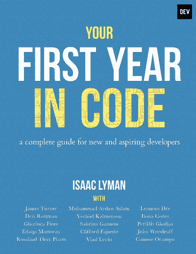

# 《代码的第一年》——面向新(不太新)开发人员的社区书籍

> 原文:[https://dev . to/adriansandu/your-first-year-in-code-a-community-book-for-new-and-so-new-developers-232m](https://dev.to/adriansandu/your-first-year-in-code-a-community-book-for-new-and-not-so-new-developers-232m)

作为一名开发人员开始您的职业生涯可能是一项非常艰巨的任务。而且不仅仅是编码。这是容易的部分。困难的部分是处理所有没人告诉你的事情。比如如何应对会议、新同事、新工作场所的文化以及其他许多事情。

这就是 Dev.to 社区伸出援手的地方。资深成员之一艾萨克·莱曼(Isaac Lyman)领导了一个团队，最终出版了一本名为《你的代码元年》(Your First Year in Code)的电子书。

我之前已经提到过这本书，在[前端新闻](https://dev.to/adriansandu/front-end-news-11-your-first-year-in-code-html-handbook-gitlab-12-1-2an7)第 11 集。今天我想更深入地探讨这个话题。因此，我联系了他本人——伊萨克·莱曼，让我们对这个项目有一些了解。

[T2】](https://res.cloudinary.com/practicaldev/image/fetch/s--sk9Gw0PI--/c_limit%2Cf_auto%2Cfl_progressive%2Cq_auto%2Cw_880/https://thepracticaldev.s3.amazonaws.com/i/yifwd10v4qabe72982o5.jpeg)

以下是艾萨克好心给我的采访记录。出于简洁和可读性的目的，我略微编辑了文本，但我尽可能地保留了艾萨克的话。

如果你喜欢听而不是读，你可以看下面我们的对话视频。

[https://www.youtube.com/embed/6aQs-PyG6sI](https://www.youtube.com/embed/6aQs-PyG6sI)

* * *

阿德里安:我想和你谈谈你的新书《你的代码元年》。但是在我们去那里之前，你为什么不先告诉我一些关于你自己的事情呢？

艾萨克:我是一名软件工程师，尽管我成为作家的时间可能比我成为程序员的时间还要长。但是我大概从 13 岁开始就以这样或那样的形式编写代码，我获得了英语学士学位，因为我的计划是去法学院。

但是在大学的最后一年，我意识到计算机科学对我来说是一个更好的职业。所以我总是试图将这两者结合起来——写作和软件工程——这本书是我发现的一种编写代码的方法的例子，希望能帮助很多发现可能没有足够高质量内容给新手开发者的人。

这就是为什么我们把它变成了“尽你所能支付”——让尽可能多的人受益。对我来说，这是写作和计算机科学这两个领域的结合。

* * *

**答:**太好了！接下来，关于您参与开发社区的情况，您能告诉我些什么？我知道你是他们的老成员之一...

我不确定，但我想我是网站上第一批 500 个人中的一员。回到 2016 年，我刚刚在 Medium 上写了一篇关于我当时工作的公司中开发人员角色的文章。它真的起飞了，并得到了大量的阅读。Ben Halpern 找到我，问我是否愿意交叉发布到他的新社区，我说“当然！我很乐意！”

支持一个崭露头角的社区总是很酷，看起来所有的价值观都是一致的，这是一个非常酷的地方。所以我继续交叉张贴，从那以后我一直是一个活跃的成员。这是一个很棒的社区。人们的素质和网站上的互动给我留下了深刻的印象。

* * *

**A:** 是什么启动了一个社区产生一本书的想法？

我:我有一堆旧的博客帖子，你知道，都是为新手开发者写的。所有我想做的事情，我都希望在我开始做开发者的时候就已经知道了。我开始认为一本书将会是展示这些的好方法。

但是我想让很多不同的人参与进来。因为新开发人员面临着一些我自己无法有效解决的问题。女性和有色人种面临着许多问题，首先，我永远无法完全理解，其次，我真的无法有效地解决自己。

因此，我在 dev 社区上发了一个帖子，邀请人们帮我写内容。写下他们独特的挑战。来帮我写一本书，这本书是我们开始写代码时就希望拥有的。到那个周末，我们有将近 100 人以不同的方式报名帮忙。

那是今年 3 月。所以，我有点天真地整理了出版时间表，因为我以前从未出版过一本书。但是我决定我们将在五个月内完成并出版这本书。不幸的是，对很多人来说，这是一个相当紧张的时间表，我们在这个过程中失去了很多人。但我认为我们的成果是从一些非常出色的作者和这本书的其他 15 位作者那里选出的最高质量的最佳内容，它们以令人难以置信的速度汇集在一起，我认为我们从中得到了一本非常令人印象深刻的书。

* * *

在我看来，这非常鼓舞人心。你能告诉我一些关于写这本书的人的事情吗？你是如何管理整个过程的？

我:我意识到的第一件事是，我不希望同一主题有 17 个章节，所以我请每个想贡献内容的人向我提交他们的想法，他们对这一章的建议，我会批准这些想法，有很多人说“这里有一些我想写的想法”。我会说“这个听起来很好，我们没有人写这个。”

所以我们都有一些不同的事情想谈。还有几个主题没有人报名，但我觉得它们真的很重要。所以我主动联系了几个我认为不错的人，请他们就这个话题发表意见。一旦我觉得我们有了一个很好的主题范围，然后我们经历了大量的写作和修改过程。初稿，修改，第二稿，很多编辑和我的建议，都来自我的英语学位背景。

让我们看看，到上个月初，我想，我们已经完成了所有的终稿，现在的问题是弄清楚这本书之外的一切。所以我们选择 LeanPub 作为发布平台，他们真的很棒。如果你要出版一本电子书，这是一个非常棒的平台。

我和 Ben 以及他在 dev 社区的团队谈过，他们同意成为这本书的制作人。这对于我们的业务范围和增长至关重要，它解决了所有法律问题，也解决了利润分享问题。所有的利润都是共享的:一部分归“写代码的女孩”所有，一部分由我们共同作者分享，一部分归开发者社区所有。

所以我们制定了所有的细节，我做了最后一两轮的编辑，7 月 22 日，我终于按下了发布按钮，那真是令人兴奋的一天，令人惊叹的一天。

* * *

现在，第一版终于发布了，你对这本书的下一步计划是什么？

我:这是个很好的问题。我们能做的事情太多了。现在我正在看一本实体书。有些人在屏幕上看书有困难。因此，我正在寻找出版一本真正的平装书的好平台，并希望在未来几周内有一些这方面的消息。

本和他的团队也在讨论一本有声读物。这里有一些挑战。大声朗读代码很难，但在这方面还会有更多的讨论，我们会想出办法。

已经有人在问续集什么时候会出版，我不知道续集会是什么样子。可能是“第二年写代码”，或者“第一年写 JavaScript”，或者“第一年写 C#”。我不知道该何去何从。但这是一次很好的经历，肯定有一些成长的空间和解决其他话题的空间，老实说，我希望在下一本书的前面中心看到别人的名字。我认为这是一个很酷的项目，但这是一个社区项目，我希望看到火炬传递给其他有写作热情的人。

* * *

**答:**一个电子产品的一大优点就是可以非常容易的更新。你有没有什么想补充但没有时间去做的事情？在印刷之前，您计划进行任何更新吗？

是的，我确实一直在考虑这个问题。LeanPub 的修改如此简单，以至于在我们发布公告后的第一个小时，我就意识到我在书中的某个部分犯了一个拼写错误。所以我上了那个网站，推了一个更新，所以，可能前五十个下载电子书的人有拼写错误，他们甚至不知道。但是肯定有修改和更新的空间。

一些人指出，随着新技术的出现和新的技术表达方式的出现，附录 B 可能会更新。这是附录，关于如果你想建造某些东西，你应该学些什么。我还认为，如果很多人写信说“嘿，真的应该有一个关于这个或那个的章节”，这在某个时候可能是合适的。以后可能会有额外内容的空间。

你是对的，电子书给了我们做所有这些事情的选择。所以，我认为，现在，我们只是有点乘着第一波兴趣，看看反馈是什么，以后很可能会有一些补充和修订。

* * *

**A:** 说到打印，到目前为止你考虑过什么？这会不会太遥远了？

I:不一定。我们谈到了亚马逊。我们谈到了英格拉姆公园。它真的试图找到一家公司的平衡，我们认为它与书的价值相结合是道德的，并且有一个体面的版税结构，所以我们不会在市场上被剥皮，所以有很多事情要考虑，但我认为我们可能会从一个不太知名的出版社开始，看看我们是否能在那里得到一些牵引力，看看它会从那里开始。

亚马逊是一种可能性——它有很大的影响力，有很多人访问亚马逊，但也有一些利弊。所以当我们在那里得到一些消息时，我一定会让每个人都知道。

* * *

**答:**我注意到最近开发者社区对道德很感兴趣。我喜欢读专门讨论这个话题的那一章。

你还有什么要补充的吗？

我:我不这么认为。我只想重申，我们的目标是尽可能多的参与，所以去 leanpub.com/firstyearincode 的。你可以从 0 美元到 500 美元的任何价格获得一份副本，并与你生活中的初级开发人员分享。你知道，如果你有任何问题，我和我的合著者随时准备帮助你。所以你可以在推特上或者任何你能找到我们的地方联系我们。你会发现我们非常渴望回答问题，并帮助任何新进入这个行业的人。

* * *

[T2】](https://res.cloudinary.com/practicaldev/image/fetch/s--O81w9ZVm--/c_limit%2Cf_auto%2Cfl_progressive%2Cq_auto%2Cw_880/https://thepracticaldev.s3.amazonaws.com/i/8thquk3a9t15gv9jr03o.jpg)

好了，伙计们！直接来自主要作者本身。所以不要再等了，去 leanpub.com/firstyearincode 那里拿一本你自己的书吧。即使你做了一年多的开发者，也绝对值得一读。