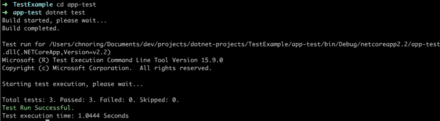
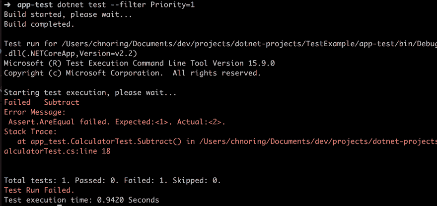
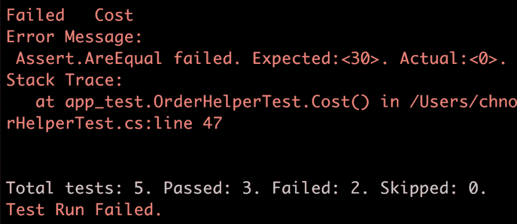
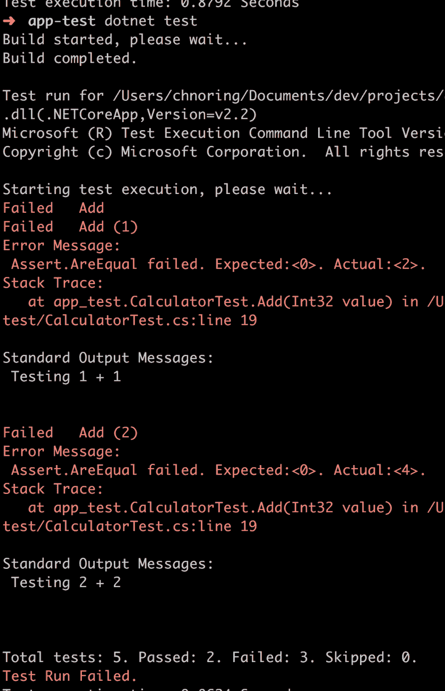
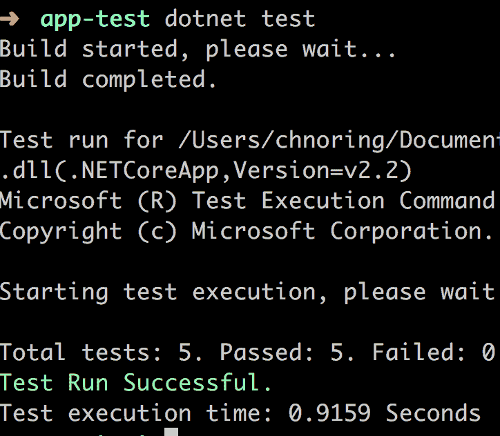

# 正在测试。网络核心

> 原文:[https://dev.to/dotnet/testing-in-net-core-ojh](https://dev.to/dotnet/testing-in-net-core-ojh)

在 [Twitter](https://twitter.com/chris_noring) 上关注我，很乐意接受您对主题或改进的建议/Chris

> 测试是我们需要做的事情，以增加对我们正在构建的东西的信心。毕竟，我们想要发布工作软件。我们确实知道错误会发生，所以我们需要遵守纪律，最好为每个错误添加一个测试，这样我们至少知道我们修复了那个错误。这是一场*打鼹鼠*的游戏，我们需要跟上。尽管有不同的测试方式，单元测试，集成测试，E2E 测试。在本文中，我们将关注单元测试，并确保我们采用一些好的实践。

TLDR；这是关于测试的初级读本。网芯。如果您完全不熟悉测试或测试。网芯，那这个给你。我会跟进一篇更高级的关于测试讨论对象母亲，嘲讽和其他事情的文章。

在本文中，我们将介绍

*   创建测试项目并运行您的测试
*   **不同类型的测试**，这里我们将提到不同类型的测试，如果你完全是测试新手，需要不同阶段和水平的入门知识。
*   编写测试，这里我们将介绍一些命名和安排测试的良好实践。

。Net Core 支持使用`MsTest`、`xUnit`以及`nUnit`进行测试，所以你有相当多的选择。对于本文，我们选择了`MsTest`。查看参考资料部分，获取其他框架的链接。

## [](#references)参考文献

*   [xUnit 测试](https://docs.microsoft.com/dotnet/core/testing/unit-testing-with-dotnet-test?wt.mc_id=devto-blog-chnoring)
    本页描述了如何使用 xUnit 与。网络核心

*   [nUnit 测试](https://docs.microsoft.com/dotnet/core/testing/unit-testing-with-nunit?wt.mc_id=devto-blog-chnoring)
    本页描述了如何使用 nUnit。网芯。

*   [dotnet 测试，终端命令描述](https://docs.microsoft.com/dotnet/core/tools/dotnet-test?tabs=netcore21?wt.mc_id=devto-blog-chnoring)
    这一页描述了终端命令`dotnet test`以及所有你可以用来调用它的不同参数。

*   [dotnet 选择性测试](https://docs.microsoft.comdotnet/core/testing/selective-unit-tests?wt.mc_id=devto-blog-chnoring)
    本页描述了如何进行选择性测试，以及如何设置过滤器和使用过滤器进行查询。

*   [c#和 VS 代码入门](https://docs.microsoft.com/dotnet/core/tutorials/with-visual-studio-code?wt.mc_id=devto-blog-chnoring)

*   [。NuGet 上的 Net Core 系列，无服务器等等](https://dev.to/softchris/net-core-series-learning-net-core-on-vs-code-and-how-you-can-create-a-serverless-api-4jep)

## [](#why)为什么

我们在文章的开始提到测试是重要的，尤其是在有 bug 的情况下。我认为测试是开发人员工具箱中最重要的工具。学会检查你的工作不仅会在你的客户中建立良好的声誉，也会在你的同事中建立良好的声誉。你越擅长*测试*你的代码，并找到各种方法来这样做，对每个人都越好。

## [](#different-types-of-testing)不同类型的测试

有不同类型的测试。它们被用在软件生命周期的不同阶段。您还可以编写不同级别的测试来测试细节或大规模行为。我们通常说单元测试是为了测试实现细节，而集成测试是用来测试两个或更多更大的部分是否能一起工作。我们应该在各个层次和生命周期进行测试。

**测试最后一次**

我们已经完成了整个软件的编写，所谓的*快乐之路*似乎也行得通。对于*快乐之路*，我们指的是我们认为客户将用来执行任务或运行我们软件的任何其他东西的场景，它可能是其他软件:)。在这种情况下，我们意识到，如果发生了意想不到的事情，我们可能会陷入困境，因此我们开始在这一点上添加测试和日志记录，以确保我们的软件涵盖我们认为可能发生的一些场景。在这一点上添加测试通常感觉像是一件苦差事，坦率地说并不有趣。但是必须加上他们才能称自己为专业人士。

**回归测试**

嗯，我要说的是，测试应该一直伴随着你，一种*这怎么能打破*的心态。是否是输入的类型，是否是内存消耗，是否有一个依赖关系来回答一些我们没有预料到的事情？

当然，你不可能考虑所有的事情，即使你尝试了，这种在你写代码之前、之中和之后的深思熟虑的分析肯定会使代码变得更好。因为什么都想不到，所以会有 bug。这里的一个好的实践是尝试编写一个测试，首先证明 bug 存在。一旦建立起来，你就可以继续修复 bug 并看到你的测试通过。至少你已经治好了那个症状/毛病。

以上并不是真正的回归测试，而是当你发现一个 bug 时的一个很好的实践。回归测试更多的是当你做一个改变，添加一个特性或者修复一个 bug，你重新运行一些测试，确保一切都还在工作。它是紧密相连的，是一个你应该知道的术语。

**重构**

当然还有一个案例重构。随着时间的推移，随着越来越多的特性被添加到代码库中，或者特性本身发生变化，我见过的大多数代码库都会变得杂乱无章。曾经简单易懂的代码变成了一团意大利面条。在这一点上，你觉得最有可能是从头开始。进行测试是一种很好的方式，让你相信你可以改变代码，一旦你停止通过重构来改进它，它仍然会做它应该做的事情。

**测试驱动开发**，**测试第一**

这是一种方法，在你真正开始写任何产品代码之前，你想出测试并写出来。这个想法是你从一个失败的测试开始，然后编写产品代码，测试通过。这叫做红绿测试。红色表示测试失败，绿色表示测试通过。一些人喜欢这种工作方式，而另一些人则觉得受其约束。从积极的一面来看，你不要写你不需要的代码，因为你写的所有代码都是为了通过某个测试场景。

**集成测试**

这通常是一些高级测试，我们测试不同的组件，系统的大部分，是否能一起工作。通常是某个*层*与另一个*层*进行对话，例如，一个 API 层与一个数据层进行对话，或者甚至是一个单独的组件与另一个组件进行对话，这使得我们成为一个大型的复杂系统。

## [](#what-creating-a-demo)什么-创建演示

在本文中，我们的目标是在较低的级别进行测试，即单元测试级别。我们将展示如何轻松地创建一个测试项目，编写测试并运行它们。希望我们也能在写作和如何改进测试方面给出一些很好的指导。我们将开展以下工作:

1.  **脚手架**一个测试项目
2.  **作者**一个测试
3.  **运行**测试
4.  **改进**我们的测试

### [](#scaffold-a-test-project)脚手架的一个测试项目

本质上，我们希望创建一个解决方案，将应用程序代码作为一个项目，并将测试代码放在一个单独的项目中。因此，整体解决方案将是这样的:

```
solution
  app // project containing our implementation
  app-test // project containing our tests 
```

**创建解决方案**

让我们从创建一个目录开始。这是我们的解决方案。这个目录可以叫任何你喜欢的名字，但是我们称我们的目录为`TestExample`，所以我们称它为

```
mkdir TestExample 
```

接下来，我们将通过调用:
来创建一个解决方案

```
cd TestExample
dotnet new sln 
```

**创建库项目**

此后，我们将创建一个库项目来保存我们的生产代码:

```
dotnet new classlib -o app 
```

接下来，我们要将项目引用添加到解决方案中，就像这样:

```
dotnet sln add app/app.csproj 
```

**创建测试项目**

此后，我们想要创建一个测试项目，如下所示:

```
dotnet new mstest -o app-test 
```

它应该会产生如下所示的输出:

[T2】](https://res.cloudinary.com/practicaldev/image/fetch/s--f4okglPW--/c_limit%2Cf_auto%2Cfl_progressive%2Cq_auto%2Cw_880/https://thepracticaldev.s3.amazonaws.com/i/a8dloqbzbxvkbsa3mqav.png)

并像这样添加对我们的解决方案的引用:

```
dotnet sln add app-test/app-test.csproj 
```

最后，我们希望在`app-test`项目中添加对`app`项目的引用，这样我们就可以引用我们想要测试的应用程序中的代码。为此，请键入以下命令:

```
cd app-test
dotnet add reference ../app/app.csproj
cd .. 
```

### [](#writing-a-test)写作测试

让我们创建一个文件`CalculatorTest.cs`，并赋予它以下内容:

```
// CalculatorTest.cs

using Microsoft.VisualStudio.TestTools.UnitTesting;

namespace app_test 
{
  [TestClass]
  public class CalculatorTest 
  {
    [TestMethod]
    public void Add() 
    {
      Assert.AreEqual(1,1);
    }
  }
} 
```

装饰器`TestClass`意味着我们的类`CalculatorTest`应该被视为一个测试类。`TestMethod`是我们添加到`Add()`方法中的装饰器，以表明这是一个测试方法。在`Add()`的方法 bofy 中，我们添加了一个断言语句`Assert.AreEqual(1,1)`。`AreEqual()`的原型是`AreEqual(expected, actual)`。这是我们创建测试所需的全部内容。

### [](#running-a-test)运行测试

现在，让我们运行它。我们通过以下方式实现这一点:

1.  终端命令

[T2】](https://res.cloudinary.com/practicaldev/image/fetch/s--dJYPzbi5--/c_limit%2Cf_auto%2Cfl_progressive%2Cq_auto%2Cw_880/https://thepracticaldev.s3.amazonaws.com/i/yxk2mhf7i1ijyft3jcx5.png)

这个命令`dotnet test`带有很多参数，所以请务必查看[文档页面](https://docs.microsoft.com/en-us/dotnet/core/tools/dotnet-test?tabs=netcore21)

1.  在 VS 代码中点击`Run Test`

[T2】](https://res.cloudinary.com/practicaldev/image/fetch/s--mRkZ5vsL--/c_limit%2Cf_auto%2Cfl_progressive%2Cq_auto%2Cw_880/https://thepracticaldev.s3.amazonaws.com/i/ib5w7o7rkjul35a611mx.png)

正如你在上面看到的，我们也可以很容易地调试一个测试，如果我们查看类级别，将会有一个调试/运行类中所有测试的链接。

我们有一个叫做`filter`的东西，可以用来运行我们针对的特定测试。让我们像这样添加另一个测试:

```
[TestMethod]
[Priority(1)]
public void Subtract() 
{
  Assert.AreEqual(1,2);
} 
```

上面我们不仅添加了测试方法`Subtract()`，还添加了装饰器`Priority(1)`。我们可以通过键入以下内容进行筛选，只运行与该名称匹配的测试:

```
dotnet test --filter Priority=1 
```

[T2】](https://res.cloudinary.com/practicaldev/image/fetch/s--lGeolahx--/c_limit%2Cf_auto%2Cfl_progressive%2Cq_auto%2Cw_880/https://thepracticaldev.s3.amazonaws.com/i/z84ougbfr5rh1n4g4af7.png)

正如你在上面看到的，它只运行了`1`测试`Subtract()`，跳过了我们的`Add()`测试。

我们还可以添加另一个装饰者。让我们添加以下两个测试:

```
[TestMethod]
[TestCategory("DivideAndMultiply")]
public void Divide() 
{
  Assert.AreEqual(1,1);
}

[TestMethod]
[TestCategory("DivideAndMultiply")]
public void Multiply()
{
  Assert.AreEqual(1, 1);
} 
```

两个测试有相同的标签`DivideAndMultiply`。我们可以通过输入`dotnet test --filter TestCategory=DivideAndMultiply`进行过滤。`TestCategory`允许我们创建比`Priority`更多的描述性标签。

### [](#a-more-real-scenario)更真实的场景

好的，我们有一个测试类`CalculatorTest`,但是让我们面对现实吧，在生产中我们编写了多少次计算器？是的，我不这么认为。很有可能我们做的是类似电子商务公司的事情。所以让我们想象一下那会是什么样子。先说订单，以及如何评价。

> 这很简单，我得到了一个订单和一些项目，然后通过它们循环，我得到了一个总数，然后我加上一些运费，然后我就完成了:)

我希望有这么简单。当你刚开始的时候，也许是这样，但是后来有人提到了折扣这个词，当然打八折很容易计算，但是突然它就变成了一个怪物。在你知道之前，你已经得到了不同产品类型的折扣，买三送二的折扣，假日折扣，以某种方式标记的所有商品的折扣等等。相信我这个*折扣*很快就变成了它自己失控的意大利面条怪兽，需要一个团队来管理，你可以想象试图跟上它的代码看起来是什么样子。

**出发**

让我们从小处着手。假设你刚开了一家网店，你需要写一些代码来支持计算订单总额。我们首先在我们的`app`项目中创建文件`Order.cs`，并赋予它以下内容:

```
// Order.cs

using System;
using System.Collections.Generic;

namespace OrderSystem {
  public enum ProductType 
  {
    CD,
    DVD,
    Book,
    Clothes,
    Game
  }

  public class Product
  {
    public string Name { get; set; }
    public string Description { get; set; }
    public ProductType Type { get; set; }
  }

  public class OrderItem
  {
    public int Quantity { get; set; }
    public double Price { get; set; }
    public Product Product { get; set; }
  }

  public class Order 
  {
    public List<OrderItem> Items { get; set; }
    public DateTime Created { get; set; }
  }
} 
```

然后我们创建一个文件`OrderHelper.cs`，它将帮助我们计算订单和相关的`Order`逻辑的总和。现在，我们给它的内容:

```
 namespace OrderSystem
{
  public class OrderHelper
  {
      public OrderHelper() 
      {}

      public static double Cost(Order order)  
      {
        return 0;
      }
  }
} 
```

好了，这没什么用，这是重点，因为现在我们要写一个测试。

让我们在我们的`app-test`项目中创建一个文件`OrderHelperTest.cs`，并赋予它以下内容:

```
using System.Collections.Generic;
using Microsoft.VisualStudio.TestTools.UnitTesting;
using OrderSystem;

namespace app_test
{
  [TestClass]
  public class OrderHelperTest
  {
      [TestMethod]
      public void ShouldSumCostOfOrder()
      {
          // Arrange

          // Act

          // Assert
      }
  }
} 
```

**创作时的良好实践**

现在让我们讨论一些在编写测试时可以使用的好的实践。测试应该易于阅读。测试名应该说明我们正在做什么，以及我们对结果的期望。给它取名`ShouldSumCostOfOrder()`告诉我们正在发生什么。你甚至可以更具体地说一些关于结果的事情，例如`ShouldSumOrderTo30()`。最终，它是对你最有意义的，也是你正在测试的。

接下来要看的是三个`A`、`Arrange`、`Act`和`Assert`。你应该安排好你需要的一切。在`Act`你应该调用你的生产代码。在最后的`Assert`步骤中，你应该验证你得到了你期望的结果。

如你所见，我们有一个方法`ShouldSumCost()`。

**编写测试**

好了，我们对命名和测试中的步骤有了更多的了解，所以让我们来充实一下测试。我们需要关注的第一件事是用下面的代码设置我们的测试，即所谓的`Arrange`阶段:

```
// Arrange
var productCD = new Product()
{
    Type = ProductType.CD,
    Name = "Nirvana",
    Description = "Album"
};
var productMovie = new Product()
{
    Type = ProductType.DVD,
    Name = "Gladiator",
    Description = "Movie"
};

var order = new Order() 
{
    Items = new List<OrderItem>() { 
        new OrderItem(){ 
            Quantity = 1, 
            Price = 10,
            Product = productCD
        },
        new OrderItem(){
            Quantity = 2,
            Price = 10,
            Product = productMovie
        } 
    }
}; 
```

我们可以很容易地将它们移到另一个类中，使测试更容易阅读。不过现在让我们继续前进，进入下一个阶段`Act`。

```
// Act
var actual = OrderHelper.Cost(order); 
```

注意变量`actual`的命名。在编写测试时使用像`actual`和`expected`这样的名字是一个好习惯，因为这些是其他开发人员知道的术语，这将使你的代码更容易阅读。

最后是`Assert`阶段，我们检查代码是否做了我们认为它做的事情:

```
// Assert
Assert.AreEqual(30, actual); 
```

完整的文件`OrderHelperTest.cs`应该是这样的:

```
// OrderHelperTest.cs

using System.Collections.Generic;
using Microsoft.VisualStudio.TestTools.UnitTesting;
using OrderSystem;

namespace app_test
{
  [TestClass]
  public class OrderHelperTest
  {
    [TestMethod]
    public void ShouldSumCostOfOrder()
    {
        // Arrange
        var productCD = new Product()
        {
            Type = ProductType.CD,
            Name = "Nirvana",
            Description = "Album"
        };
        var productMovie = new Product()
        {
            Type = ProductType.DVD,
            Name = "Gladiator",
            Description = "Movie"
        };

        var order = new Order() 
        {
            Items = new List<OrderItem>() { 
                new OrderItem(){ 
                    Quantity = 1, 
                    Price = 10,
                    Product = productCD
                },
                new OrderItem(){
                    Quantity = 2,
                    Price = 10,
                    Product = productMovie
                } 
            }
        };

        // Act
        var actual = OrderHelper.Cost(order);

        // Assert
        Assert.AreEqual(30, actual);
    }
  }
} 
```

此时，我们的测试将会失败

[T2】](https://res.cloudinary.com/practicaldev/image/fetch/s--z6qpMZ1w--/c_limit%2Cf_auto%2Cfl_progressive%2Cq_auto%2Cw_880/https://thepracticaldev.s3.amazonaws.com/i/0chgsj3io1lh5ikvomkp.png)

**添加代码**

好了，所以我们需要通过向`OrderHelper.cs`添加一个真实的实现来修复测试。将代码更改如下:

```
using System.Linq;

namespace OrderSystem
{
  public class OrderHelper
  {
      public static double Cost(Order order)  
      {
          return order.Items.Sum(i => i.Price * i.Quantity);
      }
  }
} 
```

重新运行测试，我们得到:

[T2】](https://res.cloudinary.com/practicaldev/image/fetch/s--ixQuk-vp--/c_limit%2Cf_auto%2Cfl_progressive%2Cq_auto%2Cw_880/https://thepracticaldev.s3.amazonaws.com/i/kcnicxu5dg4oujopsuom.png)

### [](#useful-functionality)有用的功能

好，我们已经带你通过所谓的`Red-Green`测试，你开始写一个测试，确保它失败，它变成`Red`。然后我们写实现。最后，我们重新运行测试，它通过了，它变成了`Green`。

很多时候，我们最终编写的测试是*测试*相同的代码流，我们只需要改变输入来确保我们的产品代码真的真的工作。

以我们的`CalculatorTest.cs`文件为例。首先，让我们在`app`项目中给它一个真实的实现`Calculator.cs`。现在给它以下内容:

```
// Calculator.cs

namespace app 
{
  public class Calculator 
  {
    public static int Add(int lhs, int rhs)
    {
      return 0;
    }
  }
} 
```

更新我们的`CalculatorTest.cs`到现在说:

```
// CalculatorTest.cs

using app;
using Microsoft.VisualStudio.TestTools.UnitTesting;

namespace app_test 
{
  [TestClass]
  public class CalculatorTest 
  {
    [TestMethod]
    public void Add() 
    {
      var actual = Calculator.Add(0,0);
      Assert.AreEqual(actual,0);
    }
  }
} 
```

此时运行测试意味着它通过了。现在，我们可以相信我们的代码在这一点上工作吗？我是说测试通过了，对吗？因为实现是如此之小，我们可以说，如果我们改变输入，它不会工作。对于较大的实现，可能更难分辨。

让我们试着找到一种方法！

将您的代码更改如下:

```
// CalculatorTest.cs

using app;
using Microsoft.VisualStudio.TestTools.UnitTesting;

namespace app_test 
{
  [TestClass]
  public class CalculatorTest 
  {
    [DataTestMethod]
    [DataRow(0)]
    public void Add(int value) 
    {
      var actual = Calculator.Add(value, value);
      var expected = value + value
      Assert.AreEqual(actual, expected);
    }
  }
} 
```

请注意我们是如何删除`TestMethod`并用`DataTestMethod`替换它的。另外，注意我们如何添加带参数的`DataRow`。现在，这个自变量变成了输入参数`value`。现在运行测试意味着它计算`0 + 0`，因此我们的测试应该仍然通过。让我们添加更多的场景，这样代码看起来就像这样:

```
using System;
using app;
using Microsoft.VisualStudio.TestTools.UnitTesting;

namespace app_test 
{
  [TestClass]
  public class CalculatorTest 
  {
    [DataTestMethod]
    [DataRow(0)]
    [DataRow(1)]
    [DataRow(2)]
    public void Add(int value) 
    {
      Console.WriteLine("Testing {0} + {0}", value);
      var actual = Calculator.Add(value, value);
      var expected = value + value;
      Assert.AreEqual(actual,expected);
    } 
  }
} 
```

现在运行测试，我们得到:

[T2】](https://res.cloudinary.com/practicaldev/image/fetch/s--aETemgPg--/c_limit%2Cf_auto%2Cfl_progressive%2Cq_auto%2Cw_880/https://thepracticaldev.s3.amazonaws.com/i/hqf6fyrotx8a6k94bqrf.png)

从上面我们可以看到`0 + 0`通过，而`1 + 1`和`2 + 2`失败。我们的代码不工作，所以我们需要修复它。让我们把`Calculator.cs`改成下面的:

```
namespace app 
{
  public class Calculator 
  {
    public static int Add(int lhs, int rhs)
    {
      return lhs + rhs;
    }
  }
} 
```

现在，如果我们运行我们的测试，我们得到:

[T2】](https://res.cloudinary.com/practicaldev/image/fetch/s--KHQ1vdj1--/c_limit%2Cf_auto%2Cfl_progressive%2Cq_auto%2Cw_880/https://thepracticaldev.s3.amazonaws.com/i/njibce6ez0vp8fm9irz9.png)

我们刚刚做的叫做*数据驱动测试*。我们到此为止吧，这篇文章已经够长了

## [](#summary)总结

我们已经带您创建了一个测试项目，编写了一些测试并学习了如何运行我们的测试。此外，我们还讨论了命名方面的一些良好实践，以及如何使用数据驱动测试来进一步改进您的测试。

我希望这是有用的，并且您期待着下一篇旨在更深入的文章。