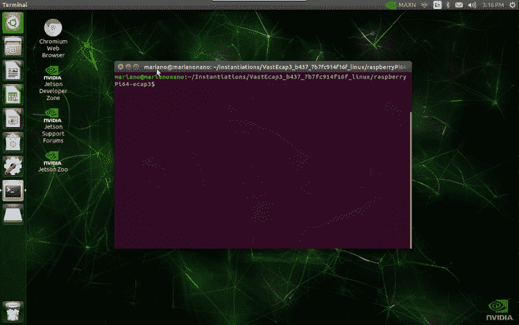
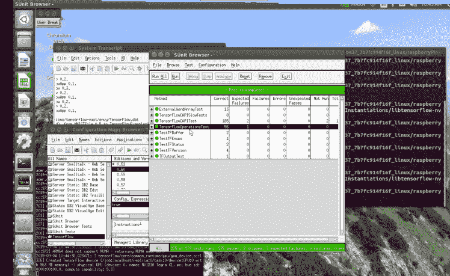
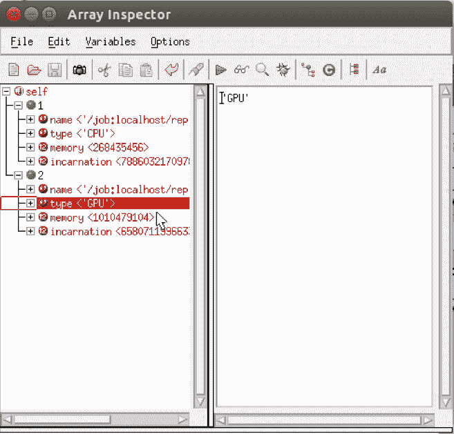
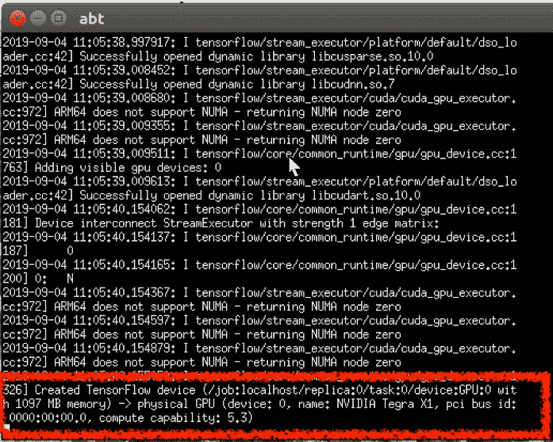
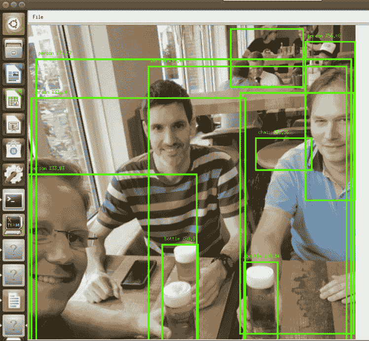

# Nvidia Jetson Nano、TensorFlow 和 Smalltalk 入门

> 原文:[https://dev . to/Martinez peck/getting-started-with-NVIDIA-jetson-nano-tensor flow-and-small talk-23mk](https://dev.to/martinezpeck/getting-started-with-nvidia-jetson-nano-tensorflow-and-smalltalk-23mk)

在我之前的所有帖子中(比如[这篇](https://dev.to/martinezpeck/docker-swarm-cloud-on-a-arm64-diy-sbc-cluster-running-a-smalltalk-webapp-9l1))，你可以看到 [VASmalltalk](https://www.instantiations.com/products/vasmalltalk/) 在任何树莓 Pi、Rock64 甚至 Nvidia Jetson TX2 上运行:

液体错误:内部

此外，你还可以看到[以前的帖子](https://dev.to/martinezpeck/object-detection-with-tensorflow-and-smalltalk-15p7)，在那里我展示了如何使用 Smalltalk 的 TensorFlow 来识别图像中的物体。

上周，在 [ESUG 2019](https://esug.github.io/2019-Conference/conf2019.html) 上，我在 [Instantiations](https://twitter.com/instantiations) 提供的 Nvidia Jetson Nano 上演示了一个 VA Smalltalk 和 TensorFlow 项目。

在这篇文章中，我将向您展示如何开始使用 Jetson Nano，如何运行 VASmalltalk，以及如何使用 TensorFlow 包装器来利用 128 个 GPU 核心。

### [](#what-do-you-need-before-starting)出发前需要什么

以下是我收集的所有物资清单:

*   [NVIDIA Jetson Nano 开发者套件](https://www.amazon.com/NVIDIA-Jetson-Nano-Developer-Kit/dp/B07PZHBDKT/ref=sr_1_3?crid=3TX2GTYZE1PQO&keywords=jetson+nano&qid=1567444057&s=gateway&sprefix=jetson+nano%2Caps%2C347&sr=8-3)
*   micross 卡:我得到了一个[三星 128gb u3](https://www.amazon.com/Samsung-MicroSDXC-Adapter-MB-ME128GA-AM/dp/B06XWZWYVP/ref=pd_bxgy_147_img_3/144-0517921-1924023?_encoding=UTF8&pd_rd_i=B06XWZWYVP&pd_rd_r=3351843b-8299-4a77-bbb3-d1dd44b03579&pd_rd_w=2dh8W&pd_rd_wg=eLEPI&pf_rd_p=a2006322-0bc0-4db9-a08e-d168c18ce6f0&pf_rd_r=KFRNVE50K798SYHVYKX3&psc=1&refRID=KFRNVE50K798SYHVYKX3)
*   电源:你可以选择有限的 USB 或者更强大的 DC 开关电源。我得到了[后者](https://www.amazon.com/SMAKN-Switching-Supply-Adapter-100-240/dp/B01N4HYWAM/ref=pd_bxgy_147_img_2/144-0517921-1924023?_encoding=UTF8&pd_rd_i=B01N4HYWAM&pd_rd_r=3351843b-8299-4a77-bbb3-d1dd44b03579&pd_rd_w=2dh8W&pd_rd_wg=eLEPI&pf_rd_p=a2006322-0bc0-4db9-a08e-d168c18ce6f0&pf_rd_r=KFRNVE50K798SYHVYKX3&psc=1&refRID=KFRNVE50K798SYHVYKX3)。
*   外壳(可选):我喜欢金属外壳，所以我买了一个带电源&复位控制开关的[外壳。](https://www.amazon.com/Geekworm-NVIDIA-Enclosure-Control-Developer/dp/B07RRRX121/ref=sr_1_4?keywords=jetson+nano+case&qid=1565123115&s=electronics&sr=1-4)
*   风扇(可选):我只能找到一个适合 Nano 的风扇，但它非常贵。
*   无线模块(可选):主板没有内置 WiFi 或蓝牙，所以我决定购买[这个模块](https://www.amazon.com/Waveshare-AC8265-Wireless-Supports-Bluetooth/dp/B07SGDRG34/ref=sr_1_2_sspa?keywords=jetson+nano+wifi&qid=1565122735&s=electronics&sr=1-2-spons&psc=1&spLa=ZW5jcnlwdGVkUXVhbGlmaWVyPUEzRDhMM1hZQURCMDdVJmVuY3J5cHRlZElkPUEwNTAyNjMzMk1FWU5aNEhVNkJKNSZlbmNyeXB0ZWRBZElkPUEwMzAyMDcxM0JIS1VGSE43TTFPVyZ3aWRnZXROYW1lPXNwX2F0ZiZhY3Rpb249Y2xpY2tSZWRpcmVjdCZkb05vdExvZ0NsaWNrPXRydWU=)。

### [](#assembling-the-nano-and-related-hardware)组装 Nano 及相关硬件

对于这一步，我首先遵循[这个简短的指南](https://towardsdatascience.com/getting-started-with-nvidia-jetson-nano-and-installing-tensorflow-gpu-ad4a3da8ed26)，但最终转移到[这个超级详细的指南](https://blog.hackster.io/getting-started-with-the-nvidia-jetson-nano-developer-kit-43aa7c298797)。我不会重复所有写在那里的东西，而是在下面添加我自己的一些东西。

我从格式化 SD 开始。为此，我总是使用“SD 卡格式化程序”。下载操作系统镜像和刷新 SD 很容易…但是第一个缺点是第一次启动时你需要一个外接显示器、键盘和鼠标。无头方式:(第一次引导后，您确实可以启用 SSH 和 VNC，但不是第一次。

下一步是组装 Wifi 和蓝牙。这不是在公园散步，但也没那么难。你需要把 Nano 拆开一点，连接一些电线，等等:

液体错误:内部

不好的是，该板被配置为默认使用 USB 电源启动。在我的情况下，我订购了 DC，因为它更好，如果你想采取最大的权力。但是…要告诉 Nano 是使用 USB 还是 DC，您必须更换跳线 J48。但是你猜怎么着？开发套件(100 美元)甚至没有一个跳线。所以你得到了你的纳米和 DC 电源，你死了，你不能启动它。真的吗？(顺便说一句，在你问之前，不，我那天没有带母对母电缆作为跳线的变通方法)

另一个复杂的部分是组装机箱和风扇。为此，我需要[仔细看几遍这个视频](https://www.youtube.com/watch?v=SpUB6h4Akp4&t=365s)。一旦建成，感觉真的很坚固，很好。顺便说一句，这个箱子确实有一个 J48 的跳线，这真的很好，因为这意味着我可以使用 DC 的电源。

风扇本身也很复杂。我买的 Noctua NF-A4x20 5V PWM 不太好用。NA-AV3 硅胶防振支架无法穿过 Nano 的孔。机箱提供的风扇螺丝太短。所以我不得不另外买一些足够长的螺丝。

当我准备尝试风扇时，我给它通电，但没有任何反应。我以为我做错了什么，我不得不重新打开案件几次…痛苦的过程。当我在互联网上找到一些帮助时，我几乎要放弃了。信不信由你，你必须运行一个控制台命令来启动风扇:`sudo jetson_clocks`。之后就开始起作用了。

液体错误:内部

### [](#setting-it-to-run-headless)设置为无头运行

虽然在大多数主板和操作系统中这很容易，但在 Nano 上这是一个具有挑战性的部分。SSH 部分很简单，你几乎不需要做任何特别的事情。但是对于 VNC 来说…天啊…我遵循了本指南中的所有建议。在我的情况下，我永远无法让`xrdp`工作…当它试图从我的 Mac 连接时，它就崩溃了…

至于 VNC，在那里提到的所有解决方法/修正之后，我能够连接，但是分辨率太差了(640×480)。我花了相当多的时间在谷歌上搜索，直到我找到了这里提到的的变通办法。基本上，我做了`sudo vim /etc/X11/xorg.conf`并添加了这些行:

```
Section "Screen"
   Identifier    "Default Screen"
   Monitor        "Configured Monitor"
   Device        "Default Device"
   SubSection "Display"
       Depth    24
       Virtual 1280 800
   EndSubSection
EndSection 
```

<svg width="20px" height="20px" viewBox="0 0 24 24" class="highlight-action crayons-icon highlight-action--fullscreen-on"><title>Enter fullscreen mode</title></svg> <svg width="20px" height="20px" viewBox="0 0 24 24" class="highlight-action crayons-icon highlight-action--fullscreen-off"><title>Exit fullscreen mode</title></svg>

换句话说，如果没有连接显示器，我需要更改虚拟显示器的大小(默认为 640×480)。

重启后，我终于能够得到一个体面的解决方案与 VNC。

*   

### [](#installing-vasmalltalk-dependencies)安装 VASmalltalk 依赖项

这部分很简单，我基本上遵循了[前一篇文章](https://dev.to/martinezpeck/getting-started-with-vasmalltalk-raspberry-pi-and-other-devices-25g3-temp-slug-2060664) :
的 bash 脚本

```
# Install VA Dependencies for running headfull and VA Environments tool
sudo apt-get install --assume-yes --no-install-recommends \
  libc6 \
  locales \
  xterm \
  libxm4 \
  xfonts-base \
  xfonts-75dpi \
  xfonts-100dpi

# Only necessary if we are using OpenSSL from Smalltalk
sudo apt-get install --assume-yes --no-install-recommends \
  libssl-dev 

# Generate locales
sudo su
echo en_US.ISO-8859-1 ISO-8859-1 >> /etc/locale.gen
echo en_US.ISO-8859-15 ISO-8859-15 >> /etc/locale.gen
locale-gen
exit 
```

<svg width="20px" height="20px" viewBox="0 0 24 24" class="highlight-action crayons-icon highlight-action--fullscreen-on"><title>Enter fullscreen mode</title></svg> <svg width="20px" height="20px" viewBox="0 0 24 24" class="highlight-action crayons-icon highlight-action--fullscreen-off"><title>Exit fullscreen mode</title></svg>

### [](#installing-tensorflow-and-vasmalltalk-wrapper)安装 TensorFlow 和 VASmalltalk 包装器

你必须做的第一件事是要么为支持 CUDA 的 Nvidia Jetson Nano 从头构建 TensorFlow，要么尝试从某个地方获得预构建的二进制文件。我使用下面的 bash 脚本获得了后者:

```
mkdir tensorflow
cd tensorflow
wget https://dl.photoprism.org/tensorflow/nvidia-jetson/libtensorflow-nvidia-jetson-nano-1.14.0.tar.gz
tar xvzf libtensorflow-nvidia-jetson-nano-1.14.0.tar.gz
cd lib
ln -s libtensorflow_framework.so libtensorflow_framework.so.1 
```

<svg width="20px" height="20px" viewBox="0 0 24 24" class="highlight-action crayons-icon highlight-action--fullscreen-on"><title>Enter fullscreen mode</title></svg> <svg width="20px" height="20px" viewBox="0 0 24 24" class="highlight-action crayons-icon highlight-action--fullscreen-off"><title>Exit fullscreen mode</title></svg>

符号链接是一种变通方法，因为在我下载的共享库中，`libtensorflow.so`依赖于`libtensorflow_framework.so.1`，但是发布的库是`libtensorflow_framework.so`，所以我创建了一个符号链接。

为了安装 VASmalltalk 和 TensorFlow 包装器，我遵循了 Github 存储库中的说明[。唯一的细节是，ARM64 VM 将在即将到来的 9.2 ECAP 3…所以给我发一条私信，我会发给你，直到发布公开。](https://github.com/vasmalltalk/tensorflow-vast/blob/master/README.md#installation)

对于我添加的`.ini`文件:

```
TENSORFLOW_LIB=/home/mpeck/Instantiations/tensorflow/lib/libtensorflow.so 
```

<svg width="20px" height="20px" viewBox="0 0 24 24" class="highlight-action crayons-icon highlight-action--fullscreen-on"><title>Enter fullscreen mode</title></svg> <svg width="20px" height="20px" viewBox="0 0 24 24" class="highlight-action crayons-icon highlight-action--fullscreen-off"><title>Exit fullscreen mode</title></svg>

最后一点是 TensorFlow 需要帮助，这样`libtensorflow`才能找到`libtensorflow_framework`。所以我做的是在启动 VASmalltalk 映像之前导出`LD_LIBRARY_PATH`。另一种可能性是将共享库转移到`/usr/lib`或`/usr/local/lib`。这取决于你。

```
cd ~/Instantiations/VastEcap3_b437_7b7fc914f16f_linux/raspberryPi64/
export LD_LIBRARY_PATH=/home/mariano/Instantiations/libtensorflow-nvidia-jetson-nano-1.14.0.2/lib:$LD_LIBRARY_PATH
./abt64.sh 
```

<svg width="20px" height="20px" viewBox="0 0 24 24" class="highlight-action crayons-icon highlight-action--fullscreen-on"><title>Enter fullscreen mode</title></svg> <svg width="20px" height="20px" viewBox="0 0 24 24" class="highlight-action crayons-icon highlight-action--fullscreen-off"><title>Exit fullscreen mode</title></svg>

所有测试都是绿色的:

[T2】](https://res.cloudinary.com/practicaldev/image/fetch/s--Nj-ClNlX--/c_limit%2Cf_auto%2Cfl_progressive%2Cq_auto%2Cw_880/https://i1.wp.com/marianopeck.blog/wp-content/uploads/2019/09/Screen-Shot-2019-09-04-at-11.45.48-AM.png%3Ffit%3D748%252C459%26ssl%3D1)

### [](#confirming-we-are-using-gpu)确认我们正在使用 GPU

默认情况下，如果存在 GPU(并且共享库是在 GPU 支持下编译的)，TensorFlow 将使用 GPU 而不是 CPU。从 Smalltalk 中，我们可以通过检查`(TFSession on: TFGraph create) devices`的结果来检查可用的`TFDevice`来确认这一点

[T2】](https://res.cloudinary.com/practicaldev/image/fetch/s--75a6mLD0--/c_limit%2Cf_auto%2Cfl_progressive%2Cq_auto%2Cw_880/https://i2.wp.com/marianopeck.blog/wp-content/uploads/2019/09/Screen-Shot-2019-09-04-at-11.54.56-AM.png%3Fw%3D748%26ssl%3D1)

然后，您可以运行一个类似于`TensorFlowCAPITest >> testAddControlInput`的简单测试，并查看打印到`xterm`中的日志。您应该看到正在使用一个 GPU 设备:

[T2】](https://res.cloudinary.com/practicaldev/image/fetch/s--4dQOrKzc--/c_limit%2Cf_auto%2Cfl_progressive%2Cq_auto%2Cw_880/https://i2.wp.com/marianopeck.blog/wp-content/uploads/2019/09/Screen-Shot-2019-09-04-at-12.07.47-PM.png%3Fw%3D748%26ssl%3D1)

### [](#using-128-gpu-cores-tensorflow-and-vasmalltalk-to-detect-k%C3%B6lsch-beers-with-esug19-pictures)**用 128 个 GPU 核，TensorFlow 和 VASmalltalk 检测科尔施啤酒用#esug19 图片**

好的。因此，我们运行 TensorFlow，通过了所有测试，我们确信我们正在使用 GPU。显而易见，下一步是运行一些真实世界的演示。

在[之前的帖子](https://dev.to/martinezpeck/object-detection-with-tensorflow-and-smalltalk-15p7)中，你看到了一些物体检测的例子。在 ESUG 2019 会议期间，我想展示这个演示，但我没有在随机图像上识别随机对象，而是展示了如何检测“啤酒”(lsch！我们在德国科隆！)在人们上传到推特#esug19 标签的真实图片上。

液体错误:内部

代码相当简单:

```
ObjectDetectionZoo new
    imageFiles: OrderedCollection new;
    addImageFile: '/home/mariano/Instantiations/tensorflow/esug2019/beer1.png';
    graphFile: '/home/mariano/Instantiations/tensorflow/frozen_inference_graph-faster_resnet50.pb';
    labelsFile: 'examples/objectDetectionZoo/mscoco_label_map.pbtxt';
    prepareImageInput;
    prepareSession;
    predict;
    openPictureWithBoundingBoxesAndLabel 
```

<svg width="20px" height="20px" viewBox="0 0 24 24" class="highlight-action crayons-icon highlight-action--fullscreen-on"><title>Enter fullscreen mode</title></svg> <svg width="20px" height="20px" viewBox="0 0 24 24" class="highlight-action crayons-icon highlight-action--fullscreen-off"><title>Exit fullscreen mode</title></svg>

结果如下:

[T2】](https://res.cloudinary.com/practicaldev/image/fetch/s--UWic4-Lu--/c_limit%2Cf_auto%2Cfl_progressive%2Cq_auto%2Cw_880/https://i2.wp.com/marianopeck.blog/wp-content/uploads/2019/09/Screen-Shot-2019-09-04-at-2.52.37-PM.png%3Ffit%3D748%252C690%26ssl%3D1)

### [](#conclusions)结论

Nvidia Jetson Nano 确实以合理的价格提供了良好的硬件。然而，它比大多数电路板更难设置。这是第一块让我花了太多时间才完全投入工作的板子。

但最糟糕的部分，在我看来，是 Linux Tegra 的状态。到处崩溃，几乎不可能设置像 VNC 这样简单的东西。我真的希望看到 Nano 有更好/更新的操作系统。

一旦你所有的痛苦设置完成，它工作得很好，它提供了很好的 GPU 功能。我们现在一切就绪，可以开始试验了。

PS:感谢 Maxi Tabacman 和 Gera Richarte 对这篇文章的评论！