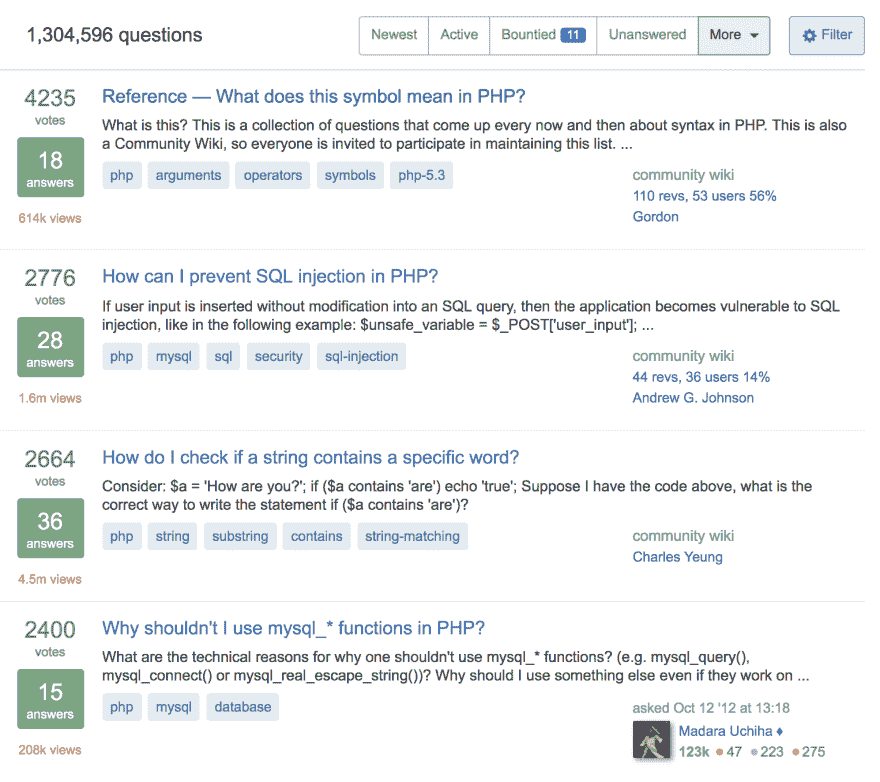

# 如何选择科技博客的主题

> 原文:[https://dev . to/Amit _ merchant/how-to-pick-topics-for-tech-blogging-34bc](https://dev.to/amit_merchant/how-to-pick-topics-for-tech-blogging-34bc)

如果你是一个科技博客写手(或者任何一个博客写手)，你一定面对过这个问题，你会发现自己处于一种无话可写的境地。你感觉像一张白纸，失去了动力。这种情况被称为[文思枯竭](https://en.wikipedia.org/wiki/Writer%27s_block)。

> 作家阻塞是一种主要与写作相关的状况，在这种状况下，作者失去了创作新作品的能力，或者经历了创作放缓。

我写博客已经三年了，我承认在这段时间里我也经历过很多次这种情况。我想写一篇文章，但我就是没有题材可写。但慢慢地，随着时间的推移，我发现了一些技巧，利用这些技巧我能够找到主题，一旦我手头有了一个主题，就只需要研究那个主题并写下来。我将在本文中列出这些技术。希望有人会觉得它们有用。

## 审视你的日常工作

我是一名软件工程师，主要从事 PHP、JavaScript 以及与这些语言相关的工作。所以，前几天我在开发一个特性时，出现了一种情况，我需要使用 [PHP 生成器](https://www.php.net/manual/en/language.generators.syntax.php)。这是我第一次使用这个功能。我已经使用生成器修复了应用程序中的问题。但是我想了解更多。所以，我对它做了更多的研究，这个想法出现了！我有一个题材要写。我给[写了一整篇关于发电机的文章](https://dev.to/deep-dive-into-generators-php/)。基本上，我的想法，我对这个问题的看法。

同样可以找到话题/主题。只要仔细看看你每天做的工作，你就可能找到你文章的下一个主题。

## 浏览文档

我为我的博客带来想法的另一种方式是浏览我所做的事情的文档。例如，我经常和拉勒维尔一起工作。我试着去查阅 Laravel 的文档，从中挑选一个特定的主题，至少每天一次。这个练习的好处是我对 Laravel 及其特性有了更多的了解，我甚至没有机会在我的工作中使用它们，并进而有了写文章的想法。这甚至也适用于语言文档。谁知道您可能会在文档中找到某个特性的精华呢？

## StackOverflow 是你的朋友

你可能只是为了寻找你只能在那里找到的答案而访问了`StackOverflow.com`。但是你可能会惊讶地发现，你也可以在这个问答网站上找到一些好主意。我在这里做的是去 StackOverflow.com，搜索我感兴趣的主题，比如说“PHP”，然后应用过滤器“最多投票”。这将列出有史以来针对该特定主题的所有经常投票的问题。举个例子，这里有一些是我在[搜索](https://stackoverflow.com/questions/tagged/php)时得到的“php”。

[T2】](https://res.cloudinary.com/practicaldev/image/fetch/s--0Fa8VqN3--/c_limit%2Cf_auto%2Cfl_progressive%2Cq_auto%2Cw_880/https://thepracticaldev.s3.amazonaws.com/i/w94t8u0lxbo8abhpfocz.png)

正如你所看到的，有一些非常好的问题，你可以从中挑选一个写在你的下一篇文章中，并给出你的答案。

## 关注其他开发者的博客

最后，还有这个公式。*想多生产，就多消费*。这也非常适合写博客。你读越多在你的领域写作的其他人的文章，你就会越了解你周围的技术、最新趋势等等。反过来，你会找到一些为你的博客写新文章的灵感。

> 如果你想生产更多，就消费更多。

为了更新我最喜欢的博主的文章，我使用 [RSS 阅读器](https://feeder.co)并订阅他们的 [RSS 源](https://en.wikipedia.org/wiki/RSS)。这样我就不会错过他们的新文章，也可以在方便的时候阅读。

## 在关闭

我希望你会发现这个技巧对你找到下一篇文章的想法很有用，如果你有其他一些用来获得写作灵感的技巧，请在评论中告诉我。在那之前，博客快乐！

> 最初发布于[https://www . Amit merchant . com/how-to-pick-topics-for-tech-blogging/](https://www.amitmerchant.com/how-to-pick-topics-for-tech-blogging/)