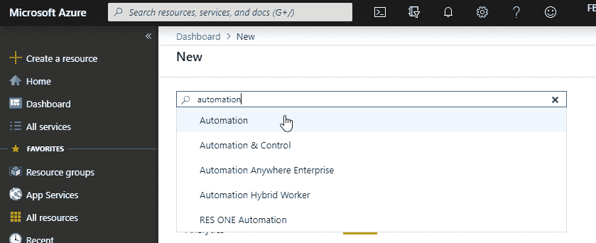
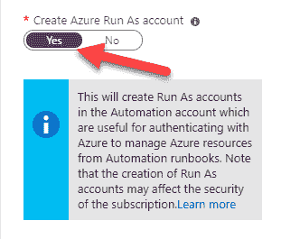
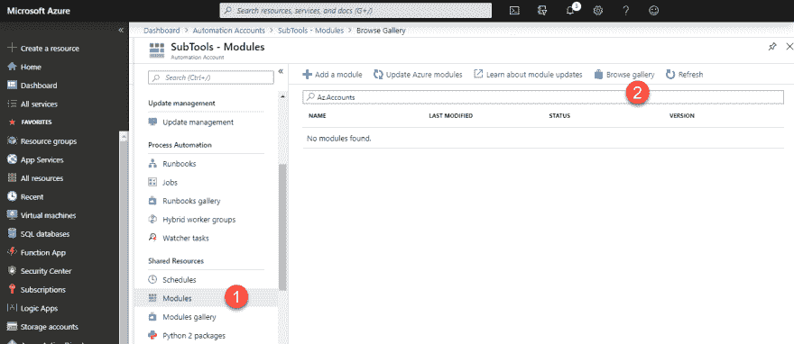
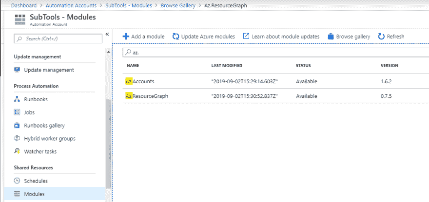
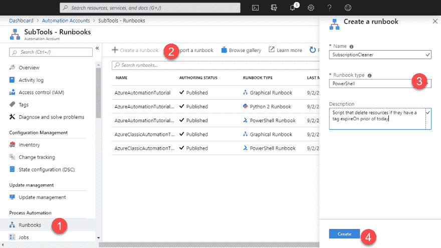
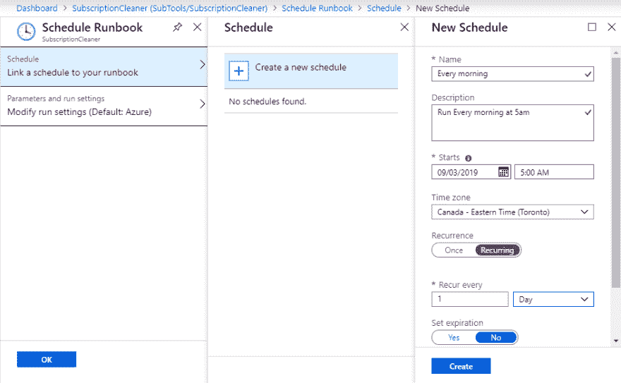

# 自动保持你的 Azure 订阅干净

> 原文：<https://dev.to/azure/keep-your-azure-subscription-clean-automatically-mmi>

我相信我们大多数人都会遇到这种情况，你在云中创建了一些东西，然后就忘记了。然后在月底，你会收到一张比预期更大的发票，这就是恐慌。尽管我足够幸运，从未有过巨大的惊喜，但我承认在一些演示后忘记删除演示资源。无论是台上演讲还是视频录制，我创建内容，演示完成后，如果资源可以在第二天删除它们，那就太好了。

在这篇文章中，我将解释如何使用一个非常简单的 PowerShell 脚本和 Azure Automation 来构建这个工具。所有的代码都可以在我的 GitHub 上找到，我现在正在开发一个一键式按钮来帮助你在订阅中部署它。我还创建了一个 [Glo 板](https://app.gitkraken.com/glo/board/XWvcyQtDJAAPG-Qo)，这样你就可以看到新特性的路线图。随便看看，用用，求个功能，加个，分享一下！

## 目标

想法是删除“过期”的资源。但是 Azure 的资源没有有效期，我就想着用标签！该脚本将定期执行(例如:每天早上)，并删除所有带有标签`expireOn`的资源，其中值在当前日期之前。看起来足够简单，让我们开始吧。

## PowerShell 脚本

为了找到所有过期的资源，我想使用 [Azure Resource Graph](http://bit.ly/AzGraph) 查询。这是一种非常有效的查询资源的方式。Azure 资源图的查询语言支持几个操作符和函数，这里我使用`todatetime`将字符串值转换成日期。因为我们只需要 ResourceId 来删除资源，所以我们返回一个 Id 列表。

```
$expResources=  Search-AzGraph  -Query  'where todatetime(tags.expireOn) < now() | project id'  foreach  ($r  in  $expResources)  {  Remove-AzResource  -ResourceId  $r.id  -Force  } 
```

Enter fullscreen mode Exit fullscreen mode

要开始学习如何运行你的第一个资源图查询，请访问[bit.ly/AzGraph](http://bit.ly/AzGraph)。我还做了一个 5 分钟的视频[像老板一样用 Azure Graph 查询](https://youtu.be/0iOwUkOg6_c)搜索，在那里我解释了它是如何工作的。

如果您执行这个查询，您会注意到，即使您有一个带有标签`expireOn`的资源组，它也不会是结果的一部分。是因为资源图查询看不到资源组。幸运的是，它允许我们在删除过程中更加细化。通过在资源级别进行选择，我们涵盖了一个场景，例如，您将删除资源组中除存储之外的所有资源。

但是，我们也可以删除所有资源，留下空的资源组。因此，我们需要删除所有空的资源组。因为没有简单的方法来搜索一个空组，所以我们需要多做一点努力，但是不要太戏剧化。

```
$rgs  =  Get-AzResourceGroup;  foreach($resourceGroup  in  $rgs){  $name=  $resourceGroup.ResourceGroupName;  $count  =  (Get-AzResource  |  Where-Object{  $_.ResourceGroupName  -match  $name  }).Count;  if($count  -eq  0){  Write-Output  "==> $name is empty. Deleting it...";  Remove-AzResourceGroup  -Name  $name  -Force  -WhatIf  }  } 
```

Enter fullscreen mode Exit fullscreen mode

## 蔚蓝自动化

要根据时间表执行一些命令，你有几个选择:时间触发 Azure 函数或逻辑应用和 Azure 自动化。在这篇文章中，我们将使用最后一个。打开你最喜欢的浏览器，导航到 Azure 门户([http://portal.azure.com](http://portal.azure.com))。点击左上角绿色加号按钮，搜索`Automation`。让我们创建一个。

[](https://res.cloudinary.com/practicaldev/image/fetch/s--7ddFZwiC--/c_limit%2Cf_auto%2Cfl_progressive%2Cq_auto%2Cw_880/https://thepracticaldev.s3.amazonaws.com/i/rpiinqu803zb54yzz0zs.png)

重要的一点是，一定要在创建表单中选择`yes`来创建 Azure Run 帐户。我们需要这个来给脚本足够的权限来查询订阅。

[](https://res.cloudinary.com/practicaldev/image/fetch/s--qdIQU8N2--/c_limit%2Cf_auto%2Cfl_progressive%2Cq_auto%2Cw_880/https://thepracticaldev.s3.amazonaws.com/i/wl7aizlkwf5jpxkdonn6.png)

### 添加模块

该脚本将需要两个模块来加载到作品:

*   阿兹。帐目
*   阿兹。资源图表

要将它们添加到我们的自动化帐户中，请打开新创建的资源，并从选项面板中单击`Modules`。这将打开一个新的刀片。在这个页面的右上角，点击**浏览图库**按钮。

[](https://res.cloudinary.com/practicaldev/image/fetch/s--OMoObEVQ--/c_limit%2Cf_auto%2Cfl_progressive%2Cq_auto%2Cw_880/https://thepracticaldev.s3.amazonaws.com/i/naajh6lbhklasjjso4lv.png)

输入“Az。Accounts”，然后选择匹配的模块。单击“导入”和“确定”将模块导入我们的自动化帐户。一旦模块完全导入，您将能够对`Az.ResourceGraph`模块重复该过程。

> `Az.Accounts`是`Az.ResourceGraph`的依赖项，这就是为什么第一个需要先完全导入。

您可以通过过滤“az”来验证这两个模块都是导入的

[](https://res.cloudinary.com/practicaldev/image/fetch/s--qBBOhv4y--/c_limit%2Cf_auto%2Cfl_progressive%2Cq_auto%2Cw_880/https://thepracticaldev.s3.amazonaws.com/i/tqq9znln2592x83vidjb.png)

## 创建一本运行手册

现在我们将创建一个 Runbook 来保存我们的 PowerShell 代码。点击左侧面板中的 **Runbooks** 选项，然后点击“+创建 runbook”按钮。

[](https://res.cloudinary.com/practicaldev/image/fetch/s--_rvIHHyC--/c_limit%2Cf_auto%2Cfl_progressive%2Cq_auto%2Cw_880/https://thepracticaldev.s3.amazonaws.com/i/czvd3vmzm4hy4n100k5z.png)

从右边的表单中，给它一个名称(例如:SubscriptionCleaner)，选择 PowerShell 作为类型，并添加一个有意义的描述。(你以后会感谢我的；) ).最后，单击创建按钮。

现在你可以复制粘贴我们的脚本。请注意，在开始时添加了几行，以便使用之前创建的运行方式帐户登录。

```
$connectionName  =  "AzureRunAsConnection"  try  {  # Get the connection "AzureRunAsConnection "  $servicePrincipalConnection=Get-AutomationConnection  -Name  $connectionName  Connect-AzAccount  `
  -ServicePrincipal  `
  -Tenant  $servicePrincipalConnection.TenantId  `
  -ApplicationId  $servicePrincipalConnection.ApplicationId  `
  -CertificateThumbprint  $servicePrincipalConnection.CertificateThumbprint  }  catch  {  if  (!$servicePrincipalConnection)  {  $ErrorMessage  =  "Connection $connectionName not found."  throw  $ErrorMessage  }  else{  Write-Error  -Message  $_.Exception  throw  $_.Exception  }  }  $expResources=  Search-AzGraph  -Query  'where todatetime(tags.expireOn) < now() | project id'  foreach  ($r  in  $expResources)  {  Remove-AzResource  -ResourceId  $r.id  -Force  -WhatIf  }  $rgs  =  Get-AzResourceGroup;  foreach($resourceGroup  in  $rgs){  $name=  $resourceGroup.ResourceGroupName;  $count  =  (Get-AzResource  |  Where-Object{  $_.ResourceGroupName  -match  $name  }).Count;  if($count  -eq  0){  Remove-AzResourceGroup  -Name  $name  -Force  -WhatIf  }  } 
```

Enter fullscreen mode Exit fullscreen mode

您现在可以保存并发布操作手册。

## 让它每天早上跑

您可能已经猜到了，我们现在需要创建一个时间表，这样我们的 runbook 就可以在每天早上(或者您想要的任何时候)执行。从 Runbook blade 中，点击刀片顶部的**链接以安排**按钮。

在那里，展开“将计划链接到您的 runbook”并单击“创建新计划”按钮。给它一个名称，描述，选择您的时间和重复选项。瞧啊。

[](https://res.cloudinary.com/practicaldev/image/fetch/s--ou81vAtt--/c_limit%2Cf_auto%2Cfl_progressive%2Cq_auto%2Cw_880/https://thepracticaldev.s3.amazonaws.com/i/wak65tir2lcamvmjpoe8.png)

## 接下来是什么

Runbook 将在下一次被我们的计划触发时搜索并删除所有过期的资源，在我的情况下是在第二天早上。当然，你需要有一些标有`expiredOn`的资源！

创建标记最容易的方法无疑是使用门户。从任何资源中，单击**标签**选项，输入`expireOn`作为名称，并按照格式`YYYY-MM-dd`输入您希望该资源到期的日期。还可以使用 PowerShell、Azure CLI 和 Azure 资源管理器(ARM)模板添加标签。

如果你喜欢的话，我还做了一个视频。

### 如何自动删除所有过期资源

[https://www.youtube.com/embed/7WomkaZWh5w](https://www.youtube.com/embed/7WomkaZWh5w)

大扫除快乐！