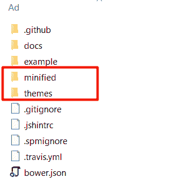
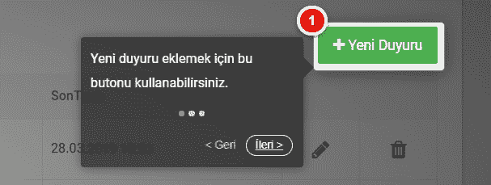

# MVC 也使用 intro.js。

> 原文:[https://dev . to/hakanyalitekin/MVC-de-intro-js-kullanimi-13cc](https://dev.to/hakanyalitekin/mvc-de-intro-js-kullanimi-13cc)

你好啊：

我要讲的是我发现的一个很棒的图书馆。首先，我们将进入 https://intrusion . com/并从 load 部分下载最新版本。

[T2】](https://res.cloudinary.com/practicaldev/image/fetch/s--NQkWAx4Q--/c_limit%2Cf_auto%2Cfl_progressive%2Cq_auto%2Cw_880/https://hakanyalitekin.files.wordpress.com/2019/09/introjs1.png%3Fw%3D302)

我们将下载的 zip 文件放在您的桌面上，并将其移到一个新定义的文件夹中。(主题取决于首选项。(请注意)

[T2】](https://res.cloudinary.com/practicaldev/image/fetch/s--0XwALAzx--/c_limit%2Cf_auto%2Cfl_progressive%2Cq_auto%2Cw_880/https://hakanyalitekin.files.wordpress.com/2019/09/introjs2.png%3Fw%3D882)

然后我们将图像的排序与版面相结合。

接下来，我们将打开一个文件夹，名为 Content 或 Scripts 文件夹。(您可以用任何名称开启它。)并写下我们的代码。我会直接分享程式码，但我会指出我的意思。

让我先谈一谈我所遇到的几个问题，

*   我必须向一个用户(浏览器)显示一次。(他们可以吹萧:)
*   我不应该错过介绍。(当 Skip 把他的裤子藏起来的时候 don 把他的裤子也藏起来了。)的最后一步。
*   它应该是动态的。因为我们需要多页的宣传。他们都需要在不同的时间互相介绍。如果任何页面上有更新，则只需要重新查看该页面。所以不是所有的宣传都应该被重置。

```
 function Tanitim(tanitimListesi, sayfaAdi ,sonGuncellenmeTarihi) {
    var doneTour = localStorage.getItem(sayfaAdi) === sonGuncellenmeTarihi;
    var intro = introJs();

    intro.setOptions({
        "nextLabel": " İleri >", //Türkçeleştirmek için kullandım.
        "prevLabel": " < Geri ",
        "doneLabel": " Tamam ",
        steps: tanitimListesi //Json tipinde gelen tanıtılacak element listesi.
    });

    intro.onafterchange(function () { //Gizlenilen Done butonunu sonuncu tanıtımda açmak için.
        if (this._introItems.length - 1 == this._currentStep || this._introItems.length == 1)
 {
            $('.introjs-skipbutton').show();
            /*Skip etmelerini engellemek icin CSS'de ".introjs-skipbutton" class'ının altına disaple:none yaptım.
             * Ama Done(Tamamlandı) görünmedi bu sefer. bunu açmak için bu js'i ekledin.*/
        }
    });
    if (doneTour) {
        //return;
    }
    else {

        setTimeout(function () {
            intro.start();
        }, 1000); // bir saniye gecikmeli açılması için.

        intro.oncomplete(function () {
            localStorage.setItem(sayfaAdi, sonGuncellenmeTarihi);
        });
        //intro.onexit(function () {
        // localStorage.setItem(sayfaAdi, sonGuncellenmeTarihi); //Eğer sayfanın herhangi bir yerine tıklayıp tamamlamadan çıktıysa tamamlandı sayılmasın istediğim için yorum satırı yaptım.
        //})
    }
} 
```

<svg width="20px" height="20px" viewBox="0 0 24 24" class="highlight-action crayons-icon highlight-action--fullscreen-on"><title>Enter fullscreen mode</title></svg> <svg width="20px" height="20px" viewBox="0 0 24 24" class="highlight-action crayons-icon highlight-action--fullscreen-off"><title>Exit fullscreen mode</title></svg>

我们在上面建立了我们的味觉基础。现在，我们准备好我们的演示文稿 Object/JSON，并将其与 document.Ready 一起使用。(如果需要，也可以使用不同的事件触发 document.Ready。

```
 var tanitimDuyuruListe = [
    {
        element: '#btnEkle',
        intro: "Yeni duyuru eklemek için bu butonu kullanabilirsiniz.",
        position: 'left-center'
    },
    {
        element: '#btnDuzenle',
        intro: "Var olan bir duyuruyu düzenlemek için burayı kullanabilirsiniz.",
        position: 'left-center'
    },
    {
        element: '#btnSil',
        intro: "Var olan bir duyuruyu silmek için burayı kullanabilirsiniz.",
        position: 'left-center'
    }
];

$(document).ready(function () {
    Tanitim(tanitimDuyuruListe, 'DuyuruListe', '05092019');
}); 
```

<svg width="20px" height="20px" viewBox="0 0 24 24" class="highlight-action crayons-icon highlight-action--fullscreen-on"><title>Enter fullscreen mode</title></svg> <svg width="20px" height="20px" viewBox="0 0 24 24" class="highlight-action crayons-icon highlight-action--fullscreen-off"><title>Exit fullscreen mode</title></svg>

为了避免混乱，我为每个页面创建了一个单独的介绍 js。楼上的准备工作结束了。将我们的 js 添加到我们要使用的页面的末尾。如果您在主题中使用，萤幕影像应该如下所示。

*   