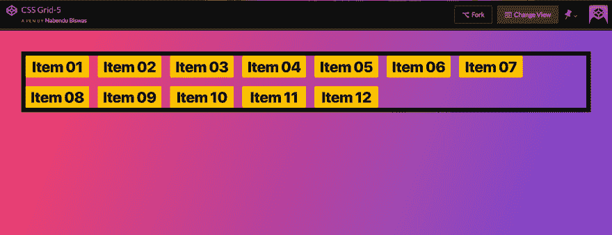
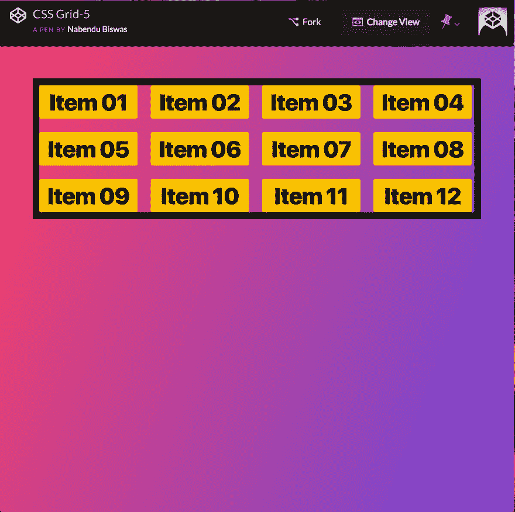
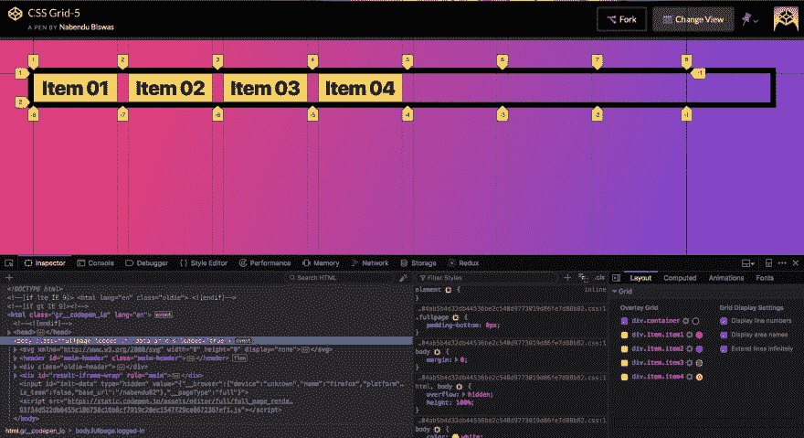
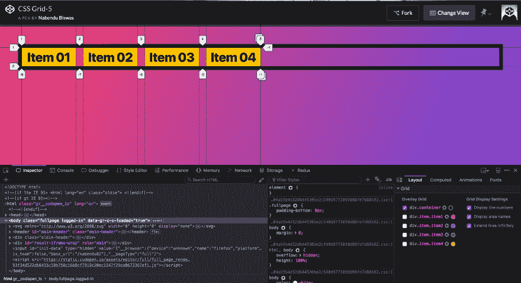
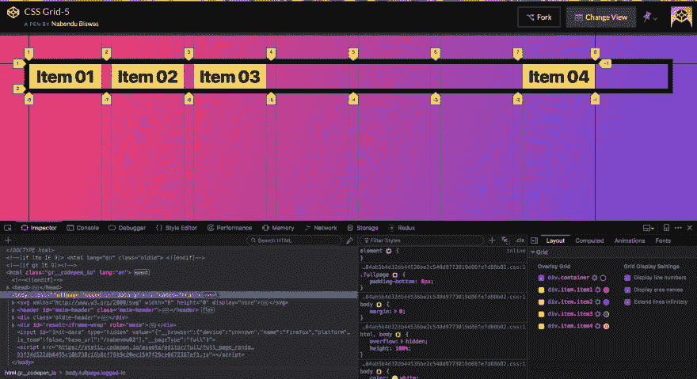
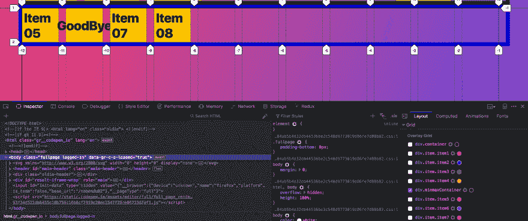
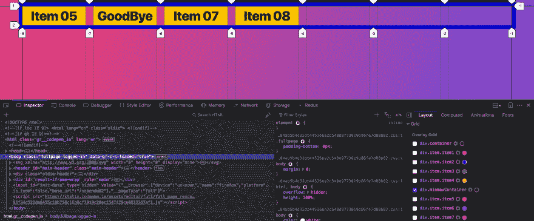
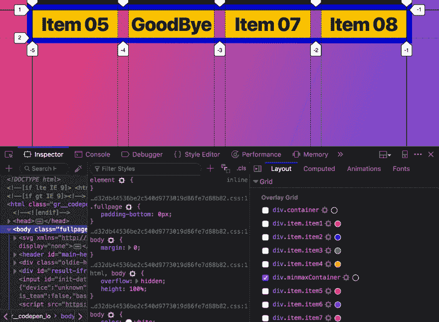
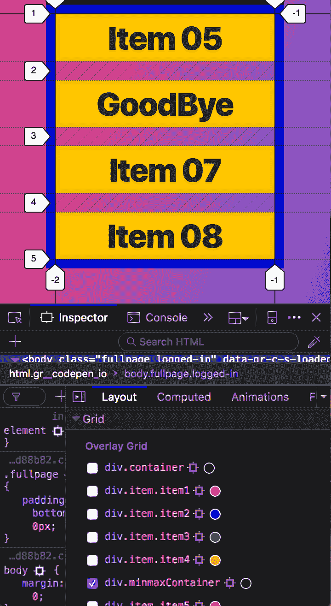
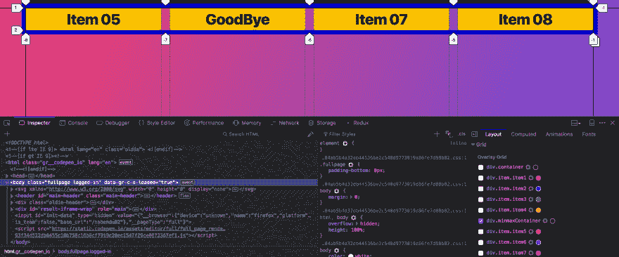

# CSS 网格基础-5

> 原文:[https://dev.to/nabendu82/basics-of-css-grid-5-1kh3](https://dev.to/nabendu82/basics-of-css-grid-5-1kh3)

欢迎来到本系列的第 5 部分。

在本教程中，我们将首先了解**自动填充**和**自动适应**属性。我们将在教程中使用这支[笔](https://codepen.io/nabendu82/full/MqOZjo/)。

Auto-fill 属性与 repeat 函数一起使用，在将项目移动到下一行之前，grid 使用该属性在该行中容纳尽可能多的项目。它非常适合响应式设计，在这种设计中，项目可以自我重组。

考虑下面的 CSS。

```
<div class="container">
    <div class="item item1">Item 01</div>
    <div class="item item2">Item 02</div>
    <div class="item item3">Item 03</div>
    <div class="item item4">Item 04</div>
    <div class="item item5">Item 05</div>
    <div class="item item6">Item 06</div>
    <div class="item item7">Item 07</div>
    <div class="item item8">Item 08</div>
    <div class="item item9">Item 09</div>
    <div class="item item10">Item 10</div>
    <div class="item item11">Item 11</div>
    <div class="item item12">Item 12</div>
  </div>

<style>
    .container {
      display: grid;
      grid-gap: 20px;
      border: 10px solid black;
      grid-template-columns: repeat(auto-fill, 150px);
    }

</style> 
```

这里每一列都是 150 像素。因此，网格只能填充到项目 07，然后项目 08 移动到下一行。

[ ](https://res.cloudinary.com/practicaldev/image/fetch/s--ZT3kAlB5--/c_limit%2Cf_auto%2Cfl_progressive%2Cq_auto%2Cw_880/https://cdn-images-1.medium.com/max/5760/1%2AF1JPPjW7CvDnSJY8Scy0Lw.png) *自动填充*

现在，让我们创建一个平板电脑视图。在这里，您可以看到网格自动排列。

[ ](https://res.cloudinary.com/practicaldev/image/fetch/s--Uxelvh-T--/c_limit%2Cf_auto%2Cfl_progressive%2Cq_auto%2Cw_880/https://cdn-images-1.medium.com/max/3144/1%2A8muXCJfNJg6-Vd6bNazPmg.png) *自动填充平板视图*

自动适应几乎类似于自动填充。但有一个区别，为了理解相同，我们将使用减少项目的数量为 4。

```
<div class="container">
    <div class="item item1">Item 01</div>
    <div class="item item2">Item 02</div>
    <div class="item item3">Item 03</div>
    <div class="item item4">Item 04</div>
<!--     <div class="item item5">Item 05</div>
    <div class="item item6">Item 06</div>
    <div class="item item7">Item 07</div>
    <div class="item item8">Item 08</div>
    <div class="item item9">Item 09</div>
    <div class="item item10">Item 10</div>
    <div class="item item11">Item 11</div>
    <div class="item item12">Item 12</div> -->
  </div>

<style>
    .container {
      display: grid;
      grid-gap: 20px;
      border: 10px solid black;
      grid-template-columns: repeat(auto-fill, 150px);
    }

</style> 
```

现在打开代码笔，打开开发工具并选择网格。**黑线**显示网格的起点和终点。你可以看到网格在轨道 8 结束。我们可以在这里安装附加项目。

[ ](https://res.cloudinary.com/practicaldev/image/fetch/s--utMkClY8--/c_limit%2Cf_auto%2Cfl_progressive%2Cq_auto%2Cw_880/https://cdn-images-1.medium.com/max/5760/1%2AQSS_4XGYsLrJ5YEpQm6oQw.png) *自动填充*

现在就改成**自动适配**吧。

```
.container {
      display: grid;
      grid-gap: 20px;
      border: 10px solid black;
      grid-template-columns: repeat(auto-fit, 150px);
    } 
```

您可以看到，网格在项目结束的地方结束，我们无法在此放置其他项目。

[](https://res.cloudinary.com/practicaldev/image/fetch/s--GrsBwdht--/c_limit%2Cf_auto%2Cfl_progressive%2Cq_auto%2Cw_880/https://cdn-images-1.medium.com/max/5760/1%2ApkGLYZT7auR97xGz92ARIw.png)

 *现在让我们向 item4 添加一个属性。

```
.container {
      display: grid;
      grid-gap: 20px;
      border: 10px solid black;
      grid-template-columns: repeat(auto-fit, 150px);
    }

.item4 {
   grid-column-end: -1;
} 
```

它现在将生效，网格在轨道 8 结束，这是结束。

现在，让我们把它改为自动填充。

```
.container {
      display: grid;
      grid-gap: 20px;
      border: 10px solid black;
      grid-template-columns: repeat(auto-fill, 150px);
    }

    .item4 {
      grid-column-end: -1;
    } 
```

如您所见，item4 被移动到了网格的末尾。当你有菜单项时，这是一个非常常见的模式。你可能有三个项目在一起，一个项目在另一端。

[ ](https://res.cloudinary.com/practicaldev/image/fetch/s--ot0jZzGS--/c_limit%2Cf_auto%2Cfl_progressive%2Cq_auto%2Cw_880/https://cdn-images-1.medium.com/max/5760/1%2Aa-gD_Bk12vgD-nyjiFrfkg.png) *自动填充福利*

Minmax 和自动填充是一个非常强大的概念，它使你的站点无需太多的媒体查询就能做出响应。

让另一个网格容器来显示 minmax。我们将首先研究下面 CSS 的问题。

```
<div class="minmaxContainer">
    <div class="item item5">Item 05</div>
    <div class="item item6">GoodBye</div>
    <div class="item item7">Item 07</div>
    <div class="item item8">Item 08</div>
</div>
  <style>
    .minmaxContainer{
      display: grid;
      grid-gap: 20px;
      border: 10px solid mediumblue;
      grid-template-columns: repeat(auto-fill, 100px );
    }
</style> 
```

这将导致以下结果。正如下面的截图，问题是再见出了它的项目。

[ ](https://res.cloudinary.com/practicaldev/image/fetch/s--FEGxjinz--/c_limit%2Cf_auto%2Cfl_progressive%2Cq_auto%2Cw_880/https://cdn-images-1.medium.com/max/5760/1%2ATXFdA0gMH2ChPqD-J27e_w.png) *问题*

这里可以使用最小最大值。属性 minmax 有两个参数，写为 **minmax(150px，1fr)** ，表示项目最小为 150px 或 1fr，每个都适用。让我们应用到我们的案例中。

```
.minmaxContainer{
      display: grid;
      grid-gap: 20px;
      border: 10px solid mediumblue;
      grid-template-columns: repeat(auto-fill, minmax(150px, 1fr));
    } 
```

这将导致完美的显示。

[ ](https://res.cloudinary.com/practicaldev/image/fetch/s--4OO56oDT--/c_limit%2Cf_auto%2Cfl_progressive%2Cq_auto%2Cw_880/https://cdn-images-1.medium.com/max/5760/1%2ANiS3Y37UUpyZLMrHaZge4w.png) *完美的东西*

而且它反应灵敏。下面是选项卡视图。

[ ](https://res.cloudinary.com/practicaldev/image/fetch/s--YG8fQL58--/c_limit%2Cf_auto%2Cfl_progressive%2Cq_auto%2Cw_880/https://cdn-images-1.medium.com/max/3252/1%2AGkcwVhVyTalq1Rj4rgdHgg.png) *选项卡查看*

和移动视图。

[ ](https://res.cloudinary.com/practicaldev/image/fetch/s--CPOg_QQN--/c_limit%2Cf_auto%2Cfl_progressive%2Cq_auto%2Cw_880/https://cdn-images-1.medium.com/max/2000/1%2AnkzvaraRa3Lfwr6d018Qew.png) *移动查看*

你可能已经注意到了，在桌面视图中，项目都在一边，在我们的网格中有很多空白的空间。我们可以用自动适应属性来解决这个问题。让我们将代码改为使用自动适应。

```
.minmaxContainer{
      display: grid;
      grid-gap: 20px;
      border: 10px solid mediumblue;
      grid-template-columns: repeat(auto-fit, minmax(150px, 1fr));
    } 
```

现在桌面视图已经完全固定了。我们现在已经准备好了完全响应的电网。

[ ](https://res.cloudinary.com/practicaldev/image/fetch/s--O-Z8zsZr--/c_limit%2Cf_auto%2Cfl_progressive%2Cq_auto%2Cw_880/https://cdn-images-1.medium.com/max/5760/1%2Ak8JJSjU9No07FMKbh-v0Og.png) *最终结果*

第 5 部分到此结束。*