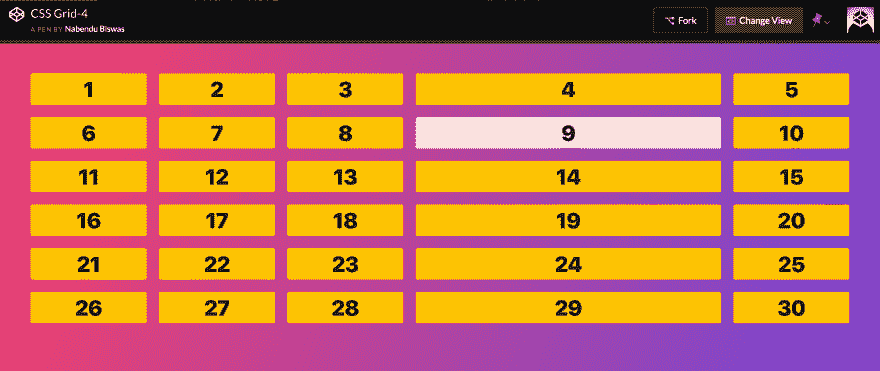
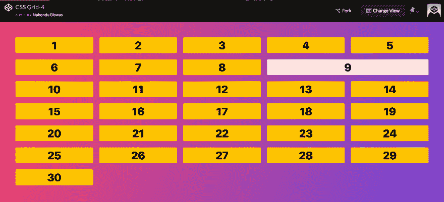
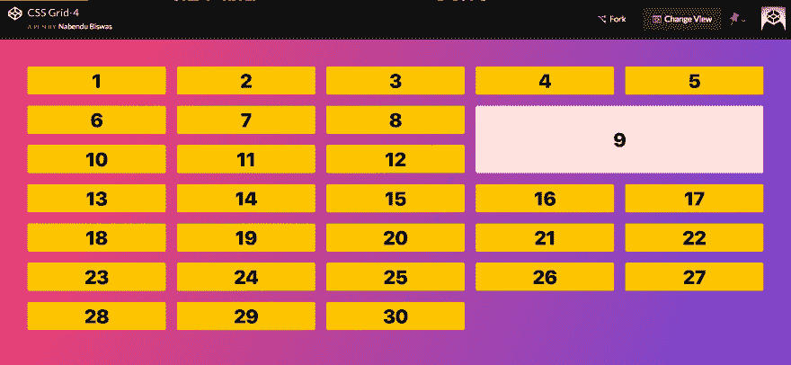
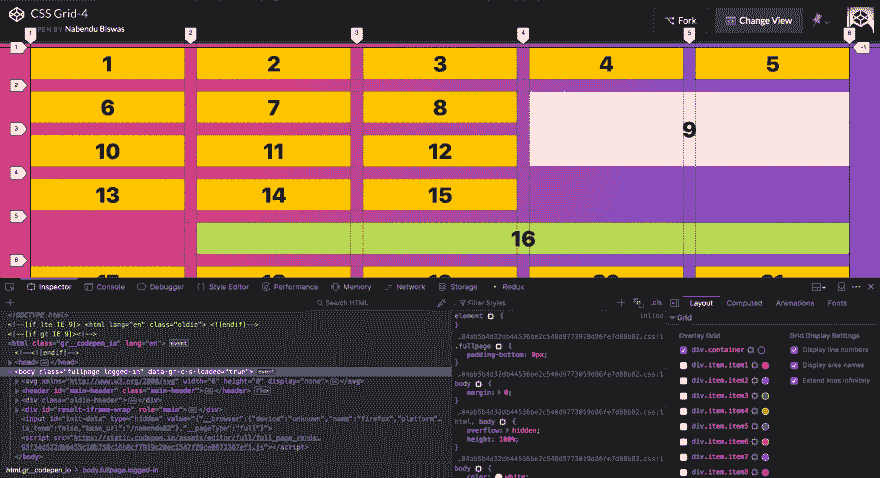
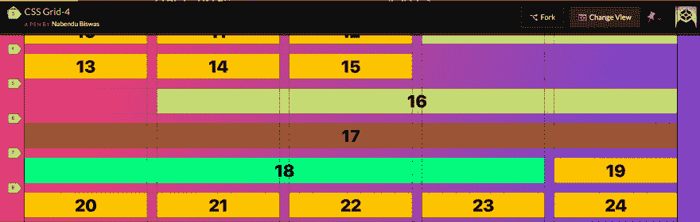
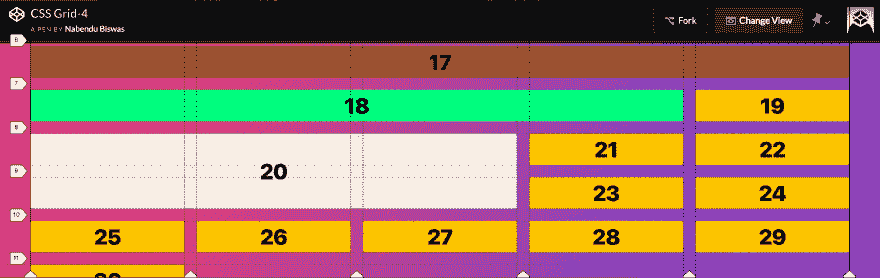

# CSS 网格基础-4

> 原文:[https://dev.to/nabendu82/basics-of-css-grid-4-1gpf](https://dev.to/nabendu82/basics-of-css-grid-4-1gpf)

欢迎来到本系列的第 4 部分。

在本教程中，我们将首先学习**调整网格项目**的大小。在 Grid 中，和在 Flexbox 中一样，我们必须选择单个项目并添加属性。

该零件使用此[代码笔](https://codepen.io/nabendu82/full/BOmGZM/)。我们有 30 个项目，然后选择项目 9 有一个宽度。请注意，这类似于我们给一个项目赋予一些内容时发生的情况(我们在上一个教程中就是这样做的)。

```
<body>
  <div class="container">
    <div class="item item1">1</div>
    <div class="item item2">2</div>
    <div class="item item3">3</div>
    <div class="item item4">4</div>
    <div class="item item5">5</div>
    <div class="item item6">6</div>
    <div class="item item7">7</div>
    <div class="item item8">8</div>
    <div class="item item9">9</div>
    <div class="item item10">10</div>
    <div class="item item11">11</div>
    <div class="item item12">12</div>
    <div class="item item13">13</div>
    <div class="item item14">14</div>
    <div class="item item15">15</div>
    <div class="item item16">16</div>
    <div class="item item17">17</div>
    <div class="item item18">18</div>
    <div class="item item19">19</div>
    <div class="item item20">20</div>
    <div class="item item21">21</div>
    <div class="item item22">22</div>
    <div class="item item23">23</div>
    <div class="item item24">24</div>
    <div class="item item25">25</div>
    <div class="item item26">26</div>
    <div class="item item27">27</div>
    <div class="item item28">28</div>
    <div class="item item29">29</div>
    <div class="item item30">30</div>
  </div>

<style>
    .container {
      display: grid;
      grid-gap: 20px;
      grid-template-columns: repeat(5, 1fr);
    }

.item9 {
      background: mistyrose;
      width: 500px;
    }
  </style>
</body>

</html> 
```

[](https://res.cloudinary.com/practicaldev/image/fetch/s--QblHN_6E--/c_limit%2Cf_auto%2Cfl_progressive%2Cq_auto%2Cw_880/https://cdn-images-1.medium.com/max/5760/1%2AXeBhSL1lOQtQr-v1KX53Uw.png)T3】结果

我们在 grid 中有一个名为 ***span*** 的属性，而不是定义宽度或者用一些内容来增加宽度。我们可以要求一个项目跨越所需的列数。我们将在项目上使用**网格列**。

```
.container {
      display: grid;
      grid-gap: 20px;
      grid-template-columns: repeat(5, 1fr);      
    }

.item9 {
      background: mistyrose;
      grid-column: span 2;
    } 
```

这将导致第 9 项占用两个空格，但它将第 10 项移动到下一行。

[](https://res.cloudinary.com/practicaldev/image/fetch/s--ZL7KrHtl--/c_limit%2Cf_auto%2Cfl_progressive%2Cq_auto%2Cw_880/https://cdn-images-1.medium.com/max/5760/1%2AGmYBworK6o_Liv196n-pEQ.png)T3】结果

类似地，我们也可以使用 grid-row 属性来判断该项扩展了多少行。

```
.container {
      display: grid;
      grid-gap: 20px;
      grid-template-columns: repeat(5, 1fr);      
    }

.item9 {
      background: mistyrose;
      grid-column: span 2;
      grid-row: span 2;
    } 
```

[](https://res.cloudinary.com/practicaldev/image/fetch/s--sAG41X3X--/c_limit%2Cf_auto%2Cfl_progressive%2Cq_auto%2Cw_880/https://cdn-images-1.medium.com/max/5760/1%2AiJZNu6lgmNHZX8t03PZ8qw.png)T3】结果

现在，我们将研究**放置网格项目**。我们会把它们放在我们想要的地方。**网格-列**实际上是一个简写属性。我们可以将其分为**网格-列-开始**和**网格-列-结束**。

让我们选择第 16 项，并通过打开开发工具和选择网格来显示网格线。我们将使用下面的代码。

```
.item16 {
      background: #BADA55;
      grid-column-start: 2;
      grid-column-end: 6;      
    } 
```

现在我们从 2 号轨道开始，到 6 号轨道结束。请注意，项目 16 无法放入它的两个空间，所以被推到下一行，在那里它获得了所需的 4 个空间。

[](https://res.cloudinary.com/practicaldev/image/fetch/s--FpB_DPSn--/c_limit%2Cf_auto%2Cfl_progressive%2Cq_auto%2Cw_880/https://cdn-images-1.medium.com/max/5760/1%2AgjHrLQB22kkiQvDfGzWf6Q.png)T3】结果

还有另外两种方法可以做到这一点。我们可以再次压缩它，使用格式**grid-column:2/6；**会给出同样的结果。

```
.item16 {
      background: #BADA55;
      grid-column: 2 / 6;
<!--  grid-column-start: 2;
      grid-column-end: 6; -->
    } 
```

第二个是使用 span by**grid-column:2/span 4；**它也会产生同样的结果。

```
.item16 {
      background: #BADA55;
      grid-column: 2 / span 4;
<!--  grid-column: 2 / 6; -->
<!--  grid-column-start: 2;
      grid-column-end: 6; -->
    } 
```

还有一个概念，我们可以用负数。假设，我们要一个项展开整行，我们可以给 grid-column:1/-1；
同理，grid-column:1/-2；意味着扩展到最后两首曲目。

```
.item17 {
      background: sienna;
      grid-column: 1 / -1;
    }

    .item18 {
      background: springGreen;
      grid-column: 1 / -2;      
    } 
```

[](https://res.cloudinary.com/practicaldev/image/fetch/s--Boc4StyO--/c_limit%2Cf_auto%2Cfl_progressive%2Cq_auto%2Cw_880/https://cdn-images-1.medium.com/max/5748/1%2A01IUOZ0wrYFTjrMxl61HJA.png)T3】结果

我们也可以将它与网格行属性混合使用。

```
.item20 {
      background: linen;
      grid-column: 1 / -3;      
      grid-row: 8 / 10;
    } 
```

[](https://res.cloudinary.com/practicaldev/image/fetch/s--3_q-wAFE--/c_limit%2Cf_auto%2Cfl_progressive%2Cq_auto%2Cw_880/https://cdn-images-1.medium.com/max/5760/1%2ABVmssV1mUAU7eIvuKzGY0Q.png)T3】结果

本系列的第 4 部分到此结束。