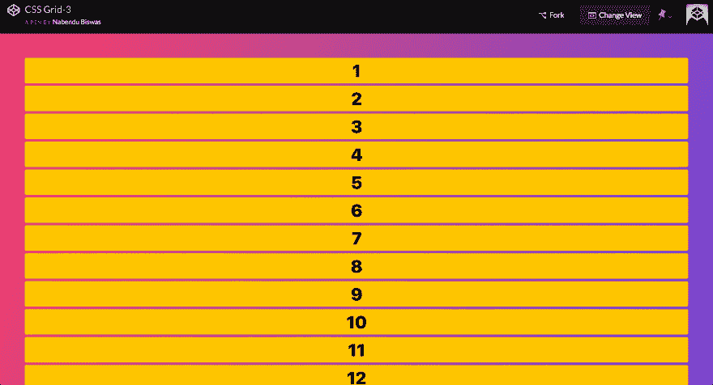
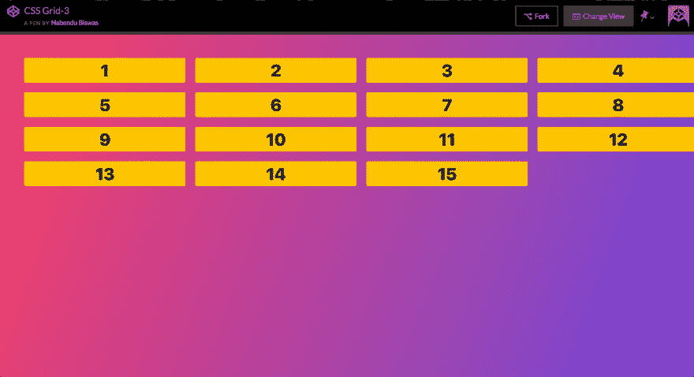
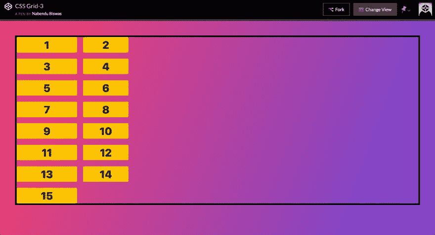
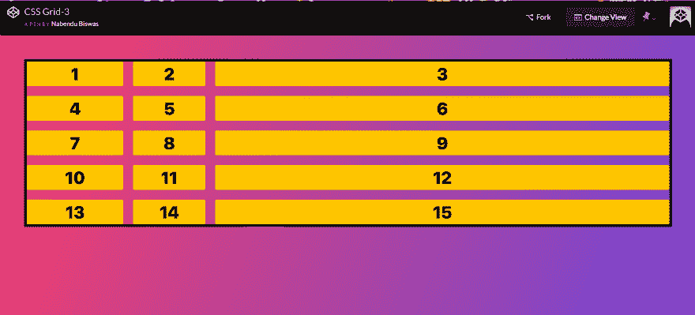
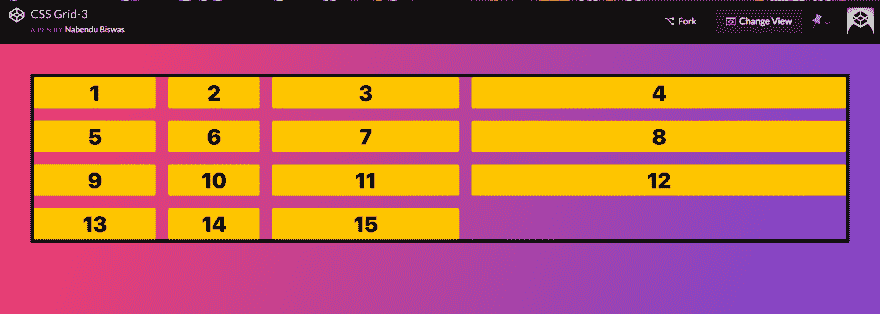
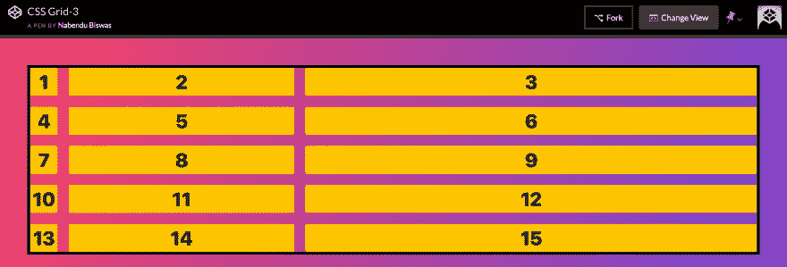
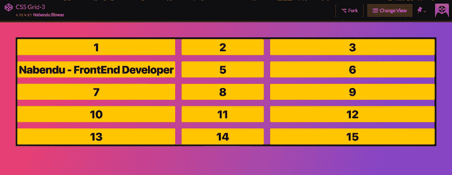
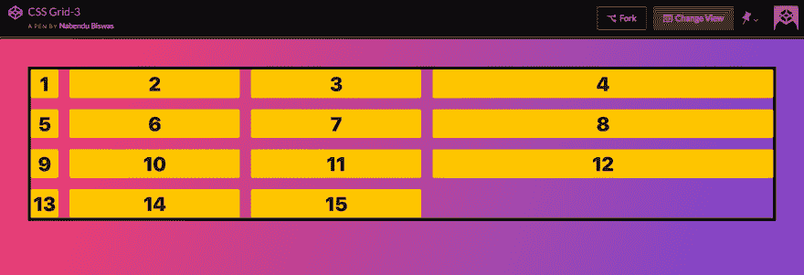

# CSS 网格基础-3

> 原文：<https://dev.to/nabendu82/basics-of-css-grid-3-3nhc>

欢迎来到本系列的第 3 部分。

我们将研究如何在 CSS 网格中*调整轨迹。为此我们将使用这个[密码笔](https://codepen.io/nabendu82/full/oPoaYj/)。*

这是最初的 html 和 css 代码。

```
<div class="container">
    <div class="item">1</div>
    <div class="item">2</div>
    <div class="item">3</div>
    <div class="item">4</div>
    <div class="item">5</div>
    <div class="item">6</div>
    <div class="item">7</div>
    <div class="item">8</div>
    <div class="item">9</div>
    <div class="item">10</div>
    <div class="item">11</div>
    <div class="item">12</div>
    <div class="item">13</div>
    <div class="item">14</div>
    <div class="item">15</div>

</div>
  <style>
    .container {
      display: grid;
      grid-gap: 20px;
    }
  </style> 
```

[ ](https://res.cloudinary.com/practicaldev/image/fetch/s--iGO2jNin--/c_limit%2Cf_auto%2Cfl_progressive%2Cq_auto%2Cw_880/https://cdn-images-1.medium.com/max/5760/1%2AJgEMyfjXQvv5mjSPZoHxDQ.png) *初步结果*

让我们先用百分比来调整列的大小

```
.container {
      display: grid;
      grid-gap: 20px;
      grid-template-columns: 25% 25% 25% 25%;
    } 
```

这将导致下文和不完善。如你所见，第 4、8 和 12 项位于边缘，没有正确显示。是因为 *25% x 4 = 100%* 加上 20px 的栅隙也是加进去的。

[ ](https://res.cloudinary.com/practicaldev/image/fetch/s--dr45zxjT--/c_limit%2Cf_auto%2Cfl_progressive%2Cq_auto%2Cw_880/https://cdn-images-1.medium.com/max/5760/1%2AFImAAwLNa4e_Ltq0qUqr3w.png) *不好*

CSS Grid 引入了一个名为 **fr** 的新单元。它是在明确的宽度被布局之后留下的自由空间。为了理解，让我们有这个基本的 CSS。我们还使用了一个边框来获取网格所占用的空间。我们有两个分别为 200 像素和 150 像素的显式宽度列。

```
.container {
      display: grid;
      grid-gap: 20px;
      border: 5px solid black;
      grid-template-columns: 200px 150px;
    } 
```

[](https://res.cloudinary.com/practicaldev/image/fetch/s---f3c2inx--/c_limit%2Cf_auto%2Cfl_progressive%2Cq_auto%2Cw_880/https://cdn-images-1.medium.com/max/5760/1%2AdXjOoYlfFrQJeSjoiqe-oQ.png)T3】结果

现在，我们将添加一个 1fr 的列，它将占用 200px 和 150px 列布局后留下的空间。

```
.container {
      display: grid;
      grid-gap: 20px;
      border: 5px solid black;
      grid-template-columns: 200px 150px 1fr;
    } 
```

[](https://res.cloudinary.com/practicaldev/image/fetch/s--rH5xeamx--/c_limit%2Cf_auto%2Cfl_progressive%2Cq_auto%2Cw_880/https://cdn-images-1.medium.com/max/5752/1%2A3-roJWse2C4AvYtCiwHqyw.png)T3】结果

现在让我们添加另一个 2fr 的列。这意味着在铺设 200px 和 150px 柱后留下的空间将被分成 1:2 比例的 1fr 和 2fr 柱。

```
.container {
      display: grid;
      grid-gap: 20px;
      border: 5px solid black;
      grid-template-columns: 200px 150px 1fr 2fr;
    } 
```

[](https://res.cloudinary.com/practicaldev/image/fetch/s--K7RDCPIV--/c_limit%2Cf_auto%2Cfl_progressive%2Cq_auto%2Cw_880/https://cdn-images-1.medium.com/max/5760/1%2AG1yI1NwMtEkP21hL-pp0gg.png)T3】结果

让我们来看一下 **auto** 用来调整轨迹的大小。auto 属性赋予列内容的宽度。我们有三列*汽车 1fr 和 2fr 尺寸*。

```
.container {
      display: grid;
      grid-gap: 20px;
      border: 5px solid black;
      grid-template-columns: auto 1fr 2fr;
    } 
```

[](https://res.cloudinary.com/practicaldev/image/fetch/s--O3E45nDB--/c_limit%2Cf_auto%2Cfl_progressive%2Cq_auto%2Cw_880/https://cdn-images-1.medium.com/max/5760/1%2ALI9Nz-bjJZ8lc4yNd32hqQ.png)T3】结果

让我们在第 4 项中增加一些更大的内容。它会根据它来调整整列。

```
<div class="container">
    <div class="item">1</div>
    <div class="item">2</div>
    <div class="item">3</div>
    <div class="item">Nabendu - FrontEnd Developer</div>
    <div class="item">5</div>
    <div class="item">6</div>
    <div class="item">7</div>
    <div class="item">8</div>
    <div class="item">9</div>
    <div class="item">10</div>
    <div class="item">11</div>
    <div class="item">12</div>
    <div class="item">13</div>
    <div class="item">14</div>
    <div class="item">15</div>

</div>
  <style>
    .container {
      display: grid;
      grid-gap: 20px;
      border: 5px solid black;
      grid-template-columns: auto 1fr 2fr;
    }
  </style> 
```

[](https://res.cloudinary.com/practicaldev/image/fetch/s--AYJSXxgv--/c_limit%2Cf_auto%2Cfl_progressive%2Cq_auto%2Cw_880/https://cdn-images-1.medium.com/max/5760/1%2AqY9Pj23HnigsFcraFIZVaA.png)T3】结果

这里我们再来理解一个**重复**的概念。repeat 函数有两个参数——一个是要重复的次数，另一个是大小。例如*重复(2，1fr)意味着 1fr 1fr* 。

让下面的代码使用重复函数创建 4 列 **auto 1fr 1fr 2fr** 。

```
.container {
      display: grid;
      grid-gap: 20px;
      border: 5px solid black;
      grid-template-columns: auto repeat(2, 1fr) 2fr;
    } 
```

[](https://res.cloudinary.com/practicaldev/image/fetch/s--H4_8Qrw2--/c_limit%2Cf_auto%2Cfl_progressive%2Cq_auto%2Cw_880/https://cdn-images-1.medium.com/max/5760/1%2Alv3g5U_GP0ynsyTy3ixDtw.png)T3】结果

重复功能也可以以另一种方式使用。如果我们给 **repeat(2，1fr 2fr)** ，这意味着创建 4 列作为 **1fr 2fr 1fr 2fr** 。

```
.container {
      display: grid;
      grid-gap: 20px;
      border: 5px solid black;
      grid-template-columns: auto repeat(2, 1fr 2fr) ;
    } 
```

[](https://res.cloudinary.com/practicaldev/image/fetch/s--YQPyeMtW--/c_limit%2Cf_auto%2Cfl_progressive%2Cq_auto%2Cw_880/https://cdn-images-1.medium.com/max/5760/1%2Aky66_dwEtjzlK-dShcyaeQ.png)T3】结果

本系列的第 3 部分到此结束。